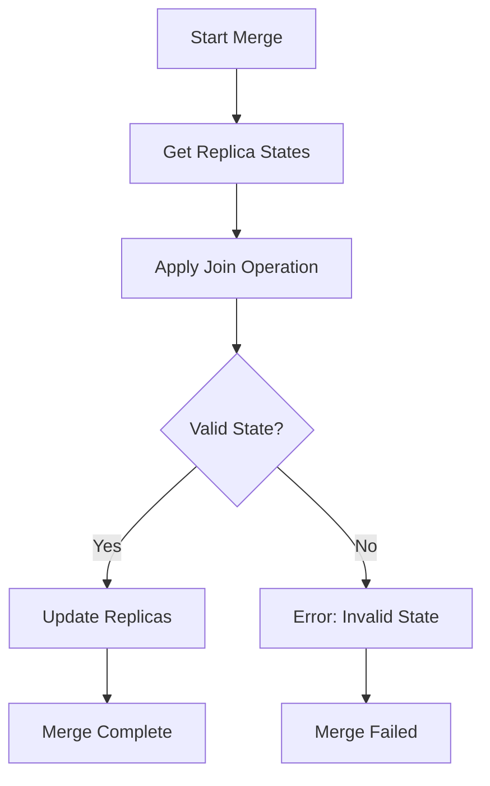
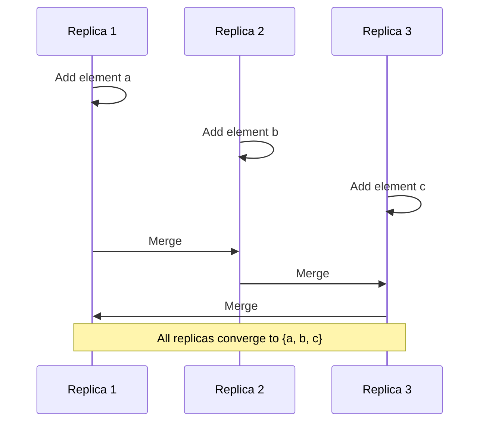

# Distributed CRDT Specification

* File:* `tooling\distributed_crdt_spec.md`
* Version:* 1.0.0
* Context:* Layer 4 (Standard Library) - Backend
* Formalism:* Join-Semilattices & Monotonicity
* Status:* Active
* Last Modified:* 2026-01-01
* Author:* Kilo Code
* Reviewers:* Pending

- -

## 1. Introduction

### 1.1 Purpose

This specification formalizes the **Conflict-Free Replicated Data Types (CRDTs)** using **Join-Semilattices** and **Monotonicity Theory**, providing mathematical foundation for distributed data structures that guarantee convergence. This formalization enables the Morph standard library to provide eventually consistent data structures for distributed systems.

### 1.2 Scope

This specification covers:
- The Conflict-Free Property for CRDTs
- The Axioms of Convergence (Commutativity, Associativity, Idempotence)
- The Monotonic Update Functions for CRDT operations
- The Join Operation for merging replicas
- The Ledger and GrowOnlySet CRDT implementations

This specification does not cover:
- Concrete implementation of CRDT data structures
- Network protocols for replication
- Conflict resolution strategies beyond CRDTs

### 1.3 Definitions, Acronyms, and Abbreviations

| Term | Definition |
|-------|------------|
| **CRDT** | Conflict-Free Replicated Data Type - data type that can be replicated across multiple computers |
| **Join-Semilattice** | Partially ordered set with a least upper bound (join) operation |
| **Monotonicity** | Property that operations never decrease the value |
| **Commutativity** | Order of operations doesn't matter |
| **Associativity** | Grouping of operations doesn't matter |
| **Idempotence** | Repeating an operation has no additional effect |
| **Convergence** | Property that all replicas eventually reach the same state |
| **Replica** | Copy of data stored on a different node |

### 1.4 References

- Shapiro, M., et al. (2011). "A comprehensive study of Convergent and Commutative Replicated Data Types"
- Baquero, C., & Almeida, P. S. (2017). "A specification of CRDTs"
- IEEE 1016: Recommended Practice for Software Design Descriptions
- ISO/IEC 29148: Systems and software engineering — Requirements engineering

- -

## 2. Formal Definitions

### 2.1 The Conflict-Free Property

A CRDT is a data type that guarantees convergence without coordination.

#### 2.1.1 CRDT Definition

A CRDT is a tuple $(S, \sqsubseteq, \sqcup, \text{update})$ where:
- $S$: State space
- $\sqsubseteq$: Partial order (less-or-equal)
- $\sqcup$: Join operation (least upper bound)
- $\text{update}$: Update function

* CRD-INV-001:* THE system SHALL define CRDTs as tuples with state, order, join, and update.

#### 2.1.2 Conflict-Free Property

A CRDT is conflict-free if:

$$ \forall s_1, s_2 \in S: s_1 \sqcup s_2 \in S $$

* CRD-INV-002:* THE system SHALL guarantee that join operation always produces valid state.

### 2.2 The Axioms of Convergence

CRDTs must satisfy three axioms to guarantee convergence.

#### 2.2.1 Commutativity

$$ \forall s_1, s_2 \in S: s_1 \sqcup s_2 = s_2 \sqcup s_1 $$

* CRD-INV-003:* THE system SHALL guarantee that join operation is commutative.

#### 2.2.2 Associativity

$$ \forall s_1, s_2, s_3 \in S: (s_1 \sqcup s_2) \sqcup s_3 = s_1 \sqcup (s_2 \sqcup s_3) $$

* CRD-INV-004:* THE system SHALL guarantee that join operation is associative.

#### 2.2.3 Idempotence

$$ \forall s \in S: s \sqcup s = s $$

* CRD-INV-005:* THE system SHALL guarantee that join operation is idempotent.

* CRD-REQ-001:* THE system SHALL satisfy all three convergence axioms.

* Priority:* Critical
* Verification Method:* Test
* Rationale:* Ensures eventual consistency across replicas
* Dependencies:* CRD-INV-001, CRD-INV-002, CRD-INV-003, CRD-INV-004, CRD-INV-005
* Traceability:* Section 2.2 (The Axioms of Convergence)

### 2.3 The Monotonic Update Functions

CRDT operations must be monotonic (never decrease the value).

#### 2.3.1 Monotonicity Definition

An update function $u: S \to S$ is monotonic if:

$$ \forall s_1, s_2 \in S: s_1 \sqsubseteq s_2 \implies u(s_1) \sqsubseteq u(s_2) $$

* CRD-INV-006:* THE system SHALL guarantee that all update functions are monotonic.

#### 2.3.2 Monotonic Update Theorem

* Theorem:* If all update functions are monotonic, then the CRDT converges.

* Proof Sketch:*
1. By definition of monotonicity, updates preserve order
2. By definition of join, updates are applied in any order
3. Therefore, all replicas converge to the same state

* CRD-THM-001:* THE system SHALL guarantee that monotonic updates imply convergence.

* Priority:* Critical
* Verification Method:* Analysis
* Rationale:* Ensures eventual consistency
* Dependencies:* CRD-INV-006
* Traceability:* Section 2.3 (The Monotonic Update Functions)

### 2.4 The Join Operation

The join operation merges two replicas into a single state.

#### 2.4.1 Join Definition

$$ \sqcup: S \times S \to S $$

* CRD-INV-007:* THE system SHALL define join operation for all CRDT states.

#### 2.4.2 Join Properties

The join operation must satisfy:
1. **Commutativity:* $s_1 \sqcup s_2 = s_2 \sqcup s_1$
2. **Associativity:* $(s_1 \sqcup s_2) \sqcup s_3 = s_1 \sqcup (s_2 \sqcup s_3)$
3. **Idempotence:* $s \sqcup s = s$
4. **Monotonicity:* $s_1 \sqsubseteq s_1 \sqcup s_2$

* CRD-REQ-002:* THE system SHALL implement join operation with all required properties.

* Priority:* Critical
* Verification Method:* Test
* Rationale:* Ensures correct merging of replicas
* Dependencies:* CRD-INV-007
* Traceability:* Section 2.4 (The Join Operation)

### 2.5 The Ledger CRDT

The Ledger CRDT tracks a set of operations with unique identifiers.

#### 2.5.1 Ledger Definition

A Ledger is a set of operations $O$ with unique identifiers.

$$ \text{Ledger} = \{o_1, o_2, \dots, o_n\} $$

* CRD-INV-008:* THE system SHALL define Ledger as a set of operations.

#### 2.5.2 Ledger Operations

* Add Operation:*
$$ \text{add}(L, o) = L \cup \{o\} $$

* Merge Operation:*
$$ \text{merge}(L_1, L_2) = L_1 \cup L_2 $$

* CRD-REQ-003:* THE system SHALL support add and merge operations for Ledger.

* Priority:* High
* Verification Method:* Test
* Rationale:* Enables operation tracking across replicas
* Dependencies:* CRD-INV-008
* Traceability:* Section 2.5 (The Ledger CRDT)

### 2.6 The GrowOnlySet CRDT

The GrowOnlySet CRDT is a set that only grows (no deletions).

#### 2.6.1 GrowOnlySet Definition

A GrowOnlySet is a set $S$ with add operation.

$$ \text{GrowOnlySet} = \{e_1, e_2, \dots, e_n\} $$

* CRD-INV-009:* THE system SHALL define GrowOnlySet as a set with add operation.

#### 2.6.2 GrowOnlySet Operations

* Add Operation:*
$$ \text{add}(S, e) = S \cup \{e\} $$

* Merge Operation:*
$$ \text{merge}(S_1, S_2) = S_1 \cup S_2 $$

* CRD-REQ-004:* THE system SHALL support add and merge operations for GrowOnlySet.

* Priority:* High
* Verification Method:* Test
* Rationale:* Enables monotonic set operations
* Dependencies:* CRD-INV-009
* Traceability:* Section 2.6 (The GrowOnlySet CRDT)

- -

## 3. Requirements

### 3.1 Functional Requirements

* CRD-REQ-005:* THE system SHALL support multiple CRDT types.

* Priority:* High
* Verification Method:* Test
* Rationale:* Provides flexibility for different use cases
* Dependencies:* CRD-INV-001
* Traceability:* Section 2.1 (The Conflict-Free Property)

* CRD-REQ-006:* THE system SHALL detect monotonicity violations.

* Priority:* Critical
* Verification Method:* Test
* Rationale:* Prevents non-monotonic operations that break convergence
* Dependencies:* CRD-INV-006
* Traceability:* Section 2.3 (The Monotonic Update Functions)

* CRD-REQ-007:* THE system SHALL support custom CRDT implementations.

* Priority:* Medium
* Verification Method:* Test
* Rationale:* Enables domain-specific CRDTs
* Dependencies:* CRD-INV-001
* Traceability:* Section 2.1 (The Conflict-Free Property)

* CRD-REQ-008:* THE system SHALL provide merge operation for all CRDTs.

* Priority:* Critical
* Verification Method:* Test
* Rationale:* Enables replica synchronization
* Dependencies:* CRD-INV-007
* Traceability:* Section 2.4 (The Join Operation)

### 3.2 Non-Functional Requirements

* CRD-NFR-001:* THE system SHALL perform merge operations in O(n) time complexity.

* Priority:* High
* Verification Method:* Analysis
* Metric:* Merge < 10ms for 10K elements
* Rationale:* Ensures fast synchronization
* Dependencies:* None
* Traceability:* Section 2.4 (The Join Operation)

* CRD-NFR-002:* THE system SHALL support CRDTs with up to 1M elements.

* Priority:* Medium
* Verification Method:* Demonstration
* Metric:* 1M elements with < 100MB memory
* Rationale:* Supports large-scale distributed systems
* Dependencies:* None
* Traceability:* Section 2.1 (The Conflict-Free Property)

* CRD-NFR-003:* THE system SHALL guarantee convergence within bounded time.

* Priority:* High
* Verification Method:* Demonstration
* Metric:* Convergence < 1s for 10 replicas
* Rationale:* Ensures eventual consistency
* Dependencies:* CRD-THM-001
* Traceability:* Section 2.3 (The Monotonic Update Functions)

- -

## 4. Design

### 4.1 Architecture Overview

The CRDT Library is implemented as a collection of data types that:
1. Define state space and partial order
2. Implement monotonic update functions
3. Provide join operation for merging replicas
4. Guarantee convergence through mathematical properties

### 4.2 Data Structures

#### 4.2.1 CRDT State

* CRDT State:* $S$

* Components:*
- State representation (set, map, counter, etc.)
- Metadata (timestamps, version vectors)

* Invariants:*
1. State is always valid
2. State is monotonic (never decreases)

#### 4.2.2 Operation Log

* Operation Log:* $\mathcal{O} = \{o_1, o_2, \dots, o_n\}$

* Components:*
- Operation identifier
- Operation type
- Operation arguments
- Timestamp

* Invariants:*
1. All operations have unique identifiers
2. Operations are ordered by timestamp

#### 4.2.3 Replica Metadata

* Replica Metadata:* $\mathcal{M} = \{r_1, r_2, \dots, r_n\}$

* Components:*
- Replica identifier
- Last synchronized timestamp
- Version vector

* Invariants:*
1. All replicas have unique identifiers
2. Version vectors are monotonic

### 4.3 Algorithms

#### 4.3.1 Merge Algorithm

* Algorithm Name:* Merge Replicas

* Input:* Two CRDT states $s_1, s_2$

* Output:* Merged state $s_{merged}$

* Mathematical Definition:*
$$
\text{Merge}(s_1, s_2) = s_1 \sqcup s_2
$$

* Pseudocode:*
```
function merge_crdt(s1, s2):
    return join(s1, s2)
```

* Complexity:*
- Time: $O(n)$ where $n$ is state size
- Space: $O(n)$

* Correctness:*
- **Invariant:* Merge operation is commutative, associative, and idempotent
- **Termination:* Single join operation

#### 4.3.2 Monotonicity Check Algorithm

* Algorithm Name:* Check Monotonicity

* Input:* Update function $u$, State $s_1, s_2$

* Output:* Boolean indicating monotonicity

* Mathematical Definition:*
$$
\text{IsMonotonic}(u, s_1, s_2) = (s_1 \sqsubseteq s_2) \implies (u(s_1) \sqsubseteq u(s_2))
$$

* Pseudocode:*
```
function is_monotonic(update, s1, s2):
    if not (s1 <= s2):
        return true  # vacuously true
    s1_updated = update(s1)
    s2_updated = update(s2)
    return s1_updated <= s2_updated
```

* Complexity:*
- Time: $O(n)$ where $n$ is state size
- Space: $O(n)$

* Correctness:*
- **Invariant:* Monotonicity is preserved under composition
- **Termination:* Single comparison

### 4.4 Mermaid Diagrams

#### 4.4.1 CRDT State Lattice

```mermaid
graph TD
    Empty[Empty Set] --> A[Set {a}]
    Empty --> B[Set {b}]
    A --> AB[Set {a, b}]
    B --> AB
    AB --> ABC[Set {a, b, c}]
    style Empty fill:#90EE90
    style ABC fill:#FF6B6B
```

#### 4.4.2 Merge Operation Flow



#### 4.4.3 Monotonic Growth



- -

## 5. Correctness Properties

### 5.1 Theorems

#### 5.1.1 Convergence Theorem

* Theorem:* If all update functions are monotonic and join satisfies convergence axioms, then all replicas converge to the same state.

* Proof Sketch:*
1. By definition of monotonicity, updates preserve order
2. By definition of join, updates are applied in any order
3. By convergence axioms, join is commutative, associative, and idempotent
4. Therefore, all replicas converge to the same state

* CRD-THM-002:* THE system SHALL guarantee convergence under monotonic updates and join axioms.

* Priority:* Critical
* Verification Method:* Analysis
* Rationale:* Ensures eventual consistency
* Dependencies:* CRD-THM-001, CRD-REQ-001
* Traceability:* Section 2.2 (The Axioms of Convergence)

#### 5.1.2 Monotonicity Preservation Theorem

* Theorem:* The composition of monotonic functions is monotonic.

* Proof Sketch:*
1. Let $f$ and $g$ be monotonic functions
2. By definition of monotonicity, $s_1 \sqsubseteq s_2 \implies f(s_1) \sqsubseteq f(s_2)$
3. Similarly, $f(s_1) \sqsubseteq f(s_2) \implies g(f(s_1)) \sqsubseteq g(f(s_2))$
4. Therefore, $g \circ f$ is monotonic

* CRD-THM-003:* THE system SHALL guarantee that composition of monotonic functions is monotonic.

* Priority:* High
* Verification Method:* Analysis
* Rationale:* Enables complex operations from simple monotonic ones
* Dependencies:* CRD-INV-006
* Traceability:* Section 2.3 (The Monotonic Update Functions)

### 5.2 Invariants

#### 5.2.1 CRDT Invariants

- **CRD-INV-010:* THE system SHALL maintain that CRDT state is always valid
- **CRD-INV-011:* THE system SHALL maintain that CRDT state is monotonic
- **CRD-INV-012:* THE system SHALL maintain that join operation is idempotent

#### 5.2.2 Replica Invariants

- **CRD-INV-013:* THE system SHALL maintain that all replicas have unique identifiers
- **CRD-INV-014:* THE system SHALL maintain that version vectors are monotonic

- -

## 6. Examples

### 6.1 Ledger CRDT Example

```morph
// Ledger CRDT: Track operations across replicas
let ledger1 = Ledger::new();
let ledger2 = Ledger::new();

// Replica 1 adds operation
ledger1.add(Operation { id: 1, type: "add", value: 42 });

// Replica 2 adds operation
ledger2.add(Operation { id: 2, type: "remove", value: 10 });

// Merge replicas
let merged = ledger1.merge(ledger2);

// Result: merged contains both operations
assert!(merged.contains(Operation { id: 1, type: "add", value: 42 }));
assert!(merged.contains(Operation { id: 2, type: "remove", value: 10 }));
```

* Merge Operation:*
- $L_1 = \{o_1\}$
- $L_2 = \{o_2\}$
- $L_{merged} = L_1 \cup L_2 = \{o_1, o_2\}$

### 6.2 GrowOnlySet CRDT Example

```morph
// GrowOnlySet CRDT: Track elements across replicas
let set1 = GrowOnlySet::new();
let set2 = GrowOnlySet::new();

// Replica 1 adds element
set1.add("a");

// Replica 2 adds element
set2.add("b");

// Merge replicas
let merged = set1.merge(set2);

// Result: merged contains both elements
assert!(merged.contains("a"));
assert!(merged.contains("b"));
```

* Merge Operation:*
- $S_1 = \{a\}$
- $S_2 = \{b\}$
- $S_{merged} = S_1 \cup S_2 = \{a, b\}$

### 6.3 Convergence Example

```morph
// Three replicas with concurrent updates
let replica1 = GrowOnlySet::new();
let replica2 = GrowOnlySet::new();
let replica3 = GrowOnlySet::new();

// Concurrent updates
replica1.add("a");
replica2.add("b");
replica3.add("c");

// Merge in any order
let merged12 = replica1.merge(replica2);
let merged123 = merged12.merge(replica3);

// Result: All replicas converge to same state
assert!(merged123.contains("a"));
assert!(merged123.contains("b"));
assert!(merged123.contains("c"));
```

* Convergence:*
- $R_1 = \{a\}$
- $R_2 = \{b\}$
- $R_3 = \{c\}$
- $R_{merged} = R_1 \cup R_2 \cup R_3 = \{a, b, c\}$

### 6.4 Monotonicity Example

```morph
// Monotonic update: Add operation
let set1 = GrowOnlySet::new();
let set2 = GrowOnlySet::new();

set1.add("a");
set2.add("a");
set2.add("b");

// set1 <= set2 (set1 is subset of set2)
assert!(set1.is_subset_of(set2));

// Monotonic update preserves order
set1.add("c");
set2.add("c");

// set1 <= set2 still holds
assert!(set1.is_subset_of(set2));
```

* Monotonicity:*
- $S_1 = \{a\}$
- $S_2 = \{a, b\}$
- $S_1 \sqsubseteq S_2$ (true)
- $S_1' = \{a, c\}$
- $S_2' = \{a, b, c\}$
- $S_1' \sqsubseteq S_2'$ (true)

### 6.5 Edge Cases

#### 6.5.1 Idempotent Merge

```morph
// Idempotent merge: Merging with itself
let set = GrowOnlySet::new();
set.add("a");

// Merge with itself
let merged = set.merge(set);

// Result: No change (idempotent)
assert!(merged == set);
```

* Idempotence:*
- $S = \{a\}$
- $S \sqcup S = S$ (true)

#### 6.5.2 Commutative Merge

```mermaid
// Commutative merge: Order doesn't matter
let set1 = GrowOnlySet::new();
let set2 = GrowOnlySet::new();

set1.add("a");
set2.add("b");

// Merge in different orders
let merged12 = set1.merge(set2);
let merged21 = set2.merge(set1);

// Result: Same result (commutative)
assert!(merged12 == merged21);
```

* Commutativity:*
- $S_1 = \{a\}$
- $S_2 = \{b\}$
- $S_1 \sqcup S_2 = S_2 \sqcup S_1$ (true)

#### 6.5.3 Associative Merge

```morph
// Associative merge: Grouping doesn't matter
let set1 = GrowOnlySet::new();
let set2 = GrowOnlySet::new();
let set3 = GrowOnlySet::new();

set1.add("a");
set2.add("b");
set3.add("c");

// Merge in different groupings
let merged12_3 = set1.merge(set2).merge(set3);
let merged1_23 = set1.merge(set2.merge(set3));

// Result: Same result (associative)
assert!(merged12_3 == merged1_23);
```

* Associativity:*
- $S_1 = \{a\}$
- $S_2 = \{b\}$
- $S_3 = \{c\}$
- $(S_1 \sqcup S_2) \sqcup S_3 = S_1 \sqcup (S_2 \sqcup S_3)$ (true)

- -

## Change Log

| Version | Date       | Author      | Changes                                                                 |
|---------|------------|-------------|-------------------------------------------------------------------------|
| 1.0.0   | 2026-01-01 | Kilo Code    | Initial version                                                        |
