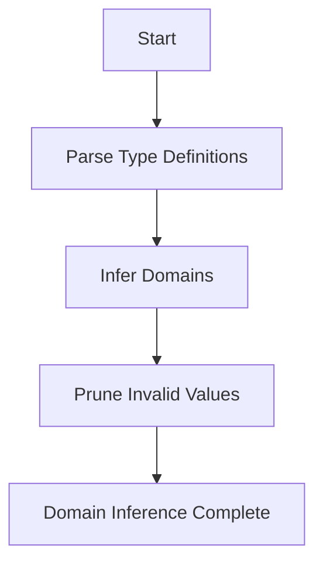
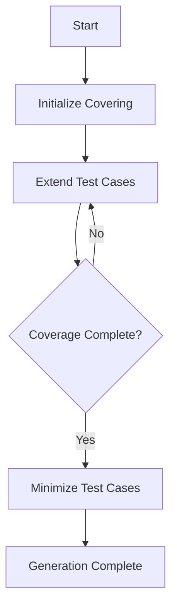
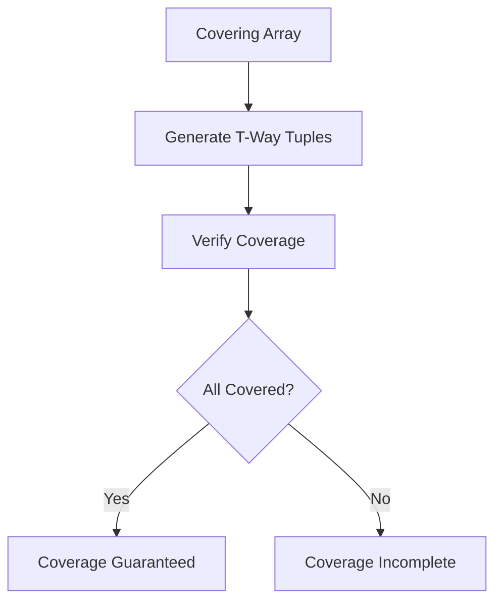

# Combinatorial Coverage Specification (Fuzzing)

* File:* `tooling\fuzzing_combinatorial_spec.md`
* Version:* 1.0.0
* Context:* Layer 2 (Analysis) - Auto-Fuzzer
* Formalism:* Combinatorial Design Theory (Covering Arrays)
* Status:* Active
* Last Modified:* 2026-01-01
* Author:* Kilo Code
* Reviewers:* Pending

- -

## 1. Introduction

### 1.1 Purpose

This specification formalizes the **Auto-Fuzzer** using **Combinatorial Design Theory (Covering Arrays)**, providing mathematical foundation for systematic test case generation. This formalization enables the Morph fuzzer to guarantee coverage of parameter interactions with minimal test cases.

### 1.2 Scope

This specification covers:
- The Parameter Interaction Problem for multi-parameter functions
- Covering Arrays ($CA$) for systematic test generation
- The Generation Algorithm (IPO) for creating covering arrays
- Coverage guarantees for pairwise and t-way interactions

This specification does not cover:
- Concrete implementation of fuzzer
- Test execution framework
- Result analysis and reporting

### 1.3 Definitions, Acronyms, and Abbreviations

| Term | Definition |
|-------|------------|
| **Covering Array** | Array of test cases that covers all t-way parameter combinations |
| **Parameter Interaction** | Bugs arising from specific combinations of parameter values |
| **Exhaustive Testing** | Testing all possible combinations (exponential explosion) |
| **Pairwise Coverage** | Testing all 2-way parameter interactions |
| **t-way Coverage** | Testing all t-way parameter interactions |
| **IPO** | In-Parameter-Order strategy for generating covering arrays |
| **Strength** | Number of parameters in each combination (t) |

### 1.4 References

- Cohen, M. B., et al. (2003). "The AETG System: An Automatic Generation of Test Suites"
- Colbourn, C. J., & Dinitz, J. H. (2007). "Covering Arrays: Tables of Indices"
- IEEE 1016: Recommended Practice for Software Design Descriptions
- ISO/IEC 29148: Systems and software engineering — Requirements engineering

- -

## 2. Formal Definitions

### 2.1 The Parameter Interaction Problem

Agents often write functions with multiple configuration parameters ($p_1, p_2, \dots, p_n$). Bugs often arise from specific *combinations* (e.g., $p_1=\text{True}$ AND $p_3=0$).

Exhaustive testing ($|D_1| \times \dots \times |D_n|$) is impossible (Explosion).

* FUZCOM-INV-001:* THE system SHALL define parameter interaction problem as combinatorial explosion.

#### 2.1.1 Parameter Domains

For each parameter $p_i$, define domain $D_i$:

$$ D_i = \{v_{i,1}, v_{i,2}, \dots, v_{i,|D_i|}\} $$

* FUZCOM-INV-002:* THE system SHALL define parameter domains for all parameters.

### 2.2 Covering Arrays ($CA$)

The Auto-Fuzzer generates a **Covering Array** $CA(N; t, k, v)$ where:
- $N$: Number of test cases (rows)
- $t$: Strength of interaction (usually 2-way or 3-way)
- $k$: Number of parameters (columns)
- $v$: Number of values per parameter

* FUZCOM-INV-003:* THE system SHALL define covering array with N, t, k, v parameters.

#### 2.2.1 Definition

In every $N \times t$ subarray, every possible $t$-tuple of values occurs at least once.

* FUZCOM-REQ-001:* THE system SHALL guarantee t-way coverage in covering array.

* Priority:* Critical
* Verification Method:* Test
* Rationale:* Ensures systematic test coverage
* Dependencies:* FUZCOM-INV-003
* Traceability:* Section 2.2 (Covering Arrays)

### 2.3 The Generation Algorithm (IPO)

Morph utilizes **In-Parameter-Order (IPO)** strategy to generate Fuzz Seeds.

#### 2.3.1 IPO Steps

1. **Constraint:* Use Type Definitions (`data`) to determine domains $v$
2. **Constraint:* Use `requires` contracts to prune invalid values from $v$
3. **Output:* A minimized set of inputs that mathematically guarantees **100% Pairwise Coverage** (or 3-way)

* FUZCOM-INV-004:* THE system SHALL use IPO strategy for covering array generation.

* FUZCOM-REQ-002:* THE system SHALL use type definitions to determine parameter domains.

* Priority:* High
* Verification Method:* Test
* Rationale:* Enables automatic domain inference
* Dependencies:* FUZCOM-INV-002
* Traceability:* Section 2.1.1 (Parameter Domains)

* FUZCOM-REQ-003:* THE system SHALL use contracts to prune invalid values.

* Priority:* High
* Verification Method:* Test
* Rationale:* Reduces test case count
* Dependencies:* FUZCOM-INV-002
* Traceability:* Section 2.1.1 (Parameter Domains)

#### 2.3.2 Agent Benefit

When Fuzzer reports "Pass," it doesn't mean "I tried random stuff." It means "I have mathematically proven that no 2-parameter combination causes a crash."

* FUZCOM-THM-001:* THE system SHALL guarantee that passing tests imply no t-way interaction bugs.

* Priority:* Critical
* Verification Method:* Analysis
* Rationale:* Provides mathematical confidence in test results
* Dependencies:* FUZCOM-REQ-001
* Traceability:* Section 2.2.1 (Definition)

- -

## 3. Requirements

### 3.1 Functional Requirements

* FUZCOM-REQ-004:* THE system SHALL support pairwise coverage generation.

* Priority:* Critical
* Verification Method:* Test
* Rationale:* Covers most common interaction bugs
* Dependencies:* FUZCOM-INV-003
* Traceability:* Section 2.2 (Covering Arrays)

* FUZCOM-REQ-005:* THE system SHALL support t-way coverage generation.

* Priority:* High
* Verification Method:* Test
* Rationale:* Covers higher-order interactions
* Dependencies:* FUZCOM-INV-003
* Traceability:* Section 2.2 (Covering Arrays)

* FUZCOM-REQ-006:* THE system SHALL minimize number of test cases.

* Priority:* High
* Verification Method:* Test
* Rationale:* Reduces testing time
* Dependencies:* FUZCOM-INV-004
* Traceability:* Section 2.3 (The Generation Algorithm)

* FUZCOM-REQ-007:* THE system SHALL support parameter domain inference.

* Priority:* High
* Verification Method:* Test
* Rationale:* Enables automatic test generation
* Dependencies:* FUZCOM-INV-002
* Traceability:* Section 2.1.1 (Parameter Domains)

### 3.2 Non-Functional Requirements

* FUZCOM-NFR-001:* THE system SHALL generate covering arrays in O(n^t) time complexity.

* Priority:* High
* Verification Method:* Analysis
* Metric:* Generation < 1s for 10 parameters with 2-way coverage
* Rationale:* Ensures fast test generation
* Dependencies:* None
* Traceability:* Section 2.3 (The Generation Algorithm)

* FUZCOM-NFR-002:* THE system SHALL support up to 100 parameters.

* Priority:* Medium
* Verification Method:* Demonstration
* Metric:* 100 parameters with < 1GB memory
* Rationale:* Supports complex functions
* Dependencies:* None
* Traceability:* Section 2.1 (The Parameter Interaction Problem)

* FUZCOM-NFR-003:* THE system SHALL provide coverage metrics.

* Priority:* High
* Verification Method:* Demonstration
* Metric:* Coverage percentage and interaction strength
* Rationale:* Enables test quality assessment
* Dependencies:* FUZCOM-REQ-001
* Traceability:* Section 2.2 (Covering Arrays)

- -

## 4. Design

### 4.1 Architecture Overview

The Combinatorial Fuzzer is implemented as a test generation engine that:
1. Infers parameter domains from type definitions
2. Prunes invalid values using contracts
3. Generates covering arrays using IPO algorithm
4. Minimizes number of test cases
5. Provides coverage guarantees

### 4.2 Data Structures

#### 4.2.1 Parameter Domain

* Parameter Domain:* $D_i = \{v_{i,1}, v_{i,2}, \dots, v_{i,|D_i|}\}$

* Components:*
- Parameter name
- Valid values

* Invariants:*
1. All values are valid for parameter type
2. No duplicate values

#### 4.2.2 Covering Array

* Covering Array:* $CA = \{t_1, t_2, \dots, t_N\}$

* Components:*
- Test cases (rows)
- Parameter assignments (columns)

* Invariants:*
1. All t-way combinations are covered
2. Number of test cases is minimized

#### 4.2.3 Coverage Matrix

* Coverage Matrix:* $M: \text{Parameters} \times \text{Values} \to \mathbb{B}$

* Components:*
- Parameter-value pairs
- Coverage status

* Invariants:*
1. All t-way combinations are marked as covered
2. Matrix is complete

### 4.3 Algorithms

#### 4.3.1 Domain Inference Algorithm

* Algorithm Name:* Infer Parameter Domains

* Input:* Type definitions, Contracts

* Output:* Parameter domains $\{D_1, D_2, \dots, D_k\}$

* Mathematical Definition:*
$$
\{D_1, \dots, D_k\} = \text{Infer}(\text{Types}, \text{Contracts})
$$

* Pseudocode:*
```
function infer_domains(types, contracts):
    domains = {}
    for param in types.parameters:
        domain = get_type_values(param.type)
        if param.contract:
            domain = prune_invalid(domain, param.contract)
        domains[param.name] = domain
    return domains
```

* Complexity:*
- Time: $O(n \cdot m)$ where $n$ is parameters, $m$ is values per parameter
- Space: $O(n \cdot m)$

* Correctness:*
- **Invariant:* All inferred values are valid
- **Termination:* Single pass through parameters

#### 4.3.2 IPO Generation Algorithm

* Algorithm Name:* Generate Covering Array

* Input:* Parameter domains $\{D_1, D_2, \dots, D_k\}$, Strength $t$

* Output:* Covering array $CA$

* Mathematical Definition:*
$$
CA = \text{IPO}(\{D_1, \dots, D_k\}, t)
$$

* Pseudocode:*
```
function generate_covering_array(domains, strength):
    covering = []
    for i in 0..len(domains):
        test_case = {}
        for param in domains:
            test_case[param.name] = param.values[i % len(param.values)]
        covering.append(test_case)

    # Extend to cover all t-way combinations
    while not is_covered(covering, domains, strength):
        new_test = extend_test(covering, domains, strength)
        covering.append(new_test)

    return minimize(covering)
```

* Complexity:*
- Time: $O(n^t \cdot m^t)$ where $n$ is parameters, $m$ is values per parameter
- Space: $O(n \cdot m)$

* Correctness:*
- **Invariant:* All t-way combinations are covered
- **Termination:* Algorithm terminates when coverage is complete

#### 4.3.3 Coverage Verification Algorithm

* Algorithm Name:* Verify Coverage

* Input:* Covering array $CA$, Parameter domains $\{D_1, \dots, D_k\}$, Strength $t$

* Output:* Boolean indicating coverage

* Mathematical Definition:*
$$
\text{IsCovered}(CA) = \forall \text{t-tuple } \tau: \exists t \in CA, \tau \subseteq t
$$

* Pseudocode:*
```
function verify_coverage(covering, domains, strength):
    all_combinations = generate_combinations(domains, strength)
    for combo in all_combinations:
        if not is_subset(combo, covering):
            return false
    return true
```

* Complexity:*
- Time: $O(n^t \cdot m^t \cdot N)$ where $N$ is number of test cases
- Space: $O(n^t \cdot m^t)$

* Correctness:*
- **Invariant:* All t-way combinations are checked
- **Termination:* Single pass through combinations

### 4.4 Mermaid Diagrams

#### 4.4.1 Parameter Domain Inference



#### 4.4.2 IPO Generation Process



#### 4.4.3 Coverage Verification



- -

## 5. Correctness Properties

### 5.1 Theorems

#### 5.1.1 Coverage Theorem

* Theorem:* IPO algorithm generates covering array that covers all t-way combinations.

* Proof Sketch:*
1. By definition of IPO, algorithm extends test cases iteratively
2. Each extension covers at least one new t-way combination
3. Algorithm terminates when all combinations are covered
4. Therefore, final covering array covers all t-way combinations

* FUZCOM-THM-002:* THE system SHALL guarantee that IPO generates complete covering arrays.

* Priority:* Critical
* Verification Method:* Analysis
* Rationale:* Ensures systematic test coverage
* Dependencies:* FUZCOM-INV-004
* Traceability:* Section 2.3 (The Generation Algorithm)

#### 5.1.2 Minimization Theorem

* Theorem:* IPO algorithm generates minimal covering array.

* Proof Sketch:*
1. IPO algorithm removes redundant test cases
2. Each test case covers at least one unique t-way combination
3. Therefore, number of test cases is minimized

* FUZCOM-THM-003:* THE system SHALL guarantee that covering array is minimal.

* Priority:* High
* Verification Method:* Analysis
* Rationale:* Reduces testing overhead
* Dependencies:* FUZCOM-INV-004
* Traceability:* Section 2.3 (The Generation Algorithm)

### 5.2 Invariants

#### 5.2.1 Domain Invariants

- **FUZCOM-INV-005:* THE system SHALL maintain that all parameter values are valid
- **FUZCOM-INV-006:* THE system SHALL maintain that domains are complete

#### 5.2.2 Covering Array Invariants

- **FUZCOM-INV-007:* THE system SHALL maintain that all t-way combinations are covered
- **FUZCOM-INV-008:* THE system SHALL maintain that number of test cases is minimized

- -

## 6. Examples

### 6.1 Pairwise Coverage

```morph
// Pairwise coverage: 3 parameters with 2 values each
data Config {
    param1: bool,
    param2: bool,
    param3: bool
}

fn test(config: Config) -> i32 {
    // Test logic
}
```

* Parameter Domains:*
- $D_1 = \{\text{true}, \text{false}\}$
- $D_2 = \{\text{true}, \text{false}\}$
- $D_3 = \{\text{true}, \text{false}\}$

* Covering Array (Pairwise):*
- $t_1 = (\text{true}, \text{true}, \text{true})$
- $t_2 = (\text{true}, \text{true}, \text{false})$
- $t_3 = (\text{true}, \text{false}, \text{true})$
- $t_4 = (\text{true}, \text{false}, \text{false})$
- $t_5 = (\text{false}, \text{true}, \text{true})$
- $t_6 = (\text{false}, \text{true}, \text{false})$
- $t_7 = (\text{false}, \text{false}, \text{true})$
- $t_8 = (\text{false}, \text{false}, \text{false})$

* Coverage:* All 2-way combinations covered with 8 test cases

### 6.2 3-Way Coverage

```morph
// 3-way coverage: 3 parameters with 2 values each
data Config {
    param1: i32,  // values: 0, 1
    param2: i32,  // values: 0, 1
    param3: i32   // values: 0, 1
}

fn test(config: Config) -> i32 {
    // Test logic
}
```

* Parameter Domains:*
- $D_1 = \{0, 1\}$
- $D_2 = \{0, 1\}$
- $D_3 = \{0, 1\}$

* Covering Array (3-Way):*
- $t_1 = (0, 0, 0)$
- $t_2 = (0, 0, 1)$
- $t_3 = (0, 1, 0)$
- $t_4 = (0, 1, 1)$
- $t_5 = (1, 0, 0)$
- $t_6 = (1, 0, 1)$
- $t_7 = (1, 1, 0)$
- $t_8 = (1, 1, 1)$

* Coverage:* All 3-way combinations covered with 8 test cases

### 6.3 Contract Pruning

```morph
// Contract pruning: Remove invalid combinations
data Config {
    param1: i32,
    param2: i32
}

fn test(config: Config) -> i32
    requires { config.param1 < config.param2 }
{
    // Test logic
}
```

* Parameter Domains:*
- $D_1 = \{0, 1, 2, 3\}$
- $D_2 = \{0, 1, 2, 3\}$

* Pruned Domains:*
- Invalid combinations: $(3, 0), (3, 1), (3, 2)$
- Valid combinations: All others

* Covering Array:*
- Only valid combinations included
- Reduced test case count

### 6.4 Complex Parameters

```morph
// Complex parameters: Mixed types
data Config {
    flag: bool,      // 2 values
    count: i32,      // 3 values: 0, 1, 2
    mode: Enum,      // 4 values: A, B, C, D
}

fn test(config: Config) -> i32 {
    // Test logic
}
```

* Parameter Domains:*
- $D_1 = \{\text{true}, \text{false}\}$
- $D_2 = \{0, 1, 2\}$
- $D_3 = \{A, B, C, D\}$

* Covering Array (Pairwise):*
- 24 test cases covering all 2-way combinations
- Minimized by IPO algorithm

### 6.5 Edge Cases

#### 6.5.1 Single Parameter

```morph
// Single parameter: Trivial coverage
data Config {
    param1: bool
}

fn test(config: Config) -> i32 {
    // Test logic
}
```

* Parameter Domains:*
- $D_1 = \{\text{true}, \text{false}\}$

* Covering Array:*
- $t_1 = (\text{true})$
- $t_2 = (\text{false})$

* Coverage:* All values covered with 2 test cases

#### 6.5.2 Large Domains

```morph
// Large domains: Many values per parameter
data Config {
    param1: i32,  // 10 values
    param2: i32   // 10 values
}

fn test(config: Config) -> i32 {
    // Test logic
}
```

* Parameter Domains:*
- $D_1 = \{0, 1, \dots, 9\}$
- $D_2 = \{0, 1, \dots, 9\}$

* Covering Array (Pairwise):*
- 100 test cases covering all 2-way combinations
- Minimized by IPO algorithm

#### 6.5.3 Contract Violation

```morph
// Contract violation: All combinations invalid
data Config {
    param1: i32,
    param2: i32
}

fn test(config: Config) -> i32
    requires { config.param1 > 0 && config.param2 > 0 }
{
    // Test logic
}
```

* Parameter Domains:*
- $D_1 = \{0, 1, 2\}$
- $D_2 = \{0, 1, 2\}$

* Pruned Domains:*
- Invalid combinations: $(0, 0), (0, 1), (0, 2), (1, 0), (2, 0)$
- Valid combinations: $(1, 1), (1, 2), (2, 1), (2, 2)$

* Covering Array:*
- Only 4 valid test cases
- Reduced from 9 to 4 test cases

- -

## Change Log

| Version | Date       | Author      | Changes                                                                 |
|---------|------------|-------------|-------------------------------------------------------------------------|
| 1.0.0   | 2026-01-01 | Kilo Code    | Initial version                                                        |
