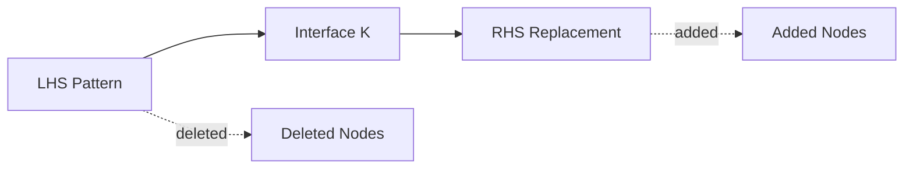
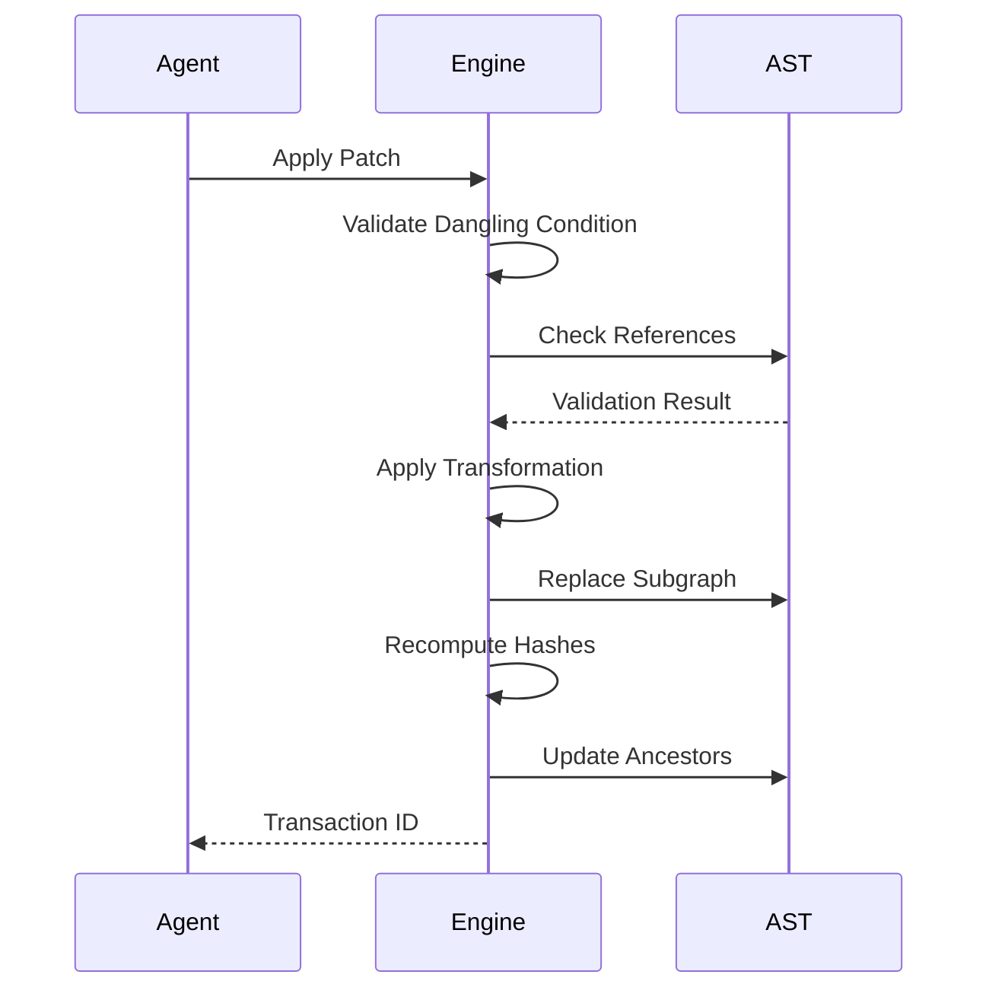
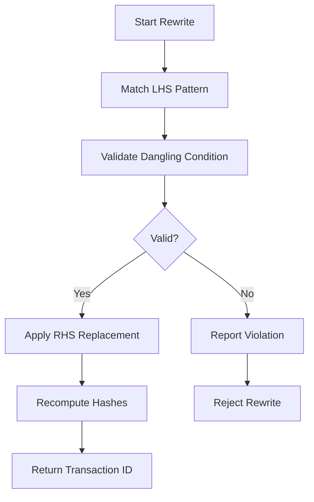
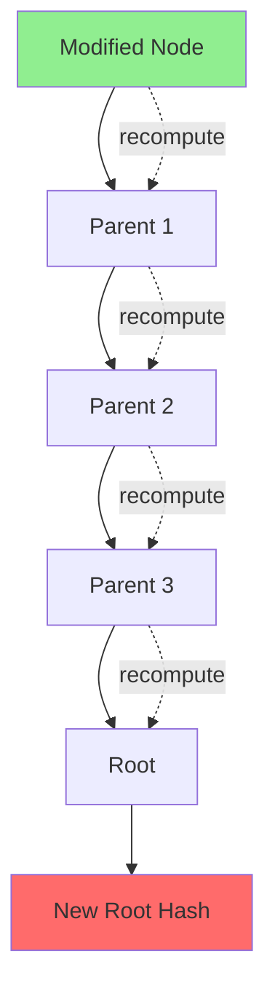

# Graph Rewriting Specification (Refactoring)

- `File:* `tooling\graph_rewriting_spec.md`
- `Version:* 1.0.0
- `Context:* Layer 5 (Tooling) - MCP `patch_ast`
- `Formalism:* Double-Pushout (DPO) Graph Rewriting
- `Status:* Active
- Last Modified:* 2026-01-01
- `Author:* Kilo Code
- `Reviewers:* Pending

- -

## 1. Introduction

### 1.1 Purpose

This specification formalizes **AST Transformation Rules** using **Double-Pushout (DPO) Graph Rewriting**, providing mathematical foundation for safe refactoring operations. This formalization ensures that refactoring operations preserve AST structure and prevent corruption.

### 1.2 Scope

This specification covers:
- AST Transformation Rules as productions $p: L \to R$
- The Application Condition (Dangling Condition) for valid rewrites
- Identity Preservation through Hash Chaining
- Topological Violation detection

This specification does not cover:
- Concrete implementation of rewrite engine
- User interface for refactoring operations
- Conflict resolution for concurrent edits

### 1.3 Definitions, Acronyms, and Abbreviations

| Term | Definition |
|-------|------------|
| **DPO** | Double-Pushout - a graph rewriting formalism ensuring structure preservation |
| **Production** | A transformation rule $p: L \to R$ with left and right-hand sides |
| **LHS** | Left-Hand Side - pattern to match in the graph |
| **RHS** | Right-Hand Side - replacement subgraph |
| **Interface Graph** | The "Glue" nodes that persist between LHS and RHS |
| **Dangling Condition** | Ensures no edges point to deleted nodes |
| **Topological Violation** | Attempting to delete a node that is still referenced |

### 1.4 References

- Ehrig, H., et al. (1997). "Handbook of Graph Grammars and Graph Transformations"
- Rozenberg, G. (1987). "An Introduction to Graph Grammars"
- IEEE 1016: Recommended Practice for Software Design Descriptions
- ISO/IEC 29148: Systems and software engineering — Requirements engineering

- -

## 2. Formal Definitions

### 2.1 AST Transformation Rules

A Refactoring Operation (Patch) is a production $p: L \to R$ consisting of:

- $L$: The **Left-Hand Side** (Pattern to match in the AST Graph)
- $R$: The **Right-Hand Side** (Replacement subgraph)
- $K$: The **Interface Graph** (The "Glue" nodes that persist)

#### 2.1.1 Production Definition

$$ p = (L, R, K) $$

where:
- $L \subseteq G$: Pattern subgraph
- $R \subseteq G$: Replacement subgraph
- $K = L \cap R$: Interface (nodes common to both)

- GRW-INV-001:* THE system SHALL define productions with LHS, RHS, and Interface Graph.

### 2.2 The Application Condition

Applying a patch is valid if and only if the **Dangling Condition** is met:

- Deleting a node in $L$ must not leave dangling edges in the remaining graph $G \setminus L$, unless those edges are also explicitly deleted.

- GRW-THM-001:* THE system SHALL guarantee that valid rewrites satisfy the Dangling Condition.

- `Priority:* Critical
- Verification Method:* Analysis
- `Rationale:* Prevents AST corruption
- `Dependencies:* GRW-INV-001
- `Traceability:* Section 2.2 (The Application Condition)

#### 2.2.1 Morph Example

If an Agent tries to `delete function foo`, but `function bar` has an edge `calls -> foo`, the DPO condition fails. The compiler detects this **Topological Violation** and rejects the patch with a specific error:

- Cannot delete node referenced by [ID:bar]"*

- GRW-REQ-001:* THE system SHALL reject rewrites that violate the Dangling Condition.

- `Priority:* Critical
- Verification Method:* Test
- `Rationale:* Prevents AST corruption
- `Dependencies:* GRW-THM-001
- `Traceability:* Section 2.2 (The Application Condition)

### 2.3 Identity Preservation (Hash Chaining)

When a rewrite $G \xrightarrow{p} G'$ occurs:

1. Let $v_{target}$ be the modified node
2. Let $P = \text{Ancestors}(v_{target})$ be the path to the root
3. For each $u \in P$, the hash $\mu(u)$ is invalidated and recomputed bottom-up
4. The new Root Hash $\mu(root')$ is the **Transaction ID** of the refactor

- GRW-INV-002:* THE system SHALL recompute hashes for all ancestors of modified nodes.

- GRW-REQ-002:* WHEN a rewrite occurs, THE system SHALL recompute hashes for all ancestor nodes.

- `Priority:* Critical
- Verification Method:* Test
- `Rationale:* Maintains Merkle property after refactoring
- `Dependencies:* None
- `Traceability:* Section 2.3 (Identity Preservation)

- -

## 3. Requirements

### 3.1 Functional Requirements

- GRW-REQ-003:* THE system SHALL support production rules for AST transformations.

- `Priority:* Critical
- Verification Method:* Test
- `Rationale:* Enables generic refactoring operations
- `Dependencies:* GRW-INV-001
- `Traceability:* Section 2.1 (AST Transformation Rules)

- GRW-REQ-004:* THE system SHALL validate the Dangling Condition before applying rewrites.

- `Priority:* Critical
- Verification Method:* Test
- `Rationale:* Prevents AST corruption
- `Dependencies:* GRW-THM-001
- `Traceability:* Section 2.2 (The Application Condition)

- GRW-REQ-005:* THE system SHALL detect topological violations in rewrites.

- `Priority:* Critical
- Verification Method:* Test
- `Rationale:* Prevents deletion of referenced nodes
- `Dependencies:* GRW-REQ-001
- `Traceability:* Section 2.2.1 (Morph Example)

- GRW-REQ-006:* THE system SHALL provide clear error messages for invalid rewrites.

- `Priority:* High
- Verification Method:* Test
- `Rationale:* Improves developer experience
- `Dependencies:* GRW-REQ-004, GRW-REQ-005
- `Traceability:* Section 2.2 (The Application Condition)

- GRW-REQ-007:* THE system SHALL maintain hash consistency after rewrites.

- `Priority:* Critical
- Verification Method:* Test
- `Rationale:* Ensures Merkle property is preserved
- `Dependencies:* GRW-INV-002
- `Traceability:* Section 2.3 (Identity Preservation)

### 3.2 Non-Functional Requirements

- GRW-NFR-001:* THE system SHALL validate rewrites in O(V + E) time complexity.

- `Priority:* High
- Verification Method:* Analysis
- `Metric:* Validation < 10ms for 10K nodes
- `Rationale:* Ensures fast refactoring

- GRW-NFR-002:* THE system SHALL support rewrites on ASTs with up to 1,000,000 nodes.

- `Priority:* Medium
- Verification Method:* Demonstration
- `Metric:* 1M nodes with < 1GB memory
- `Rationale:* Supports large-scale projects

- GRW-NFR-003:* THE system SHALL provide transaction IDs for all rewrites.

- `Priority:* High
- Verification Method:* Demonstration
- `Metric:* Transaction ID is unique and traceable
- `Rationale:* Enables rollback and audit trails

- -

## 4. Design

### 4.1 Architecture Overview

The Graph Rewriting System is implemented as a transformation engine that:
1. Matches LHS patterns in the AST
2. Validates the Dangling Condition
3. Applies RHS replacements
4. Recomputes hashes for affected nodes
5. Returns transaction ID for the rewrite

### 4.2 Data Structures

#### 4.2.1 Production Rule

- `Production:* $p = (L, R, K)$

- `Components:*
- $L$: Pattern subgraph (set of nodes and edges)
- $R$: Replacement subgraph (set of nodes and edges)
- $K$: Interface graph (nodes common to both)

- `Invariants:*
1. $K = L \cap R$ (Interface is intersection)
2. $L \setminus K$ and $R \setminus K$ are disjoint (deleted and added nodes)

#### 4.2.2 Rewrite Transaction

- `Transaction:* $T = (p, G, G', \text{id})$

- `Components:*
- $p$: Production rule applied
- $G$: Original graph
- $G'$: Transformed graph
- $\text{id}$: Transaction ID (root hash)

- `Invariants:*
1. $\text{id} = \mu(root')$ (Transaction ID is new root hash)
2. $G'$ is valid (satisfies all invariants)

### 4.3 Algorithms

#### 4.3.1 Pattern Matching Algorithm

- Algorithm Name:* Find LHS Pattern Matches

- `Input:* Graph $G$, Pattern $L$

- `Output:* Set of matches $M = \{m_1, \dots, m_k\}$

- Mathematical Definition:*
$$
M = \{ \phi: L \xrightarrow{\phi} G \} $$
$$

where $\phi$ is a graph isomorphism from $L$ to a subgraph of $G$.

- `Pseudocode:*
```
function find_matches(graph, pattern):
    matches = []
    for subgraph in all_subgraphs(graph):
        if is_isomorphic(subgraph, pattern):
            matches.append(subgraph)
    return matches
```

- `Complexity:*
- Time: $O(|V| \cdot |L|)$ where $|V|$ is graph size, $|L|$ is pattern size
- Space: $O(|L|)$

- `Correctness:*
- **Invariant:* Returns all isomorphic subgraphs
- **Termination:* Finite number of subgraphs

#### 4.3.2 Dangling Condition Validation Algorithm

- Algorithm Name:* Validate Dangling Condition

- `Input:* Graph $G$, Production $p = (L, R, K)$

- `Output:* Boolean indicating validity

- Mathematical Definition:*
$$
\text{Valid}(p, G) = \forall e \in E(G \setminus L), \text{target}(e) \notin L \lor \text{target}(e) \in K
$$

- `Pseudocode:*
```
function validate_dangling(graph, production):
    deleted_nodes = nodes(L)
    interface_nodes = nodes(K)
    for edge in edges(graph):
        if edge.target in deleted_nodes:
            if edge.target not in interface_nodes:
                return false
    return true
```

- `Complexity:*
- Time: $O(|E|)$ where $|E|$ is number of edges
- Space: $O(1)$

- `Correctness:*
- **Invariant:* Returns true iff no dangling edges
- **Termination:* Single pass through all edges

#### 4.3.3 Hash Recomputation Algorithm

- Algorithm Name:* Recompute Ancestor Hashes

- `Input:* Modified node $v_{modified}$

- `Output:* Updated root hash $\mu(root')$

- Mathematical Definition:*
$$
\text{Recompute}(v) = \begin{cases}
\mu(v') & \text{Recompute}(\text{parent}(v)) & \text{if } v \text{ is modified} \\
\mu(v) & \text{Recompute}(\text{parent}(v)) & \text{otherwise}
\end{cases}
$$

- `Pseudocode:*
```
function recompute_ancestor_hashes(modified_node):
    current = modified_node
    while current is not None:
        current.hash = compute_hash(current)
        current = current.parent
    return root.hash
```

- `Complexity:*
- Time: $O(h)$ where $h$ is tree height
- Space: $O(1)$

- `Correctness:*
- **Invariant:* All ancestor hashes reflect the modification
- **Termination:* Loop terminates when reaching root

### 4.4 Mermaid Diagrams

#### 4.4.1 Production Rule Structure



#### 4.4.2 Rewrite Application Flow



#### 4.4.3 Topological Violation Detection



#### 4.4.4 Hash Propagation



- -

## 5. Correctness Properties

### 5.1 Theorems

#### 5.1.1 DPO Correctness Theorem

- `Theorem:* If a rewrite satisfies the Dangling Condition, then the resulting graph is well-formed.

- Proof Sketch:*
1. By definition of Dangling Condition, no edges point to deleted nodes
2. All edges in the new graph have valid targets
3. Therefore, the graph structure is preserved
4. Therefore, the resulting graph is well-formed

- GRW-THM-002:* THE system SHALL guarantee that DPO-valid rewrites produce well-formed graphs.

- `Priority:* Critical
- Verification Method:* Analysis
- `Rationale:* Ensures structural integrity
- `Dependencies:* GRW-THM-001
- `Traceability:* Section 2.2 (The Application Condition)

#### 5.1.2 Hash Consistency Theorem

- `Theorem:* After recomputing ancestor hashes, the new root hash correctly represents the modified AST.

- Proof Sketch:*
1. By induction on the path from modified node to root
2. Base case: Modified node's hash is correctly recomputed
3. Inductive step: If parent's hash is correct, grandparent's hash is correct
4. Therefore, root's hash is correct

- GRW-THM-003:* THE system SHALL guarantee hash consistency after rewrites.

- `Priority:* Critical
- Verification Method:* Analysis
- `Rationale:* Maintains Merkle property
- `Dependencies:* GRW-INV-002
- `Traceability:* Section 2.3 (Identity Preservation)

### 5.2 Invariants

#### 5.2.1 Graph Invariants

- **GRW-INV-003:* THE system SHALL maintain that the AST is a well-formed tree
- **GRW-INV-004:* THE system SHALL maintain that all edges have valid targets
- **GRW-INV-005:* THE system SHALL maintain that the graph is acyclic

#### 5.2.2 Rewrite Invariants

- **GRW-INV-006:* THE system SHALL maintain that all rewrites satisfy the Dangling Condition
- **GRW-INV-007:* THE system SHALL maintain that transaction IDs are unique
- **GRW-INV-008:* THE system SHALL maintain that hash recomputation is bottom-up

- -

## 6. Examples

### 6.1 Simple Rename

```morph
// Original AST
fn foo() -> i32 {
    ret 42;
}

fn bar() -> i32 {
    ret foo() + 1;  // Calls foo
}
```

- `Rewrite:* Rename `foo` to `baz`

- `Production:* $p = (L, R, K)$
- $L$: Node `foo` (function declaration)
- $R$: Node `baz` (function declaration with same structure)
- $K$: Empty (no interface nodes)

- `Result:*
1. `foo` is replaced with `baz`
2. `bar`'s call edge is updated to point to `baz`
3. Hashes are recomputed for `bar` and root

### 6.2 Delete with References

```morph
fn foo() -> i32 {
    ret 42;
}

fn bar() -> i32 {
    ret foo() + 1;  // Calls foo
}

fn baz() -> i32 {
    ret foo() * 2;  // Also calls foo
}
```

- `Rewrite:* Delete `foo`

- `Production:* $p = (L, R, K)$
- $L$: Node `foo` (function declaration)
- $R$: Empty (delete the node)
- $K$: Empty (no interface nodes)

- `Validation:*
1. `bar` has edge `calls -> foo`
2. `baz` has edge `calls -> foo`
3. Dangling Condition violated!

- `Error:* "Cannot delete node 'foo' referenced by [ID:bar, ID:baz]"

### 6.3 Complex Transformation

```morph
// Original
fn process(data: i32) -> i32 {
    let x = data * 2;
    let y = data + 1;
    ret x + y;
}
```

- `Rewrite:* Extract `x` and `y` into separate function

- `Production:* $p = (L, R, K)$
- $L$: Subgraph containing `let x = ...; let y = ...; ret x + y`
- $R$: Subgraph with new function `fn helper(x, y) -> i32 { ret x + y; }` and call `ret helper(x, y)`
- $K$: Nodes `data`, `ret` (interface)

- `Result:*
1. New function `helper` is created
2. Original `process` is simplified to call `helper`
3. Hashes are recomputed for all affected nodes

### 6.4 Identity Preservation

```morph
// Before rewrite
fn main() -> i32 {
    ret 42;
}
// Root hash: 0xabc123...
```

- `Rewrite:* Change return value from `42` to `43`

- Hash Propagation:*
1. `main` node is modified
2. Hash recomputed: 0xdef456...
3. New transaction ID: 0xdef456...

### 6.5 Edge Cases

#### 6.5.1 Empty LHS

```morph
// Rewrite with empty pattern (no-op)
```

- `Production:* $p = (\emptyset, \emptyset, \emptyset)$

- `Result:* No change to graph

#### 6.5.2 Multiple Matches

```morph
// Multiple functions named 'foo'
fn foo() -> i32 { ret 1; }
fn foo() -> i32 { ret 2; }
```

- `Rewrite:* Rename all `foo` to `bar`

- `Validation:*
1. Pattern matches both `foo` nodes
2. Ambiguity: Which `foo` to rename?

- `Error:* "Pattern matches multiple nodes: [ID:foo1, ID:foo2]"

#### 6.5.3 Cyclic Dependency

```morph
fn a() -> i32 { ret b(); }
fn b() -> i32 { ret c(); }
fn c() -> i32 { ret a(); }  // Cycle!
```

- `Rewrite:* Delete `b`

- `Validation:*
1. `a` calls `b`
2. `b` calls `c`
3. `c` calls `a` (cycle)
4. Deleting `b` breaks the cycle but leaves dangling edge from `a`

- `Error:* "Cannot delete node 'b' in cycle: a -> b -> c -> a"

- -

## Change Log

| Version | Date       | Author      | Changes                                                                 |
|---------|------------|-------------|-------------------------------------------------------------------------|
| 1.0.0   | 2026-01-01 | Kilo Code    | Initial version                                                        |
