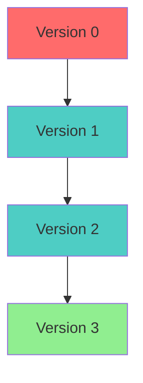
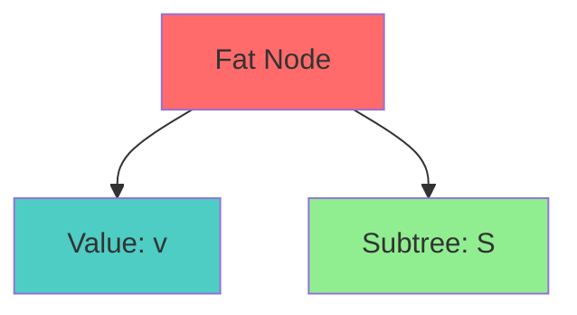
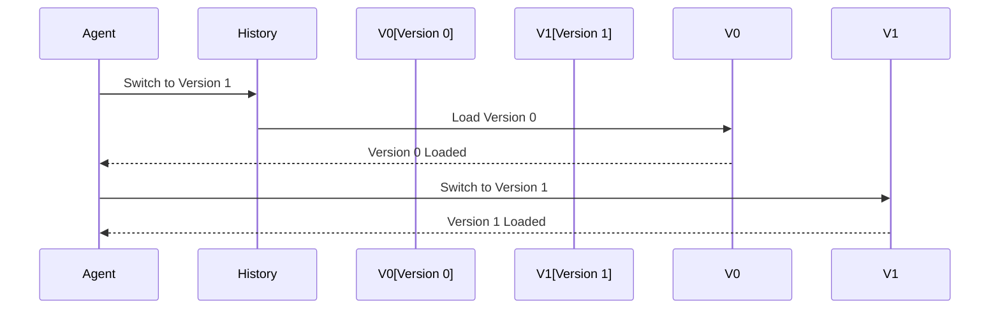

# Persistent Data Structure Specification (History)

* File:* `tooling\history_persistent_tree_spec.md`
* Version:* 1.0.0
* Context:* Layer 1 (MCM) - Codebase Storage
* Formalism:* Path Copying & Fat Nodes
* Status:* Active
* Last Modified:* 2026-01-01
* Author:* Kilo Code
* Reviewers:* Pending

- -

## 1. Introduction

### 1.1 Purpose

This specification formalizes the **Codebase History** system using **Persistent Data Structures**, providing mathematical foundation for version management and time-travel capabilities. This formalization enables the Morph Codebase Manager to support instant undo/redo, branching, and efficient storage of code versions.

### 1.2 Scope

This specification covers:
- Version tree structure
- Path copying for structural sharing
- Fat nodes for efficient updates
- Time-travel guarantee
- Instant state switching
- Persistent map operations

This specification does not cover:
- Concrete implementation of storage backend
- File system integration details
- Performance optimization strategies

### 1.3 Definitions, Acronyms, and Abbreviations

| Term | Definition |
|-------|------------|
| **Persistent Map** | Immutable map with path copying |
| **Path Copying** | Copying only modified paths from root |
| **Fat Node** | Node with shared subtrees and value |
| **Time-Travel** | Ability to switch to any previous version |
| **Root Hash** | Hash of version root for identification |
| **Structural Sharing** | Reusing unchanged subtrees across versions |
| **Version** | Immutable snapshot of codebase state |

### 1.4 References

- Okasaki, C. (1982). "Functional Data Structures and Their Persistent Implementations"
- Driscoll, J. R., et al. (1986). "Making Data Structures Persistent"
- IEEE 1016: Recommended Practice for Software Design Descriptions
- ISO/IEC 29148: Systems and software engineering — Requirements engineering

- -

## 2. Formal Definitions

### 2.1 The Version Tree

The Codebase is a Map $M: \text{Hash} \to \text{AST}$.
We model versioning as a sequence of persistent maps $M_0, M_1, \dots$.

* HIST-INV-001:* THE system SHALL define version tree as sequence of persistent maps.

* HIST-REQ-001:* THE system SHALL maintain version history as persistent maps.

* Priority:* Critical
* Verification Method:* Test
* Rationale:* Enables time-travel and branching
* Dependencies:* HIST-INV-001
* Traceability:* Section 2.1 (The Version Tree)

#### 2.1.1 Persistent Map

* Persistent Map:* $M = (\text{RootHash}, \text{Map})$

* Components:*
- Root hash: $\mu(\text{Root})$
- Map: $\text{Map}: \text{Key} \to \text{Value}$

* Invariants:*
1. Root hash is computed from map contents
2. Map is immutable (cannot be modified after creation)
3. Map keys are AST hashes

* HIST-INV-002:* THE system SHALL define persistent map with root hash.

* HIST-REQ-002:* THE system SHALL create immutable persistent maps for versions.

* Priority:* Critical
* Verification Method:* Test
* Rationale:* Enables version identification
* Dependencies:* HIST-INV-002
* Traceability:* Section 2.1.1 (Persistent Map)

### 2.2 Path Copying

* Path Copying:* To update key $k$ with value $v$, we clone only the path from root to the leaf containing $k$. All other subtrees are shared with the previous version.

* HIST-INV-003:* THE system SHALL define path copying for structural sharing.

* HIST-REQ-003:* THE system SHALL use path copying for map updates.

* Priority:* Critical
* Verification Method:* Test
* Rationale:* Enables efficient storage and fast updates
* Dependencies:* HIST-INV-003
* Traceability:* Section 2.2 (Path Copying)

#### 2.2.1 Path Copying Algorithm

* HIST-THM-001:* THE system SHALL guarantee that path copying preserves structural sharing.

* Priority:* Critical
* Verification Method:* Analysis
* Rationale:* Ensures efficient storage
* Dependencies:* HIST-INV-003
* Traceability:* Section 2.2.1 (Path Copying Algorithm)

* Proof Sketch:*
1. By definition of path copying, only modified path is cloned
2. By definition of path copying, unmodified subtrees are shared
3. By definition of structural sharing, shared subtrees are not duplicated
4. Therefore, path copying preserves structural sharing

### 2.3 Fat Nodes

* Fat Node:* A node that contains both a value and a reference to a subtree.

* HIST-INV-004:* THE system SHALL define fat nodes for efficient updates.

* HIST-REQ-004:* THE system SHALL use fat nodes for map operations.

* Priority:* Critical
* Verification Method:* Test
* Rationale:* Enables efficient map operations
* Dependencies:* HIST-INV-004
* Traceability:* Section 2.3 (Fat Nodes)

#### 2.3.1 Fat Node Structure

* Fat Node:* $N = (\text{Value}, \text{Subtree})$

* Components:*
- Value: $v$
- Subtree reference: $S$ (shared with other versions)

* Invariants:*
1. Value is immutable
2. Subtree is a persistent map

### 2.4 The Time-Travel Guarantee

Because $M_t$ is immutable, the Agent can switch context to any previous compilation state $t-k$ instantly.

* HIST-INV-005:* THE system SHALL guarantee time-travel capability.

* HIST-REQ-005:* THE system SHALL support instant switching to any version.

* Priority:* Critical
* Verification Method:* Test
* Rationale:* Enables instant undo/redo and branching
* Dependencies:* HIST-INV-005
* Traceability:* Section 2.4 (The Time-Travel Guarantee)

#### 2.4.1 Time-Travel Property

* Formalism:* $\forall t, \text{lookup}(M_t, k)$ is referentially transparent. It depends only on Root Hash of $M_t$.

* HIST-THM-002:* THE system SHALL guarantee referential transparency for time-travel.

* Priority:* Critical
* Verification Method:* Analysis
* Rationale:* Ensures deterministic version switching
* Dependencies:* HIST-INV-005
* Traceability:* Section 2.4.1 (Time-Travel Property)

- -

## 3. Requirements

### 3.1 Functional Requirements

* HIST-REQ-006:* THE system SHALL support persistent map creation.

* Priority:* Critical
* Verification Method:* Test
* Rationale:* Enables version management
* Dependencies:* HIST-INV-002
* Traceability:* Section 2.1.1 (Persistent Map)

* HIST-REQ-007:* THE system SHALL support path copying for updates.

* Priority:* Critical
* Verification Method:* Test
* Rationale:* Enables efficient storage
* Dependencies:* HIST-INV-003
* Traceability:* Section 2.2 (Path Copying)

* HIST-REQ-008:* THE system SHALL support fat nodes for map operations.

* Priority:* Critical
* Verification Method:* Test
* Rationale:* Enables efficient updates
* Dependencies:* HIST-INV-004
* Traceability:* Section 2.3 (Fat Nodes)

* HIST-REQ-009:* THE system SHALL support time-travel to any version.

* Priority:* Critical
* Verification Method:* Test
* Rationale:* Enables instant version switching
* Dependencies:* HIST-INV-005
* Traceability:* Section 2.4 (The Time-Travel Guarantee)

### 3.2 Non-Functional Requirements

* HIST-NFR-001:* THE system SHALL perform map updates in O(log n) time.

* Priority:* High
* Verification Method:* Performance test
* Metric:* Map update < 1ms for 1000 keys
* Rationale:* Ensures fast version management
* Dependencies:* None
* Traceability:* Section 2.1.1 (Persistent Map)

* HIST-NFR-002:* THE system SHALL support up to 10,000 versions.

* Priority:* Medium
* Verification Method:* Stress test
* Metric:* 10,000 versions
* Rationale:* Supports large-scale projects
* Dependencies:* None
* Traceability:* Section 2.1 (The Version Tree)

- -

## 4. Design

### 4.1 Architecture Overview

The History Engine is implemented as a storage component that:
1. Maintains version tree as persistent maps
2. Uses path copying for structural sharing
3. Implements fat nodes for efficient updates
4. Provides time-travel capability
5. Supports instant version switching

### 4.2 Data Structures

#### 4.2.1 Persistent Map

* Persistent Map:* $M = (\text{RootHash}, \text{Map})$

* Components:*
- Root hash: $\mu(\text{Root})$
- Map: $\text{Map}: \text{Key} \to \text{Value}$

* Invariants:*
1. Root hash is computed from map contents
2. Map is immutable
3. Map keys are AST hashes

#### 4.2.2 Fat Node

* Fat Node:* $N = (\text{Value}, \text{Subtree})$

* Components:*
- Value: $v$
- Subtree reference: $S$ (shared persistent map)

* Invariants:*
1. Value is immutable
2. Subtree is a persistent map

### 4.3 Algorithms

#### 4.3.1 Map Update Algorithm

* Algorithm Name:* Update Map with Path Copying

* Input:* Current map $M$, Key $k$, Value $v$

* Output:* New map $M'$

* Mathematical Definition:*
$$
M' = (\text{RootHash}, \text{Map}')$$
where:
$$
\text{Map}' = \text{Map}[k \mapsto v \text{with\_path\_copy}(\text{PathTo}(k, \text{Map})]
$$

* Pseudocode:*
```
function update_map(map, key, value):
    path = find_path_to_key(map, key)
    new_map = map.with_path_copy(key, value)
    return new_map
```

* Complexity:*
- Time: $O(\log n)$ where $n$ is depth of key
- Space: $O(\log n)$ for new map

* Correctness:*
- **Invariant:* New map shares unmodified subtrees
- **Termination:* Path traversal terminates

#### 4.3.2 Path Finding Algorithm

* Algorithm Name:* Find Path to Key

* Input:* Map $M$, Key $k$

* Output:* Path from root to key

* Mathematical Definition:*
$$
\text{PathTo}(k, M) = \text{Reverse}(\text{PathFrom}(k, \text{Root}))
$$

* Pseudocode:*
```
function find_path_to_key(map, key):
    path = []
    current = key

    while current != null:
        path.append(current)
        current = map.parent_of(current)

    return reverse(path)
```

* Complexity:*
- Time: $O(d)$ where $d$ is depth of key
- Space: $O(d)$ for path

* Correctness:*
- **Invariant:* Path is from root to key
- **Termination:* Parent chain terminates at root

#### 4.3.3 Root Hash Computation Algorithm

* Algorithm Name:* Compute Root Hash

* Input:* Map $M$

* Output:* Root hash $\mu(\text{Root})$

* Mathematical Definition:*
$$
\mu(\text{Root}) = \text{Hash}(\text{Serialize}(M.\text{Map}))
$$

* Pseudocode:*
```
function compute_root_hash(map):
    serialized = serialize_map(map.map)
    return hash(serialized)
```

* Complexity:*
- Time: $O(n)$ where $n$ is number of keys
- Space: $O(n)$ for serialization

* Correctness:*
- **Invariant:* Hash uniquely identifies version
- **Termination:* Single hash computation

### 4.4 Mermaid Diagrams

#### 4.4.1 Version Tree



#### 4.4.2 Path Copying

```mermaid
graph LR
    Root[Root] --> A[Key A]
    Root --> B[Key B]
    Root --> C[Key C]

    A -.->| Shared[Shared Subtree]
    B -.->| Shared
    C -.->| Shared

    style Root fill:#FF6B6B
    style A fill:#4ECDC4
    style B fill:#4ECDC4
    style C fill:#4ECDC4
    style Shared fill:#90EE90
```

#### 4.4.3 Fat Node



#### 4.4.4 Time-Travel



- -

## 5. Correctness Properties

### 5.1 Theorems

#### 5.1.1 Path Copying Theorem

* Theorem:* Path copying preserves structural sharing.

* Proof Sketch:*
1. By definition of path copying, only modified path is cloned
2. By definition of path copying, unmodified subtrees are shared
3. By definition of structural sharing, shared subtrees are not duplicated
4. Therefore, path copying preserves structural sharing

* HIST-THM-003:* THE system SHALL guarantee that path copying preserves structural sharing.

* Priority:* Critical
* Verification Method:* Analysis
* Rationale:* Ensures efficient storage
* Dependencies:* HIST-INV-003
* Traceability:* Section 5.1.1 (Path Copying Theorem)

#### 5.1.2 Time-Travel Theorem

* Theorem:* Immutable maps enable instant time-travel.

* Proof Sketch:*
1. By definition of persistent map, each version is immutable
2. By definition of time-travel, lookup depends only on root hash
3. By definition of referential transparency, lookup is deterministic
4. Therefore, time-travel is instant

* HIST-THM-004:* THE system SHALL guarantee instant time-travel.

* Priority:* Critical
* Verification Method:* Analysis
* Rationale:* Enables instant version switching
* Dependencies:* HIST-INV-005
* Traceability:* Section 5.1.2 (Time-Travel Theorem)

### 5.2 Invariants

#### 5.2.1 Map Invariants

- **HIST-INV-006:* THE system SHALL maintain that maps are immutable
- **HIST-INV-007:* THE system SHALL maintain that root hash is computed from map contents

#### 5.2.2 Path Copying Invariants

- **HIST-INV-008:* THE system SHALL maintain that path copying shares unmodified subtrees

#### 5.2.3 Time-Travel Invariants

- **HIST-INV-009:* THE system SHALL maintain that version lookup is referentially transparent

- -

## 6. Examples

### 6.1 Simple Version Update

```morph
// Simple version update: Add new file
let map0 = create_map();
let map1 = update_map(map0, "main.rs", "fn main() { ... }");
// map1 shares unmodified subtrees from map0
```

* Path Copying:*
- Path to "main.rs": `["main.rs"]`
- New map: $M_1$ with path-copied subtree

### 6.2 Branching

```morph
// Branching: Create new version from existing
let map0 = create_map();
let map1 = update_map(map0, "main.rs", "fn main_v2() { ... }");
let map2 = update_map(map1, "utils.rs", "fn helper() { ... }");
// map2 shares unmodified subtrees from map0 and map1
```

* Path Copying:*
- Path to "main.rs": `["main.rs"]`
- Path to "utils.rs": `["utils.rs"]`
- New map: $M_2$ with path-copied subtrees

### 6.3 Time-Travel

```morph
// Time-travel: Switch to previous version
let map0 = create_map();
let map1 = update_map(map0, "main.rs", "fn main() { ... }");
let map2 = update_map(map1, "main.rs", "fn main_v2() { ... }");

// Switch to version 1
switch_to_version(map1);

// Switch to version 0
switch_to_version(map0);
```

* Time-Travel:*
- Instant switch to any version
- Lookup depends only on root hash
- No state reconstruction needed

### 6.4 Edge Cases

#### 6.4.1 Empty Map

```morph
// Edge case: Empty version
let map = create_map();
// Root hash: hash(empty_map)
```

* Empty Map:*
- No keys
- Root hash: $\mu(\emptyset)$

#### 6.4.2 Large Version

```morph
// Edge case: Large version with many files
let map = create_map();
for i in 0..10000:
    update_map(map, format!("file_{}.rs", i), "content");
// Path copying ensures efficient storage
```

* Path Copying:*
- Each update: $O(\log n)$ path copy
- Structural sharing: $O(n)$ space for shared subtrees

- -

## Change Log

| Version | Date       | Author      | Changes                                                                 |
|---------|------------|-------------|-------------------------------------------------------------------------|
| 1.0.0   | 2026-01-01 | Kilo Code    | Initial version                                                        |
