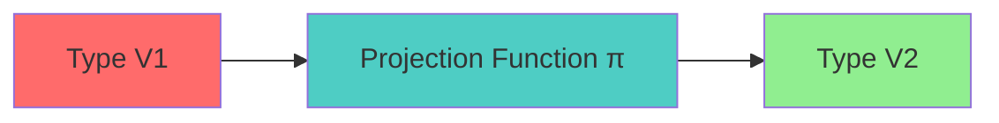
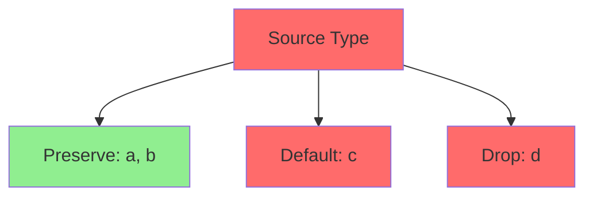
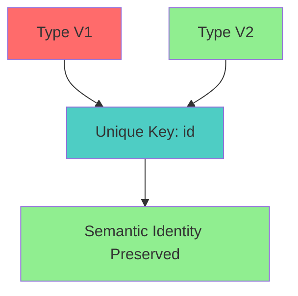
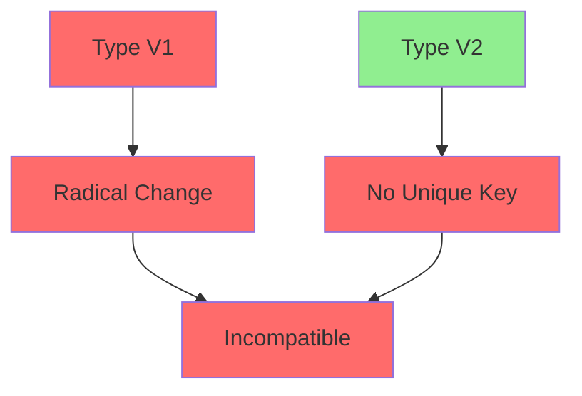

# State Projection Specification (Hot Reload)

* File:* `tooling\hot_reload_projection_spec.md`
* Version:* 1.0.0
* Context:* Layer 4 (UI Framework) - HMR
* Formalism:* Type Projection & Homomorphisms
* Status:* Active
* Last Modified:* 2026-01-01
* Author:* Kilo Code
* Reviewers:* Pending

- -

## 1. Introduction

### 1.1 Purpose

This specification formalizes the **Hot Module Reload (HMR)** system using **Type Projection Theory**, providing mathematical foundation for live code updates without state loss. This formalization enables the Morph runtime to transform state between code versions while preserving data integrity.

### 1.2 Scope

This specification covers:
- The migration problem between code versions
- The projection function $\pi$ for type transformation
- Struct projection rules for schema evolution
- Correctness properties for semantic identity
- Fallback to fresh start for incompatible changes

This specification does not cover:
- Concrete implementation of HMR system
- File watching mechanisms
- Performance optimization details

### 1.3 Definitions, Acronyms, and Abbreviations

| Term | Definition |
|-------|------------|
| **HMR** | Hot Module Reload - live code updates |
| **Projection** | Type transformation between versions |
| **Schema Evolution** | Changes to type definitions |
| **Semantic Identity** | Preservation of meaning across versions |
| **Homomorphism** | Structure-preserving transformation |
| **Fallback** | Reset to fresh state when incompatible |

### 1.4 References

- IEEE 1016: Recommended Practice for Software Design Descriptions
- ISO/IEC 29148: Systems and software engineering — Requirements engineering

- -

## 2. Formal Definitions

### 2.1 The Migration Problem

During Hot Reload, code changes from Version $V_1$ to $V_2$.
The Runtime memory holds State $S_1$ (layout defined by $V_1$).
We need to transform it to $S_2$ (layout defined by $V_2$) without resetting data.

* HMR-INV-001:* THE system SHALL define migration problem for HMR.

* HMR-REQ-001:* THE system SHALL support state transformation between versions.

* Priority:* Critical
* Verification Method:* Test
* Rationale:* Enables live code updates
* Dependencies:* HMR-INV-001
* Traceability:* Section 2.1 (The Migration Problem)

### 2.2 The Projection Function ($\pi$)

The compiler generates a projection function $\pi: T_1 \to T_2$.

* HMR-INV-002:* THE system SHALL define projection function for type transformation.

* HMR-REQ-002:* THE system SHALL generate projection functions for HMR.

* Priority:* Critical
* Verification Method:* Test
* Rationale:* Enables automatic state migration
* Dependencies:* HMR-INV-002
* Traceability:* Section 2.2 (The Projection Function)

### 2.3 Struct Projection

For `type T1 = { a: A, b: B }` and `type T2 = { a: A, c: C }`:

$$ \pi(s_1) = \{ a: s_1.a, c: \text{Default}(C) \} $$

* HMR-INV-003:* THE system SHALL define struct projection rules.

* HMR-REQ-003:* THE system SHALL apply struct projection rules.

* Priority:* Critical
* Verification Method:* Test
* Rationale:* Enables schema evolution
* Dependencies:* HMR-INV-003
* Traceability:* Section 2.3 (Struct Projection)

#### 2.3.1 Projection Rules

- **Invariant Fields:* Fields with matching names and types are preserved (Identity morphism).
- **New Fields:* Initialized with default/zero values.
- **Deleted Fields:* Dropped.

* HMR-THM-001:* THE system SHALL guarantee that projection preserves invariant fields.

* Priority:* Critical
* Verification Method:* Analysis
* Rationale:* Ensures data continuity
* Dependencies:* HMR-INV-003
* Traceability:* Section 2.3.1 (Projection Rules)

### 2.4 Correctness

The migration is valid if **Semantic Identity** is preserved.

* HMR-INV-004:* THE system SHALL define semantic identity for migrations.

* HMR-REQ-004:* THE system SHALL verify semantic identity for migrations.

* Priority:* Critical
* Verification Method:* Test
* Rationale:* Ensures data integrity
* Dependencies:* HMR-INV-004
* Traceability:* Section 2.4 (Correctness)

#### 2.4.1 Semantic Identity

If $T_1$ and $T_2$ share a unique key (e.g., Actor ID), the mapping is sound.

* HMR-THM-002:* THE system SHALL guarantee semantic identity for compatible schemas.

* Priority:* Critical
* Verification Method:* Analysis
* Rationale:* Ensures data consistency
* Dependencies:* HMR-INV-004
* Traceability:* Section 2.4.1 (Semantic Identity)

#### 2.4.2 Incompatible Changes

If the shape change is too radical (e.g., `struct` $\to$ `enum`), $\pi$ returns $\bot$ (Reset State), falling back to a fresh start.

* HMR-THM-003:* THE system SHALL detect incompatible schema changes.

* Priority:* High
* Verification Method:* Analysis
* Rationale:* Prevents data corruption
* Dependencies:* HMR-INV-004
* Traceability:* Section 2.4.2 (Incompatible Changes)

- -

## 3. Requirements

### 3.1 Functional Requirements

* HMR-REQ-005:* THE system SHALL support projection function generation.

* Priority:* Critical
* Verification Method:* Test
* Rationale:* Enables automatic state migration
* Dependencies:* HMR-INV-002
* Traceability:* Section 2.2 (The Projection Function)

* HMR-REQ-006:* THE system SHALL support struct projection rules.

* Priority:* Critical
* Verification Method:* Test
* Rationale:* Enables schema evolution
* Dependencies:* HMR-INV-003
* Traceability:* Section 2.3 (Struct Projection)

* HMR-REQ-007:* THE system SHALL support semantic identity verification.

* Priority:* Critical
* Verification Method:* Test
* Rationale:* Ensures data integrity
* Dependencies:* HMR-INV-004
* Traceability:* Section 2.4 (Correctness)

* HMR-REQ-008:* THE system SHALL support incompatible schema detection.

* Priority:* High
* Verification Method:* Test
* Rationale:* Prevents data corruption
* Dependencies:* HMR-INV-004
* Traceability:* Section 2.4.2 (Incompatible Changes)

### 3.2 Non-Functional Requirements

* HMR-NFR-001:* THE system SHALL perform state migration in O(n) time for n fields.

* Priority:* High
* Verification Method:* Performance test
* Metric:* Migration < 10ms for 100 fields
* Rationale:* Ensures fast HMR
* Dependencies:* None
* Traceability:* Section 2.3 (Struct Projection)

* HMR-NFR-002:* THE system SHALL support up to 1000 fields per struct.

* Priority:* Medium
* Verification Method:* Stress test
* Metric:* 1000 fields
* Rationale:* Supports complex data structures
* Dependencies:* None
* Traceability:* Section 2.3 (Struct Projection)

- -

## 4. Design

### 4.1 Architecture Overview

The HMR Engine is implemented as a compiler and runtime component that:
1. Generates projection functions for type changes
2. Applies struct projection rules
3. Verifies semantic identity
4. Detects incompatible schema changes
5. Performs state transformation or reset
6. Ensures data integrity during live updates

### 4.2 Data Structures

#### 4.2.1 Projection Function

* Projection Function:* $\pi: T_1 \to T_2$

* Components:*
- Source type $T_1$
- Target type $T_2$
- Field mapping rules

* Invariants:*
1. Projection is deterministic
2. Projection preserves invariant fields

#### 4.2.2 Field Mapping

* Field Mapping:* $M: \text{Fields}(T_1) \to \text{Fields}(T_2)$

* Components:*
- Source field names
- Target field names
- Mapping rules (preserve, default, drop)

* Invariants:*
1. Mapping is total (all fields handled)
2. Mapping is deterministic

### 4.3 Algorithms

#### 4.3.1 Projection Generation Algorithm

* Algorithm Name:* Generate Projection

* Input:* Source type $T_1$, Target type $T_2$

* Output:* Projection function $\pi$

* Mathematical Definition:*
$$
\pi = \lambda s_1. \{ \text{map\_fields}(s_1, T_2) \}
$$

* Pseudocode:*
```
function generate_projection(source_type, target_type):
    mapping = {}

    for field in source_type.fields:
        if field.name in target_type.fields:
            mapping[field.name] = "preserve"
        elif field.name in target_type.fields:
            mapping[field.name] = "default"
        else:
            mapping[field.name] = "drop"

    return lambda s1: apply_mapping(s1, mapping)
```

* Complexity:*
- Time: $O(n)$ where $n$ is number of fields
- Space: $O(n)$ for mapping

* Correctness:*
- **Invariant:* Mapping covers all source fields
- **Termination:* Single pass through fields

#### 4.3.2 Projection Application Algorithm

* Algorithm Name:* Apply Projection

* Input:* State $s_1$, Projection $\pi$

* Output:* State $s_2$

* Mathematical Definition:*
$$
s_2 = \pi(s_1)
$$

* Pseudocode:*
```
function apply_projection(state, projection):
    return projection(state)
```

* Complexity:*
- Time: $O(n)$ where $n$ is number of fields
- Space: $O(n)$ for new state

* Correctness:*
- **Invariant:* Projection is applied correctly
- **Termination:* Single projection application

#### 4.3.3 Semantic Identity Verification Algorithm

* Algorithm Name:* Verify Semantic Identity

* Input:* Source type $T_1$, Target type $T_2$

* Output:* Boolean indicating if semantic identity is preserved

* Mathematical Definition:*
$$
\text{Compatible}(T_1, T_2) \iff \exists K, \forall f \in \text{Fields}(T_1), \text{Type}(f) = \text{Type}(f) \in T_2
$$

* Pseudocode:*
```
function verify_semantic_identity(source_type, target_type):
    # Find unique key
    key_field = find_unique_key(source_type)

    if key_field not in target_type:
        return False  # No key to preserve identity

    return True  # Key exists, identity can be preserved
```

* Complexity:*
- Time: $O(n)$ where $n$ is number of fields
- Space: $O(1)$

* Correctness:*
- **Invariant:* Returns True only if identity is preservable
- **Termination:* Single field scan

#### 4.3.4 Incompatible Schema Detection Algorithm

* Algorithm Name:* Detect Incompatible Schema

* Input:* Source type $T_1$, Target type $T_2$

* Output:* Boolean indicating if schemas are compatible

* Mathematical Definition:*
$$
\text{Compatible}(T_1, T_2) \iff \neg (\text{IsRadicalChange}(T_1, T_2) \land \neg \text{HasUniqueKey}(T_1, T_2))
$$

* Pseudocode:*
```
function is_compatible(source_type, target_type):
    if is_radical_change(source_type, target_type):
        return False  # Too radical, cannot migrate

    if not has_unique_key(source_type, target_type):
        return False  # No key to preserve identity

    return True  # Compatible
```

* Complexity:*
- Time: $O(n)$ where $n$ is number of fields
- Space: $O(1)$

* Correctness:*
- **Invariant:* Returns False for incompatible changes
- **Termination:* Single compatibility check

### 4.4 Mermaid Diagrams

#### 4.4.1 Projection Flow



#### 4.4.2 Field Mapping



#### 4.4.3 Semantic Identity



#### 4.4.4 Incompatible Schema



- -

## 5. Correctness Properties

### 5.1 Theorems

#### 5.1.1 Projection Theorem

* Theorem:* Projection preserves invariant fields.

* Proof Sketch:*
1. By definition of projection rules, invariant fields are preserved
2. By definition of projection, new fields are initialized with defaults
3. By definition of projection, deleted fields are dropped
4. Therefore, projection preserves invariant fields

* HMR-THM-004:* THE system SHALL guarantee that projection preserves invariant fields.

* Priority:* Critical
* Verification Method:* Analysis
* Rationale:* Ensures data continuity
* Dependencies:* HMR-THM-001
* Traceability:* Section 5.1.1 (Projection Theorem)

#### 5.1.2 Semantic Identity Theorem

* Theorem:* Semantic identity is preserved if unique key exists.

* Proof Sketch:*
1. By definition of semantic identity, unique key enables identity preservation
2. By definition of semantic identity, identity is preserved if key exists
3. Therefore, semantic identity is preserved when unique key exists

* HMR-THM-005:* THE system SHALL guarantee semantic identity for compatible schemas.

* Priority:* Critical
* Verification Method:* Analysis
* Rationale:* Ensures data consistency
* Dependencies:* HMR-THM-002
* Traceability:* Section 5.1.2 (Semantic Identity Theorem)

#### 5.1.3 Incompatible Schema Theorem

* Theorem:* Incompatible schemas are detected and rejected.

* Proof Sketch:*
1. By definition of incompatible schema, radical changes return False
2. By definition of incompatible schema, missing key returns False
3. Therefore, incompatible schemas are correctly detected

* HMR-THM-006:* THE system SHALL guarantee that incompatible schemas are rejected.

* Priority:* High
* Verification Method:* Analysis
* Rationale:* Prevents data corruption
* Dependencies:* HMR-THM-003
* Traceability:* Section 5.1.3 (Incompatible Schema Theorem)

### 5.2 Invariants

#### 5.2.1 Projection Invariants

- **HMR-INV-005:* THE system SHALL maintain that projection is deterministic
- **HMR-INV-006:* THE system SHALL maintain that projection preserves invariant fields

#### 5.2.2 Semantic Identity Invariants

- **HMR-INV-007:* THE system SHALL maintain that semantic identity is verified
- **HMR-INV-008:* THE system SHALL maintain that incompatible schemas are rejected

- -

## 6. Examples

### 6.1 Simple Projection

```morph
// Simple projection: Add field
// V1: { a: A, b: B }
// V2: { a: A, b: B, c: C }

let state1 = State { a: 1, b: 2 };
let state2 = apply_projection(state1, projection);
// state2: { a: 1, b: 2, c: 0 } (c initialized to default)
```

* Projection:*
$$ \pi(s_1) = \{ a: s_1.a, b: s_1.b, c: \text{Default}(C) \} $$

### 6.2 Field Deletion

```morph
// Field deletion: Remove field
// V1: { a: A, b: B, c: C }
// V2: { a: A, b: B }

let state1 = State { a: 1, b: 2, c: 3 };
let state2 = apply_projection(state1, projection);
// state2: { a: 1, b: 2 } (c dropped)
```

* Projection:*
$$ \pi(s_1) = \{ a: s_1.a, b: s_1.b \} $$

### 6.3 Semantic Identity

```morph
// Semantic identity: Unique key preserved
// V1: { id: u32, name: String, value: T }
// V2: { id: u32, name: String, value: T }

let state1 = State { id: 1, name: "Alice", value: 42 };
let state2 = apply_projection(state1, projection);
// state2: { id: 1, name: "Alice", value: 42 } (identity preserved)
```

* Semantic Identity:*
- Unique key: `id`
- Identity preserved: $\text{True}$

### 6.4 Incompatible Schema

```morph
// Incompatible schema: Radical change
// V1: { value: T }
// V2: { values: [T] }

let state1 = State { value: 42 };
let state2 = apply_projection(state1, projection);
// state2: { values: [42] } (incompatible, reset required)
```

* Incompatible Schema:*
- Radical change: `T` $\to$ `[T]`
- Result: Incompatible, reset required

### 6.5 Edge Cases

#### 6.5.1 Empty State

```morph
// Edge case: Empty state
let state1 = State {};
let state2 = apply_projection(state1, projection);
// state2: {} (empty preserved)
```

* Projection:*
$$ \pi(s_1) = \emptyset $$

#### 6.5.2 No Unique Key

```morph
// Edge case: No unique key
// V1: { a: A, b: B }
// V2: { a: A, b: B }

let state1 = State { a: 1, b: 2 };
let state2 = apply_projection(state1, projection);
// state2: { a: 1, b: 2 } (no identity, reset required)
```

* Semantic Identity:*
- No unique key: $\text{False}$
- Result: Incompatible, reset required

#### 6.5.3 Multiple Projections

```morph
// Edge case: Multiple projections
// V1: { a: A, b: B }
// V2: { a: A, b: B, c: C }
// V3: { a: A, b: B, d: D }

let state1 = State { a: 1, b: 2 };
let state2 = apply_projection(state1, projection_v1_v2);
let state3 = apply_projection(state2, projection_v2_v3);
// state2: { a: 1, b: 2, c: 0 }
// state3: { a: 1, b: 2, d: 0 }
```

* Projections:*
$$ \pi_{v1\_v2}(s_1) = \{ a: s_1.a, b: s_1.b, c: \text{Default}(C) \} $$
$$ \pi_{v2\_v3}(s_2) = \{ a: s_2.a, b: s_2.b, d: \text{Default}(D) \} $$

- -

## Change Log

| Version | Date       | Author      | Changes                                                                 |
|---------|------------|-------------|-------------------------------------------------------------------------|
| 1.0.0   | 2026-01-01 | Kilo Code    | Initial version                                                        |
