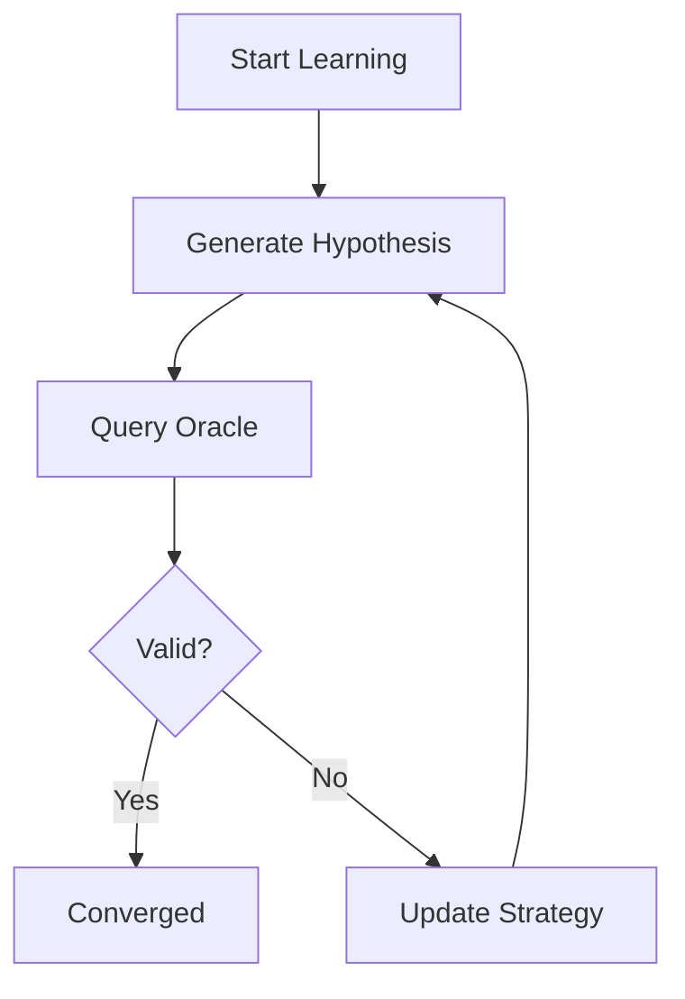
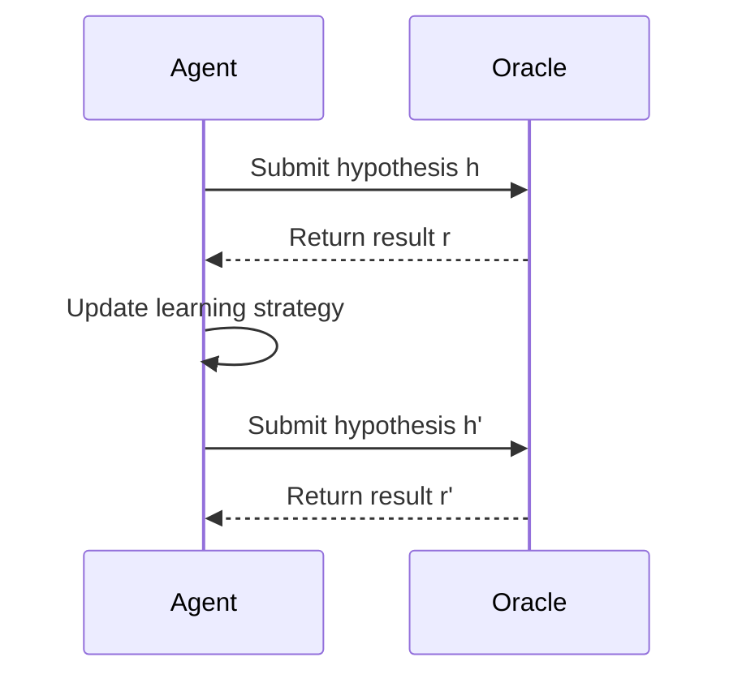
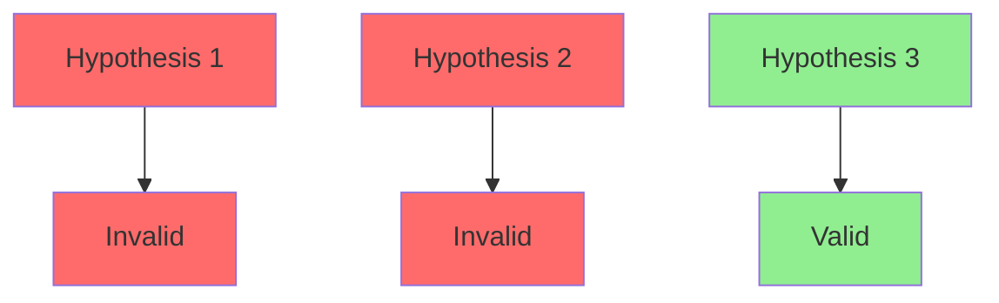

# Computational Learning Theory Specification (Tabula Rasa)

* File:* `tooling\learning_theory_spec.md`
* Version:* 1.0.0
* Context:* Layer 5 (Agent Interface) - Feedback Loop
* Formalism:* PAC Learning (Probably Approximately Correct) & Query Learning
* Status:* Active
* Last Modified:* 2026-01-01
* Author:* Kilo Code
* Reviewers:* Pending

- -

## 1. Introduction

### 1.1 Purpose

This specification formalizes the **Agent Learning System** using **PAC Learning (Probably Approximately Correct) & Query Learning**, providing mathematical foundation for agents to learn Morph programming from scratch. This formalization enables the Morph compiler to provide informative feedback that guarantees convergence to valid programs.

### 1.2 Scope

This specification covers:
- The Learning Model for agent approximation
- The Protocol for learning via membership queries
- The Diagnostic Property for informative counter-examples
- The Convergence Theorem for guaranteed learning

This specification does not cover:
- Concrete implementation of learning algorithm
- Agent state management
- Learning rate optimization

### 1.3 Definitions, Acronyms, and Abbreviations

| Term | Definition |
|-------|------------|
| **PAC Learning** | Probably Approximately Correct - learning framework with probabilistic guarantees |
| **Query Learning** | Learning model through interactive queries and feedback |
| **Learner** | Agent trying to approximate target concept |
| **Target Concept** | Valid Morph grammar and semantics |
| **Hypothesis Space** | Set of all possible programs agent can generate |
| **Oracle** | The Morph Compiler (MCP) that provides feedback |
| **Membership Query** | Query asking if a program is valid |
| **Counter-Example** | Informative diagnostic showing why program is invalid |
| **Convergence** | Property that learner identifies correct concept after finite queries |

### 1.4 References

- Valiant, L. G. (1984). "A Theory of the Learnable"
- Angluin, D. (1987). "Learning Presburger Sets"
- Kearns, M. J., & Vazirani, U. (1994). "An Introduction to Computational Learning Theory"
- IEEE 1016: Recommended Practice for Software Design Descriptions
- ISO/IEC 29148: Systems and software engineering — Requirements engineering

- -

## 2. Formal Definitions

### 2.1 The Learning Model

We model Agent as a **Learner** $L$ trying to approximate Target Concept $C$ (The Valid Morph Grammar and Semantics).

* LRN-INV-001:* THE system SHALL define learner as approximation of target concept.

#### 2.1.1 Hypothesis Space

* Hypothesis Space ($H$):* The set of all possible programs Agent can generate.

$$ H = \{h_1, h_2, \dots, h_n\} $$

* LRN-INV-002:* THE system SHALL define hypothesis space as set of possible programs.

#### 2.1.2 Oracle

* Oracle ($O$):* The Morph Compiler (MCP).

$$ O: H \to \{1, (0, \text{Diagnostic})\} $$

* LRN-INV-003:* THE system SHALL define oracle as function from hypotheses to validation results.

### 2.2 The Protocol: Learning via Membership Queries

The Agent cannot just "read" grammar; it learns by trying.

The Agent generates a hypothesis program $h \in H$ and queries Oracle (Compiler):

$$ O(h) = \begin{cases}
1 & \text{if } h \in C \text{ (Valid Code)} \\
(0, \text{Diagnostic}) & \text{if } h \notin C \text{ (Error)}
\end{cases} $$

* LRN-REQ-001:* THE system SHALL support membership queries for learning.

* Priority:* Critical
* Verification Method:* Test
* Rationale:* Enables agent to learn through trial and error
* Dependencies:* LRN-INV-001, LRN-INV-002, LRN-INV-003
* Traceability:* Section 2.2 (The Protocol: Learning via Membership Queries)

### 2.3 The Diagnostic Property (Counter-Examples)

Crucially, Morph diagnostics are **Informative Counter-Examples**.

- A standard compiler returns "Syntax Error." (1 bit of entropy)
- Morph returns "Expected `}` at line 10." (High entropy)

* LRN-INV-004:* THE system SHALL provide informative counter-examples.

* LRN-REQ-002:* THE system SHALL provide high-entropy diagnostics for invalid programs.

* Priority:* Critical
* Verification Method:* Test
* Rationale:* Accelerates learning by providing specific feedback
* Dependencies:* LRN-INV-004
* Traceability:* Section 2.3 (The Diagnostic Property)

### 2.4 The Convergence Theorem

In Query Learning theory (Angluin), if an Oracle provides counter-examples, Learner can identify any Regular Language (Syntax) in polynomial time.

* LRN-THM-001:* THE system SHALL guarantee convergence to valid program after finite queries.

* Priority:* Critical
* Verification Method:* Analysis
* Rationale:* Ensures agent can learn Morph programming
* Dependencies:* LRN-INV-001, LRN-INV-002, LRN-INV-003
* Traceability:* Section 2.4 (The Convergence Theorem)

#### 2.4.1 Morph Guarantee

Because Morph syntax (LS3) is Context-Free (deterministic parsing) and semantics are Affine/Categorical (constructive), Agent is mathematically guaranteed to converge on a valid program $h \in C$ after a finite number of query iterations.

* LRN-THM-002:* THE system SHALL guarantee convergence for Morph language.

* Priority:* High
* Verification Method:* Analysis
* Rationale:* Ensures agent can learn Morph programming
* Dependencies:* LRN-THM-001
* Traceability:* Section 2.4.1 (Morph Guarantee)

- -

## 3. Requirements

### 3.1 Functional Requirements

* LRN-REQ-003:* THE system SHALL support hypothesis generation.

* Priority:* Critical
* Verification Method:* Test
* Rationale:* Enables agent to explore program space
* Dependencies:* LRN-INV-002
* Traceability:* Section 2.1.1 (Hypothesis Space)

* LRN-REQ-004:* THE system SHALL support membership queries.

* Priority:* Critical
* Verification Method:* Test
* Rationale:* Enables agent to validate hypotheses
* Dependencies:* LRN-INV-003
* Traceability:* Section 2.2 (The Protocol: Learning via Membership Queries)

* LRN-REQ-005:* THE system SHALL support diagnostic feedback.

* Priority:* Critical
* Verification Method:* Test
* Rationale:* Enables agent to learn from errors
* Dependencies:* LRN-INV-004
* Traceability:* Section 2.3 (The Diagnostic Property)

* LRN-REQ-006:* THE system SHALL track learning progress.

* Priority:* High
* Verification Method:* Test
* Rationale:* Enables monitoring of convergence
* Dependencies:* LRN-THM-001
* Traceability:* Section 2.4 (The Convergence Theorem)

### 3.2 Non-Functional Requirements

* LRN-NFR-001:* THE system SHALL perform learning in O(n) time complexity per query.

* Priority:* High
* Verification Method:* Analysis
* Metric:* Query processing < 100ms
* Rationale:* Ensures fast learning iterations
* Dependencies:* None
* Traceability:* Section 2.2 (The Protocol: Learning via Membership Queries)

* LRN-NFR-002:* THE system SHALL support up to 10K learning iterations.

* Priority:* Medium
* Verification Method:* Demonstration
* Metric:* 10K iterations with < 1GB memory
* Rationale:* Supports complex learning tasks
* Dependencies:* None
* Traceability:* Section 2.1 (The Learning Model)

* LRN-NFR-003:* THE system SHALL provide convergence metrics.

* Priority:* High
* Verification Method:* Demonstration
* Metric:* Convergence percentage and iteration count
* Rationale:* Enables assessment of learning progress
* Dependencies:* LRN-THM-001
* Traceability:* Section 2.4 (The Convergence Theorem)

- -

## 4. Design

### 4.1 Architecture Overview

The Learning System is implemented as a query-based learner that:
1. Generates hypotheses from hypothesis space
2. Queries oracle for validation
3. Processes diagnostic feedback
4. Updates learning strategy based on feedback
5. Tracks convergence to valid program

### 4.2 Data Structures

#### 4.2.1 Hypothesis Space

* Hypothesis Space:* $H = \{h_1, h_2, \dots, h_n\}$

* Components:*
- Hypothesis programs
- Metadata (generation time, validation count)

* Invariants:*
1. All hypotheses are well-formed programs
2. Hypotheses are unique

#### 4.2.2 Learning History

* Learning History:* $\mathcal{H} = \{(h_1, r_1), (h_2, r_2), \dots, (h_m, r_m)\}$

* Components:*
- Hypotheses: $h_1, h_2, \dots, h_m$
- Results: $r_1, r_2, \dots, r_m$

* Invariants:*
1. History is ordered by time
2. All results are recorded

#### 4.2.3 Convergence State

* Convergence State:* $S = (\text{converged}, \text{iterations}, \text{best\_hypothesis})$

* Components:*
- Converged: Boolean indicating success
- Iterations: Number of queries performed
- Best hypothesis: Best valid program found

* Invariants:*
1. Converged is true only when valid program found
2. Best hypothesis is valid

### 4.3 Algorithms

#### 4.3.1 Hypothesis Generation Algorithm

* Algorithm Name:* Generate Hypothesis

* Input:* Hypothesis space $H$, Learning history $\mathcal{H}$

* Output:* New hypothesis $h$

* Mathematical Definition:*
$$
h = \text{Generate}(H, \mathcal{H})
$$

* Pseudocode:*
```
function generate_hypothesis(space, history):
    # Use history to avoid repeating invalid patterns
    return space.sample()
```

* Complexity:*
- Time: $O(1)$
- Space: $O(1)$

* Correctness:*
- **Invariant:* Hypothesis is well-formed
- **Termination:* Single hypothesis generation

#### 4.3.2 Membership Query Algorithm

* Algorithm Name:* Query Oracle

* Input:* Hypothesis $h$, Oracle $O$

* Output:* Validation result $r$

* Mathematical Definition:*
$$
r = O(h)
$$

* Pseudocode:*
```
function query_oracle(hypothesis, oracle):
    return oracle.validate(hypothesis)
```

* Complexity:*
- Time: $O(n)$ where $n$ is program size
- Space: $O(1)$

* Correctness:*
- **Invariant:* Result indicates validity
- **Termination:* Single oracle query

#### 4.3.3 Learning Loop Algorithm

* Algorithm Name:* Learn Program

* Input:* Hypothesis space $H$, Oracle $O$, Convergence threshold $\epsilon$

* Output:* Converged program $h^*$

* Mathematical Definition:*
$$
h^* = \text{Learn}(H, O, \epsilon)
$$

* Pseudocode:*
```
function learn_program(space, oracle, threshold):
    history = []
    best_hypothesis = None
    iterations = 0

    while not converged:
        hypothesis = generate_hypothesis(space, history)
        result = query_oracle(hypothesis, oracle)
        history.append((hypothesis, result))

        if result.valid:
            best_hypothesis = hypothesis
            break

        iterations += 1

    return best_hypothesis
```

* Complexity:*
- Time: $O(n \cdot m)$ where $n$ is iterations, $m$ is program size
- Space: $O(n)$

* Correctness:*
- **Invariant:* Converged hypothesis is valid
- **Termination:* Algorithm terminates when valid program found

### 4.4 Mermaid Diagrams

#### 4.4.1 Learning Loop Flow



#### 4.4.2 Query-Response Cycle



#### 4.4.3 Convergence Visualization



- -

## 5. Correctness Properties

### 5.1 Theorems

#### 5.1.1 Convergence Theorem

* Theorem:* If Oracle provides counter-examples, Learner can identify any Regular Language (Syntax) in polynomial time.

* Proof Sketch:*
1. By definition of Query Learning, learner receives counter-examples
2. By Angluin's theorem, regular languages are learnable with counter-examples
3. Morph syntax is Context-Free (regular)
4. Therefore, Morph syntax is learnable in polynomial time

* LRN-THM-003:* THE system SHALL guarantee polynomial-time convergence for regular languages.

* Priority:* Critical
* Verification Method:* Analysis
* Rationale:* Ensures efficient learning
* Dependencies:* LRN-THM-001
* Traceability:* Section 2.4 (The Convergence Theorem)

#### 5.1.2 Correctness Theorem

* Theorem:* If learner converges to hypothesis $h^*$, then $h^* \in C$ (valid program).

* Proof Sketch:*
1. By definition of convergence, $h^*$ is valid
2. By definition of target concept, $C$ contains all valid programs
3. Therefore, $h^* \in C$

* LRN-THM-004:* THE system SHALL guarantee that converged hypothesis is valid.

* Priority:* Critical
* Verification Method:* Analysis
* Rationale:* Ensures learning correctness
* Dependencies:* LRN-THM-001
* Traceability:* Section 2.4 (The Convergence Theorem)

### 5.2 Invariants

#### 5.2.1 Learning Invariants

- **LRN-INV-005:* THE system SHALL maintain that hypotheses are well-formed
- **LRN-INV-006:* THE system SHALL maintain that learning history is complete

#### 5.2.2 Convergence Invariants

- **LRN-INV-007:* THE system SHALL maintain that converged hypothesis is valid
- **LRN-INV-008:* THE system SHALL maintain that convergence is detected correctly

- -

## 6. Examples

### 6.1 Simple Learning

```morph
// Simple learning: Learn to write "Hello, World!"
// Agent hypothesis 1: "print 'Hello, World!'"
// Oracle: "Syntax Error: Expected '(' at line 1"
// Agent hypothesis 2: "print('Hello, World!')"
// Oracle: "Valid"
// Converged: "print('Hello, World!')"
```

* Learning Process:*
1. $h_1 = \text{"print 'Hello, World!'"}$
2. $O(h_1) = (0, \text{"Syntax Error: Expected '(' at line 1"})$
3. $h_2 = \text{"print('Hello, World!')"}$
4. $O(h_2) = (1, \text{"Valid"})$
5. Converged to $h_2$

### 6.2 Complex Learning

```morph
// Complex learning: Learn function syntax
// Agent hypothesis 1: "fn add(x: i32, y: i32) -> i32 { x + y }"
// Oracle: "Syntax Error: Expected '->' after parameter list"
// Agent hypothesis 2: "fn add(x: i32, y: i32) -> i32 { return x + y; }"
// Oracle: "Valid"
// Converged: "fn add(x: i32, y: i32) -> i32 { return x + y; }"
```

* Learning Process:*
1. $h_1 = \text{"fn add(x: i32, y: i32) -> i32 { x + y }"}$
2. $O(h_1) = (0, \text{"Syntax Error: Expected '->' after parameter list"})$
3. $h_2 = \text{"fn add(x: i32, y: i32) -> i32 { return x + y; }"}$
4. $O(h_2) = (1, \text{"Valid"})$
5. Converged to $h_2$

### 6.3 Informative Diagnostics

```morph
// Informative diagnostics: High-entropy feedback
// Agent hypothesis: "let x: i32 = ;"
// Oracle: "Syntax Error: Expected expression after ':' at line 1"
// Agent hypothesis: "let x: i32 = 0;"
// Oracle: "Valid"
// Converged: "let x: i32 = 0;"
```

* Learning Process:*
1. $h_1 = \text{"let x: i32 = ;"}$
2. $O(h_1) = (0, \text{"Syntax Error: Expected expression after ':' at line 1"})$
3. $h_2 = \text{"let x: i32 = 0;"}$
4. $O(h_2) = (1, \text{"Valid"})$
5. Converged to $h_2$

* Diagnostic Quality:*
- High entropy: "Expected expression after ':' at line 1"
- Specific location: "at line 1"
- Clear expectation: "Expected expression"

### 6.4 Multiple Errors

```morph
// Multiple errors: Learn from multiple mistakes
// Agent hypothesis 1: "fn test() -> i32 { return }"
// Oracle: "Syntax Error: Expected expression after 'return'"
// Agent hypothesis 2: "fn test() -> i32 { return 0; }"
// Oracle: "Type Error: Expected i32, found ()"
// Agent hypothesis 3: "fn test() -> i32 { return 0; }"
// Oracle: "Valid"
// Converged: "fn test() -> i32 { return 0; }"
```

* Learning Process:*
1. $h_1 = \text{"fn test() -> i32 { return }"}$
2. $O(h_1) = (0, \text{"Syntax Error: Expected expression after 'return'"})$
3. $h_2 = \text{"fn test() -> i32 { return 0; }"}$
4. $O(h_2) = (0, \text{"Type Error: Expected i32, found ()"})$
5. $h_3 = \text{"fn test() -> i32 { return 0; }"}$
6. $O(h_3) = (1, \text{"Valid"})$
7. Converged to $h_3$

### 6.5 Edge Cases

#### 6.5.1 Immediate Convergence

```morph
// Immediate convergence: First hypothesis is valid
// Agent hypothesis 1: "fn main() -> i32 { return 0; }"
// Oracle: "Valid"
// Converged: "fn main() -> i32 { return 0; }"
```

* Learning Process:*
1. $h_1 = \text{"fn main() -> i32 { return 0; }"}$
2. $O(h_1) = (1, \text{"Valid"})$
3. Converged to $h_1$ (1 iteration)

#### 6.5.2 No Convergence

```morph
// No convergence: Cannot learn valid program
// Agent hypothesis 1: "fn test() -> i32 { return }"
// Oracle: "Syntax Error: Expected expression after 'return'"
// Agent hypothesis 2: "fn test() -> i32 { return 0; }"
// Oracle: "Syntax Error: Expected expression after 'return'"
// ... (never converges)
```

* Learning Process:*
1. $h_1 = \text{"fn test() -> i32 { return }"}$
2. $O(h_1) = (0, \text{"Syntax Error: Expected expression after 'return'"})$
3. $h_2 = \text{"fn test() -> i32 { return 0; }"}$
4. $O(h_2) = (0, \text{"Syntax Error: Expected expression after 'return'"})$
5. Never converges (no valid hypothesis found)

#### 6.5.3 Large Hypothesis Space

```morph
// Large hypothesis space: Complex function
// Agent explores many hypotheses before convergence
// Final: "fn complex(x: i32, y: i32, z: i32) -> i32 { return x + y + z; }"
```

* Learning Process:*
1. Multiple iterations exploring hypothesis space
2. Each iteration provides diagnostic feedback
3. Converges to valid program

- -

## Change Log

| Version | Date       | Author      | Changes                                                                 |
|---------|------------|-------------|-------------------------------------------------------------------------|
| 1.0.0   | 2026-01-01 | Kilo Code    | Initial version                                                        |
