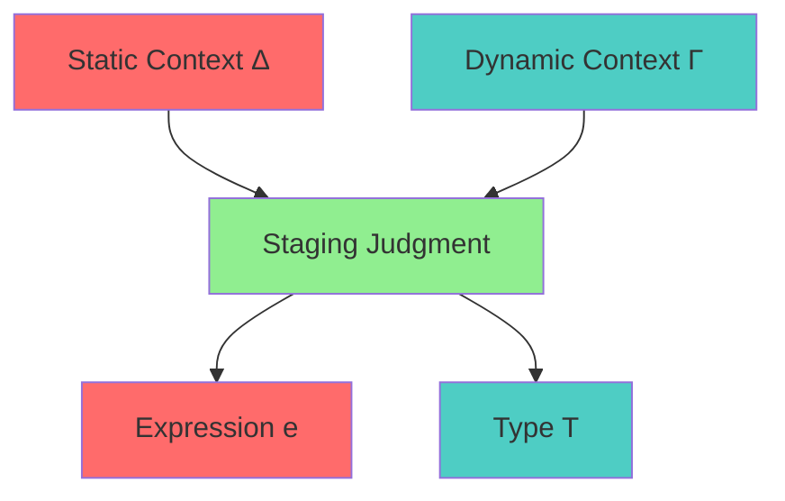
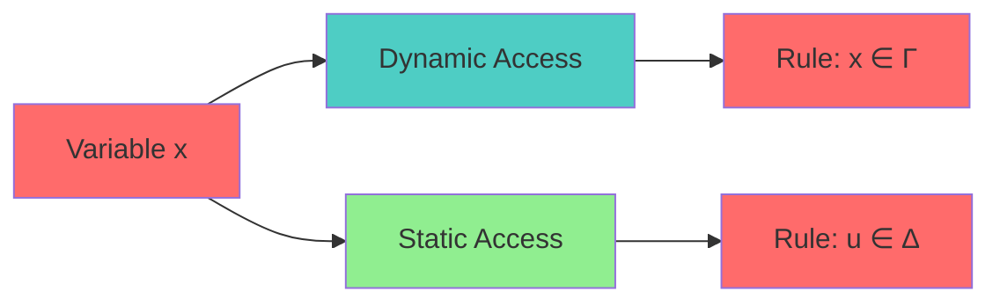

# Contextual Modal Type Theory Specification (Staging)

* File:* `tooling\meta_modal_logic_spec.md`
* Version:* 1.0.0
* Context:* Layer 2 (Compiler) - `comptime`
* Formalism:* Contextual Modal Type Theory (Nanevski et al.)
* Status:* Active
* Last Modified:* 2026-01-01
* Author:* Kilo Code
* Reviewers:* Pending

- -

## 1. Introduction

### 1.1 Purpose

This specification formalizes the **Metaprogramming Staging** system using **Contextual Modal Type Theory**, providing mathematical foundation for compile-time code execution. This formalization enables the Morph compiler to prove that `comptime` code cannot accidentally access runtime variables, ensuring Stage Separation.

### 1.2 Scope

This specification covers:
- The Box Modality ($\Box$) for distinguishing runtime and comptime types
- Staging judgments with dual contexts
- The Prevention Rule for stage separation
- Stage leak prevention

This specification does not cover:
- Concrete implementation of comptime evaluation
- Performance optimization details
- Integration with other compiler phases

### 1.3 Definitions, Acronyms, and Abbreviations

| Term | Definition |
|-------|------------|
| **Box Modality ($\Box$)** | Modal operator for comptime types |
| **Staging Judgment** | Typing judgment with dual contexts |
| **Static Context ($\Delta$)** | Context of static variables (available in comptime) |
| **Dynamic Context ($\Gamma$)** | Context of dynamic variables (available at runtime) |
| **Stage Separation** | Property that comptime code cannot access runtime variables |
| **Stage Leak** | Bug where comptime code accesses runtime variable |

### 1.4 References

- Nanevski, A., et al. (2008). "Contextual Modal Type Theory"
- IEEE 1016: Recommended Practice for Software Design Descriptions
- ISO/IEC 29148: Systems and software engineering — Requirements engineering

- -

## 2. Formal Definitions

### 2.1 The Box Modality ($\Box$)

We distinguish between types at *Runtime* ($T$) and types at *Comptime* ($\Box T$).

* META-INV-001:* THE system SHALL define box modality for type distinction.

* META-REQ-001:* THE system SHALL distinguish runtime types from comptime types.

* Priority:* Critical
* Verification Method:* Test
* Rationale:* Enables stage separation
* Dependencies:* META-INV-001
* Traceability:* Section 2.1 (The Box Modality)

#### 2.1.1 Typing Judgments

- $\Gamma \vdash e : T$ means $e$ is available now (runtime).
- $\Gamma \vdash e : \Box T$ means $e$ is code that yields $T$ in future stage (comptime).

* META-INV-002:* THE system SHALL define typing judgments for runtime and comptime.

* META-REQ-002:* THE system SHALL support typing judgments for both runtime and comptime.

* Priority:* Critical
* Verification Method:* Test
* Rationale:* Enables type checking
* Dependencies:* META-INV-002
* Traceability:* Section 2.1.1 (Typing Judgments)

### 2.2 Staging Judgments

The typing judgment is extended to dual contexts $\Delta ; \Gamma \vdash e : T$.

* META-INV-003:* THE system SHALL define dual contexts for staging.

* META-REQ-003:* THE system SHALL use dual contexts for typing.

* Priority:* Critical
* Verification Method:* Test
* Rationale:* Enables stage separation
* Dependencies:* META-INV-003
* Traceability:* Section 2.2 (Staging Judgments)

#### 2.2.1 Context Definitions

- $\Delta$: Context of **Static variables** (available in `comptime`).
- $\Gamma$: Context of **Dynamic variables** (available at runtime).

* META-INV-004:* THE system SHALL define static and dynamic contexts.

* META-REQ-004:* THE system SHALL maintain separate static and dynamic contexts.

* Priority:* Critical
* Verification Method:* Test
* Rationale:* Enables stage separation
* Dependencies:* META-INV-004
* Traceability:* Section 2.2.1 (Context Definitions)

### 2.3 The Prevention Rule

The rule for accessing a variable $x$:

$$ \frac{x : T \in \Gamma}{\Delta ; \Gamma \vdash x : T} \quad \text{(Dynamic Access)} $$

$$ \frac{u : T \in \Delta}{\Delta ; \Gamma \vdash u : T} \quad \text{(Static Access)} $$

* META-INV-005:* THE system SHALL define prevention rule for variable access.

* META-REQ-005:* THE system SHALL enforce variable access rules.

* Priority:* Critical
* Verification Method:* Test
* Rationale:* Prevents stage leaks
* Dependencies:* META-INV-005
* Traceability:* Section 2.3 (The Prevention Rule)

#### 2.3.1 Constraint: Comptime Block Empties $\Gamma$

$$ \frac{\Delta ; \emptyset \vdash e : T}{\Delta ; \Gamma \vdash \text{comptime } \{ e \} : T} $$

* META-THM-001:* THE system SHALL guarantee that comptime blocks empty dynamic context.

* Priority:* Critical
* Verification Method:* Analysis
* Rationale:* Prevents stage leaks
* Dependencies:* META-INV-005
* Traceability:* Section 2.3.1 (Constraint: Comptime Block Empties $\Gamma$)

* Morph Meaning:* Inside `comptime`, $\Gamma$ is empty. You cannot access runtime variables. This mathematically prevents "Stage Leaks" (accessing a runtime value during compilation).

- -

## 3. Requirements

### 3.1 Functional Requirements

* META-REQ-006:* THE system SHALL support box modality for type distinction.

* Priority:* Critical
* Verification Method:* Test
* Rationale:* Enables stage separation
* Dependencies:* META-INV-001
* Traceability:* Section 2.1 (The Box Modality)

* META-REQ-007:* THE system SHALL support dual contexts for staging.

* Priority:* Critical
* Verification Method:* Test
* Rationale:* Enables stage separation
* Dependencies:* META-INV-003
* Traceability:* Section 2.2 (Staging Judgments)

* META-REQ-008:* THE system SHALL enforce prevention rule for variable access.

* Priority:* Critical
* Verification Method:* Test
* Rationale:* Prevents stage leaks
* Dependencies:* META-INV-005
* Traceability:* Section 2.3 (The Prevention Rule)

* META-REQ-009:* THE system SHALL prevent comptime blocks from accessing runtime variables.

* Priority:* Critical
* Verification Method:* Test
* Rationale:* Ensures stage separation
* Dependencies:* META-THM-001
* Traceability:* Section 2.3.1 (Constraint: Comptime Block Empties $\Gamma$)

### 3.2 Non-Functional Requirements

* META-NFR-001:* THE system SHALL perform type checking in O(n) time for n variables.

* Priority:* High
* Verification Method:* Performance test
* Metric:* Type check < 10ms for 1000 variables
* Rationale:* Ensures fast compilation
* Dependencies:* None
* Traceability:* Section 2.2 (Staging Judgments)

- -

## 4. Design

### 4.1 Architecture Overview

The Staging Engine is implemented as a compiler component that:
1. Distinguishes runtime types from comptime types using box modality
2. Maintains dual contexts for static and dynamic variables
3. Enforces prevention rule for variable access
4. Prevents stage leaks by emptying dynamic context in comptime blocks

### 4.2 Data Structures

#### 4.2.1 Context

* Context:* $C = (\Delta, \Gamma)$

* Components:*
- Static context: $\Delta$
- Dynamic context: $\Gamma$

* Invariants:*
1. Static context contains comptime variables
2. Dynamic context contains runtime variables
3. Contexts are disjoint

#### 4.2.2 Typing Judgment

* Typing Judgment:* $J = (\Delta, \Gamma, e, T)$

* Components:*
- Static context: $\Delta$
- Dynamic context: $\Gamma$
- Expression: $e$
- Type: $T$

* Invariants:*
1. Expression is well-typed
2. Type is consistent with contexts

### 4.3 Algorithms

#### 4.3.1 Type Checking Algorithm

* Algorithm Name:* Check Staging

* Input:* Expression $e$, Context $(\Delta, \Gamma)$

* Output:* Boolean indicating if expression is well-staged

* Mathematical Definition:*
$$
\text{WellStaged}(e, \Delta, \Gamma) \iff \Delta ; \Gamma \vdash e : T
$$

* Pseudocode:*
```
function check_staging(expr, static_ctx, dynamic_ctx):
    if is_comptime_block(expr):
        # Empty dynamic context
        return check_expression(expr.body, static_ctx, {})
    else:
        return check_expression(expr, static_ctx, dynamic_ctx)
```

* Complexity:*
- Time: $O(n)$ where $n$ is number of variables
- Space: $O(n)$ for contexts

* Correctness:*
- **Invariant:* Expression is well-staged
- **Termination:* Single pass through expression

#### 4.3.2 Variable Access Algorithm

* Algorithm Name:* Check Variable Access

* Input:* Variable $x$, Context $(\Delta, \Gamma)$

* Output:* Boolean indicating if access is valid

* Mathematical Definition:*
$$
\text{ValidAccess}(x, \Delta, \Gamma) \iff x \in \Delta \lor x \in \Gamma
$$

* Pseudocode:*
```
function check_variable_access(var, static_ctx, dynamic_ctx):
    if var in static_ctx:
        return True
    elif var in dynamic_ctx:
        return True
    else:
        return False
```

* Complexity:*
- Time: $O(1)$ for hash-based context
- Space: $O(1)$ for lookup

* Correctness:*
- **Invariant:* Variable access is valid
- **Termination:* Single lookup

### 4.4 Mermaid Diagrams

#### 4.4.1 Staging Judgment



#### 4.4.2 Prevention Rule



#### 4.4.3 Comptime Block

```mermaid
graph TD
    Block[comptime { e }] --> Empty[Empty Γ]
    Block --> Static[Static Δ]

    Empty --> Check[Check e with Δ; ∅]
    Static --> Check

    style Block fill:#FF6B6B
    style Empty fill:#4ECDC4
    style Static fill:#90EE90
    style Check fill:#FF6B6B
```

- -

## 5. Correctness Properties

### 5.1 Theorems

#### 5.1.1 Stage Separation Theorem

* Theorem:* Comptime blocks cannot access runtime variables.

* Proof Sketch:*
1. By definition of comptime block, dynamic context $\Gamma$ is empty
2. By definition of prevention rule, variable access requires variable in $\Gamma$ or $\Delta$
3. By definition of empty set, no variable is in $\Gamma$
4. Therefore, comptime blocks cannot access runtime variables

* META-THM-002:* THE system SHALL guarantee stage separation.

* Priority:* Critical
* Verification Method:* Analysis
* Rationale:* Prevents stage leaks
* Dependencies:* META-THM-001
* Traceability:* Section 5.1.1 (Stage Separation Theorem)

### 5.2 Invariants

#### 5.2.1 Context Invariants

- **META-INV-006:* THE system SHALL maintain that static and dynamic contexts are disjoint
- **META-INV-007:* THE system SHALL maintain that comptime blocks empty dynamic context

#### 5.2.2 Staging Invariants

- **META-INV-008:* THE system SHALL maintain that typing judgments are sound
- **META-INV-009:* THE system SHALL maintain that stage leaks are prevented

- -

## 6. Examples

### 6.1 Simple Comptime Block

```morph
// Simple comptime block: Compile-time computation
comptime {
    let x = 1 + 2;
    let y = x * 3;
}
// x and y are static variables (in Δ)
```

* Staging Judgment:*
- Static context: $\Delta = \{x: i32, y: i32\}$
- Dynamic context: $\Gamma = \emptyset$
- Expression: $\Delta ; \emptyset \vdash \text{comptime } \{ \dots \} : \text{void}$

### 6.2 Stage Leak Prevention

```morph
// Stage leak prevention: Cannot access runtime variable
let runtime_var = 42;

comptime {
    // Error: Cannot access runtime_var
    // let x = runtime_var + 1;
}
```

* Staging Judgment:*
- Static context: $\Delta = \emptyset$
- Dynamic context: $\Gamma = \{\text{runtime\_var}: i32\}$
- Expression: $\Delta ; \Gamma \vdash \text{comptime } \{ \dots \} : \text{void}$
- Error: $\text{runtime\_var} \notin \Delta$ and $\Gamma = \emptyset$ in comptime block

### 6.3 Valid Comptime Access

```morph
// Valid comptime access: Can access static variables
comptime {
    const STATIC_VALUE = 100;
}

fn main() {
    let x = STATIC_VALUE;  // Valid: STATIC_VALUE is in Δ
}
```

* Staging Judgment:*
- Static context: $\Delta = \{\text{STATIC\_VALUE}: i32\}$
- Dynamic context: $\Gamma = \emptyset$
- Expression: $\Delta ; \emptyset \vdash \text{comptime } \{ \dots \} : \text{void}$
- Valid: $\text{STATIC\_VALUE} \in \Delta$

### 6.4 Edge Cases

#### 6.4.1 Nested Comptime Blocks

```morph
// Edge case: Nested comptime blocks
comptime {
    let x = 1;
    comptime {
        let y = x + 2;  // Valid: x is in Δ
    }
}
```

* Staging Judgment:*
- Outer static context: $\Delta_1 = \{x: i32\}$
- Inner static context: $\Delta_2 = \{x: i32, y: i32\}$
- Dynamic context: $\Gamma = \emptyset$ (both levels)

#### 6.4.2 Empty Comptime Block

```morph
// Edge case: Empty comptime block
comptime {
    // No variables
}
```

* Staging Judgment:*
- Static context: $\Delta = \emptyset$
- Dynamic context: $\Gamma = \emptyset$
- Expression: $\emptyset ; \emptyset \vdash \text{comptime } \{ \} : \text{void}$

- -

## Change Log

| Version | Date       | Author      | Changes                                                                 |
|---------|------------|-------------|-------------------------------------------------------------------------|
| 1.0.0   | 2026-01-01 | Kilo Code    | Initial version                                                        |
