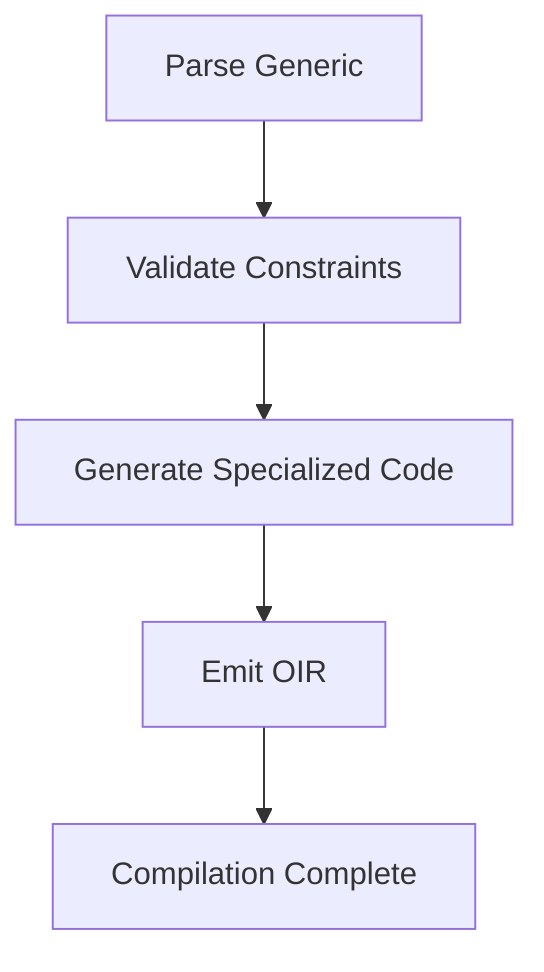
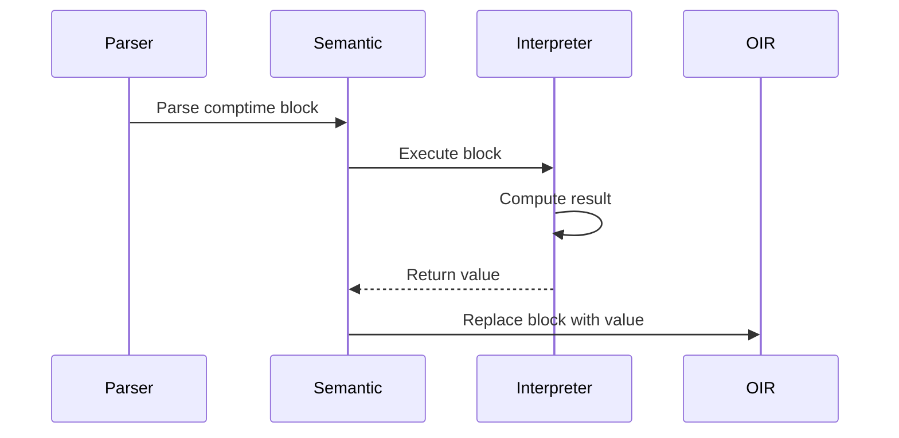
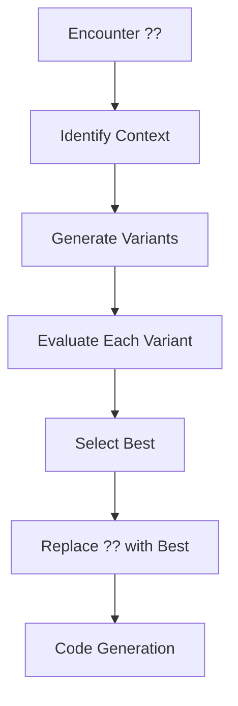
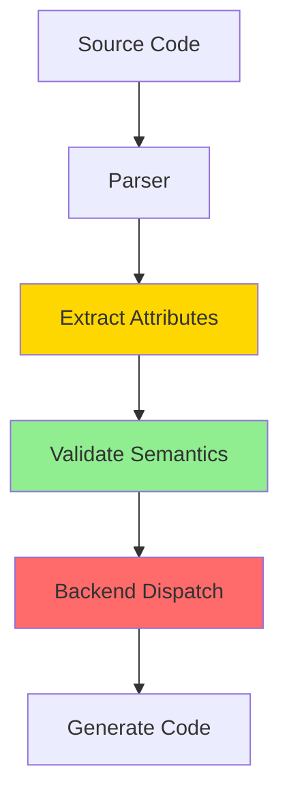

# Morph Metaprogramming & Generics Specification (MGS)

- `File:* `tooling\metaprogramming_spec.md`
- `Version:* 2.0.0
- `Context:* Layer 2 (Compilation Phase)
- `Formalism:* Monomorphization, Staged Compilation, Attribute-Driven
- `Status:* Active
- Last Modified:* 2026-01-01
- `Author:* Kilo Code
- `Reviewers:* Pending

- -

## 1. Introduction

### 1.1 Purpose

This specification defines the Metaprogramming and Generics system of Morph, providing formal foundation for compile-time code generation, type parameterization, and attribute-driven compilation. This formalization enables zero-cost abstractions and AI-compiler symbiosis.

### 1.2 Scope

This specification covers:
- Parametric Polymorphism (Generics) with monomorphization
- Compile-Time Execution (`comptime` blocks)
- The Optimization Hole (`??` operator)
- Compiler Directives (Attributes)
- Static Reflection (Introspection)
- AST-Based Macros

This specification does not cover:
- Concrete implementation of metaprogramming engine
- Runtime reflection mechanisms
- Dynamic code generation

### 1.3 Definitions, Acronyms, and Abbreviations

| Term | Definition |
|-------|------------|
| **Monomorphization** | Generating specialized code for each concrete type instead of using type erasure |
| **Generics** | Type parameterization allowing functions and data structures to work with multiple types |
| **Traits** | Semantic constraints on type parameters (Concepts) |
| **comptime** | Compile-time execution block that runs during semantic analysis |
| **Optimization Hole** | A placeholder (`??`) for compiler to search for optimal values |
| **Attributes** | Compiler directives prefixed with `@` to control code generation |
| **Introspection** | Compile-time inspection of type structure |
| **DSL** | Domain Specific Language built via metaprogramming |

### 1.4 References

- Pierce, B. C. (2002). "Types and Programming Languages"
- ISO/IEC 29148: Systems and software engineering — Requirements engineering
- IEEE 1016: Recommended Practice for Software Design Descriptions

- -

## 2. Formal Definitions

### 2.1 Parametric Polymorphism

#### 2.1.1 Generic Type Syntax

Morph uses **angle bracket syntax** for generic type parameters:

* Syntax Definition:*
```
GenericTypeName<T1, T2, ..., Tn>
```

where:
- `GenericTypeName`: Name of generic type or function
- `T1, T2, ..., Tn`: Type parameters (comma-separated, optional whitespace)

* Valid Generic Syntax:*
```morph
// Single type parameter
type List<T> = { head: T, tail: ^List<T>? };
type Option<T> = | Some { value: T } | None;
type Box<T> = { value: T };

// Multiple type parameters
type Map<K, V> = { keys: List<K>, values: List<V> };
type Result<T, E> = | Ok { value: T } | Err { error: E };
type Pair<A, B> = { first: A, second: B };

// Generic functions
fn identity<T>(x: T) -> T { ret x; }
fn map<T, U>(list: List<T>, f: fn(T)->U) -> List<U> { ... }
fn zip<A, B>(a: List<A>, b: List<B>) -> List<Pair<A, B>> { ... }

// Nested generics
type Matrix<T> = { data: List<List<T>> };
type Tree<T> = | Leaf | Node { value: T, left: ^Tree<T>, right: ^Tree<T> };
```

* Invalid Generic Syntax:*
```morph
// Missing angle brackets
type List T = { head: T, tail: ^List<T>? };  // ERROR: Missing <>

// Empty angle brackets
type List<> = { head: i32, tail: ^List<>? };  // ERROR: Empty type parameter list

// Missing comma separator
type Map<K V> = { keys: List<K>, values: List<V> };  // ERROR: Missing comma

// Trailing comma (not allowed)
type List<T,> = { head: T, tail: ^List<T>? };  // ERROR: Trailing comma

// Whitespace-only separator
type Map<K  V> = { keys: List<K>, values: List<V> };  // ERROR: Invalid separator
```

* Syntax Validation Rules:*
1. **Angle Bracket Requirement:* Generic type parameters must be enclosed in `<` and `>`
2. **Non-Empty List:* Type parameter list must contain at least one type parameter
3. **Comma Separation:* Multiple type parameters must be separated by commas
4. **No Trailing Comma:* Type parameter list must not end with a comma
5. **Whitespace Tolerance:* Optional whitespace is allowed around commas and angle brackets
6. **Type Parameter Validity:* Each type parameter must be a valid identifier

* META-INV-001:* THE system SHALL define generic functions with type parameters.

* META-INV-006:* THE system SHALL validate generic type syntax according to rules above.

#### 2.1.2 Generic Function Definition

Let a generic function be defined as:

$$ f: \forall T. \text{List}<T> \times (T \to \text{str}) \to \text{List}<\text{str}> $$

* META-INV-002:* THE system SHALL define generic functions with type parameters.

#### 2.1.2 Monomorphization

The compiler generates specialized code for each concrete type:

$$ \text{Specialize}(f, \text{int}) = f_{\text{int}}: \text{List}<\text{int}> \to \text{List}<\text{str}> $$

* META-INV-002:* THE system SHALL generate specialized code for each concrete type.

### 2.2 Compile-Time Execution

#### 2.2.1 comptime Block Semantics

Code within `comptime { ... }` is executed during semantic analysis:

$$ \text{Execute}(\text{comptime block}) = \text{Value} $$

* META-INV-003:* THE system SHALL execute comptime blocks during semantic analysis.

### 2.3 Optimization Hole

#### 2.3.1 Search Space Definition

The `??` operator represents a search space:

$$ \Theta = \{ \theta_1, \theta_2, \dots, \theta_n \} $$

* META-INV-004:* THE system SHALL define search space for optimization holes.

### 2.4 Compiler Directives

#### 2.4.1 Attribute Definition

Attributes are semantic annotations:

$$ \text{Attribute} = (\text{name}, \text{context}, \text{semantics}) $$

* META-INV-005:* THE system SHALL define attributes with semantic meaning.

- -

## 3. Requirements

### 3.1 Functional Requirements

- META-REQ-001:* THE system SHALL support parametric polymorphism with monomorphization.

- `Priority:* Critical
- Verification Method:* Test
- `Rationale:* Enables zero-cost abstractions
- `Dependencies:* META-INV-001, META-INV-002
- `Traceability:* Section 2.1 (Parametric Polymorphism)

- META-REQ-002:* THE system SHALL enforce trait constraints on generic parameters.

- `Priority:* Critical
- Verification Method:* Test
- `Rationale:* Prevents template metaprogramming errors
- `Dependencies:* META-INV-001
- `Traceability:* Section 2.1.1 (Generic Function Definition)

- META-REQ-003:* THE system SHALL support compile-time execution.

- `Priority:* Critical
- Verification Method:* Test
- `Rationale:* Enables static computation and code generation
- `Dependencies:* META-INV-003
- `Traceability:* Section 2.2 (Compile-Time Execution)

- META-REQ-004:* THE system SHALL support optimization holes.

- `Priority:* High
- Verification Method:* Test
- `Rationale:* Enables AI-compiler symbiosis
- `Dependencies:* META-INV-004
- `Traceability:* Section 2.3 (Optimization Hole)

- META-REQ-005:* THE system SHALL support compiler directives.

- `Priority:* High
- Verification Method:* Test
- `Rationale:* Enables performance engineering
- `Dependencies:* META-INV-005
- `Traceability:* Section 2.4 (Compiler Directives)

- META-REQ-006:* THE system SHALL support static reflection.

- `Priority:* High
- Verification Method:* Test
- `Rationale:* Enables compile-time introspection
- `Dependencies:* None
- `Traceability:* Section 5 (Static Reflection)

- META-REQ-007:* THE system SHALL support AST-based macros.

- `Priority:* Medium
- Verification Method:* Test
- `Rationale:* Enables DSL construction
- `Dependencies:* None
- `Traceability:* Section 6 (Macros)

### 3.2 Non-Functional Requirements

- META-NFR-001:* THE system SHALL complete monomorphization in O(n) time where n is AST size.

- `Priority:* High
- Verification Method:* Analysis
- `Metric:* Monomorphization < 100ms for 10K nodes
- `Rationale:* Ensures fast compilation

- META-NFR-002:* THE system SHALL enforce resource quotas for comptime execution.

- `Priority:* High
- Verification Method:* Test
- `Metric:* 500ms CPU time, 128MB RAM per comptime block
- `Rationale:* Prevents build hangs

- META-NFR-003:* THE system SHALL provide clear error messages for constraint violations.

- `Priority:* High
- Verification Method:* Demonstration
- `Metric:* Error message includes constraint and location
- `Rationale:* Improves developer experience

- -

## 4. Design

### 4.1 Architecture Overview

The Metaprogramming system is implemented as a multi-phase compiler component:

1. **Generic Parsing:* Parse generic function and type definitions
2. **Constraint Validation:* Verify trait constraints
3. **Monomorphization:* Generate specialized code for each concrete type
4. **comptime Execution:* Execute compile-time blocks
5. **Optimization Search:* Search for optimal values for `??` holes
6. **Attribute Processing:* Apply compiler directives
7. **Reflection:* Provide compile-time type inspection
8. **Macro Expansion:* Generate AST fragments

### 4.2 Data Structures

#### 4.2.1 Generic Function

- Generic Function:* $G = (\text{name}, \text{type\_params}, \text{body}, \text{constraints})$

- `Components:*
- $\text{name} \in \text{String}$: Function name
- $\text{type\_params} \in \text{TypeParam}^*$: Type parameters
- $\text{body} \in \text{AST}$: Function body
- $\text{constraints} \in \text{Trait}^*$: Trait constraints

- `Invariants:*
1. All type parameters are used in body or constraints
2. Constraints are satisfied before monomorphization

#### 4.2.2 Specialized Function

- Specialized Function:* $S = (\text{name}, \text{concrete\_types}, \text{body})$

- `Components:*
- $\text{name} \in \text{String}$: Function name
- $\text{concrete\_types} \in \text{Type}^*$: Concrete type substitutions
- $\text{body} \in \text{OIR}$: Generated OIR code

- `Invariants:*
1. All type parameters are substituted with concrete types
2. Generated code is type-safe

### 4.3 Algorithms

#### 4.3.1 Monomorphization Algorithm

- Algorithm Name:* Generate Specialized Code

- Input:* Generic function $G$, Concrete types $T_1, \dots, T_n$

- Output:* Specialized functions $S_1, \dots, S_n$

- Mathematical Definition:*
$$
\text{Monomorphize}(G, T_i) = \begin{cases}
\text{Substitute}(G.\text{body}, G.\text{type\_params}, T_i) \land \text{Validate}(G.\text{constraints}, T_i) \\
\text{GenerateOIR}(\text{result}) & \text{otherwise}
\end{cases}
$$

- Pseudocode:*
```
function monomorphize(generic_func, concrete_types):
    for type in concrete_types:
        substituted = substitute(generic_func.body, generic_func.type_params, type)
        if validate(substituted, generic_func.constraints, type):
            specialized = generate_oir(substituted)
            emit(specialized.name + "_" + type.name, specialized)
```

- Complexity:*
- Time: $O(n \cdot m)$ where $n$ is AST size, $m$ is number of types
- Space: $O(n)$

- Correctness:*
- **Invariant:* Generated code is type-safe
- **Termination:* Processes all concrete types

#### 4.3.2 Monomorphization Cost Analysis

* Cost Model:*

Monomorphization trades **code size** for **runtime performance**. The cost is determined by:

1. **Code Bloat:* Each monomorphized instance generates a complete copy of the generic function
2. **Compilation Time:* Each instance requires separate compilation and optimization passes
3. **Binary Size:* Monomorphization increases binary size linearly with number of concrete types

* Cost Function:*

$$ \text{Cost}(G, \{T_1, \dots, T_m\}) = \sum_{i=1}^{m} \text{Size}(G[T_i]) + \text{CompileTime}(G[T_i]) $$

where:
- $\text{Size}(G[T_i])$: Size of monomorphized code for type $T_i$
- $\text{CompileTime}(G[T_i])$: Time to compile monomorphized instance for type $T_i$

* Cost-Benefit Analysis:*

| Factor | Cost | Benefit | Trade-off |
|--------|-------|----------|-----------|
| **Code Size** | $O(m \cdot n)$ where $m$ is number of types, $n$ is function size | Eliminates vtable overhead, enables inlining | Binary size grows with type diversity |
| **Compilation Time** | $O(m \cdot n)$ | Each instance is optimized for its concrete type | Longer builds for polymorphic libraries |
| **Runtime Performance** | $O(1)$ per call (no vtable lookup) | Direct function calls, better inlining | Optimal for hot paths |
| **Cache Locality** | Improved (specialized code fits in cache) | Better instruction cache utilization | May increase instruction cache pressure |

* Mitigation Strategies:*

1. **Type Deduplication:* If multiple monomorphized instances are identical, deduplicate at link time
2. **Selective Monomorphization:* Only monomorphize hot paths, use dynamic dispatch for cold paths
3. **Code Sharing:* Extract common subexpressions into separate functions
4. **LTO (Link-Time Optimization):* Enable link-time optimization to eliminate duplicate code

* Cost Bounds:*

- **Worst Case:* Generic used with $N$ distinct types $\rightarrow$ $N$ copies of function
- **Best Case:* Generic used with 1 type $\rightarrow$ 1 copy (same as non-generic)
- **Typical Case:* Generic used with 3-5 types $\rightarrow$ 3-5 copies

* Example:*

```morph
// Generic function
fn identity<T>(x: T) -> T { ret x; }

// Monomorphized instances
identity_i32(x: i32) -> i32 { ret x; }  // 50 bytes
identity_str(x: str) -> str { ret x; }      // 50 bytes
identity_f64(x: f64) -> f64 { ret x; }      // 50 bytes

// Total: 150 bytes vs 50 bytes for generic with dynamic dispatch
```

* META-INV-013:* THE system SHALL analyze monomorphization cost-benefit trade-offs.

* META-REQ-008:* THE system SHALL provide monomorphization cost analysis for build optimization.

- `Priority:* High
- Verification Method:* Analysis
- Rationale:* Enables informed decisions about when to use generics
- `Dependencies:* META-INV-002
- `Traceability:* Section 4.3.1 (Monomorphization Algorithm)

#### 4.3.2 comptime Execution Algorithm

- Algorithm Name:* Execute Compile-Time Block

- Input:* comptime block $B$

- Output:* Value $V$

- Mathematical Definition:*
$$
\text{Execute}(B) = \text{Interpret}(B.\text{body}) \quad \text{if } \text{WithinQuota}(B)
$$

- Pseudocode:*
```
function execute_comptime(block):
    if not within_quota(block):
        return Error("Quota exceeded")
    result = interpret(block.body)
    return result
```

- Complexity:*
- Time: $O(n)$ where $n$ is block size
- Space: $O(n)$

- Correctness:*
- **Invariant:* Result is deterministic
- **Termination:* Block execution terminates

#### 4.3.3 Optimization Search Algorithm

- Algorithm Name:* Search Optimal Configuration

- Input:* Optimization hole $H$, Search space $\Theta$

- Output:* Optimal value $\theta^*$

- Mathematical Definition:*
$$
\theta^* = \arg\min_{\theta \in \Theta} \mathcal{L}(\theta)
$$

where $\mathcal{L}$ is objective function.

- Pseudocode:*
```
function search_optimal(hole, search_space):
    best_theta = None
    best_cost = Infinity
    for theta in search_space:
        cost = evaluate(theta)
        if cost < best_cost:
            best_theta = theta
            best_cost = cost
    return best_theta
```

- Complexity:*
- Time: $O(|\Theta| \cdot n)$ where $n$ is evaluation cost
- Space: $O(1)$

- Correctness:*
- **Invariant:* Returns optimal configuration
- **Termination:* Searches entire space

### 4.4 Mermaid Diagrams

#### 4.4.1 Monomorphization Flow



#### 4.4.2 comptime Execution Flow



#### 4.4.3 Optimization Search Flow



#### 4.4.4 Attribute Processing Flow



- -

## 5. Correctness Properties

### 5.1 Theorems

#### 5.1.1 Type Safety Theorem

- Theorem:* If a generic function is monomorphized with valid type substitutions, then the generated code is type-safe.

- Proof Sketch:*
1. By definition of monomorphization, all type parameters are substituted
2. By definition of constraint validation, all trait constraints are satisfied
3. Therefore, generated code respects type system
4. Therefore, generated code is type-safe

- META-THM-001:* THE system SHALL guarantee type safety for monomorphized code.

- `Priority:* Critical
- Verification Method:* Analysis
- Rationale:* Ensures zero-cost abstractions are safe
- Dependencies:* META-REQ-001, META-REQ-002
- Traceability:* Section 4.3.1 (Monomorphization Algorithm)

#### 5.1.2 Determinism Theorem

- Theorem:* comptime execution is deterministic.

- Proof Sketch:*
1. By definition of comptime, execution occurs during semantic analysis
2. Semantic analysis is deterministic
3. Therefore, comptime execution is deterministic

- META-THM-002:* THE system SHALL guarantee deterministic comptime execution.

- `Priority:* High
- Verification Method:* Analysis
- Rationale:* Ensures reproducible builds
- Dependencies:* META-REQ-003
- Traceability:* Section 4.3.2 (comptime Execution Algorithm)

### 5.2 Invariants

#### 5.2.1 Monomorphization Invariants

- **META-INV-006:* THE system SHALL maintain that all type parameters are substituted
- **META-INV-007:* THE system SHALL maintain that all constraints are validated
- **META-INV-008:* THE system SHALL maintain that generated code is type-safe

#### 5.2.2 comptime Invariants

- **META-INV-009:* THE system SHALL maintain that comptime execution is deterministic
- **META-INV-010:* THE system SHALL maintain that comptime execution respects quotas

#### 5.2.3 Optimization Invariants

- **META-INV-011:* THE system SHALL maintain that search space is complete
- **META-INV-012:* THE system SHALL maintain that optimal configuration is selected

- -

## 6. Examples

### 6.1 Generic Function Example

```morph
fn map<T, U>(list: List<T>, op: fn(T)->U) -> List<U> {
    let mut result: List<U> = [];
    for item in list {
        result.append(op(item));
    }
    ret result;
}

// Usage:
let int_list: List<i32> = [1, 2, 3];
let str_list: List<str> = map(int_list, |x| x.to_str());
```

- Monomorphization:*
1. Compiler generates `map_i32_str` specialized function
2. No runtime type erasure or boxing

### 6.2 Trait Constraint Example

```morph
trait Serializable {
    fn to_json(&self) -> str;
}

fn serialize<T: Serializable>(data: T) -> str {
    ret data.to_json();
}

// Error: Type doesn't implement trait
let user: User = User { name: "Alice" };
serialize(user);  // Compile error: User doesn't implement Serializable
```

- Constraint Enforcement:*
1. Compiler validates that `User` implements `Serializable`
2. Error occurs at call site, not deep in library

### 6.3 comptime Example

```morph
const SIN_TABLE = comptime {
    mut t = [0.0; 360.0];
    loop i in 0..360 {
        t[i] = sin(degrees(i));
    }
    ret t;
};

// Usage:
fn get_sin(degrees: f64) -> f64 {
    ret SIN_TABLE[degrees];  // No runtime calculation
}
```

- Compile-Time Execution:*
1. `SIN_TABLE` is computed during semantic analysis
2. Embedded as static array in binary
3. No runtime overhead

### 6.4 Optimization Hole Example

```morph
fn copy_memory(src: &u8, dst: &u8, len: usize) {
    // Agent doesn't know optimal chunk size
    const CHUNK = ??;  // Optimization hole

    loop i in 0..len step CHUNK {
        // ... SIMD copy logic ...
    }
}
```

- Optimization Search:*
1. Compiler identifies `CHUNK` as loop unroll factor
2. Generates variants: `unroll=4`, `unroll=8`, `unroll=16`
3. Evaluates each variant and selects best
4. Replaces `??` with optimal constant

### 6.5 Attribute Example

```morph
@gpu
fn render_shader(data: &VertexData) -> ColorBuffer {
    // Compiled to SPIR-V/PTX
    // Forbidden from using System I/O, Heap Allocation, or ref globals
    // ... shader logic ...
}

@simd
fn process_array(data: &[f64]) -> f64 {
    // Asserts that iterations are independent
    // Enables vectorization
    loop i in 0..data.len() {
        result += data[i];
    }
}
```

- Attribute Enforcement:*
1. `@gpu` function cannot use `print()` or allocate heap
2. `@simd` loop enables vectorization
3. Compiler validates attribute semantics

### 6.6 Edge Cases

#### 6.6.1 Recursive Generic

```morph
fn recursive<T>(list: List<T>) -> List<T> {
    if list.is_empty() {
        ret list;
    }
    ret recursive(list.tail());
}
```

- Monomorphization:*
1. Compiler generates specialized code for each concrete type
2. No runtime type erasure overhead

#### 6.6.2 comptime Quota Exceeded

```morph
const LARGE_TABLE = comptime {
    // This would exceed 500ms quota
    mut t = [0.0; 10000.0];
    loop i in 0..10000 {
        t[i] = complex_calculation(i);
    }
    ret t;
};
```

- Error:* "comptime quota exceeded: 500ms CPU time limit"

#### 6.6.3 Invalid Attribute Usage

```morph
@gpu
fn render_shader(data: &VertexData) -> ColorBuffer {
    print("Debug info");  // ERROR: @gpu forbids System I/O
    // ... shader logic ...
}
```

- Error:* "Attribute violation: @gpu function cannot use print()"

- -

## Change Log

| Version | Date       | Author      | Changes                                                                 |
|---------|------------|-------------|-------------------------------------------------------------------------|
| 2.0.0   | 2026-01-01 | Kilo Code    | Refactored to match specification convention v2.0.0, added EARS requirements, Mermaid diagrams, and examples |
| 1.0.0   | 2025-12-01 | Kilo Code    | Initial version                                                        |
