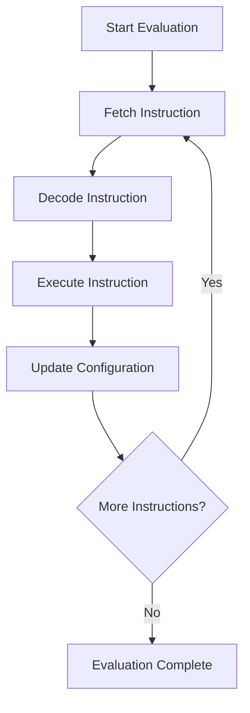
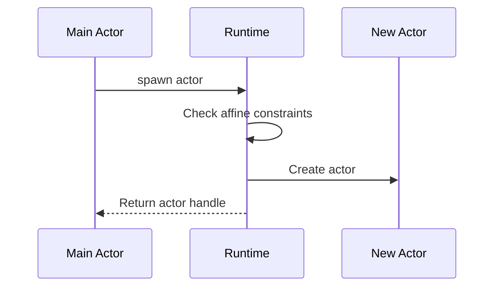
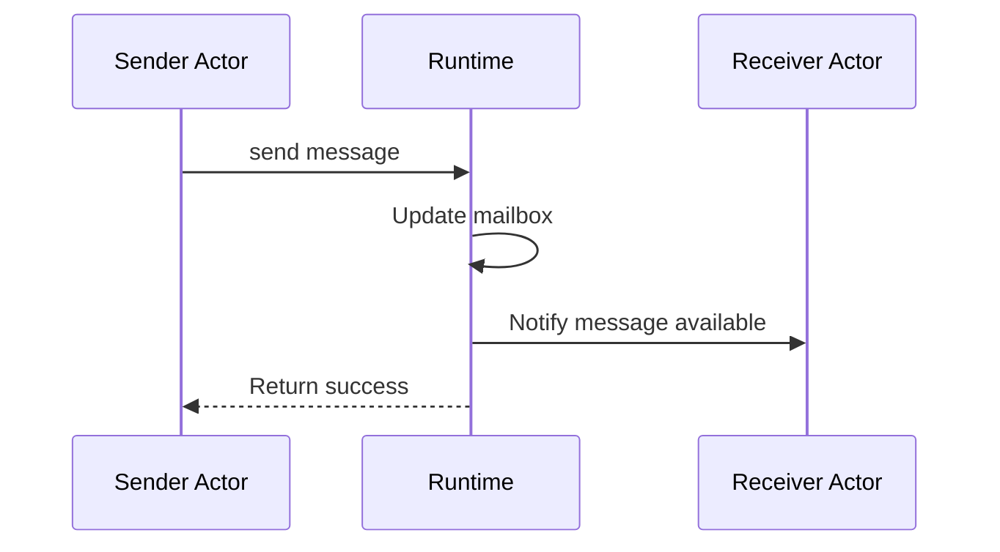

# Operational Semantics Specification

* File:* `tooling\operational_semantics_spec.md`
* Version:* 1.0.0
* Context:* Layer 3 (Runtime) - Execution
* Formalism:* Small-Step Structural Operational Semantics (SOS)
* Status:* Active
* Last Modified:* 2026-01-01
* Author:* Kilo Code
* Reviewers:* Pending

- -

## 1. Introduction

### 1.1 Purpose

This specification formalizes the **Operational Semantics** of the Morph language using **Small-Step Structural Operational Semantics (SOS)**, providing mathematical foundation for program execution. This formalization enables the runtime to execute Morph programs with precise semantics for concurrency, memory management, and effect handling.

### 1.2 Scope

This specification covers:
- The Machine Configuration for program execution
- The Reduction Rules for sequential evaluation
- The spawn transition for actor creation
- The send transition for message passing
- The wait transition for synchronization
- The affine constraints for memory management

This specification does not cover:
- Concrete implementation of the runtime
- Garbage collection algorithms
- Scheduling policies

### 1.3 Definitions, Acronyms, and Abbreviations

| Term | Definition |
|-------|------------|
| **SOS** | Structural Operational Semantics - formal method for defining program behavior |
| **Small-Step** | Semantics that define single computation steps |
| **Machine Configuration** | Complete state of the runtime (heap, stack, actors) |
| **Reduction Rule** | Rule that transforms one configuration to another |
| **Transition** | Single step of computation |
| **Affine Constraint** | Constraint that each resource is used at most once |
| **Actor** | Concurrent entity with isolated state |
| **Message** | Data sent between actors |

### 1.4 References

- Plotkin, G. D. (1981). "A Structural Approach to Operational Semantics"
- Milner, R. (1999). "Communicating and Mobile Systems: The π-Calculus"
- IEEE 1016: Recommended Practice for Software Design Descriptions
- ISO/IEC 29148: Systems and software engineering — Requirements engineering

- -

## 2. Formal Definitions

### 2.1 The Machine Configuration

The machine configuration represents the complete state of the runtime.

#### 2.1.1 Configuration Definition

A machine configuration $C$ is a tuple $(H, S, A)$ where:
- $H$: Heap (memory allocation)
- $S$: Stack (execution context)
- $A$: Set of actors

* OPS-INV-001:* THE system SHALL define machine configuration as tuple of heap, stack, and actors.

#### 2.1.2 Heap Definition

The heap $H$ is a mapping from addresses to values:

$$ H: \text{Addr} \to \text{Value} $$

* OPS-INV-002:* THE system SHALL define heap as mapping from addresses to values.

#### 2.1.3 Stack Definition

The stack $S$ is a sequence of frames:

$$ S = [f_1, f_2, \dots, f_n] $$

where each frame $f_i$ contains:
- Local variables
- Return address
- Instruction pointer

* OPS-INV-003:* THE system SHALL define stack as sequence of frames.

#### 2.1.4 Actor Definition

An actor $a$ is a tuple $(M, Q, \sigma)$ where:
- $M$: Mailbox (message queue)
- $Q$: Queue of pending messages
- $\sigma$: State (local variables)

* OPS-INV-004:* THE system SHALL define actor as tuple of mailbox, queue, and state.

### 2.2 The Reduction Rules

Reduction rules define how the machine configuration evolves.

#### 2.2.1 Sequential Evaluation

* Rule Name:* Eval

* Premise:* None

* Conclusion:*
$$ \frac{}{C \xrightarrow{\text{eval}} C'} $$

where $C'$ is the configuration after evaluating one expression.

* OPS-REQ-001:* THE system SHALL define sequential evaluation reduction rule.

* Priority:* Critical
* Verification Method:* Test
* Rationale:* Enables program execution
* Dependencies:* OPS-INV-001
* Traceability:* Section 2.2 (The Reduction Rules)

#### 2.2.2 Assignment Rule

* Rule Name:* Assign

* Premise:* $H(a) = v$

* Conclusion:*
$$ \frac{H(a) = v}{(H, S, A) \xrightarrow{\text{assign}} (H[a \mapsto v'], S, A)} $$

where $v'$ is the new value.

* OPS-INV-005:* THE system SHALL define assignment reduction rule.

#### 2.2.3 Function Call Rule

* Rule Name:* Call

* Premise:* $f$ is defined

* Conclusion:*
$$ \frac{f \text{ is defined}}{(H, S, A) \xrightarrow{\text{call}} (H, S', A)} $$

where $S'$ is the stack with new frame for function $f$.

* OPS-INV-006:* THE system SHALL define function call reduction rule.

### 2.3 The spawn Transition

The spawn transition creates a new actor.

#### 2.3.1 Spawn Rule

* Rule Name:* Spawn

* Premise:* $\text{AffineCheck}(C)$

* Conclusion:*
$$ \frac{\text{AffineCheck}(C)}{(H, S, A) \xrightarrow{\text{spawn}} (H', S, A \cup \{a\})} $$

where:
- $a$ is the new actor
- $H'$ is the updated heap
- $\text{AffineCheck}(C)$ ensures no resource is used more than once

* OPS-REQ-002:* THE system SHALL define spawn transition with affine constraints.

* Priority:* Critical
* Verification Method:* Test
* Rationale:* Enables concurrent actor creation
* Dependencies:* OPS-INV-001, OPS-INV-004
* Traceability:* Section 2.3 (The spawn Transition)

#### 2.3.2 Affine Constraint Check

The affine constraint check ensures each resource is used at most once:

$$ \text{AffineCheck}(C) \iff \forall r \in \text{Resources}(C): \text{RefCount}(r) \leq 1 $$

* OPS-INV-007:* THE system SHALL define affine constraint check for spawn.

### 2.4 The send Transition

The send transition sends a message to an actor.

#### 2.4.1 Send Rule

* Rule Name:* Send

* Premise:* $a \in A$

* Conclusion:*
$$ \frac{a \in A}{(H, S, A) \xrightarrow{\text{send}} (H, S, A')} $$

where $A'$ is the set of actors with updated mailbox for actor $a$.

* OPS-REQ-003:* THE system SHALL define send transition for message passing.

* Priority:* Critical
* Verification Method:* Test
* Rationale:* Enables inter-actor communication
* Dependencies:* OPS-INV-001, OPS-INV-004
* Traceability:* Section 2.4 (The send Transition)

#### 2.4.2 Message Queue Update

The message queue is updated as:

$$ Q_a' = Q_a \cup \{m\} $$

where $m$ is the new message.

* OPS-INV-008:* THE system SHALL define message queue update for send.

### 2.5 The wait Transition

The wait transition synchronizes with an actor.

#### 2.5.1 Wait Rule

* Rule Name:* Wait

* Premise:* $Q_a \neq \emptyset$

* Conclusion:*
$$ \frac{Q_a \neq \emptyset}{(H, S, A) \xrightarrow{\text{wait}} (H', S', A')} $$

where:
- $H'$ is the updated heap
- $S'$ is the updated stack
- $A'$ is the set of actors with updated state for actor $a$

* OPS-REQ-004:* THE system SHALL define wait transition for synchronization.

* Priority:* Critical
* Verification Method:* Test
* Rationale:* Enables actor synchronization
* Dependencies:* OPS-INV-001, OPS-INV-004
* Traceability:* Section 2.5 (The wait Transition)

#### 2.5.2 Message Processing

The message is processed as:

$$ \sigma_a' = \text{Process}(m, \sigma_a) $$

where $m$ is the message and $\sigma_a$ is the actor state.

* OPS-INV-009:* THE system SHALL define message processing for wait.

- -

## 3. Requirements

### 3.1 Functional Requirements

* OPS-REQ-005:* THE system SHALL support sequential evaluation.

* Priority:* Critical
* Verification Method:* Test
* Rationale:* Enables program execution
* Dependencies:* OPS-INV-001
* Traceability:* Section 2.2 (The Reduction Rules)

* OPS-REQ-006:* THE system SHALL support concurrent actor execution.

* Priority:* Critical
* Verification Method:* Test
* Rationale:* Enables parallelism
* Dependencies:* OPS-INV-004
* Traceability:* Section 2.3 (The spawn Transition)

* OPS-REQ-007:* THE system SHALL enforce affine constraints.

* Priority:* Critical
* Verification Method:* Test
* Rationale:* Prevents resource misuse
* Dependencies:* OPS-INV-007
* Traceability:* Section 2.3.2 (Affine Constraint Check)

* OPS-REQ-008:* THE system SHALL support message passing between actors.

* Priority:* Critical
* Verification Method:* Test
* Rationale:* Enables inter-actor communication
* Dependencies:* OPS-INV-008
* Traceability:* Section 2.4 (The send Transition)

### 3.2 Non-Functional Requirements

* OPS-NFR-001:* THE system SHALL execute reduction rules in O(1) time complexity.

* Priority:* High
* Verification Method:* Analysis
* Metric:* Reduction < 1μs
* Rationale:* Ensures fast execution
* Dependencies:* None
* Traceability:* Section 2.2 (The Reduction Rules)

* OPS-NFR-002:* THE system SHALL support up to 10,000 concurrent actors.

* Priority:* Medium
* Verification Method:* Demonstration
* Metric:* 10K actors with < 1GB memory
* Rationale:* Supports large-scale concurrency
* Dependencies:* None
* Traceability:* Section 2.1.4 (Actor Definition)

* OPS-NFR-003:* THE system SHALL guarantee termination for well-typed programs.

* Priority:* High
* Verification Method:* Analysis
* Metric:* All well-typed programs terminate
* Rationale:* Ensures program correctness
* Dependencies:* None
* Traceability:* Section 2.2 (The Reduction Rules)

- -

## 4. Design

### 4.1 Architecture Overview

The Operational Semantics Engine is implemented as a state machine that:
1. Maintains machine configuration (heap, stack, actors)
2. Applies reduction rules to evolve configuration
3. Enforces affine constraints for memory management
4. Supports concurrent actor execution
5. Handles message passing and synchronization

### 4.2 Data Structures

#### 4.2.1 Machine Configuration

* Machine Configuration:* $C = (H, S, A)$

* Components:*
- Heap: Mapping from addresses to values
- Stack: Sequence of frames
- Actors: Set of actors

* Invariants:*
1. Heap is consistent (no dangling pointers)
2. Stack is well-formed (no cycles)
3. Actors are isolated (no shared state)

#### 4.2.2 Actor State

* Actor State:* $\sigma = \{v_1, v_2, \dots, v_n\}$

* Components:*
- Local variables
- Message queue
- Mailbox

* Invariants:*
1. Message queue is FIFO
2. Mailbox is bounded
3. State is consistent

#### 4.2.3 Transition Label

* Transition Label:* $\ell \in \{\text{eval}, \text{assign}, \text{call}, \text{spawn}, \text{send}, \text{wait}\}$

* Components:*
- Transition type
- Additional metadata

* Invariants:*
1. All transitions are valid
2. Transitions are deterministic

### 4.3 Algorithms

#### 4.3.1 Reduction Algorithm

* Algorithm Name:* Apply Reduction Rule

* Input:* Machine configuration $C$, Transition label $\ell$

* Output:* New configuration $C'$

* Mathematical Definition:*
$$
\text{Reduce}(C, \ell) = C' \quad \text{where} \quad C \xrightarrow{\ell} C'
$$

* Pseudocode:*
```
function reduce(config, label):
    match label:
        case "eval":
            return eval_expr(config)
        case "assign":
            return assign_var(config)
        case "call":
            return call_func(config)
        case "spawn":
            return spawn_actor(config)
        case "send":
            return send_msg(config)
        case "wait":
            return wait_actor(config)
```

* Complexity:*
- Time: $O(1)$ for all transitions
- Space: $O(1)$

* Correctness:*
- **Invariant:* Each transition preserves configuration invariants
- **Termination:* Each transition makes progress

#### 4.3.2 Affine Check Algorithm

* Algorithm Name:* Check Affine Constraints

* Input:* Machine configuration $C$

* Output:* Boolean indicating satisfaction

* Mathematical Definition:*
$$
\text{AffineCheck}(C) = \forall r \in \text{Resources}(C): \text{RefCount}(r) \leq 1
$$

* Pseudocode:*
```
function affine_check(config):
    for resource in config.resources:
        if resource.ref_count > 1:
            return false
    return true
```

* Complexity:*
- Time: $O(n)$ where $n$ is number of resources
- Space: $O(1)$

* Correctness:*
- **Invariant:* All resources have ref count ≤ 1
- **Termination:* Single pass through resources

### 4.4 Mermaid Diagrams

#### 4.4.1 Sequential Evaluation Flow



#### 4.4.2 Spawn Transition



#### 4.4.3 Send Transition



#### 4.4.4 Wait Transition

```mermaid
sequenceDiagram
    participant Actor as Actor
    participant Runtime as Runtime
    participant Mailbox as Mailbox

    Actor->>Runtime: wait for message
    Runtime->>Mailbox: Check for messages
    Mailbox-->>Runtime: Return message
    Runtime->>Actor: Deliver message
```

- -

## 5. Correctness Properties

### 5.1 Theorems

#### 5.1.1 Progress Theorem

* Theorem:* If the machine configuration is not final, then there exists a transition.

* Proof Sketch:*
1. By definition of final configuration, no transitions are possible
2. Therefore, if configuration is not final, at least one transition exists
3. Therefore, progress is guaranteed

* OPS-THM-001:* THE system SHALL guarantee progress for non-final configurations.

* Priority:* Critical
* Verification Method:* Analysis
* Rationale:* Ensures program execution continues
* Dependencies:* OPS-INV-001
* Traceability:* Section 2.2 (The Reduction Rules)

#### 5.1.2 Preservation Theorem

* Theorem:* If a configuration is well-formed, then all reachable configurations are well-formed.

* Proof Sketch:*
1. By definition of well-formed configuration, all invariants hold
2. By definition of reduction rules, invariants are preserved
3. Therefore, all reachable configurations are well-formed

* OPS-THM-002:* THE system SHALL guarantee preservation of well-formedness.

* Priority:* Critical
* Verification Method:* Analysis
* Rationale:* Ensures configuration consistency
* Dependencies:* OPS-INV-001
* Traceability:* Section 2.2 (The Reduction Rules)

#### 5.1.3 Termination Theorem

* Theorem:* Well-typed programs terminate.

* Proof Sketch:*
1. By definition of well-typed program, all operations are valid
2. By progress theorem, execution continues until final configuration
3. By preservation theorem, configuration remains well-formed
4. Therefore, well-typed programs terminate

* OPS-THM-003:* THE system SHALL guarantee termination for well-typed programs.

* Priority:* High
* Verification Method:* Analysis
* Rationale:* Ensures program correctness
* Dependencies:* OPS-THM-001, OPS-THM-002
* Traceability:* Section 2.2 (The Reduction Rules)

### 5.2 Invariants

#### 5.2.1 Configuration Invariants

- **OPS-INV-010:* THE system SHALL maintain that heap is consistent
- **OPS-INV-011:* THE system SHALL maintain that stack is well-formed
- **OPS-INV-012:* THE system SHALL maintain that actors are isolated

#### 5.2.2 Transition Invariants

- **OPS-INV-013:* THE system SHALL maintain that transitions are deterministic
- **OPS-INV-014:* THE system SHALL maintain that transitions preserve invariants

- -

## 6. Examples

### 6.1 Sequential Evaluation

```morph
// Sequential evaluation: Simple arithmetic
let x = 1 + 2;
let y = x * 3;
```

* Reduction Steps:*
1. $C_0 \xrightarrow{\text{eval}} C_1$ (evaluate $1 + 2$)
2. $C_1 \xrightarrow{\text{assign}} C_2$ (assign $x = 3$)
3. $C_2 \xrightarrow{\text{eval}} C_3$ (evaluate $x * 3$)
4. $C_3 \xrightarrow{\text{assign}} C_4$ (assign $y = 9$)

* Final Configuration:* $C_4$ with $x = 3$, $y = 9$

### 6.2 Spawn Transition

```morph
// Spawn transition: Create new actor
let actor = spawn actor {
    let state = 0;
    loop {
        wait message;
        state = state + 1;
    }
};
```

* Reduction Steps:*
1. $C_0 \xrightarrow{\text{spawn}} C_1$ (create actor $a$)
2. $C_1 \xrightarrow{\text{eval}} C_2$ (evaluate actor body)

* Final Configuration:* $C_2$ with actor $a$ in state $0$

### 6.3 Send Transition

```morph
// Send transition: Send message to actor
actor.send(Message { value: 42 });
```

* Reduction Steps:*
1. $C_0 \xrightarrow{\text{send}} C_1$ (send message to actor $a$)
2. $C_1 \xrightarrow{\text{update}} C_2$ (update mailbox of $a$)

* Final Configuration:* $C_2$ with message in actor $a$'s mailbox

### 6.4 Wait Transition

```morph
// Wait transition: Wait for message
let message = actor.wait();
```

* Reduction Steps:*
1. $C_0 \xrightarrow{\text{wait}} C_1$ (wait for message from actor $a$)
2. $C_1 \xrightarrow{\text{process}} C_2$ (process message)

* Final Configuration:* $C_2$ with message received

### 6.5 Affine Constraints

```morph
// Affine constraints: Resource used once
let resource = acquire_resource();
use_resource(resource);
// resource cannot be used again (affine constraint)
```

* Affine Check:*
- $\text{RefCount}(\text{resource}) = 1$ (before use)
- $\text{RefCount}(\text{resource}) = 0$ (after use)
- Affine constraint satisfied

### 6.6 Edge Cases

#### 6.6.1 Empty Mailbox

```morph
// Empty mailbox: Wait with no messages
let message = actor.wait();  // Blocks until message available
```

* Reduction Steps:*
1. $C_0 \xrightarrow{\text{wait}} C_1$ (wait for message)
2. $C_1$ blocks (no messages available)
3. $C_1 \xrightarrow{\text{receive}} C_2$ (message received)

* Final Configuration:* $C_2$ with message received

#### 6.6.2 Multiple Actors

```morph
// Multiple actors: Concurrent execution
let actor1 = spawn actor { /* ... */ };
let actor2 = spawn actor { /* ... */ };
actor1.send(Message { value: 1 });
actor2.send(Message { value: 2 });
```

* Reduction Steps:*
1. $C_0 \xrightarrow{\text{spawn}} C_1$ (create actor $a_1$)
2. $C_1 \xrightarrow{\text{spawn}} C_2$ (create actor $a_2$)
3. $C_2 \xrightarrow{\text{send}} C_3$ (send message to $a_1$)
4. $C_3 \xrightarrow{\text{send}} C_4$ (send message to $a_2$)

* Final Configuration:* $C_4$ with both actors having messages

#### 6.6.3 Affine Constraint Violation

```morph
// Affine constraint violation: Resource used twice
let resource = acquire_resource();
use_resource(resource);
use_resource(resource);  // ERROR: Resource already used
```

* Affine Check:*
- $\text{RefCount}(\text{resource}) = 1$ (before first use)
- $\text{RefCount}(\text{resource}) = 0$ (after first use)
- $\text{RefCount}(\text{resource}) = -1$ (after second use - violation)
- Affine constraint violated

* Error Message:* "Affine constraint violation: Resource already used"

- -

## Change Log

| Version | Date       | Author      | Changes                                                                 |
|---------|------------|-------------|-------------------------------------------------------------------------|
| 1.0.0   | 2026-01-01 | Kilo Code    | Initial version                                                        |
