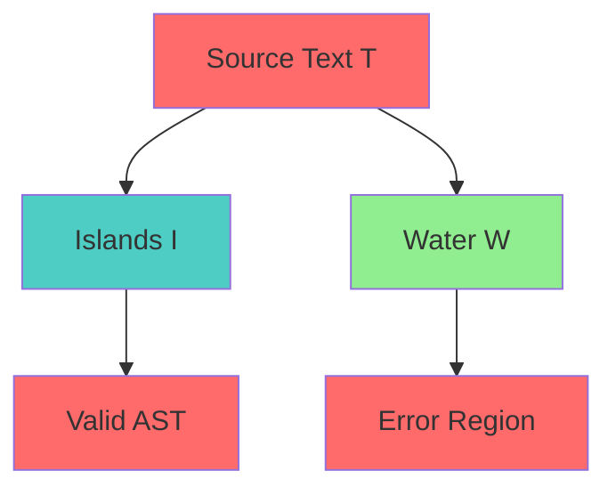
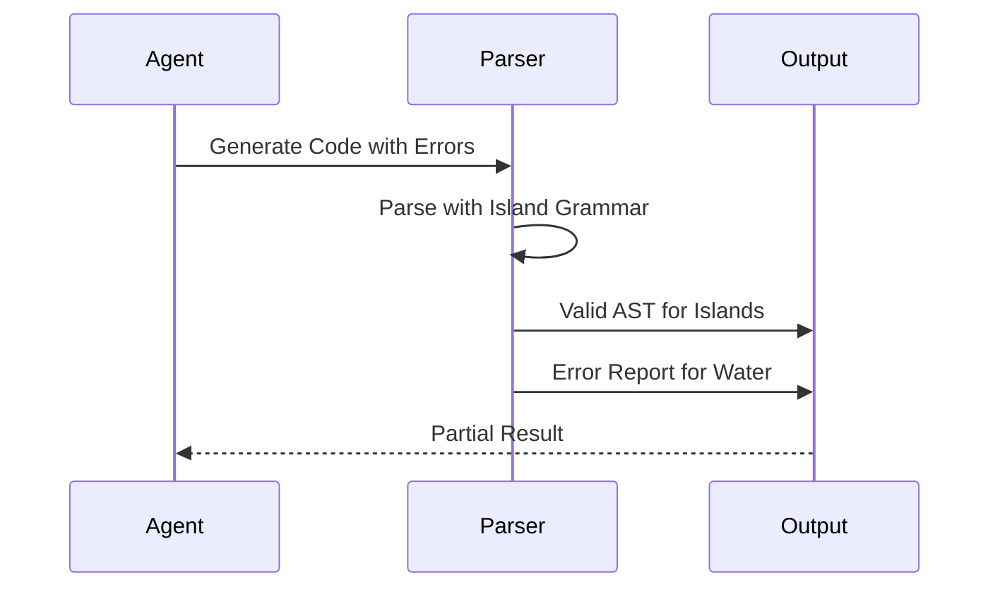

# Island Grammar Specification (Resilient Parsing)

* File:* `tooling\parsing_island_grammar_spec.md`
* Version:* 1.0.0
* Context:* Layer 2 (Compiler) - Parser
* Formalism:* Island Grammars (Moonen) & Robust Parsing
* Status:* Active
* Last Modified:* 2026-01-01
* Author:* Kilo Code
* Reviewers:* Pending

- -

## 1. Introduction

### 1.1 Purpose

This specification formalizes the **Resilient Parsing Strategy** system using **Island Grammars**, providing mathematical foundation for error recovery. This formalization enables the Morph compiler to extract valid AST nodes even from broken/incomplete Agent output.

### 1.2 Scope

This specification covers:
- The Ocean and Islands distinction
- The Parsing Strategy for maximizing coverage
- The Recovery Rule for error handling
- Agent Utility for partial parsing

This specification does not cover:
- Concrete implementation of parser
- Performance optimization details
- Integration with other compiler phases

### 1.3 Definitions, Acronyms, and Abbreviations

| Term | Definition |
|-------|------------|
| **Island Grammar** | Grammar with islands (constructs of interest) and water (errors) |
| **Islands ($I$)** | Constructs of interest (Functions, Structs) to parse strictly |
| **Water ($W$)** | Gap between islands (Comments, Whitespace, Syntax Errors) |
| **Synchronization Token** | Token that marks end of water region |
| **Resilient Parsing** | Ability to extract valid AST from broken input |
| **Coverage Maximization** | Strategy to maximize island coverage |

### 1.4 References

- Moonen, L. (1999). "Generating Robust Parsers for Island Grammars"
- IEEE 1016: Recommended Practice for Software Design Descriptions
- ISO/IEC 29148: Systems and software engineering — Requirements engineering

- -

## 2. Formal Definitions

### 2.1 The Ocean and Islands

Let the source text $T$ be a stream of tokens. We define a grammar $G$ not as a single hierarchy, but as two distinct sets of productions:

- **Islands ($I$):* Constructs of interest (Functions, Structs) that we want to parse strictly.
- **Water ($W$):* The gap between islands (Comments, Whitespace, Syntax Errors).

* PARS-INV-001:* THE system SHALL define ocean and islands distinction.

* PARS-REQ-001:* THE system SHALL represent grammar as islands and water.

* Priority:* Critical
* Verification Method:* Test
* Rationale:* Enables resilient parsing
* Dependencies:* PARS-INV-001
* Traceability:* Section 2.1 (The Ocean and Islands)

#### 2.1.1 Island Definition

* Islands ($I$):* Constructs of interest (Functions, Structs) that we want to parse strictly.

* PARS-INV-002:* THE system SHALL define islands for strict parsing.

* PARS-REQ-002:* THE system SHALL parse islands strictly.

* Priority:* Critical
* Verification Method:* Test
* Rationale:* Enables strict parsing
* Dependencies:* PARS-INV-002
* Traceability:* Section 2.1.1 (Island Definition)

#### 2.1.2 Water Definition

* Water ($W$):* The gap between islands (Comments, Whitespace, Syntax Errors).

* PARS-INV-003:* THE system SHALL define water for error regions.

* PARS-REQ-003:* THE system SHALL treat water as error regions.

* Priority:* Critical
* Verification Method:* Test
* Rationale:* Enables error recovery
* Dependencies:* PARS-INV-003
* Traceability:* Section 2.1.2 (Water Definition)

### 2.2 The Parsing Strategy

The parser maximizes the coverage of Islands against the background of Water.

* PARS-INV-004:* THE system SHALL define parsing strategy for coverage maximization.

* PARS-REQ-004:* THE system SHALL maximize island coverage.

* Priority:* Critical
* Verification Method:* Test
* Rationale:* Enables resilient parsing
* Dependencies:* PARS-INV-004
* Traceability:* Section 2.2 (The Parsing Strategy)

#### 2.2.1 Coverage Maximization

$$ P(T) = \max_{S \in \mathcal{P}(I^*)} |S| \quad \text{s.t.} \quad \text{Valid}(S) $$

* PARS-INV-005:* THE system SHALL define coverage maximization.

* PARS-REQ-005:* THE system SHALL find maximum coverage of islands.

* Priority:* Critical
* Verification Method:* Test
* Rationale:* Enables resilient parsing
* Dependencies:* PARS-INV-005
* Traceability:* Section 2.2.1 (Coverage Maximization)

### 2.3 The Recovery Rule

If a production $A \to \alpha$ fails at token $t_k$:

1. Demote the current region from $I$ to $W$.
2. Advance $k$ until a **Synchronization Token** (e.g., `}`, `;`, `fn`) is found.
3. Restart parsing $I$.

* PARS-INV-006:* THE system SHALL define recovery rule for error handling.

* PARS-REQ-006:* THE system SHALL implement recovery rule for failed productions.

* Priority:* Critical
* Verification Method:* Test
* Rationale:* Enables error recovery
* Dependencies:* PARS-INV-006
* Traceability:* Section 2.3 (The Recovery Rule)

#### 2.3.1 Synchronization Tokens

* Synchronization Tokens:* `}`, `;`, `fn`, `struct`, `enum`, `impl`, `trait`.

* PARS-INV-007:* THE system SHALL define synchronization tokens for recovery.

* PARS-REQ-007:* THE system SHALL recognize synchronization tokens.

* Priority:* Critical
* Verification Method:* Test
* Rationale:* Enables error recovery
* Dependencies:* PARS-INV-007
* Traceability:* Section 2.3.1 (Synchronization Tokens)

### 2.4 Agent Utility

If an Agent generates:

```rust
fn valid() { ... }
fn brokes_syntax( { ...
fn valid_again() { ... }
```

A standard LL(k) parser stops at line 2. The Morph Resilient Parser treats line 2 as "Water" and successfully parses `valid` and `valid_again`. The diagnostic system reports an error for Water region but returns a valid AST for the Islands.

* PARS-INV-008:* THE system SHALL define agent utility for partial parsing.

* PARS-REQ-008:* THE system SHALL support partial parsing for agent output.

* Priority:* Critical
* Verification Method:* Test
* Rationale:* Enables agent utility
* Dependencies:* PARS-INV-008
* Traceability:* Section 2.4 (Agent Utility)

* PARS-THM-001:* THE system SHALL guarantee that valid islands are extracted.

* Priority:* Critical
* Verification Method:* Analysis
* Rationale:* Ensures agent utility
* Dependencies:* PARS-INV-008
* Traceability:* Section 2.4 (Agent Utility)

- -

## 3. Requirements

### 3.1 Functional Requirements

* PARS-REQ-009:* THE system SHALL support ocean and islands distinction.

* Priority:* Critical
* Verification Method:* Test
* Rationale:* Enables resilient parsing
* Dependencies:* PARS-INV-001
* Traceability:* Section 2.1 (The Ocean and Islands)

* PARS-REQ-010:* THE system SHALL support parsing strategy for coverage maximization.

* Priority:* Critical
* Verification Method:* Test
* Rationale:* Enables resilient parsing
* Dependencies:* PARS-INV-004
* Traceability:* Section 2.2 (The Parsing Strategy)

* PARS-REQ-011:* THE system SHALL support recovery rule for error handling.

* Priority:* Critical
* Verification Method:* Test
* Rationale:* Enables error recovery
* Dependencies:* PARS-INV-006
* Traceability:* Section 2.3 (The Recovery Rule)

* PARS-REQ-012:* THE system SHALL support agent utility for partial parsing.

* Priority:* Critical
* Verification Method:* Test
* Rationale:* Enables agent utility
* Dependencies:* PARS-INV-008
* Traceability:* Section 2.4 (Agent Utility)

### 3.2 Non-Functional Requirements

* PARS-NFR-001:* THE system SHALL perform parsing in O(n) time for n tokens.

* Priority:* High
* Verification Method:* Performance test
* Metric:* Parsing < 100ms for 10000 tokens
* Rationale:* Ensures fast parsing
* Dependencies:* None
* Traceability:* Section 2.2 (The Parsing Strategy)

- -

## 4. Design

### 4.1 Architecture Overview

The Resilient Parser is implemented as a compiler component that:
1. Distinguishes islands from water
2. Maximizes coverage of islands
3. Implements recovery rule for error handling
4. Supports partial parsing for agent output

### 4.2 Data Structures

#### 4.2.1 Grammar

* Island Grammar:* $G = (I, W)$

* Components:*
- Islands: $I$
- Water: $W$

* Invariants:*
1. Islands are well-formed
2. Water is well-formed

#### 4.2.2 Parse State

* Parse State:* $S = (tokens, position, mode)$

* Components:*
- Tokens: $T$
- Position: $p$
- Mode: $m \in \{\text{Island}, \text{Water}\}$

* Invariants:*
1. Position is valid
2. Mode is consistent

### 4.3 Algorithms

#### 4.3.1 Coverage Maximization Algorithm

* Algorithm Name:* Maximize Island Coverage

* Input:* Tokens $T$, Grammar $G$

* Output:* Parse result $S$

* Mathematical Definition:*
$$
S = \arg\max_{S \in \mathcal{P}(I^*)} |S| \quad \text{s.t.} \quad \text{Valid}(S)
$$

* Pseudocode:*
```
function maximize_coverage(tokens, grammar):
    best_result = None
    best_coverage = 0

    for parse in all_parses(tokens, grammar):
        if is_valid(parse) and parse.coverage > best_coverage:
            best_result = parse
            best_coverage = parse.coverage

    return best_result
```

* Complexity:*
- Time: $O(n \cdot m)$ where $n$ is tokens, $m$ is parses
- Space: $O(n)$ for parse result

* Correctness:*
- **Invariant:* Result maximizes island coverage
- **Termination:* All parses are evaluated

#### 4.3.2 Recovery Algorithm

* Algorithm Name:* Recover from Error

* Input:* Tokens $T$, Position $p$, Failed Production $A \to \alpha$

* Output:* New Position $p'$

* Mathematical Definition:*
$$
p' = \text{FindSyncToken}(T, p)
$$

* Pseudocode:*
```
function recover_from_error(tokens, position, failed_production):
    # Demote to water
    set_mode(position, Water)

    # Find synchronization token
    sync_pos = find_sync_token(tokens, position)

    # Restart parsing
    return sync_pos
```

* Complexity:*
- Time: $O(n)$ where $n$ is tokens
- Space: $O(1)$ for new position

* Correctness:*
- **Invariant:* Recovery finds synchronization token
- **Termination:* Single scan through tokens

#### 4.3.3 Synchronization Token Detection Algorithm

* Algorithm Name:* Find Synchronization Token

* Input:* Tokens $T$, Position $p$

* Output:* Position of synchronization token

* Mathematical Definition:*
$$
\text{FindSyncToken}(T, p) = \min \{p' \mid p' > p \land T[p'] \in \text{SyncTokens}\}
$$

* Pseudocode:*
```
function find_sync_token(tokens, position):
    for i in range(position + 1, len(tokens)):
        if tokens[i] in SyncTokens:
            return i

    return len(tokens)
```

* Complexity:*
- Time: $O(n)$ where $n$ is tokens
- Space: $O(1)$ for position

* Correctness:*
- **Invariant:* Finds nearest synchronization token
- **Termination:* Single scan through tokens

### 4.4 Mermaid Diagrams

#### 4.4.1 Ocean and Islands



#### 4.4.2 Recovery Rule


#### 4.4.3 Agent Utility



- -

## 5. Correctness Properties

### 5.1 Theorems

#### 5.1.1 Coverage Maximization Theorem

* Theorem:* Parser maximizes island coverage.

* Proof Sketch:*
1. By definition of coverage maximization, parser evaluates all possible parses
2. By definition of maximum, result has highest coverage
3. By definition of validity, result is valid
4. Therefore, parser maximizes island coverage

* PARS-THM-002:* THE system SHALL guarantee that island coverage is maximized.

* Priority:* Critical
* Verification Method:* Analysis
* Rationale:* Ensures resilient parsing
* Dependencies:* PARS-THM-001
* Traceability:* Section 5.1.1 (Coverage Maximization Theorem)

### 5.2 Invariants

#### 5.2.1 Grammar Invariants

- **PARS-INV-009:* THE system SHALL maintain that islands are well-formed
- **PARS-INV-010:* THE system SHALL maintain that water is well-formed

#### 5.2.2 Parsing Invariants

- **PARS-INV-011:* THE system SHALL maintain that coverage is maximized
- **PARS-INV-012:* THE system SHALL maintain that recovery finds synchronization tokens

- -

## 6. Examples

### 6.1 Simple Island Parsing

```rust
// Simple island parsing: Valid functions
fn valid() {
    println("Valid");
}

fn broken_syntax( {
    println("Broken");
}

fn valid_again() {
    println("Valid Again");
}
```

* Parsing Result:*
- Islands: `valid()`, `valid_again()`
- Water: `broken_syntax(`
- Coverage: 2/3 islands

### 6.2 Agent Utility

```rust
// Agent utility: Partial parsing
fn valid() { ... }
fn brokes_syntax( { ...
fn valid_again() { ... }
```

* Parsing Result:*
- Islands: `valid()`, `valid_again()`
- Water: `broken_syntax(`
- Coverage: 2/3 islands
- Error: Reported for water region

### 6.3 Synchronization Tokens

```rust
// Synchronization tokens: Recovery points
fn main() {
    let x = 1;
    }  // Sync token
    let y = 2;
}
```

* Recovery:*
- Error at `}`: Recover at next statement
- Error at `;`: Recover at next statement

### 6.4 Edge Cases

#### 6.4.1 Empty Source

```rust
// Edge case: Empty source
// No tokens
```

* Parsing Result:*
- Islands: None
- Water: Entire source
- Coverage: 0/0 islands

#### 6.4.2 All Water

```rust
// Edge case: All water
// /* comment */
// another comment
```

* Parsing Result:*
- Islands: None
- Water: Entire source
- Coverage: 0/0 islands

- -

## Change Log

| Version | Date       | Author      | Changes                                                                 |
|---------|------------|-------------|-------------------------------------------------------------------------|
| 1.0.0   | 2026-01-01 | Kilo Code    | Initial version                                                        |
