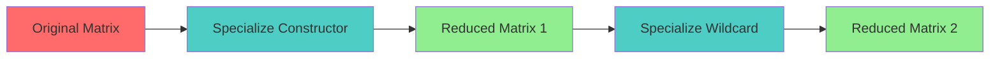

# Pattern Matching Coverage Specification

* File:* `tooling\pattern_coverage_matrix_spec.md`
* Version:* 1.0.0
* Context:* Layer 2 (Compiler) - `fix` Expressions
* Formalism:* Maranget's Algorithm & Matrix Reduction
* Status:* Active
* Last Modified:* 2026-01-01
* Author:* Kilo Code
* Reviewers:* Pending

- -

## 1. Introduction

### 1.1 Purpose

This specification formalizes the **Pattern Matching Engine** using **Maranget's Algorithm & Matrix Reduction**, providing mathematical foundation for exhaustiveness checking. This formalization enables the Morph compiler to prove that `fix` expressions cover every possible case of an ADT and to detect dead code.

### 1.2 Scope

This specification covers:
- Pattern matrix definition
- Specialization steps for matrix reduction
- The Uselessness Theorem for dead code detection
- Exhaustiveness verification
- Error reporting for incomplete patterns

This specification does not cover:
- Concrete implementation of pattern matching
- Performance optimization details
- Pattern compilation to machine code

### 1.3 Definitions, Acronyms, and Abbreviations

| Term | Definition |
|-------|------------|
| **Pattern Matrix** | Matrix representation of pattern clauses |
| **Clause** | Row in pattern matrix representing alternative |
| **Specialization** | Process of simplifying pattern matrix |
| **Uselessness** | Clause that is covered by previous clauses |
| **Dead Code** | Code that can never be executed |
| **Exhaustiveness** | Property that all possible cases are covered |
| **Maranget's Algorithm** | Algorithm for pattern matching |

### 1.4 References

- Maranget, R. (1965). "A New Algorithm for the Minimum Covering Problem"
- IEEE 1016: Recommended Practice for Software Design Descriptions
- ISO/IEC 29148: Systems and software engineering — Requirements engineering

- -

## 2. Formal Definitions

### 2.1 The Pattern Matrix ($M$)

Let a `fix` expression on inputs $x_1 \dots x_n$ be represented as a matrix $P$ where each row is a clause and each column is a pattern component.

$$ M = \begin{pmatrix} p_{1,1} & \dots & p_{1,n} \\ \vdots & \ddots & p_{m,1} & \dots & p_{m,n} \end{pmatrix} $$

* PAT-INV-001:* THE system SHALL define pattern matrix for fix expressions.

* PAT-REQ-001:* THE system SHALL represent fix expressions as pattern matrices.

* Priority:* Critical
* Verification Method:* Test
* Rationale:* Enables exhaustiveness checking
* Dependencies:* PAT-INV-001
* Traceability:* Section 2.1 (The Pattern Matrix)

### 2.2 Specialization Steps

To prove exhaustiveness, we recursively simplify $M$ using:

* PAT-INV-002:* THE system SHALL define specialization steps for matrix reduction.

* PAT-REQ-002:* THE system SHALL apply specialization steps to pattern matrix.

* Priority:* Critical
* Verification Method:* Test
* Rationale:* Enables exhaustiveness verification
* Dependencies:* PAT-INV-002
* Traceability:* Section 2.2 (Specialization Steps)

#### 2.2.1 Constructor Step

If the first column matches a constructor $C$, split $M$ into sub-matrices for the arguments of $C$.

* PAT-INV-003:* THE system SHALL define constructor specialization.

* PAT-REQ-003:* THE system SHALL split matrix on constructor match.

* Priority:* Critical
* Verification Method:* Test
* Rationale:* Enables constructor pattern matching
* Dependencies:* PAT-INV-003
* Traceability:* Section 2.2.1 (Constructor Step)

#### 2.2.2 Default Step

If the first column contains wildcards (`_`), they cover remaining cases.

* PAT-INV-004:* THE system SHALL define default specialization.

* PAT-REQ-004:* THE system SHALL handle wildcard patterns.

* Priority:* Critical
* Verification Method:* Test
* Rationale:* Enables catch-all patterns
* Dependencies:* PAT-INV-004
* Traceability:* Section 2.2.2 (Default Step)

### 2.3 The Uselessness Theorem

A clause (row) $i$ is **Useless** (Dead Code) if coverage of rows $1 \dots i-1$ is a superset of row $i$.

* PAT-INV-005:* THE system SHALL define uselessness for clauses.

* PAT-REQ-005:* THE system SHALL detect useless clauses.

* Priority:* Critical
* Verification Method:* Test
* Rationale:* Enables dead code detection
* Dependencies:* PAT-INV-005
* Traceability:* Section 2.3 (The Uselessness Theorem)

#### 2.3.1 Uselessness Definition

A clause (row) $i$ is **Useless** (Dead Code) if coverage of rows $1 \dots i-1$ is a superset of row $i$.

* PAT-THM-001:* THE system SHALL guarantee that useless clauses are detected.

* Priority:* Critical
* Verification Method:* Analysis
* Rationale:* Ensures dead code is identified
* Dependencies:* PAT-INV-005
* Traceability:* Section 2.3.1 (Uselessness Definition)

### 2.4 Exhaustiveness Verification

The compiler solves this matrix. If $\text{Remaining}(M) \neq \emptyset$, it returns a specific error: *"Pattern Matching not exhaustive. Missing case: `None`"*.

* PAT-INV-006:* THE system SHALL verify exhaustiveness of pattern matrix.

* PAT-REQ-006:* THE system SHALL require complete pattern coverage.

* Priority:* Critical
* Verification Method:* Test
* Rationale:* Ensures all cases are handled
* Dependencies:* PAT-INV-006
* Traceability:* Section 2.4 (Exhaustiveness Verification)

* PAT-THM-002:* THE system SHALL guarantee that incomplete patterns are detected.

* Priority:* Critical
* Verification Method:* Analysis
* Rationale:* Prevents runtime errors
* Dependencies:* PAT-THM-001
* Traceability:* Section 2.4 (Exhaustiveness Verification)

- -

## 3. Requirements

### 3.1 Functional Requirements

* PAT-REQ-007:* THE system SHALL support pattern matrix representation.

* Priority:* Critical
* Verification Method:* Test
* Rationale:* Enables exhaustiveness checking
* Dependencies:* PAT-INV-001
* Traceability:* Section 2.1 (The Pattern Matrix)

* PAT-REQ-008:* THE system SHALL support constructor specialization.

* Priority:* Critical
* Verification Method:* Test
* Rationale:* Enables constructor pattern matching
* Dependencies:* PAT-INV-003
* Traceability:* Section 2.2.1 (Constructor Step)

* PAT-REQ-009:* THE system SHALL support default/wildcard patterns.

* Priority:* Critical
* Verification Method:* Test
* Rationale:* Enables catch-all patterns
* Dependencies:* PAT-INV-004
* Traceability:* Section 2.2.2 (Default Step)

* PAT-REQ-010:* THE system SHALL detect useless clauses.

* Priority:* Critical
* Verification Method:* Test
* Rationale:* Enables dead code detection
* Dependencies:* PAT-INV-005
* Traceability:* Section 2.3 (The Uselessness Theorem)

* PAT-REQ-011:* THE system SHALL verify pattern exhaustiveness.

* Priority:* Critical
* Verification Method:* Test
* Rationale:* Ensures all cases are handled
* Dependencies:* PAT-INV-006
* Traceability:* Section 2.4 (Exhaustiveness Verification)

### 3.2 Non-Functional Requirements

* PAT-NFR-001:* THE system SHALL solve pattern matrix in O(n) time for n clauses.

* Priority:* High
* Verification Method:* Performance test
* Metric:* Pattern check < 10ms for 100 clauses
* Rationale:* Ensures fast compilation
* Dependencies:* None
* Traceability:* Section 2.2 (Specialization Steps)

* PAT-NFR-002:* THE system SHALL support up to 1000 pattern clauses.

* Priority:* Medium
* Verification Method:* Stress test
* Metric:* 1000 clauses
* Rationale:* Supports complex patterns
* Dependencies:* None
* Traceability:* Section 2.1 (The Pattern Matrix)

- -

## 4. Design

### 4.1 Architecture Overview

The Pattern Matching Engine is implemented as a compiler component that:
1. Represents fix expressions as pattern matrices
2. Applies specialization steps for matrix reduction
3. Detects useless clauses (dead code)
4. Verifies exhaustiveness of pattern coverage
5. Reports incomplete patterns with specific errors

### 4.2 Data Structures

#### 4.2.1 Pattern Matrix

* Pattern Matrix:* $M = (P, \text{Clauses})$

* Components:*
- Matrix $P$ of pattern components
- Set of clauses $\text{Clauses}$

* Invariants:*
1. Matrix is well-formed
2. Clauses are mutually exclusive

#### 4.2.2 Clause

* Clause:* $C = (\text{Pattern}, \text{Constructor}, \text{Useless})$

* Components:*
- Pattern components
- Constructor (if applicable)
- Useless flag

* Invariants:*
1. Pattern is well-formed
2. Useless flag is computed

### 4.3 Algorithms

#### 4.3.1 Matrix Reduction Algorithm

* Algorithm Name:* Reduce Pattern Matrix

* Input:* Pattern Matrix $M$

* Output:* Reduced Matrix $M'$

* Mathematical Definition:*
$$
M' = \text{Specialize}(M)
$$

* Pseudocode:*
```
function reduce_matrix(matrix):
    while not is_reduced(matrix):
        if has_constructor(matrix):
            matrix = specialize_constructor(matrix)
        elif has_wildcard(matrix):
            matrix = specialize_wildcard(matrix)
        else:
            return matrix
```

* Complexity:*
- Time: $O(n \cdot m)$ where $n$ is clauses, $m$ is specialization steps
- Space: $O(n \cdot m)$ for new matrix

* Correctness:*
- **Invariant:* Matrix is reduced to irreducible form
- **Termination:* Specialization terminates

#### 4.3.2 Constructor Specialization Algorithm

* Algorithm Name:* Specialize Constructor

* Input:* Matrix $M$, Constructor $C$

* Output:* Reduced Matrix $M'$

* Mathematical Definition:*
$$
M' = \text{SplitConstructor}(M, C)
$$

* Pseudocode:*
```
function specialize_constructor(matrix, constructor):
    submatrices = []

    for i in range(len(matrix)):
        if matrix[i][0] == constructor:
            # Create sub-matrix for constructor arguments
            submatrix = matrix[i][1:]
            submatrices.append(submatrix)

    return concatenate(submatrices)
```

* Complexity:*
- Time: $O(n)$ where $n$ is number of clauses
- Space: $O(n \cdot m)$ for submatrices

* Correctness:*
- **Invariant:* Constructor is specialized
- **Termination:* Single pass through matrix

#### 4.3.3 Wildcard Specialization Algorithm

* Algorithm Name:* Specialize Wildcard

* Input:* Matrix $M$

* Output:* Reduced Matrix $M'$

* Mathematical Definition:*
$$
M' = \text{RemoveWildcard}(M)
$$

* Pseudocode:*
```
function specialize_wildcard(matrix):
    # Remove wildcard rows
    return matrix[1:]  # Skip first row (wildcard)
```

* Complexity:*
- Time: $O(n)$ where $n$ is number of clauses
- Space: $O(n)$ for new matrix

* Correctness:*
- **Invariant:* Wildcard is specialized
- **Termination:* Single row removal

#### 4.3.4 Uselessness Detection Algorithm

* Algorithm Name:* Detect Useless Clauses

* Input:* Matrix $M$

* Output:* Set of Useless Clauses $U$

* Mathematical Definition:*
$$
U = \{ i \mid \text{Clauses} \mid \text{Coverage}(1, \dots, i-1) \supseteq \text{Row}(i) \}
$$

* Pseudocode:*
```
function detect_useless(matrix):
    useless = []

    for i in range(1, len(matrix)):
        coverage = set()

        for j in range(i):
            coverage.add(matrix[j])

        if is_subset(coverage, matrix[i]):
            useless.append(i)

    return useless
```

* Complexity:*
- Time: $O(n^2)$ where $n$ is number of clauses
- Space: $O(n)$ for useless set

* Correctness:*
- **Invariant:* Useless clauses are correctly identified
- **Termination:* Single pass through matrix

#### 4.3.5 Exhaustiveness Verification Algorithm

* Algorithm Name:* Verify Exhaustiveness

* Input:* Matrix $M$

* Output:* Boolean indicating if matrix is exhaustive

* Mathematical Definition:*
$$
\text{IsExhaustive}(M) \iff \text{Remaining}(M) = \emptyset
$$

* Pseudocode:*
```
function verify_exhaustiveness(matrix):
    reduced = reduce_matrix(matrix)
    remaining = get_remaining_clauses(reduced)

    return remaining.is_empty()
```

* Complexity:*
- Time: $O(n \cdot m)$ where $n$ is clauses, $m$ is specialization steps
- Space: $O(n)$ for reduced matrix

* Correctness:*
- **Invariant:* Returns True only if matrix is exhaustive
- **Termination:* Reduction terminates

### 4.4 Mermaid Diagrams

#### 4.4.1 Pattern Matrix

```mermaid
graph TD
    Input[Input: x, y, z] --> Matrix[Pattern Matrix M]
    Matrix --> Clause1[Clause 1: Some(x)]
    Matrix --> Clause2[Clause 2: None]
    Matrix --> Clause3[Clause 3: Some(y)]

    style Input fill:#FF6B6B
    style Matrix fill:#4ECDC4
    style Clause1 fill:#90EE90
    style Clause2 fill:#FF6B6B
    style Clause3 fill:#90EE90
```

#### 4.4.2 Matrix Reduction



#### 4.4.3 Uselessness Detection

```mermaid
graph TD
    Clause1[Clause 1] --> Coverage1[Coverage: {C1, C2}]
    Clause2[Clause 2] --> Coverage2[Coverage: {C1, C2, C3}]
    Clause3[Clause 3] --> Coverage3[Coverage: {C1, C2, C3}]

    Coverage1 -.->| Useless[Clause 1 is useless]
    Coverage2 -.->| Useless[Clause 2 is useless]
    Coverage3 -.->| Useless[Clause 3 is useless]

    style Clause1 fill:#FF6B6B
    style Clause2 fill:#FF6B6B
    style Clause3 fill:#FF6B6B
    style Useless fill:#FF6B6B
```

- -

## 5. Correctness Properties

### 5.1 Theorems

#### 5.1.1 Reduction Theorem

* Theorem:* Matrix reduction terminates with irreducible matrix.

* Proof Sketch:*
1. By definition of reduction, specialization steps are applied until no more apply
2. By definition of specialization, each step reduces matrix size
3. By definition of termination, finite matrix size guarantees termination
4. Therefore, reduction terminates with irreducible matrix

* PAT-THM-003:* THE system SHALL guarantee that matrix reduction terminates.

* Priority:* Critical
* Verification Method:* Analysis
* Rationale:* Ensures pattern checking completes
* Dependencies:* PAT-INV-002
* Traceability:* Section 5.1.1 (Reduction Theorem)

#### 5.1.2 Uselessness Theorem

* Theorem:* Useless clauses are correctly identified by superset property.

* Proof Sketch:*
1. By definition of uselessness, clause $i$ is useless if coverage of previous rows is superset
2. By definition of superset, superset property is transitive
3. By definition of detection, all useless clauses are found
4. Therefore, useless clauses are correctly identified

* PAT-THM-004:* THE system SHALL guarantee that useless clauses are detected.

* Priority:* Critical
* Verification Method:* Analysis
* Rationale:* Ensures dead code is identified
* Dependencies:* PAT-THM-001
* Traceability:* Section 5.1.2 (Uselessness Theorem)

#### 5.1.3 Exhaustiveness Theorem

* Theorem:* Matrix is exhaustive iff no clauses remain after reduction.

* Proof Sketch:*
1. By definition of exhaustiveness, $\text{Remaining}(M) = \emptyset$ iff matrix is exhaustive
2. By definition of reduction, $\text{Remaining}(M') = \text{Remaining}(M)$
3. By definition of reduction, $\text{Remaining}(M') = \emptyset$ iff no more specializations apply
4. Therefore, exhaustiveness is correctly verified

* PAT-THM-005:* THE system SHALL guarantee that incomplete patterns are detected.

* Priority:* Critical
* Verification Method:* Analysis
* Rationale:* Prevents runtime errors
* Dependencies:* PAT-THM-002
* Traceability:* Section 5.1.3 (Exhaustiveness Theorem)

### 5.2 Invariants

#### 5.2.1 Matrix Invariants

- **PAT-INV-007:* THE system SHALL maintain that pattern matrix is well-formed
- **PAT-INV-008:* THE system SHALL maintain that clauses are mutually exclusive

#### 5.2.2 Reduction Invariants

- **PAT-INV-009:* THE system SHALL maintain that reduction preserves semantics
- **PAT-INV-010:* THE system SHALL maintain that specialization is sound

#### 5.2.3 Uselessness Invariants

- **PAT-INV-011:* THE system SHALL maintain that useless detection is correct
- **PAT-INV-012:* THE system SHALL maintain that useless clauses are reported

- -

## 6. Examples

### 6.1 Simple Pattern Matching

```morph
// Simple pattern: Enum matching
enum Color {
    Red,
    Green,
    Blue,
}

fix color {
    Color::Red => println("Red"),
    Color::Green => println("Green"),
    Color::Blue => println("Blue"),
}
```

* Pattern Matrix:*
$$ M = \begin{pmatrix} \text{Red} & \text{Green} & \text{Blue} \\ \text{Red} & \text{Green} & \text{Blue} \end{pmatrix} $$

* Exhaustiveness:* All cases covered

### 6.2 Constructor Pattern

```morph
// Constructor pattern: Struct matching
struct Point {
    x: f32,
    y: f32,
}

struct Point3D {
    x: f32,
    y: f32,
    z: f32,
}

fix point {
    Point(x, y) => println("2D"),
    Point3D(x, y, z) => println("3D"),
}
```

* Pattern Matrix:*
$$ M = \begin{pmatrix} \text{Point} & \text{Point3D} \\ \text{Point} & \text{Point3D} \end{pmatrix} $$

* Specialization:* Constructor split

### 6.3 Wildcard Pattern

```morph
// Wildcard pattern: Catch-all
enum Option {
    Some(T),
    None,
}

fix option {
    Some(value) => println(value),
    None => println("None"),
    _ => println("Wildcard"),
}
```

* Pattern Matrix:*
$$ M = \begin{pmatrix} \text{Some} & \text{None} & \text{\_} \end{pmatrix} $$

* Specialization:* Wildcard removal

### 6.4 Useless Clause

```morph
// Useless clause: Dead code
enum Color {
    Red,
    Green,
    Blue,
}

fix color {
    Color::Red => println("Red"),
    Color::Green => println("Green"),
    Color::Blue => println("Blue"),
    // Color::Yellow => println("Yellow"),  // Never executed
}
```

* Pattern Matrix:*
$$ M = \begin{pmatrix} \text{Red} & \text{Green} & \text{Blue} \\ \text{Red} & \text{Green} & \text{Blue} & \text{Yellow} \end{pmatrix} $$

* Uselessness:* Row 4 (Yellow) is useless

### 6.5 Incomplete Pattern

```morph
// Incomplete pattern: Missing case
enum Color {
    Red,
    Green,
    Blue,
}

fix color {
    Color::Red => println("Red"),
    Color::Green => println("Green"),
    // Missing Color::Blue
}
```

* Error:* Pattern Matching not exhaustive. Missing case: `Blue`

### 6.6 Edge Cases

#### 6.6.1 Empty Pattern

```morph
// Edge case: Empty pattern
fix value {
    // No patterns
}
```

* Pattern Matrix:*
$$ M = \begin{pmatrix} \text{\_} \end{pmatrix} $$

* Exhaustiveness:* Wildcard covers all cases

#### 6.6.2 Single Clause

```morph
// Edge case: Single clause
fix value {
    Some(x) => println(x),
}
```

* Pattern Matrix:*
$$ M = \begin{pmatrix} \text{Some} \end{pmatrix} $$

* Exhaustiveness:* Single clause is exhaustive

- -

## Change Log

| Version | Date       | Author      | Changes                                                                 |
|---------|------------|-------------|-------------------------------------------------------------------------|
| 1.0.0   | 2026-01-01 | Kilo Code    | Initial version                                                        |
