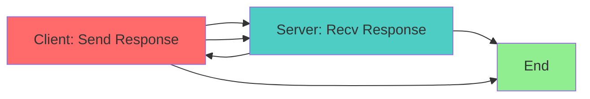
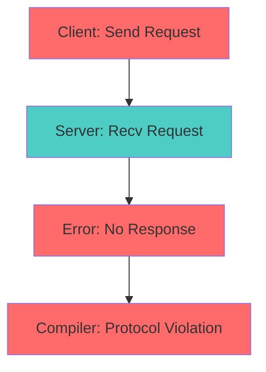
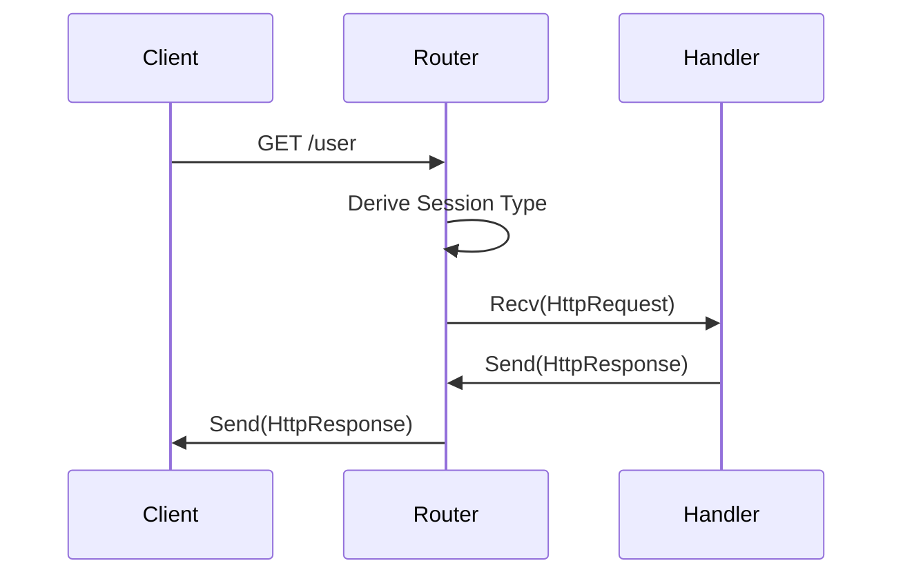

# Session Type Specification (Protocols)

* File:* `tooling\protocol_session_types_spec.md`
* Version:* 1.0.0
* Context:* Layer 4 (StdLib) - `routing` & Actor Protocols
* Formalism:* Binary & Multiparty Session Types
* Status:* Active
* Last Modified:* 2026-01-01
* Author:* Kilo Code
* Reviewers:* Pending

- -

## 1. Introduction

### 1.1 Purpose

This specification formalizes the **Protocol System** using **Session Types**, providing mathematical foundation for type-safe communication between actors and HTTP handlers. This formalization enables the Morph compiler to verify protocol compliance at compile time, preventing runtime communication errors.

### 1.2 Scope

This specification covers:
- Protocol definition and syntax
- Duality (Client-Server compatibility)
- Application to `routing` block
- Actor protocol verification
- Protocol violation detection

This specification does not cover:
- Concrete implementation of protocol runtime
- Network transport layer details
- Performance optimization

### 1.3 Definitions, Acronyms, and Abbreviations

| Term | Definition |
|-------|------------|
| **Session Type** | Type describing communication sequences |
| **Dual** | Complementary session type for bidirectional communication |
| **Protocol** | Type-safe communication pattern |
| **Send** | Operation to send a message |
| **Recv** | Operation to receive a message |
| **Choose** | Branching operation (client-side) |
| **Offer** | Branching operation (server-side) |
| **End** | Termination of communication |

### 1.4 References

- Honda, K. (1993). "Types for Dyadic Interaction"
- IEEE 1016: Recommended Practice for Software Design Descriptions
- ISO/IEC 29148: Systems and software engineering — Requirements engineering

- -

## 2. Formal Definitions

### 2.1 Protocol Definition

Standard types describe *data*. Session types describe *communication sequences*.
Morph applies this to `routing` block and Actor interactions.

* ST-INV-001:* THE system SHALL define Session Types for communication sequences.

* ST-REQ-001:* THE system SHALL use Session Types for protocol verification.

* Priority:* Critical
* Verification Method:* Test
* Rationale:* Enables compile-time protocol checking
* Dependencies:* ST-INV-001
* Traceability:* Section 2.1 (Protocol Definition)

#### 2.1.1 The Protocol Syntax

$$ S ::= \text{Send}(T, S) \ | \ \text{Recv}(T, S) \ | \ \text{Choose}\{l_i: S_i\} \ | \ \text{Offer}\{l_i: S_i\} \ | \ \text{End} $$

* ST-INV-002:* THE system SHALL define protocol syntax with Send, Recv, Choose, Offer, and End.

* ST-REQ-002:* THE system SHALL support all protocol operations.

* Priority:* Critical
* Verification Method:* Test
* Rationale:* Enables complete protocol specification
* Dependencies:* ST-INV-002
* Traceability:* Section 2.1.1 (The Protocol Syntax)

### 2.2 Duality (Client-Server Compatibility)

For a communication to be safe, the Client's type $S$ and the Server's type $\bar{S}$ must be **Duals**.

* ST-INV-003:* THE system SHALL define duality for session types.

* ST-REQ-003:* THE system SHALL verify duality for all protocols.

* Priority:* Critical
* Verification Method:* Test
* Rationale:* Ensures protocol compatibility
* Dependencies:* ST-INV-003
* Traceability:* Section 2.2 (Duality)

#### 2.2.1 Duality Rules

- $\overline{\text{Send}(T, S)} = \text{Recv}(T, \bar{S})$
- $\overline{\text{Recv}(T, S)} = \text{Send}(T, \bar{S})$
- $\overline{\text{End}} = \text{End}$

* ST-THM-001:* THE system SHALL guarantee that dual types are compatible.

* Priority:* Critical
* Verification Method:* Analysis
* Rationale:* Ensures safe communication
* Dependencies:* ST-INV-003
* Traceability:* Section 2.2.1 (Duality Rules)

### 2.3 Application: The `routing` Block

When an Agent writes:
```rust
GET "/user" -> UserActor.Get
```

The compiler derives the Session Type for the HTTP Handler:
$$ S_{http} = \text{Recv}(\text{HttpRequest}, \text{Send}(\text{HttpResponse}, \text{End})) $$

It then verifies that `UserActor.Get` implements the dual:
$$ S_{actor} = \text{Recv}(\text{Message}, \text{Send}(\text{Result}, \text{End})) $$

If types mismatch (e.g., Actor doesn't send a reply), the compiler raises a **Protocol Violation Error**.

* ST-INV-004:* THE system SHALL derive session types for routing blocks.

* ST-REQ-004:* THE system SHALL verify protocol compatibility for routing.

* Priority:* Critical
* Verification Method:* Test
* Rationale:* Prevents runtime protocol errors
* Dependencies:* ST-INV-004
* Traceability:* Section 2.3 (Application: The `routing` Block)

- -

## 3. Requirements

### 3.1 Functional Requirements

* ST-REQ-005:* THE system SHALL support Send operation in protocols.

* Priority:* Critical
* Verification Method:* Test
* Rationale:* Enables message sending
* Dependencies:* ST-INV-002
* Traceability:* Section 2.1.1 (The Protocol Syntax)

* ST-REQ-006:* THE system SHALL support Recv operation in protocols.

* Priority:* Critical
* Verification Method:* Test
* Rationale:* Enables message receiving
* Dependencies:* ST-INV-002
* Traceability:* Section 2.1.1 (The Protocol Syntax)

* ST-REQ-007:* THE system SHALL support Choose operation in protocols.

* Priority:* High
* Verification Method:* Test
* Rationale:* Enables client-side branching
* Dependencies:* ST-INV-002
* Traceability:* Section 2.1.1 (The Protocol Syntax)

* ST-REQ-008:* THE system SHALL support Offer operation in protocols.

* Priority:* High
* Verification Method:* Test
* Rationale:* Enables server-side branching
* Dependencies:* ST-INV-002
* Traceability:* Section 2.1.1 (The Protocol Syntax)

* ST-REQ-009:* THE system SHALL support End operation in protocols.

* Priority:* Critical
* Verification Method:* Test
* Rationale:* Enables protocol termination
* Dependencies:* ST-INV-002
* Traceability:* Section 2.1.1 (The Protocol Syntax)

* ST-REQ-010:* THE system SHALL verify duality for all protocols.

* Priority:* Critical
* Verification Method:* Test
* Rationale:* Ensures protocol compatibility
* Dependencies:* ST-INV-003
* Traceability:* Section 2.2 (Duality)

* ST-REQ-011:* THE system SHALL derive session types for routing blocks.

* Priority:* Critical
* Verification Method:* Test
* Rationale:* Enables automatic protocol verification
* Dependencies:* ST-INV-004
* Traceability:* Section 2.3 (Application: The `routing` Block)

### 3.2 Non-Functional Requirements

* ST-NFR-001:* THE system SHALL verify protocol compatibility at compile time.

* Priority:* Critical
* Verification Method:* Compilation test
* Metric:* Protocol errors caught at compile time
* Rationale:* Prevents runtime errors
* Dependencies:* ST-THM-001
* Traceability:* Section 2.2 (Duality)

* ST-NFR-002:* THE system SHALL support up to 100 protocol branches.

* Priority:* Medium
* Verification Method:* Stress test
* Metric:* 100 branches
* Rationale:* Supports complex protocols
* Dependencies:* None
* Traceability:* Section 2.1.1 (The Protocol Syntax)

- -

## 4. Design

### 4.1 Architecture Overview

The Session Type Engine is implemented as a compiler component that:
1. Parses protocol definitions
2. Derives session types for routing blocks
3. Verifies duality between client and server
4. Reports protocol violations at compile time
5. Ensures type-safe communication

### 4.2 Data Structures

#### 4.2.1 Session Type

* Session Type:* $S = \text{Send}(T, S) \ | \ \text{Recv}(T, S) \ | \ \text{Choose}\{l_i: S_i\} \ | \ \text{Offer}\{l_i: S_i\} \ | \ \text{End}$

* Components:*
- Operation type (Send/Recv/Choose/Offer/End)
- Message type $T$
- Continuation type $S$
- Branch labels $l_i$

* Invariants:*
1. Every Send has a corresponding Recv in dual
2. Every Choose has a corresponding Offer in dual
3. Every protocol eventually reaches End

#### 4.2.2 Protocol Definition

* Protocol Definition:* $P = (S_{client}, S_{server})$

* Components:*
- Client session type $S_{client}$
- Server session type $S_{server}$

* Invariants:*
1. $S_{server} = \overline{S_{client}}$
2. Both types are well-formed

### 4.3 Algorithms

#### 4.3.1 Duality Verification Algorithm

* Algorithm Name:* Verify Duality

* Input:* Client type $S$, Server type $S'$

* Output:* Boolean indicating if types are dual

* Mathematical Definition:*
$$
\text{Dual}(S, S') \iff S' = \overline{S}
$$

* Pseudocode:*
```
function verify_duality(client_type, server_type):
    return compute_dual(client_type) == server_type

function compute_dual(type):
    match type:
        Send(T, S) => Recv(T, compute_dual(S))
        Recv(T, S) => Send(T, compute_dual(S))
        Choose{labels: types} => Offer{labels: [compute_dual(t) for t in types]}
        Offer{labels: types} => Choose{labels: [compute_dual(t) for t in types]}
        End => End
```

* Complexity:*
- Time: $O(n)$ where $n$ is depth of type
- Space: $O(n)$ for recursion stack

* Correctness:*
- **Invariant:* Dual types are compatible
- **Termination:* Recursion terminates at End

#### 4.3.2 Protocol Derivation Algorithm

* Algorithm Name:* Derive Protocol

* Input:* Routing block definition

* Output:* Session type for the protocol

* Mathematical Definition:*
$$
\text{Derive}(\text{RoutingBlock}) = S_{protocol}
$$

* Pseudocode:*
```
function derive_protocol(routing_block):
    match routing_block:
        GET path -> handler:
            return Recv(HttpRequest, Send(HttpResponse, End))
        POST path -> handler:
            return Recv(HttpRequest, Send(HttpResponse, End))
        ActorMessage -> handler:
            return Recv(Message, Send(Result, End))
```

* Complexity:*
- Time: $O(1)$ for simple protocols
- Space: $O(1)$

* Correctness:*
- **Invariant:* Derived type matches protocol semantics
- **Termination:* Single pattern match

### 4.4 Mermaid Diagrams

#### 4.4.1 Protocol Duality



#### 4.4.2 Protocol Violation



#### 4.4.3 Routing Protocol



- -

## 5. Correctness Properties

### 5.1 Theorems

#### 5.1.1 Duality Theorem

* Theorem:* Dual session types are compatible for communication.

* Proof Sketch:*
1. By definition of duality, Send matches Recv
2. By definition of duality, Recv matches Send
3. By definition of duality, Choose matches Offer
4. By definition of duality, End matches End
5. Therefore, dual types are compatible

* ST-THM-002:* THE system SHALL guarantee dual type compatibility.

* Priority:* Critical
* Verification Method:* Analysis
* Rationale:* Ensures safe communication
* Dependencies:* ST-INV-003
* Traceability:* Section 5.1.1 (Duality Theorem)

#### 5.1.2 Protocol Safety Theorem

* Theorem:* If client and server types are dual, communication is safe.

* Proof Sketch:*
1. By duality theorem, dual types are compatible
2. By definition of session types, all operations are matched
3. By definition of End, communication terminates
4. Therefore, communication is safe

* ST-THM-003:* THE system SHALL guarantee protocol safety.

* Priority:* Critical
* Verification Method:* Analysis
* Rationale:* Prevents runtime errors
* Dependencies:* ST-THM-001
* Traceability:* Section 5.1.2 (Protocol Safety Theorem)

### 5.2 Invariants

#### 5.2.1 Protocol Invariants

- **ST-INV-005:* THE system SHALL maintain that every Send has a corresponding Recv
- **ST-INV-006:* THE system SHALL maintain that every Choose has a corresponding Offer
- **ST-INV-007:* THE system SHALL maintain that every protocol eventually reaches End

#### 5.2.2 Duality Invariants

- **ST-INV-008:* THE system SHALL maintain that dual types are inverses
- **ST-INV-009:* THE system SHALL maintain that dual of dual is original

- -

## 6. Examples

### 6.1 Simple Protocol

```morph
// Simple protocol: Request-Response
routing {
    GET "/api/user" -> UserHandler.GetUser
}
```

* Session Type:*
$$ S = \text{Recv}(\text{HttpRequest}, \text{Send}(\text{HttpResponse}, \text{End})) $$

* Dual:*
$$ \overline{S} = \text{Send}(\text{HttpRequest}, \text{Recv}(\text{HttpResponse}, \text{End})) $$

### 6.2 Branching Protocol

```morph
// Branching protocol: Multiple endpoints
routing {
    GET "/api/user" -> UserHandler.GetUser
    POST "/api/user" -> UserHandler.CreateUser
    DELETE "/api/user" -> UserHandler.DeleteUser
}
```

* Session Type:*
$$ S = \text{Choose}\{ \text{Get}: S_{get}, \text{Post}: S_{post}, \text{Delete}: S_{delete} \} $$

* Dual:*
$$ \overline{S} = \text{Offer}\{ \text{Get}: \overline{S_{get}}, \text{Post}: \overline{S_{post}}, \text{Delete}: \overline{S_{delete}} \} $$

### 6.3 Actor Protocol

```morph
// Actor protocol: Message-Response
actor UserActor {
    fn handle(msg: Message) -> Result {
        // Process message
        return Result;
    }
}
```

* Session Type:*
$$ S = \text{Recv}(\text{Message}, \text{Send}(\text{Result}, \text{End})) $$

* Dual:*
$$ \overline{S} = \text{Send}(\text{Message}, \text{Recv}(\text{Result}, \text{End})) $$

### 6.4 Edge Cases

#### 6.4.1 Protocol Violation

```morph
// Edge case: Protocol violation
routing {
    GET "/api/user" -> UserHandler.GetUser
    // Handler doesn't send response
}
```

* Error:* Protocol Violation - Expected Send(HttpResponse) but got End

#### 6.4.2 Mismatched Types

```morph
// Edge case: Type mismatch
routing {
    GET "/api/user" -> UserHandler.GetUser
    // Handler sends wrong type
}
```

* Error:* Protocol Violation - Expected Send(HttpResponse) but got Send(String)

- -

## Change Log

| Version | Date       | Author      | Changes                                                                 |
|---------|------------|-------------|-------------------------------------------------------------------------|
| 1.0.0   | 2026-01-01 | Kilo Code    | Initial version                                                        |
