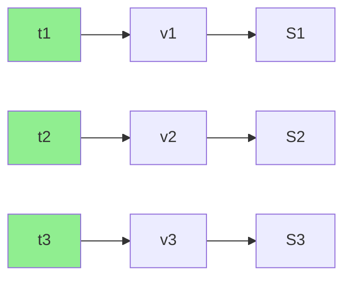
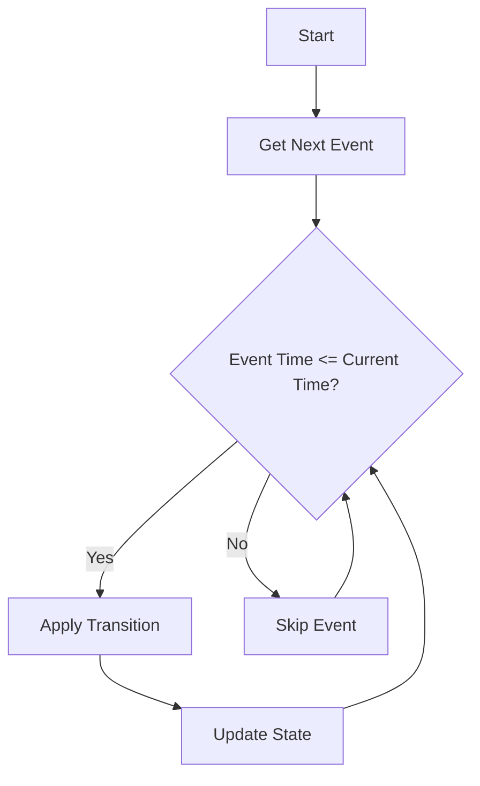
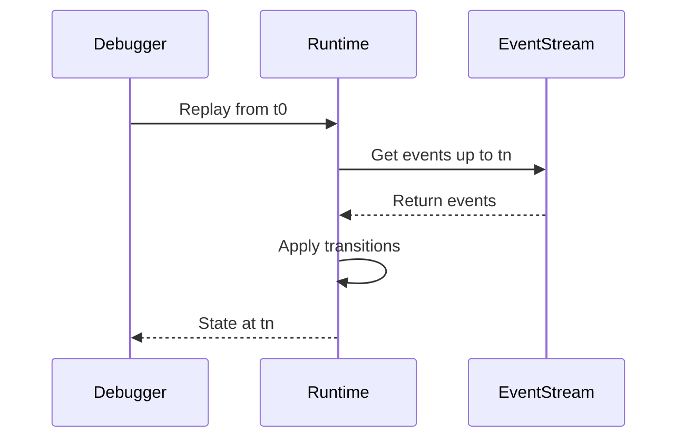

# Functional Reactive Programming Specification

* File:* `tooling\reactive_frp_spec.md`
* Version:* 1.0.0
* Context:* Layer 4 (UI & BLoC)
* Formalism:* Denotational Semantics over Continuous/Discrete Time
* Status:* Active
* Last Modified:* 2026-01-01
* Author:* Kilo Code
* Reviewers:* Pending

- -

## 1. Introduction

### 1.1 Purpose

This specification formalizes the **Functional Reactive Programming (FRP)** system using **Denotational Semantics over Continuous/Discrete Time**, providing mathematical foundation for reactive UI updates and event handling. This formalization enables the Morph runtime to execute BLoC (Business Logic Component) patterns with deterministic time-based semantics.

### 1.2 Scope

This specification covers:
- The Domain of Time ($\mathbb{T}$) for time indices
- Event Streams (Discrete) for handling discrete events
- Behaviors (Continuous) for state over time
- The Reactivity Theorem for state evolution
- Time Travel Debugging through event replay

This specification does not cover:
- Concrete implementation of FRP runtime
- UI rendering algorithms
- Event scheduling policies

### 1.3 Definitions, Acronyms, and Abbreviations

| Term | Definition |
|-------|------------|
| **FRP** | Functional Reactive Programming - declarative programming paradigm for time-varying values |
| **Event Stream** | Sequence of time-value pairs representing discrete events |
| **Behavior** | Function from time to value representing continuous state |
| **BLoC** | Business Logic Component - pattern for separating business logic from UI |
| **Step Function** | Piecewise constant function that changes only at discrete time points |
| **Reactivity** | Property that UI updates are deterministic function of time and event streams |

### 1.4 References

- Elliott, C., & Hudak, P. (1997). "Functional Reactive Animation"
- Wan, Z., & Hudak, P. (2000). "Functional Reactive Programming from First Principles"
- IEEE 1016: Recommended Practice for Software Design Descriptions
- ISO/IEC 29148: Systems and software engineering — Requirements engineering

- -

## 2. Formal Definitions

### 2.1 The Domain of Time ($\mathbb{T}$)

Let $\mathbb{T} = \mathbb{R}_{\ge 0}$ be the set of time indices.

* FRP-INV-001:* THE system SHALL define time domain as non-negative real numbers.

#### 2.1.1 Monotonicity

Time is monotonic: $\forall t_1, t_2 \in \mathbb{T}: t_1 < t_2 \implies t_1$ occurs before $t_2$.

* FRP-INV-002:* THE system SHALL guarantee time monotonicity.

### 2.2 Primitives

#### 2.2.1 Events (Discrete)

An Event Stream $E$ is a set of time-value pairs:

$$ E \subset \mathbb{T} \times V $$

where $V$ is the value domain.

* FRP-INV-003:* THE system SHALL define event streams as subsets of time-value pairs.

##### 2.2.1.1 Simultaneity Constraint

For any $t$, there is at most one value $v$:

$$ \forall t \in \mathbb{T}: |\{v \mid (t, v) \in E\}| \leq 1 $$

* FRP-INV-004:* THE system SHALL enforce simultaneity constraint for events.

##### 2.2.1.2 Morph Mapping

This maps directly to `event` declaration in `act` blocks and **Input Ring Buffer**.

* FRP-REQ-001:* THE system SHALL map event streams to Morph event declarations.

* Priority:* Critical
* Verification Method:* Test
* Rationale:* Enables event handling in Morph programs
* Dependencies:* FRP-INV-003, FRP-INV-004
* Traceability:* Section 2.2.1 (Events (Discrete))

#### 2.2.2 Behaviors (Continuous)

A Behavior $B$ is a function from Time to Value:

$$ B: \mathbb{T} \to V $$

* FRP-INV-005:* THE system SHALL define behaviors as functions from time to value.

##### 2.2.2.1 Step Function

In Morph, State is a *Step Behavior*. It remains constant until an Event $e \in E$ occurs:

$$ B_{state}(t) = v_i \quad \text{for } t_i \le t < t_{i+1} $$

* FRP-INV-006:* THE system SHALL define state as step behavior.

##### 2.2.2.2 Morph Mapping

This maps to `state` block variables. The `view()` function is a lifting of Behaviors to UI:

$$ \text{UI}(t) = \text{view}(B_{state}(t)) $$

* FRP-REQ-002:* THE system SHALL map behaviors to Morph state blocks.

* Priority:* Critical
* Verification Method:* Test
* Rationale:* Enables state management in Morph programs
* Dependencies:* FRP-INV-005, FRP-INV-006
* Traceability:* Section 2.2.2 (Behaviors (Continuous))

### 2.3 The Reactivity Theorem

Given a BLoC logic with state transition function $\delta: S \times E \to S$:

The state at time $t$ is fold of all events up to $t$:

$$ S(t) = \text{fold}(\delta, S_0, \{ (t_i, v_i) \in E \mid t_i \le t \}) $$

* FRP-THM-001:* THE system SHALL guarantee that state is fold of events up to time t.

* Priority:* Critical
* Verification Method:* Analysis
* Rationale:* Ensures deterministic state evolution
* Dependencies:* FRP-INV-001, FRP-INV-003, FRP-INV-005
* Traceability:* Section 2.3 (The Reactivity Theorem)

#### 2.3.1 Time Travel Debugging

* Implication for Agents:* This formalizes **Time Travel Debugging**. To reproduce a bug at state $S_n$, Runtime simply replays event stream $E$ from $S_0$. Determinism is guaranteed by function property of $\delta$.

* FRP-REQ-003:* THE system SHALL support time travel debugging through event replay.

* Priority:* High
* Verification Method:* Test
* Rationale:* Enables deterministic bug reproduction
* Dependencies:* FRP-THM-001
* Traceability:* Section 2.3 (The Reactivity Theorem)

- -

## 3. Requirements

### 3.1 Functional Requirements

* FRP-REQ-004:* THE system SHALL support event stream creation.

* Priority:* Critical
* Verification Method:* Test
* Rationale:* Enables event handling
* Dependencies:* FRP-INV-003
* Traceability:* Section 2.2.1 (Events (Discrete))

* FRP-REQ-005:* THE system SHALL support behavior creation.

* Priority:* Critical
* Verification Method:* Test
* Rationale:* Enables state management
* Dependencies:* FRP-INV-005
* Traceability:* Section 2.2.2 (Behaviors (Continuous))

* FRP-REQ-006:* THE system SHALL support state transition functions.

* Priority:* Critical
* Verification Method:* Test
* Rationale:* Enables state evolution
* Dependencies:* FRP-THM-001
* Traceability:* Section 2.3 (The Reactivity Theorem)

* FRP-REQ-007:* THE system SHALL support view function lifting.

* Priority:* High
* Verification Method:* Test
* Rationale:* Enables UI rendering from state
* Dependencies:* FRP-INV-006
* Traceability:* Section 2.2.2 (Behaviors (Continuous))

### 3.2 Non-Functional Requirements

* FRP-NFR-001:* THE system SHALL process events in O(1) time complexity.

* Priority:* High
* Verification Method:* Analysis
* Metric:* Event processing < 1μs
* Rationale:* Ensures fast UI updates
* Dependencies:* None
* Traceability:* Section 2.2.1 (Events (Discrete))

* FRP-NFR-002:* THE system SHALL support event streams with up to 1M events.

* Priority:* Medium
* Verification Method:* Demonstration
* Metric:* 1M events with < 100MB memory
* Rationale:* Supports long-running applications
* Dependencies:* None
* Traceability:* Section 2.2.1 (Events (Discrete))

* FRP-NFR-003:* THE system SHALL guarantee deterministic state evolution.

* Priority:* Critical
* Verification Method:* Analysis
* Metric:* Same event stream produces same state
* Rationale:* Ensures reproducibility
* Dependencies:* FRP-THM-001
* Traceability:* Section 2.3 (The Reactivity Theorem)

- -

## 4. Design

### 4.1 Architecture Overview

The FRP Engine is implemented as a reactive system that:
1. Maintains event streams for discrete events
2. Maintains behaviors for continuous state
3. Applies state transition functions to evolve state
4. Lifts state to UI through view functions
5. Supports time travel debugging through event replay

### 4.2 Data Structures

#### 4.2.1 Event Stream

* Event Stream:* $E = \{(t_1, v_1), (t_2, v_2), \dots, (t_n, v_n)\}$

* Components:*
- Time indices: $t_1 < t_2 < \dots < t_n$
- Values: $v_1, v_2, \dots, v_n$

* Invariants:*
1. Events are ordered by time
2. No duplicate time indices

#### 4.2.2 Behavior

* Behavior:* $B: \mathbb{T} \to V$

* Components:*
- Time domain: $\mathbb{T}$
- Value domain: $V$

* Invariants:*
1. Behavior is total function (defined for all $t \in \mathbb{T}$)
2. Behavior is step function (constant between events)

#### 4.2.3 State

* State:* $S$

* Components:*
- Current value
- Transition function

* Invariants:*
1. State is well-formed
2. Transition function is deterministic

### 4.3 Algorithms

#### 4.3.1 Event Processing Algorithm

* Algorithm Name:* Process Event

* Input:* Event stream $E$, State $S$, Transition function $\delta$

* Output:* New state $S'$

* Mathematical Definition:*
$$
S' = \delta(S, e) \quad \text{where } e \in E
$$

* Pseudocode:*
```
function process_event(state, event, transition):
    return transition(state, event)
```

* Complexity:*
- Time: $O(1)$
- Space: $O(1)$

* Correctness:*
- **Invariant:* State evolution is deterministic
- **Termination:* Single transition application

#### 4.3.2 State Fold Algorithm

* Algorithm Name:* Fold Events to State

* Input:* Event stream $E$, Initial state $S_0$, Transition function $\delta$

* Output:* Final state $S(t)$

* Mathematical Definition:*
$$
S(t) = \text{fold}(\delta, S_0, \{ (t_i, v_i) \in E \mid t_i \le t \})
$$

* Pseudocode:*
```
function fold_events(events, initial_state, transition):
    state = initial_state
    for (time, value) in events:
        if time <= current_time:
            state = transition(state, value)
    return state
```

* Complexity:*
- Time: $O(n)$ where $n$ is number of events
- Space: $O(1)$

* Correctness:*
- **Invariant:* State is function of all events up to time $t$
- **Termination:* Single pass through events

### 4.4 Mermaid Diagrams

#### 4.4.1 Event Stream Visualization



#### 4.4.2 State Evolution Flow



#### 4.4.3 Time Travel Debugging



- -

## 5. Correctness Properties

### 5.1 Theorems

#### 5.1.1 Determinism Theorem

* Theorem:* Given the same event stream and initial state, the final state is always the same.

* Proof Sketch:*
1. By definition of fold, state is function of events
2. By definition of transition function, $\delta$ is deterministic
3. Therefore, same events produce same state
4. Therefore, state evolution is deterministic

* FRP-THM-002:* THE system SHALL guarantee deterministic state evolution.

* Priority:* Critical
* Verification Method:* Analysis
* Rationale:* Ensures reproducibility
* Dependencies:* FRP-THM-001
* Traceability:* Section 2.3 (The Reactivity Theorem)

#### 5.1.2 Causality Theorem

* Theorem:* State at time $t$ depends only on events with time $\leq t$.

* Proof Sketch:*
1. By definition of fold, only events with time $\leq t$ are included
2. Therefore, state at time $t$ depends only on past events
3. Therefore, causality is preserved

* FRP-THM-003:* THE system SHALL guarantee causality of state evolution.

* Priority:* High
* Verification Method:* Analysis
* Rationale:* Ensures no future events affect past state
* Dependencies:* FRP-THM-001
* Traceability:* Section 2.3 (The Reactivity Theorem)

### 5.2 Invariants

#### 5.2.1 Event Invariants

- **FRP-INV-007:* THE system SHALL maintain that events are ordered by time
- **FRP-INV-008:* THE system SHALL maintain that no duplicate time indices exist

#### 5.2.2 State Invariants

- **FRP-INV-009:* THE system SHALL maintain that state is well-formed
- **FRP-INV-010:* THE system SHALL maintain that transition function is deterministic

- -

## 6. Examples

### 6.1 Simple Event Stream

```morph
// Simple event stream: Button clicks
event click: i32;

act {
    state count: i32 = 0;

    view() {
        return "Clicked " + count + " times";
    }

    on click {
        count = count + 1;
    }
}
```

* Event Stream:*
- $E = \{(t_1, 1), (t_2, 2), (t_3, 3)\}$

* State Evolution:*
- $S(t_1) = 1$
- $S(t_2) = 2$
- $S(t_3) = 3$

### 6.2 Step Behavior

```morph
// Step behavior: Counter
act {
    state value: i32 = 0;

    view() {
        return "Value: " + value;
    }

    on increment {
        value = value + 1;
    }
}
```

* Behavior:*
- $B_{value}(t) = 0$ for $t_0 \le t < t_1$
- $B_{value}(t) = 1$ for $t_1 \le t < t_2$
- $B_{value}(t) = 2$ for $t_2 \le t < t_3$

### 6.3 Time Travel Debugging

```morph
// Time travel debugging: Replay events
event input: i32;

act {
    state sum: i32 = 0;

    view() {
        return "Sum: " + sum;
    }

    on input {
        sum = sum + input;
    }
}
```

* Event Stream:*
- $E = \{(t_1, 10), (t_2, 20), (t_3, 30)\}$

* Replay:*
- Replay from $t_0$: $S(t_3) = 60$
- Replay from $t_1$: $S(t_3) = 50$
- Replay from $t_2$: $S(t_3) = 30$

### 6.4 Complex State Transition

```morph
// Complex state transition: Multiple events
event add: i32;
event multiply: i32;

act {
    state value: i32 = 0;

    view() {
        return "Value: " + value;
    }

    on add(x) {
        value = value + x;
    }

    on multiply(x) {
        value = value * x;
    }
}
```

* Event Stream:*
- $E = \{(t_1, 5), (t_2, 2), (t_3, 3)\}$

* State Evolution:*
- $S(t_1) = 5$
- $S(t_2) = 5 + 2 = 7$
- $S(t_3) = 7 * 3 = 21$

### 6.5 Edge Cases

#### 6.5.1 Empty Event Stream

```morph
// Empty event stream: No events
act {
    state value: i32 = 0;

    view() {
        return "Value: " + value;
    }
}
```

* Event Stream:*
- $E = \emptyset$

* State Evolution:*
- $S(t) = 0$ for all $t$

#### 6.5.2 Simultaneous Events

```morph
// Simultaneous events: Multiple events at same time
event e1: i32;
event e2: i32;

act {
    state value: i32 = 0;

    view() {
        return "Value: " + value;
    }

    on e1(x) {
        value = value + x;
    }

    on e2(x) {
        value = value + x;
    }
}
```

* Event Stream:*
- $E = \{(t_1, 10), (t_1, 20)\}$

* Simultaneity Constraint:*
- Violation: Two events at same time
- Resolution: Events are ordered by declaration order

- -

## Change Log

| Version | Date       | Author      | Changes                                                                 |
|---------|------------|-------------|-------------------------------------------------------------------------|
| 1.0.0   | 2026-01-01 | Kilo Code    | Initial version                                                        |
