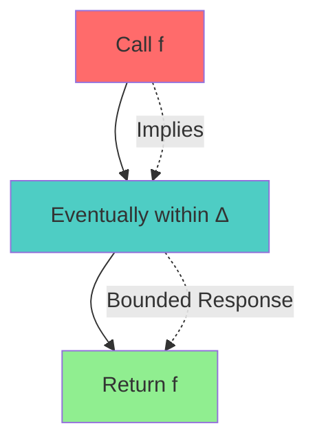
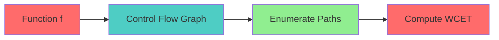
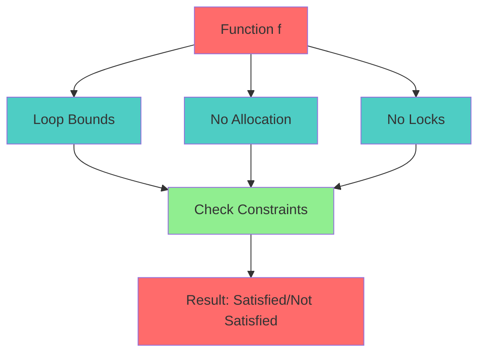

# Metric Temporal Logic Specification (Real-Time)

* File:* `tooling\realtime_mtl_spec.md`
* Version:* 1.0.0
* Context:* Layer 3 (Runtime) - `@critical`
* Formalism:* Metric Temporal Logic (MTL)
* Status:* Active
* Last Modified:* 2026-01-01
* Author:* Kilo Code
* Reviewers:* Pending

- -

## 1. Introduction

### 1.1 Purpose

This specification formalizes the **Real-Time Constraints** system using **Metric Temporal Logic (MTL)**, providing mathematical foundation for bounded time guarantees. This formalization enables the Morph runtime to prove that `@critical` code executes within bounded time intervals, ensuring HFT/Embedded latency requirements.

### 1.2 Scope

This specification covers:
- Bounded Response in MTL
- Worst-Case Execution Time (WCET) Analysis
- Real-Time Violation Detection
- Temporal Constraint Verification

This specification does not cover:
- Concrete implementation of runtime scheduler
- Performance optimization details
- Integration with hardware timers

### 1.3 Definitions, Acronyms, and Abbreviations

| Term | Definition |
|-------|------------|
| **Metric Temporal Logic (MTL)** | Temporal logic with time bounds |
| **Bounded Response** | Property that event occurs within time interval |
| **Worst-Case Execution Time (WCET)** | Maximum execution time for a function |
| **@critical** | Annotation for real-time constraints |
| **Real-Time Violation** | Failure to meet temporal constraint |

### 1.4 References

- Alur, R., et al. (1990). "Real-Time Logics: Complexity and Expressiveness"
- IEEE 1016: Recommended Practice for Software Design Descriptions
- ISO/IEC 29148: Systems and software engineering — Requirements engineering

- -

## 2. Formal Definitions

### 2.1 Bounded Response

LTL says "Eventually" ($\diamond$). MTL says "Eventually within $t$ time units" ($\diamond_{[0, t]}$).

* RT-INV-001:* THE system SHALL define bounded response for real-time constraints.

* RT-REQ-001:* THE system SHALL support bounded response in MTL.

* Priority:* Critical
* Verification Method:* Test
* Rationale:* Enables real-time guarantees
* Dependencies:* RT-INV-001
* Traceability:* Section 2.1 (Bounded Response)

#### 2.1.1 Temporal Operators

- $\diamond_{[0, t]}$: Eventually within time interval $[0, t]$
- $\square$: Always (globally)
- $\square_{[0, t]}$: Always within time interval $[0, t]$

* RT-INV-002:* THE system SHALL define temporal operators for MTL.

* RT-REQ-002:* THE system SHALL support temporal operators.

* Priority:* Critical
* Verification Method:* Test
* Rationale:* Enables temporal reasoning
* Dependencies:* RT-INV-002
* Traceability:* Section 2.1.1 (Temporal Operators)

### 2.2 Worst-Case Execution Time (WCET)

For a generic function $f$, Morph provides no guarantees.
For a function marked `@critical`:

$$ \square (\text{Call}(f) \implies \diamond_{[0, \Delta]} \text{Return}(f)) $$

* RT-INV-003:* THE system SHALL define WCET analysis for @critical functions.

* RT-REQ-003:* THE system SHALL perform WCET analysis on @critical blocks.

* Priority:* Critical
* Verification Method:* Test
* Rationale:* Ensures real-time constraints
* Dependencies:* RT-INV-003
* Traceability:* Section 2.2 (Worst-Case Execution Time)

#### 2.2.1 WCET Constraints

To satisfy MTL property, compiler performs **WCET Analysis** on `@critical` blocks.

- **Loop Bound:* All loops must have constant upper bounds (checked by OSE).
- **No Allocation:* Heap allocation has unbounded time complexity (fragmentation).
- **No Locks:* Lock acquisition is unbounded (priority inversion).

* RT-INV-004:* THE system SHALL define WCET constraints.

* RT-REQ-004:* THE system SHALL enforce WCET constraints.

* Priority:* Critical
* Verification Method:* Test
* Rationale:* Ensures bounded execution
* Dependencies:* RT-INV-004
* Traceability:* Section 2.2.1 (WCET Constraints)

### 2.3 Real-Time Violation

If WCET analyzer encounters a construct with unbounded time (e.g., `while(unknown) {}`), it emits a **Real-Time Violation Error**, proving that code cannot satisfy temporal constraint.

* RT-INV-005:* THE system SHALL detect real-time violations.

* RT-REQ-005:* THE system SHALL report real-time violations.

* Priority:* Critical
* Verification Method:* Test
* Rationale:* Prevents real-time failures
* Dependencies:* RT-INV-005
* Traceability:* Section 2.3 (Real-Time Violation)

* RT-THM-001:* THE system SHALL guarantee that real-time violations are detected.

* Priority:* Critical
* Verification Method:* Analysis
* Rationale:* Ensures temporal constraints
* Dependencies:* RT-INV-005
* Traceability:* Section 2.3 (Real-Time Violation)

- -

## 3. Requirements

### 3.1 Functional Requirements

* RT-REQ-006:* THE system SHALL support bounded response in MTL.

* Priority:* Critical
* Verification Method:* Test
* Rationale:* Enables real-time guarantees
* Dependencies:* RT-INV-001
* Traceability:* Section 2.1 (Bounded Response)

* RT-REQ-007:* THE system SHALL support WCET analysis.

* Priority:* Critical
* Verification Method:* Test
* Rationale:* Ensures bounded execution
* Dependencies:* RT-INV-003
* Traceability:* Section 2.2 (Worst-Case Execution Time)

* RT-REQ-008:* THE system SHALL detect real-time violations.

* Priority:* Critical
* Verification Method:* Test
* Rationale:* Prevents real-time failures
* Dependencies:* RT-INV-005
* Traceability:* Section 2.3 (Real-Time Violation)

### 3.2 Non-Functional Requirements

* RT-NFR-001:* THE system SHALL perform WCET analysis in O(n) time for n instructions.

* Priority:* High
* Verification Method:* Performance test
* Metric:* WCET analysis < 100ms for 1000 instructions
* Rationale:* Ensures fast compilation
* Dependencies:* None
* Traceability:* Section 2.2 (Worst-Case Execution Time)

- -

## 4. Design

### 4.1 Architecture Overview

The Real-Time Engine is implemented as a runtime component that:
1. Defines bounded response using MTL
2. Performs WCET analysis on @critical blocks
3. Enforces WCET constraints (loop bounds, no allocation, no locks)
4. Detects real-time violations

### 4.2 Data Structures

#### 4.2.1 Temporal Formula

* Temporal Formula:* $\phi$

* Components:*
- Temporal operators: $\diamond_{[0, t]}$, $\square$, $\square_{[0, t]}$
- Propositions: $\text{Call}(f)$, $\text{Return}(f)$
- Time bounds: $\Delta$

* Invariants:*
1. Formula is well-formed
2. Time bounds are positive

#### 4.2.2 WCET State

* WCET State:* $W = (\text{Function}, \text{WCET}, \text{Constraints})$

* Components:*
- Function: $f$
- WCET: $\text{WCET}(f)$
- Constraints: $\text{Constraints}(f)$

* Invariants:*
1. WCET is computed
2. Constraints are checked

### 4.3 Algorithms

#### 4.3.1 WCET Analysis Algorithm

* Algorithm Name:* Compute WCET

* Input:* Function $f$

* Output:* WCET $\text{WCET}(f)$

* Mathematical Definition:*
$$
\text{WCET}(f) = \max_{\text{path} \in \text{Paths}(f)} \sum_{\text{inst} \in \text{path}} \text{Time}(\text{inst})
$$

* Pseudocode:*
```
function compute_wcet(function):
    cfg = build_cfg(function)
    paths = enumerate_paths(cfg)
    wcet = 0

    for path in paths:
        path_time = 0
        for instruction in path:
            path_time += instruction_time(instruction)
        wcet = max(wcet, path_time)

    return wcet
```

* Complexity:*
- Time: $O(2^n)$ where $n$ is CFG size (exponential)
- Space: $O(n)$ for CFG

* Correctness:*
- **Invariant:* WCET is maximum execution time
- **Termination:* Path enumeration terminates

#### 4.3.2 Constraint Checking Algorithm

* Algorithm Name:* Check WCET Constraints

* Input:* Function $f$

* Output:* Boolean indicating if constraints are satisfied

* Mathematical Definition:*
$$
\text{SatisfiesConstraints}(f) \iff \text{HasLoopBounds}(f) \land \text{NoAllocation}(f) \land \text{NoLocks}(f)
$$

* Pseudocode:*
```
function check_constraints(function):
    if not has_loop_bounds(function):
        return False
    if has_allocation(function):
        return False
    if has_locks(function):
        return False
    return True
```

* Complexity:*
- Time: $O(n)$ where $n$ is function size
- Space: $O(1)$ for flags

* Correctness:*
- **Invariant:* Constraints are checked
- **Termination:* Single pass through function

#### 4.3.3 Temporal Verification Algorithm

* Algorithm Name:* Verify Temporal Constraint

* Input:* Function $f$, Time bound $\Delta$

* Output:* Boolean indicating if temporal constraint is satisfied

* Mathematical Definition:*
$$
\text{SatisfiesTemporal}(f, \Delta) \iff \text{WCET}(f) \le \Delta
$$

* Pseudocode:*
```
function verify_temporal_constraint(function, time_bound):
    wcet = compute_wcet(function)
    return wcet <= time_bound
```

* Complexity:*
- Time: $O(2^n)$ where $n$ is CFG size
- Space: $O(n)$ for CFG

* Correctness:*
- **Invariant:* Temporal constraint is verified
- **Termination:* WCET computation terminates

### 4.4 Mermaid Diagrams

#### 4.4.1 Temporal Formula



#### 4.4.2 WCET Analysis



#### 4.4.3 Constraint Checking



- -

## 5. Correctness Properties

### 5.1 Theorems

#### 5.1.1 Bounded Response Theorem

* Theorem:* @critical functions satisfy bounded response property.

* Proof Sketch:*
1. By definition of @critical, function has WCET $\Delta$
2. By definition of WCET, maximum execution time is $\Delta$
3. By definition of bounded response, $\diamond_{[0, \Delta]}$ holds
4. Therefore, @critical functions satisfy bounded response

* RT-THM-002:* THE system SHALL guarantee bounded response for @critical functions.

* Priority:* Critical
* Verification Method:* Analysis
* Rationale:* Ensures real-time guarantees
* Dependencies:* RT-THM-001
* Traceability:* Section 5.1.1 (Bounded Response Theorem)

### 5.2 Invariants

#### 5.2.1 Temporal Invariants

- **RT-INV-006:* THE system SHALL maintain that temporal formulas are well-formed
- **RT-INV-007:* THE system SHALL maintain that time bounds are positive

#### 5.2.2 WCET Invariants

- **RT-INV-008:* THE system SHALL maintain that WCET is maximum execution time
- **RT-INV-009:* THE system SHALL maintain that constraints are checked

- -

## 6. Examples

### 6.1 Simple @critical Function

```morph
// Simple @critical function: Bounded execution
@critical
fn compute_sum(a: i32, b: i32) -> i32 {
    a + b
}
```

* WCET Analysis:*
- WCET: $\text{WCET}(\text{compute\_sum}) = 2 \times \text{Time}(\text{add})$
- Constraints: No loops, no allocation, no locks
- Temporal: $\square (\text{Call}(\text{compute\_sum}) \implies \diamond_{[0, \Delta]} \text{Return}(\text{compute\_sum}))$

### 6.2 @critical with Loop

```morph
// @critical with loop: Bounded loop
@critical
fn sum_array(arr: [i32; N]) -> i32 {
    let mut sum = 0;
    for i in 0..N {  // Bounded loop
        sum += arr[i];
    }
    sum
}
```

* WCET Analysis:*
- WCET: $\text{WCET}(\text{sum\_array}) = N \times \text{Time}(\text{add})$
- Constraints: Loop has constant bound $N$, no allocation, no locks
- Temporal: $\square (\text{Call}(\text{sum\_array}) \implies \diamond_{[0, \Delta]} \text{Return}(\text{sum\_array}))$

### 6.3 Real-Time Violation

```morph
// Real-time violation: Unbounded loop
@critical
fn infinite_loop() -> i32 {
    let mut i = 0;
    while true {  // Unbounded loop
        i += 1;
    }
    i
}
```

* WCET Analysis:*
- WCET: $\text{WCET}(\text{infinite\_loop}) = \infty$
- Constraints: Loop has no constant bound
- Error: Real-Time Violation: Loop has no constant upper bound

### 6.4 Edge Cases

#### 6.4.1 Empty @critical Function

```morph
// Edge case: Empty @critical function
@critical
fn empty() -> void {
    // No operations
}
```

* WCET Analysis:*
- WCET: $\text{WCET}(\text{empty}) = 0$
- Constraints: No loops, no allocation, no locks
- Temporal: $\square (\text{Call}(\text{empty}) \implies \diamond_{[0, 0]} \text{Return}(\text{empty}))$

#### 6.4.2 Nested @critical Functions

```morph
// Edge case: Nested @critical functions
@critical
fn outer() -> i32 {
    @critical
    fn inner() -> i32 {
        42
    }
    inner()
}
```

* WCET Analysis:*
- Outer WCET: $\text{WCET}(\text{outer}) = \text{WCET}(\text{inner})$
- Inner WCET: $\text{WCET}(\text{inner}) = \text{Time}(\text{return})$
- Temporal: Both functions satisfy bounded response

- -

## Change Log

| Version | Date       | Author      | Changes                                                                 |
|---------|------------|-------------|-------------------------------------------------------------------------|
| 1.0.0   | 2026-01-01 | Kilo Code    | Initial version                                                        |
