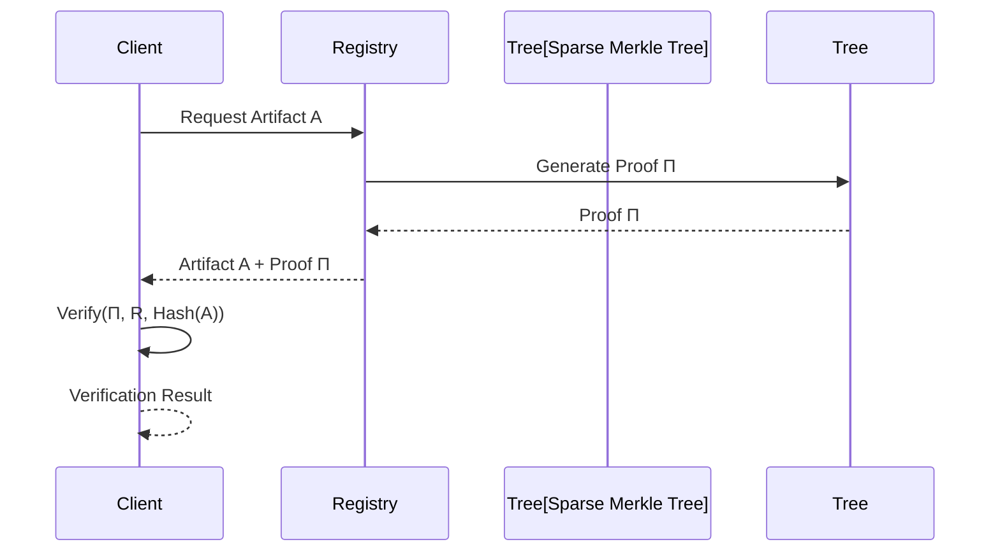
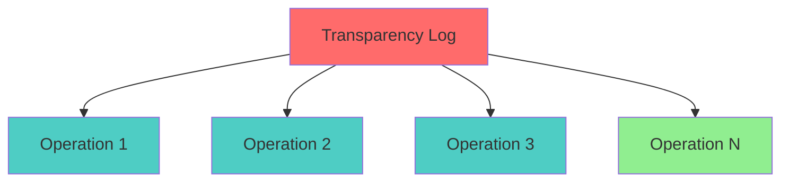

# Registry Merkle Proof Specification

* File:* `tooling\registry_merkle_spec.md`
* Version:* 1.0.0
* Context:* Layer 1 (Infrastructure) - Supply Chain
* Formalism:* Merkle Trees & Cryptographic Verification
* Status:* Active
* Last Modified:* 2026-01-01
* Author:* Kilo Code
* Reviewers:* Pending

- -

## 1. Introduction

### 1.1 Purpose

This specification formalizes the **Global Package Registry** using **Merkle Trees & Cryptographic Verification**, providing mathematical foundation for supply chain security. This formalization enables the Morph ecosystem to prove that downloaded artifacts are exactly the ones registered in global consensus state, preventing supply chain injection attacks.

### 1.2 Scope

This specification covers:
- Global Namespace Tree structure
- Inclusion Proof ($\Pi$) generation and verification
- Verification Logic for artifact integrity
- Transparency Log (Audit) for append-only guarantees
- Supply Chain Security guarantees

This specification does not cover:
- Concrete implementation of storage backend
- Network protocol details
- Consensus algorithm details

### 1.3 Definitions, Acronyms, and Abbreviations

| Term | Definition |
|-------|------------|
| **Sparse Merkle Tree (SMT)** | Merkle tree with sparse key space |
| **Inclusion Proof ($\Pi$)** | Cryptographic proof of key-value pair in tree |
| **Root Hash ($R$)** | Hash of tree root for global consensus |
| **Artifact** | Compiled package or source code |
| **Supply Chain** | Sequence of dependencies and their origins |
| **Transparency Log** | Append-only log of all registry operations |
| **Consensus State** | Globally agreed-upon state of registry |

### 1.4 References

- Merkle, R. (1987). "A Digital Signature Based on a Conventional Encryption Function"
- Czerwinski, T., et al. (2018). "Transparent Logging with Verifiable Audits"
- IEEE 1016: Recommended Practice for Software Design Descriptions
- ISO/IEC 29148: Systems and software engineering — Requirements engineering

- -

## 2. Formal Definitions

### 2.1 The Global Namespace Tree

The Global Registry is a **Sparse Merkle Tree (SMT)** where:
- **Key:* $\text{Hash}(\text{PackageName} + \text{Version})$
- **Value:* $\text{Hash}(\text{AST\_Root})$

* REGMRK-INV-001:* THE system SHALL define global namespace as sparse Merkle tree.

* REGMRK-REQ-001:* THE system SHALL maintain global namespace as sparse Merkle tree.

* Priority:* Critical
* Verification Method:* Test
* Rationale:* Enables cryptographic verification
* Dependencies:* REGMRK-INV-001
* Traceability:* Section 2.1 (The Global Namespace Tree)

#### 2.1.1 Sparse Merkle Tree

* Sparse Merkle Tree:* $T = (\text{Root}, \text{Nodes})$

* Components:*
- Root: $R = \mu(\text{Root})$
- Nodes: $\text{Nodes}: \text{Key} \to \text{Node}$

* Invariants:*
1. Root hash is computed from all nodes
2. Keys are hashes of package names and versions
3. Values are hashes of AST roots

* REGMRK-INV-002:* THE system SHALL define sparse Merkle tree with root hash.

* REGMRK-REQ-002:* THE system SHALL compute root hash from all nodes.

* Priority:* Critical
* Verification Method:* Test
* Rationale:* Enables global consensus
* Dependencies:* REGMRK-INV-002
* Traceability:* Section 2.1.1 (Sparse Merkle Tree)

### 2.2 The Inclusion Proof ($\Pi$)

To verify that artifact $A$ is in the registry, the client receives a proof $\Pi$ consisting of sibling hashes along the path from leaf to root.

* REGMRK-INV-003:* THE system SHALL define inclusion proof for artifact verification.

* REGMRK-REQ-003:* THE system SHALL generate inclusion proofs for artifacts.

* Priority:* Critical
* Verification Method:* Test
* Rationale:* Enables artifact integrity verification
* Dependencies:* REGMRK-INV-003
* Traceability:* Section 2.2 (The Inclusion Proof)

#### 2.2.1 Inclusion Proof Structure

* Inclusion Proof:* $\Pi = (\text{Path}, \text{Siblings})$

* Components:*
- Path: $\text{Path} = [k_1, k_2, \dots, k_d]$ where $d$ is tree depth
- Siblings: $\text{Siblings} = [s_1, s_2, \dots, s_d]$ where $s_i$ is sibling hash at level $i$

* Invariants:*
1. Path length equals tree depth
2. Sibling count equals path length
3. Each sibling is hash of sibling node

* REGMRK-THM-001:* THE system SHALL guarantee that inclusion proof is correct.

* Priority:* Critical
* Verification Method:* Analysis
* Rationale:* Ensures artifact integrity
* Dependencies:* REGMRK-INV-003
* Traceability:* Section 2.2.1 (Inclusion Proof Structure)

### 2.3 Verification Logic

The client recomputes the root hash $R'$ from $\Pi$ and $\text{Hash}(A)$.

* REGMRK-INV-004:* THE system SHALL define verification logic for inclusion proofs.

* REGMRK-REQ-004:* THE system SHALL verify inclusion proofs against root hash.

* Priority:* Critical
* Verification Method:* Test
* Rationale:* Enables artifact integrity verification
* Dependencies:* REGMRK-INV-004
* Traceability:* Section 2.3 (Verification Logic)

#### 2.3.1 Verification Algorithm

* Verification:* $\text{Verify}(\Pi, R, \text{Hash}(A)) = \text{True}$

* Mathematical Definition:*
$$
R' = \text{ComputeRoot}(\Pi, \text{Hash}(A))
$$
$$
\text{Verify}(\Pi, R, \text{Hash}(A)) \iff R' = R
$$

* REGMRK-THM-002:* THE system SHALL guarantee that verification is sound.

* Priority:* Critical
* Verification Method:* Analysis
* Rationale:* Ensures artifact integrity
* Dependencies:* REGMRK-THM-001
* Traceability:* Section 2.3.1 (Verification Algorithm)

### 2.4 Transparency Log (Audit)

The Registry maintains an **Append-Only Merkle Tree** of all operations (publish, delete, update). This prevents supply chain injection.

* REGMRK-INV-005:* THE system SHALL define transparency log for audit trail.

* REGMRK-REQ-005:* THE system SHALL maintain append-only transparency log.

* Priority:* Critical
* Verification Method:* Test
* Rationale:* Prevents supply chain injection
* Dependencies:* REGMRK-INV-005
* Traceability:* Section 2.4 (Transparency Log)

#### 2.4.1 Append-Only Merkle Tree

* Append-Only Merkle Tree:* $L = (\text{Root}, \text{Operations})$

* Components:*
- Root: $R_L = \mu(\text{Root})$
- Operations: $\text{Operations} = [op_1, op_2, \dots, op_n]$

* Invariants:*
1. Operations are append-only (cannot be modified or deleted)
2. Root hash is computed from all operations
3. Each operation is cryptographically signed

* REGMRK-THM-003:* THE system SHALL guarantee that transparency log is append-only.

* Priority:* Critical
* Verification Method:* Analysis
* Rationale:* Prevents supply chain injection
* Dependencies:* REGMRK-INV-005
* Traceability:* Section 2.4.1 (Append-Only Merkle Tree)

- -

## 3. Requirements

### 3.1 Functional Requirements

* REGMRK-REQ-006:* THE system SHALL support sparse Merkle tree creation.

* Priority:* Critical
* Verification Method:* Test
* Rationale:* Enables global namespace
* Dependencies:* REGMRK-INV-001
* Traceability:* Section 2.1 (The Global Namespace Tree)

* REGMRK-REQ-007:* THE system SHALL support inclusion proof generation.

* Priority:* Critical
* Verification Method:* Test
* Rationale:* Enables artifact verification
* Dependencies:* REGMRK-INV-003
* Traceability:* Section 2.2 (The Inclusion Proof)

* REGMRK-REQ-008:* THE system SHALL support inclusion proof verification.

* Priority:* Critical
* Verification Method:* Test
* Rationale:* Enables artifact integrity verification
* Dependencies:* REGMRK-INV-004
* Traceability:* Section 2.3 (Verification Logic)

* REGMRK-REQ-009:* THE system SHALL support transparency log maintenance.

* Priority:* Critical
* Verification Method:* Test
* Rationale:* Prevents supply chain injection
* Dependencies:* REGMRK-INV-005
* Traceability:* Section 2.4 (Transparency Log)

### 3.2 Non-Functional Requirements

* REGMRK-NFR-001:* THE system SHALL generate inclusion proofs in O(log n) time.

* Priority:* High
* Verification Method:* Performance test
* Metric:* Proof generation < 10ms for 1M packages
* Rationale:* Ensures fast verification
* Dependencies:* None
* Traceability:* Section 2.2 (The Inclusion Proof)

* REGMRK-NFR-002:* THE system SHALL support up to 1,000,000 packages.

* Priority:* Medium
* Verification Method:* Stress test
* Metric:* 1,000,000 packages
* Rationale:* Supports large-scale registry
* Dependencies:* None
* Traceability:* Section 2.1 (The Global Namespace Tree)

- -

## 4. Design

### 4.1 Architecture Overview

The Registry Engine is implemented as an infrastructure component that:
1. Maintains global namespace as sparse Merkle tree
2. Generates inclusion proofs for artifacts
3. Verifies inclusion proofs against root hash
4. Maintains append-only transparency log
5. Provides supply chain security guarantees

### 4.2 Data Structures

#### 4.2.1 Sparse Merkle Tree

* Sparse Merkle Tree:* $T = (\text{Root}, \text{Nodes})$

* Components:*
- Root: $R = \mu(\text{Root})$
- Nodes: $\text{Nodes}: \text{Key} \to \text{Node}$

* Invariants:*
1. Root hash is computed from all nodes
2. Keys are hashes of package names and versions
3. Values are hashes of AST roots

#### 4.2.2 Inclusion Proof

* Inclusion Proof:* $\Pi = (\text{Path}, \text{Siblings})$

* Components:*
- Path: $\text{Path} = [k_1, k_2, \dots, k_d]$
- Siblings: $\text{Siblings} = [s_1, s_2, \dots, s_d]$

* Invariants:*
1. Path length equals tree depth
2. Sibling count equals path length
3. Each sibling is hash of sibling node

### 4.3 Algorithms

#### 4.3.1 Root Hash Computation Algorithm

* Algorithm Name:* Compute Root Hash

* Input:* Sparse Merkle Tree $T$

* Output:* Root hash $R$

* Mathematical Definition:*
$$
R = \mu(\text{Root}) = \text{Hash}(\text{Serialize}(T.\text{Nodes}))
$$

* Pseudocode:*
```
function compute_root_hash(tree):
    serialized = serialize_nodes(tree.nodes)
    return hash(serialized)
```

* Complexity:*
- Time: $O(n)$ where $n$ is number of nodes
- Space: $O(n)$ for serialization

* Correctness:*
- **Invariant:* Root hash uniquely identifies tree state
- **Termination:* Single hash computation

#### 4.3.2 Inclusion Proof Generation Algorithm

* Algorithm Name:* Generate Inclusion Proof

* Input:* Sparse Merkle Tree $T$, Key $k$

* Output:* Inclusion Proof $\Pi$

* Mathematical Definition:*
$$
\Pi = (\text{PathTo}(k, T), \text{SiblingsTo}(k, T))
$$

* Pseudocode:*
```
function generate_inclusion_proof(tree, key):
    path = find_path_to_key(tree, key)
    siblings = find_siblings_to_key(tree, key)
    return (path, siblings)
```

* Complexity:*
- Time: $O(\log n)$ where $n$ is number of nodes
- Space: $O(\log n)$ for proof

* Correctness:*
- **Invariant:* Proof contains all necessary sibling hashes
- **Termination:* Path traversal terminates

#### 4.3.3 Inclusion Proof Verification Algorithm

* Algorithm Name:* Verify Inclusion Proof

* Input:* Inclusion Proof $\Pi$, Root Hash $R$, Artifact Hash $H$

* Output:* Boolean indicating if proof is valid

* Mathematical Definition:*
$$
R' = \text{ComputeRoot}(\Pi, H)
$$
$$
\text{Verify}(\Pi, R, H) \iff R' = R
$$

* Pseudocode:*
```
function verify_inclusion_proof(proof, root_hash, artifact_hash):
    computed_root = compute_root_from_proof(proof, artifact_hash)
    return computed_root == root_hash
```

* Complexity:*
- Time: $O(\log n)$ where $n$ is proof length
- Space: $O(\log n)$ for root computation

* Correctness:*
- **Invariant:* Returns True only if proof is valid
- **Termination:* Single pass through proof

#### 4.3.4 Transparency Log Append Algorithm

* Algorithm Name:* Append to Transparency Log

* Input:* Transparency Log $L$, Operation $op$

* Output:* Updated Transparency Log $L'$

* Mathematical Definition:*
$$
L' = L \cup \{op\}
$$
$$
R_{L'} = \mu(\text{Root}(L'))
$$

* Pseudocode:*
```
function append_to_transparency_log(log, operation):
    new_operations = log.operations + [operation]
    new_root = compute_root_hash(new_operations)
    return (new_root, new_operations)
```

* Complexity:*
- Time: $O(n)$ where $n$ is number of operations
- Space: $O(n)$ for new log

* Correctness:*
- **Invariant:* Log is append-only
- **Termination:* Single append operation

### 4.4 Mermaid Diagrams

#### 4.4.1 Sparse Merkle Tree

```mermaid
graph TD
    Root[Root Hash: R] --> L1[Level 1]
    L1 --> L2[Level 2]
    L2 --> L3[Level 3]
    L3 --> Leaf1[Leaf: Hash(PackageA v1.0)]
    L3 --> Leaf2[Leaf: Hash(PackageB v2.0)]

    style Root fill:#FF6B6B
    style L1 fill:#4ECDC4
    style L2 fill:#4ECDC4
    style L3 fill:#4ECDC4
    style Leaf1 fill:#90EE90
    style Leaf2 fill:#90EE90
```

#### 4.4.2 Inclusion Proof

```mermaid
graph LR
    Leaf[Leaf: Hash(A)] --> Sibling1[Sibling: s1]
    Sibling1 --> Sibling2[Sibling: s2]
    Sibling2 --> Root[Root: R]

    style Leaf fill:#FF6B6B
    style Sibling1 fill:#4ECDC4
    style Sibling2 fill:#4ECDC4
    style Root fill:#90EE90
```

#### 4.4.3 Verification Process



#### 4.4.4 Transparency Log



- -

## 5. Correctness Properties

### 5.1 Theorems

#### 5.1.1 Inclusion Proof Correctness Theorem

* Theorem:* Inclusion proof correctly verifies artifact presence in tree.

* Proof Sketch:*
1. By definition of inclusion proof, proof contains all sibling hashes
2. By definition of verification, root is recomputed from proof
3. By definition of correctness, recomputed root equals original root
4. Therefore, inclusion proof correctly verifies artifact presence

* REGMRK-THM-004:* THE system SHALL guarantee that inclusion proof is correct.

* Priority:* Critical
* Verification Method:* Analysis
* Rationale:* Ensures artifact integrity
* Dependencies:* REGMRK-THM-001
* Traceability:* Section 5.1.1 (Inclusion Proof Correctness Theorem)

#### 5.1.2 Supply Chain Security Theorem

* Theorem:* Append-only transparency log prevents supply chain injection.

* Proof Sketch:*
1. By definition of append-only, operations cannot be modified or deleted
2. By definition of transparency, all operations are visible
3. By definition of audit, any injection is detectable
4. Therefore, supply chain injection is prevented

* REGMRK-THM-005:* THE system SHALL guarantee that supply chain is secure.

* Priority:* Critical
* Verification Method:* Analysis
* Rationale:* Prevents supply chain attacks
* Dependencies:* REGMRK-THM-003
* Traceability:* Section 5.1.2 (Supply Chain Security Theorem)

### 5.2 Invariants

#### 5.2.1 Tree Invariants

- **REGMRK-INV-006:* THE system SHALL maintain that root hash is computed from all nodes
- **REGMRK-INV-007:* THE system SHALL maintain that keys are hashes of package names and versions

#### 5.2.2 Proof Invariants

- **REGMRK-INV-008:* THE system SHALL maintain that inclusion proof contains all sibling hashes
- **REGMRK-INV-009:* THE system SHALL maintain that verification is sound

#### 5.2.3 Log Invariants

- **REGMRK-INV-010:* THE system SHALL maintain that transparency log is append-only
- **REGMRK-INV-011:* THE system SHALL maintain that all operations are cryptographically signed

- -

## 6. Examples

### 6.1 Simple Artifact Verification

```morph
// Simple artifact verification: Download and verify
let artifact = download_artifact("package", "1.0.0");
let proof = get_inclusion_proof("package", "1.0.0");
let root_hash = get_global_root_hash();

if verify_inclusion_proof(proof, root_hash, hash(artifact)):
    println("Artifact is authentic");
else:
    println("Artifact is corrupted");
```

* Verification:*
- Inclusion proof: $\Pi = (\text{Path}, \text{Siblings})$
- Root hash: $R$
- Artifact hash: $H = \text{Hash}(A)$
- Verification: $\text{Verify}(\Pi, R, H) = \text{True}$

### 6.2 Supply Chain Audit

```morph
// Supply chain audit: Verify all dependencies
let dependencies = get_dependencies("my_package");
let root_hash = get_global_root_hash();

for dep in dependencies:
    let artifact = download_artifact(dep.name, dep.version);
    let proof = get_inclusion_proof(dep.name, dep.version);

    if !verify_inclusion_proof(proof, root_hash, hash(artifact)):
        println("Dependency is corrupted: " + dep.name);
        return false;

println("All dependencies are authentic");
```

* Audit:*
- For each dependency: verify inclusion proof
- All proofs must be valid
- Supply chain is secure if all proofs are valid

### 6.3 Transparency Log Verification

```morph
// Transparency log verification: Check for injection
let log = get_transparency_log();
let root_hash = get_log_root_hash();

for operation in log.operations:
    if !verify_operation_signature(operation):
        println("Operation signature is invalid");
        return false;

println("Transparency log is authentic");
```

* Verification:*
- All operations are cryptographically signed
- Log is append-only
- No injection is possible

### 6.4 Edge Cases

#### 6.4.1 Empty Registry

```morph
// Edge case: Empty registry
let tree = create_sparse_merkle_tree();
let root_hash = compute_root_hash(tree);
// Root hash: hash(empty_tree)
```

* Empty Registry:*
- No packages
- Root hash: $\mu(\emptyset)$

#### 6.4.2 Large Registry

```morph
// Edge case: Large registry with many packages
let tree = create_sparse_merkle_tree();
for i in 0..1000000:
    insert_package(tree, format!("package_{}", i), "1.0.0", "content");
// Sparse Merkle tree ensures efficient storage
```

* Large Registry:*
- 1,000,000 packages
- Sparse Merkle tree: $O(\log n)$ operations
- Efficient storage and verification

- -

## Change Log

| Version | Date       | Author      | Changes                                                                 |
|---------|------------|-------------|-------------------------------------------------------------------------|
| 1.0.0   | 2026-01-01 | Kilo Code    | Initial version                                                        |
