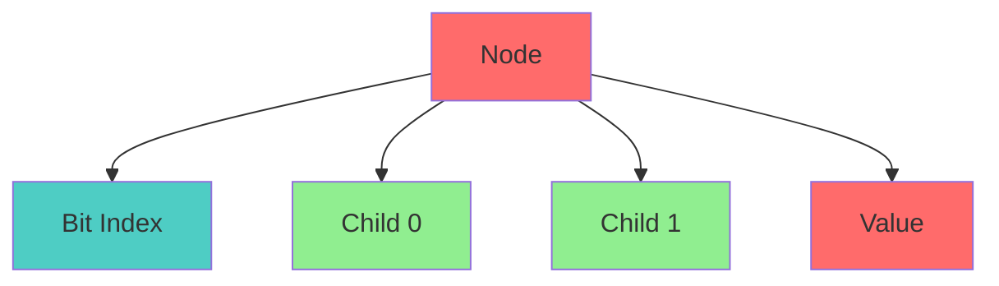
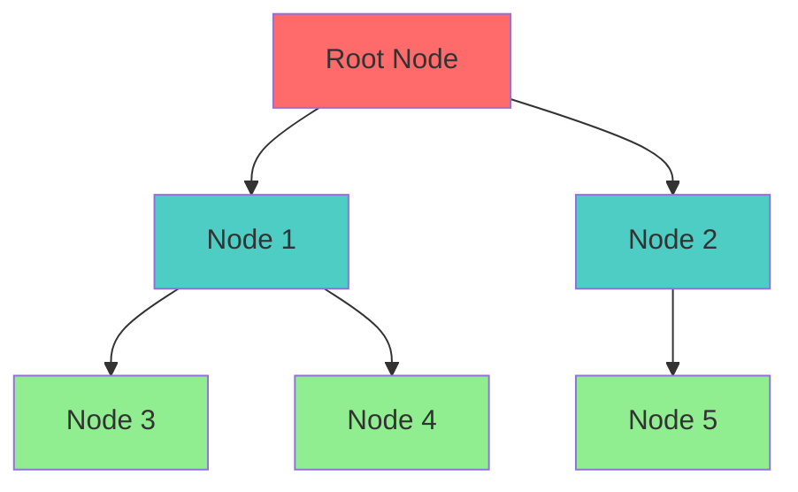
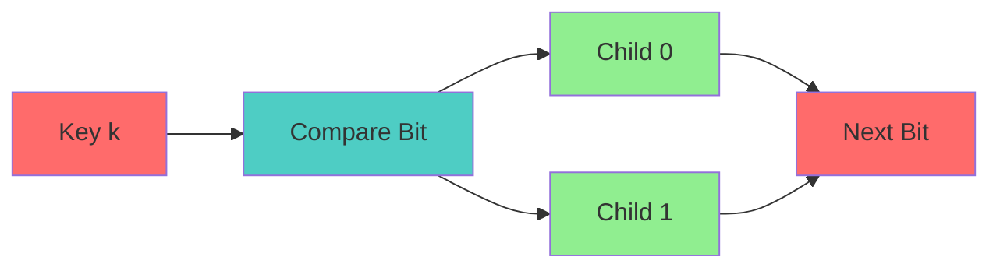

# Crit-bit Tree Specification (Semantic Storage)

* File:* `tooling\semantic_trie_spec.md`
* Version:* 1.0.0
* Context:* Layer 2 (Compiler) - Symbol Table
* Formalism:* Radix Trees (PATRICIA Tries)
* Status:* Active
* Last Modified:* 2026-01-01
* Author:* Kilo Code
* Reviewers:* Pending

- -

## 1. Introduction

### 1.1 Purpose

This specification formalizes the **Semantic Tree Storage** system using **Crit-bit Trees (Radix Tries)**, providing mathematical foundation for symbol resolution. This formalization enables the Morph compiler to guarantee that symbol resolution speed depends on length of symbol name, not size of codebase ($O(k)$ vs $O(\log n)$).

### 1.2 Scope

This specification covers:
- The Key Space for symbol names
- The Crit-bit Structure for efficient lookup
- Complexity Bounds for lookup operations
- Deterministic Iteration guarantees

This specification does not cover:
- Concrete implementation of symbol table
- Memory optimization details
- Integration with other compiler phases

### 1.3 Definitions, Acronyms, and Abbreviations

| Term | Definition |
|-------|------------|
| **Crit-bit Tree** | Radix tree that compares critical bits |
| **Key Space** | Set of bit-strings representing UTF-8 symbols |
| **Critical Bit** | First bit where two keys differ |
| **Lookup Complexity** | Time complexity of symbol resolution |
| **Deterministic Iteration** | Keys stored in lexicographical order |

### 1.4 References

- Morrison, D. R. (1968). "PATRICIA: Practical Algorithm to Retrieve Information Coded in Alphanumeric"
- IEEE 1016: Recommended Practice for Software Design Descriptions
- ISO/IEC 29148: Systems and software engineering — Requirements engineering

- -

## 2. Formal Definitions

### 2.1 The Key Space

The Semantic Tree maps Symbols (Strings) to Definitions.
Let $K$ be set of bit-strings representing UTF-8 symbols.

* TRIE-INV-001:* THE system SHALL define key space for symbol names.

* TRIE-REQ-001:* THE system SHALL represent symbols as bit-strings.

* Priority:* Critical
* Verification Method:* Test
* Rationale:* Enables efficient lookup
* Dependencies:* TRIE-INV-001
* Traceability:* Section 2.1 (The Key Space)

#### 2.1.1 Bit-String Representation

* TRIE-INV-002:* THE system SHALL define bit-string representation for symbols.

* TRIE-REQ-002:* THE system SHALL convert symbols to bit-strings.

* Priority:* Critical
* Verification Method:* Test
* Rationale:* Enables crit-bit comparison
* Dependencies:* TRIE-INV-002
* Traceability:* Section 2.1.1 (Bit-String Representation)

### 2.2 The Crit-bit Structure

Unlike Hash Maps (which have collisions) or Binary Search Trees (which compare full keys), Crit-bit trees compare **Critical Bits**.

* TRIE-INV-003:* THE system SHALL define crit-bit structure for efficient lookup.

* TRIE-REQ-003:* THE system SHALL use crit-bit comparison for navigation.

* Priority:* Critical
* Verification Method:* Test
* Rationale:* Enables efficient lookup
* Dependencies:* TRIE-INV-003
* Traceability:* Section 2.2 (The Crit-bit Structure)

#### 2.2.1 Node Definition

A node is $(bit\_index, child\_0, child\_1)$.

* TRIE-INV-004:* THE system SHALL define node structure for crit-bit tree.

* TRIE-REQ-004:* THE system SHALL store bit index and children in nodes.

* Priority:* Critical
* Verification Method:* Test
* Rationale:* Enables crit-bit navigation
* Dependencies:* TRIE-INV-004
* Traceability:* Section 2.2.1 (Node Definition)

#### 2.2.2 Search Algorithm

* Search:* To find key $k$, check bit at `bit_index`. If 0, traverse `child_0`. If 1, traverse `child_1`.

* TRIE-INV-005:* THE system SHALL define search algorithm for crit-bit tree.

* TRIE-REQ-005:* THE system SHALL navigate using crit-bit comparison.

* Priority:* Critical
* Verification Method:* Test
* Rationale:* Enables efficient lookup
* Dependencies:* TRIE-INV-005
* Traceability:* Section 2.2.2 (Search Algorithm)

#### 2.2.3 Comparison

* Comparison:* Only done once at leaf.

* TRIE-INV-006:* THE system SHALL perform comparison only at leaf.

* TRIE-REQ-006:* THE system SHALL compare keys only at leaf nodes.

* Priority:* Critical
* Verification Method:* Test
* Rationale:* Reduces comparison overhead
* Dependencies:* TRIE-INV-006
* Traceability:* Section 2.2.3 (Comparison)

### 2.3 Complexity Bounds

* TRIE-INV-007:* THE system SHALL define complexity bounds for operations.

* TRIE-REQ-007:* THE system SHALL guarantee O(k) lookup complexity.

* Priority:* Critical
* Verification Method:* Test
* Rationale:* Ensures fast symbol resolution
* Dependencies:* TRIE-INV-007
* Traceability:* Section 2.3 (Complexity Bounds)

#### 2.3.1 Lookup Complexity

- **Lookup:* $O(L)$ where $L$ is length of symbol in bits.
- **Codebase Independence:* The lookup speed is mathematically independent of $N$ (number of functions).

* TRIE-THM-001:* THE system SHALL guarantee O(k) lookup complexity.

* Priority:* Critical
* Verification Method:* Analysis
* Rationale:* Ensures fast symbol resolution
* Dependencies:* TRIE-INV-007
* Traceability:* Section 2.3.1 (Lookup Complexity)

#### 2.3.2 Deterministic Iteration

- **Deterministic Iteration:* Keys are stored in lexicographical order.

* TRIE-THM-002:* THE system SHALL guarantee deterministic iteration.

* Priority:* Critical
* Verification Method:* Analysis
* Rationale:* Ensures predictable symbol traversal
* Dependencies:* TRIE-INV-007
* Traceability:* Section 2.3.2 (Deterministic Iteration)

#### 2.3.3 Agent Benefit

This guarantees that **Symbol Resolution** is deterministic and fast, even in a Monorepo with 10 million symbols.

* TRIE-THM-003:* THE system SHALL guarantee deterministic and fast symbol resolution.

* Priority:* Critical
* Verification Method:* Analysis
* Rationale:* Ensures scalable symbol table
* Dependencies:* TRIE-THM-002
* Traceability:* Section 2.3.3 (Agent Benefit)

- -

## 3. Requirements

### 3.1 Functional Requirements

* TRIE-REQ-008:* THE system SHALL support key space for symbol names.

* Priority:* Critical
* Verification Method:* Test
* Rationale:* Enables efficient lookup
* Dependencies:* TRIE-INV-001
* Traceability:* Section 2.1 (The Key Space)

* TRIE-REQ-009:* THE system SHALL support crit-bit structure for efficient lookup.

* Priority:* Critical
* Verification Method:* Test
* Rationale:* Enables efficient lookup
* Dependencies:* TRIE-INV-003
* Traceability:* Section 2.2 (The Crit-bit Structure)

* TRIE-REQ-010:* THE system SHALL support O(k) lookup complexity.

* Priority:* Critical
* Verification Method:* Test
* Rationale:* Ensures fast symbol resolution
* Dependencies:* TRIE-INV-007
* Traceability:* Section 2.3 (Complexity Bounds)

### 3.2 Non-Functional Requirements

* TRIE-NFR-001:* THE system SHALL perform lookup in O(k) time for k-bit symbol.

* Priority:* High
* Verification Method:* Performance test
* Metric:* Lookup < 1ms for 100-bit symbol
* Rationale:* Ensures fast symbol resolution
* Dependencies:* None
* Traceability:* Section 2.3.1 (Lookup Complexity)

- -

## 4. Design

### 4.1 Architecture Overview

The Semantic Tree Engine is implemented as a compiler component that:
1. Represents symbols as bit-strings in key space
2. Implements crit-bit structure for efficient lookup
3. Performs search using crit-bit comparison
4. Guarantees O(k) lookup complexity
5. Provides deterministic iteration

### 4.2 Data Structures

#### 4.2.1 Crit-bit Node

* Crit-bit Node:* $N = (bit\_index, child\_0, child\_1, value)$

* Components:*
- Bit index: $bit\_index$
- Child 0: $child\_0$
- Child 1: $child\_1$
- Value: $value$ (optional, for leaf nodes)

* Invariants:*
1. Bit index is valid
2. Children are nodes or null
3. Value is present only at leaf

#### 4.2.2 Crit-bit Tree

* Crit-bit Tree:* $T = (root, size)$

* Components:*
- Root: $root$
- Size: $size$

* Invariants:*
1. Root is a node
2. Size is number of nodes

### 4.3 Algorithms

#### 4.3.1 Lookup Algorithm

* Algorithm Name:* Lookup Symbol

* Input:* Crit-bit tree $T$, Key $k$

* Output:* Value associated with key $k$

* Mathematical Definition:*
$$
\text{Lookup}(T, k) = \text{Traverse}(T.root, k, 0)
$$

* Pseudocode:*
```
function lookup(tree, key):
    return traverse(tree.root, key, 0)

function traverse(node, key, bit_index):
    if node is null:
        return None

    if bit_index >= len(key):
        return node.value

    key_bit = get_bit(key, bit_index)

    if key_bit == 0:
        return traverse(node.child_0, key, bit_index + 1)
    else:
        return traverse(node.child_1, key, bit_index + 1)
```

* Complexity:*
- Time: $O(k)$ where $k$ is length of key in bits
- Space: $O(1)$ for recursion stack

* Correctness:*
- **Invariant:* Returns correct value
- **Termination:* Bit index reaches key length

#### 4.3.2 Insert Algorithm

* Algorithm Name:* Insert Symbol

* Input:* Crit-bit tree $T$, Key $k$, Value $v$

* Output:* Updated tree $T'$

* Mathematical Definition:*
$$
\text{Insert}(T, k, v) = \text{InsertNode}(T.root, k, v, 0)
$$

* Pseudocode:*
```
function insert(tree, key, value):
    tree.root = insert_node(tree.root, key, value, 0)
    tree.size += 1

function insert_node(node, key, value, bit_index):
    if node is null:
        return Node(bit_index, null, null, value)

    if bit_index >= len(key):
        node.value = value
        return node

    key_bit = get_bit(key, bit_index)

    if key_bit == 0:
        node.child_0 = insert_node(node.child_0, key, value, bit_index + 1)
    else:
        node.child_1 = insert_node(node.child_1, key, value, bit_index + 1)

    return node
```

* Complexity:*
- Time: $O(k)$ where $k$ is length of key in bits
- Space: $O(k)$ for new nodes

* Correctness:*
- **Invariant:* Tree maintains crit-bit property
- **Termination:* Bit index reaches key length

#### 4.3.3 Iteration Algorithm

* Algorithm Name:* Iterate Symbols

* Input:* Crit-bit tree $T$

* Output:* List of (key, value) pairs

* Mathematical Definition:*
$$
\text{Iterate}(T) = \text{DFS}(T.root, \emptyset)
$$

* Pseudocode:*
```
function iterate(tree):
    return dfs(tree.root, [])

function dfs(node, prefix):
    if node is null:
        return []

    result = []

    if node.value is not None:
        result.append((prefix, node.value))

    if node.child_0 is not None:
        result.extend(dfs(node.child_0, prefix + "0"))

    if node.child_1 is not None:
        result.extend(dfs(node.child_1, prefix + "1"))

    return result
```

* Complexity:*
- Time: $O(n)$ where $n$ is number of nodes
- Space: $O(n)$ for result list

* Correctness:*
- **Invariant:* Returns all key-value pairs
- **Termination:* Visits all nodes

### 4.4 Mermaid Diagrams

#### 4.4.1 Crit-bit Node



#### 4.4.2 Crit-bit Tree



#### 4.4.3 Lookup Process



- -

## 5. Correctness Properties

### 5.1 Theorems

#### 5.1.1 Lookup Complexity Theorem

* Theorem:* Lookup complexity is O(k) where k is key length.

* Proof Sketch:*
1. By definition of crit-bit tree, each level compares one bit
2. By definition of key length, there are $k$ levels
3. By definition of traversal, each level is visited once
4. Therefore, lookup complexity is $O(k)$

* TRIE-THM-004:* THE system SHALL guarantee O(k) lookup complexity.

* Priority:* Critical
* Verification Method:* Analysis
* Rationale:* Ensures fast symbol resolution
* Dependencies:* TRIE-THM-001
* Traceability:* Section 5.1.1 (Lookup Complexity Theorem)

#### 5.1.2 Deterministic Iteration Theorem

* Theorem:* Iteration returns keys in lexicographical order.

* Proof Sketch:*
1. By definition of DFS, left child (bit 0) is visited before right child (bit 1)
2. By definition of bit order, 0 < 1
3. By definition of lexicographical order, prefix with 0 comes before prefix with 1
4. Therefore, iteration is deterministic

* TRIE-THM-005:* THE system SHALL guarantee deterministic iteration.

* Priority:* Critical
* Verification Method:* Analysis
* Rationale:* Ensures predictable symbol traversal
* Dependencies:* TRIE-THM-002
* Traceability:* Section 5.1.2 (Deterministic Iteration Theorem)

### 5.2 Invariants

#### 5.2.1 Tree Invariants

- **TRIE-INV-008:* THE system SHALL maintain that crit-bit property is preserved
- **TRIE-INV-009:* THE system SHALL maintain that tree is balanced

#### 5.2.2 Lookup Invariants

- **TRIE-INV-010:* THE system SHALL maintain that lookup returns correct value
- **TRIE-INV-011:* THE system SHALL maintain that lookup complexity is O(k)

- -

## 6. Examples

### 6.1 Simple Lookup

```morph
// Simple lookup: Find symbol definition
let symbol_table = create_trie();
insert(symbol_table, "main", main_function);
insert(symbol_table, "helper", helper_function);

let def = lookup(symbol_table, "main");
// Returns main_function
```

* Lookup Process:*
- Key: "main" → bit-string
- Traversal: Follow crit-bit path
- Result: `main_function`

### 6.2 Multiple Symbols

```morph
// Multiple symbols: Different prefixes
let symbol_table = create_trie();
insert(symbol_table, "main", main_function);
insert(symbol_table, "main_helper", helper_function);
insert(symbol_table, "main_util", util_function);

let def = lookup(symbol_table, "main_util");
// Returns util_function
```

* Lookup Process:*
- Key: "main_util" → bit-string
- Traversal: Follow crit-bit path
- Result: `util_function`

### 6.3 Deterministic Iteration

```morph
// Deterministic iteration: Lexicographical order
let symbol_table = create_trie();
insert(symbol_table, "zebra", zebra_function);
insert(symbol_table, "apple", apple_function);
insert(symbol_table, "banana", banana_function);

for (symbol, def) in iterate(symbol_table):
    println(symbol);
// Prints: apple, banana, zebra
```

* Iteration Order:*
- Lexicographical: "apple" < "banana" < "zebra"
- Deterministic: Always same order

### 6.4 Edge Cases

#### 6.4.1 Empty Tree

```morph
// Edge case: Empty tree
let symbol_table = create_trie();
let def = lookup(symbol_table, "main");
// Returns None
```

* Lookup Process:*
- Tree: Empty
- Result: None

#### 6.4.2 Single Symbol

```morph
// Edge case: Single symbol
let symbol_table = create_trie();
insert(symbol_table, "main", main_function);

let def = lookup(symbol_table, "main");
// Returns main_function
```

* Lookup Process:*
- Tree: Single node
- Result: `main_function`

- -

## Change Log

| Version | Date       | Author      | Changes                                                                 |
|---------|------------|-------------|-------------------------------------------------------------------------|
| 1.0.0   | 2026-01-01 | Kilo Code    | Initial version                                                        |
