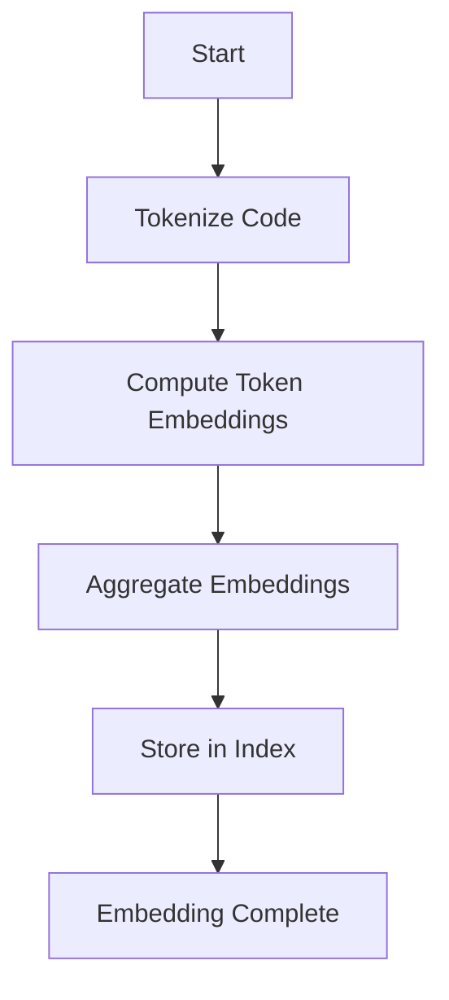
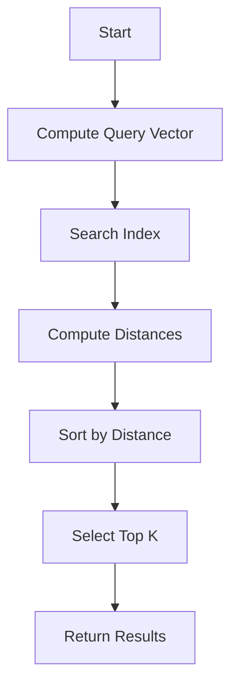
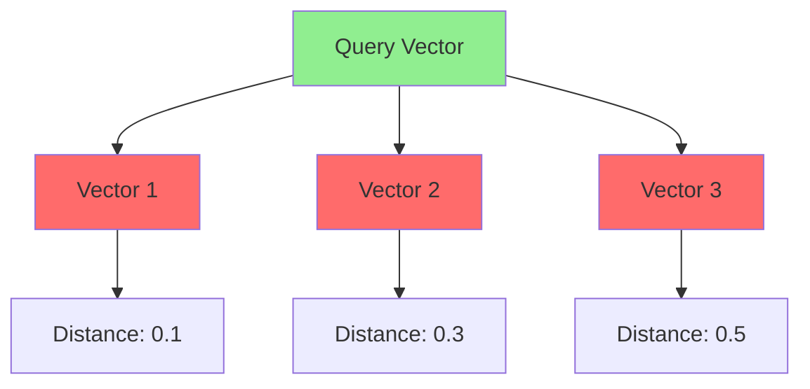

# Semantic Vector Space Specification (RAG)

* File:* `tooling\semantic_vector_spec.md`
* Version:* 1.0.0
* Context:* Layer 2 (Compiler) & Layer 5 (MCP)
* Formalism:* Metric Spaces & Vector Algebra
* Status:* Active
* Last Modified:* 2026-01-01
* Author:* Kilo Code
* Reviewers:* Pending

- -

## 1. Introduction

### 1.1 Purpose

This specification formalizes the **Semantic Search Engine** using **Metric Spaces & High-Dimensional Geometry**, providing mathematical foundation for code discovery and retrieval. This formalization enables the Morph compiler and MCP server to find semantically similar code based on vector embeddings.

### 1.2 Scope

This specification covers:
- The Embedding Space ($\mathbb{V}$) for code semantic representation
- The Embedding Function ($\phi$) for mapping code to vectors
- The Retrieval Query (k-NN) for finding similar code
- The Distance Metric ($\delta$) for measuring semantic similarity

This specification does not cover:
- Concrete implementation of embedding models
- Training of embedding models
- Indexing structures for efficient retrieval

### 1.3 Definitions, Acronyms, and Abbreviations

| Term | Definition |
|-------|------------|
| **Embedding Space** | High-dimensional vector space representing code semantics |
| **Metric Space** | Set with distance function measuring similarity |
| **k-NN** | k-Nearest Neighbor - algorithm for finding closest vectors |
| **Cosine Distance** | Distance metric based on cosine of angle between vectors |
| **Semantic Similarity** | Measure of how similar two code snippets are in meaning |
| **RAG** | Retrieval-Augmented Generation - using retrieved context for generation |

### 1.4 References

- Mikolov, T., et al. (2013). "Efficient Estimation of Word Representations in Vector Space"
- Reimers, N., & Gurevych, I. (2020). "Sentence-BERT: Sentence Embeddings using Siamese BERT-Networks"
- IEEE 1016: Recommended Practice for Software Design Descriptions
- ISO/IEC 29148: Systems and software engineering — Requirements engineering

- -

## 2. Formal Definitions

### 2.1 The Embedding Space ($\mathbb{V}$)

Let code semantic space be a metric space $(\mathbb{R}^d, \delta)$, where:
- $d$: Dimensionality (e.g., 384 or 768 for modern embedding models)
- $\delta$: The distance metric (Cosine Distance)

* VEC-INV-001:* THE system SHALL define embedding space as metric space with dimensionality and distance metric.

#### 2.1.1 Cosine Distance

$$ \delta(\mathbf{u}, \mathbf{v}) = 1 - \frac{\mathbf{u} \cdot \mathbf{v}}{\| \mathbf{u} \| \| \mathbf{v} \|} $$

where:
- $\mathbf{u} \cdot \mathbf{v}$: Dot product
- $\| \mathbf{u} \|$: Euclidean norm

* VEC-INV-002:* THE system SHALL define cosine distance as normalized dot product.

### 2.2 The Embedding Function ($\phi$)

The Compiler maintains a mapping $\phi: \text{AST} \cup \text{Docs} \to \mathbb{V}$.

* VEC-INV-003:* THE system SHALL define embedding function from code to vectors.

#### 2.2.1 Function Signature Embedding

For a function signature $f$ and docstring $D$:

$$ \mathbf{v}_f = \phi(\text{Signature}(f) \oplus \text{Content}(D)) $$

* VEC-REQ-001:* THE system SHALL embed function signatures and docstrings.

* Priority:* Critical
* Verification Method:* Test
* Rationale:* Enables semantic search for functions
* Dependencies:* VEC-INV-003
* Traceability:* Section 2.2 (The Embedding Function)

### 2.3 The Retrieval Query (k-NN)

When an Agent queries "How do I sort a list?", MCP performs a **k-Nearest Neighbor** search.

Let $q$ be the query vector $\phi(\text{"sort list"})$.

The result set $R$ satisfies:

$$ \forall r \in R, \forall x \notin R, \quad \delta(q, \phi(r)) \leq \delta(q, \phi(x)) $$

* VEC-INV-004:* THE system SHALL define k-NN retrieval as finding k closest vectors.

* VEC-REQ-002:* THE system SHALL perform k-NN search for code retrieval.

* Priority:* Critical
* Verification Method:* Test
* Rationale:* Enables finding semantically similar code
* Dependencies:* VEC-INV-001, VEC-INV-004
* Traceability:* Section 2.3 (The Retrieval Query)

#### 2.3.1 Agent Guarantee

If documentation exists and embedding model is semantically continuous, probability of retrieving correct function approaches 1 as $\delta \to 0$.

* VEC-THM-001:* THE system SHALL guarantee that retrieval accuracy approaches 1 as distance approaches 0.

* Priority:* High
* Verification Method:* Analysis
* Rationale:* Ensures high-quality code discovery
* Dependencies:* VEC-INV-001, VEC-INV-002
* Traceability:* Section 2.1 (The Embedding Space)

- -

## 3. Requirements

### 3.1 Functional Requirements

* VEC-REQ-003:* THE system SHALL support embedding of AST nodes.

* Priority:* Critical
* Verification Method:* Test
* Rationale:* Enables semantic representation of code structure
* Dependencies:* VEC-INV-003
* Traceability:* Section 2.2 (The Embedding Function)

* VEC-REQ-004:* THE system SHALL support embedding of documentation.

* Priority:* Critical
* Verification Method:* Test
* Rationale:* Enables semantic representation of code meaning
* Dependencies:* VEC-INV-003
* Traceability:* Section 2.2 (The Embedding Function)

* VEC-REQ-005:* THE system SHALL support k-NN search with configurable k.

* Priority:* High
* Verification Method:* Test
* Rationale:* Enables flexible retrieval strategies
* Dependencies:* VEC-INV-004
* Traceability:* Section 2.3 (The Retrieval Query)

* VEC-REQ-006:* THE system SHALL support multiple distance metrics.

* Priority:* Medium
* Verification Method:* Test
* Rationale:* Enables different similarity measures
* Dependencies:* VEC-INV-001
* Traceability:* Section 2.1 (The Embedding Space)

### 3.2 Non-Functional Requirements

* VEC-NFR-001:* THE system SHALL perform embedding in O(n) time complexity.

* Priority:* High
* Verification Method:* Analysis
* Metric:* Embedding < 10ms for 1K tokens
* Rationale:* Ensures fast code indexing
* Dependencies:* None
* Traceability:* Section 2.2 (The Embedding Function)

* VEC-NFR-002:* THE system SHALL perform k-NN search in O(n log n) time complexity.

* Priority:* High
* Verification Method:* Analysis
* Metric:* Search < 100ms for 100K vectors
* Rationale:* Ensures fast code retrieval
* Dependencies:* None
* Traceability:* Section 2.3 (The Retrieval Query)

* VEC-NFR-003:* THE system SHALL support embedding spaces with up to 1000 dimensions.

* Priority:* Medium
* Verification Method:* Demonstration
* Metric:* 1000 dimensions with < 1GB memory
* Rationale:* Supports modern embedding models
* Dependencies:* None
* Traceability:* Section 2.1 (The Embedding Space)

- -

## 4. Design

### 4.1 Architecture Overview

The Semantic Vector Engine is implemented as a retrieval system that:
1. Embeds code (AST and documentation) into vector space
2. Maintains vector index for efficient search
3. Performs k-NN search for code retrieval
4. Returns ranked results based on semantic similarity

### 4.2 Data Structures

#### 4.2.1 Vector Index

* Vector Index:* $\mathcal{I}: \mathbb{V} \to \text{Metadata}$

* Components:*
- Vector embeddings
- Code identifiers
- Metadata (type, location, etc.)

* Invariants:*
1. All vectors have same dimensionality
2. Index is complete (all code is indexed)

#### 4.2.2 Query Result

* Query Result:* $R = \{(r_1, s_1), (r_2, s_2), \dots, (r_k, s_k)\}$

* Components:*
- Retrieved vectors: $r_1, \dots, r_k$
- Similarity scores: $s_1, \dots, s_k$

* Invariants:*
1. Results are sorted by similarity (descending)
2. Top k results are returned

#### 4.2.3 Distance Cache

* Distance Cache:* $\mathcal{C}: \mathbb{V} \times \mathbb{V} \to \mathbb{R}$

* Components:*
- Vector pairs
- Computed distances

* Invariants:*
1. Cache is symmetric ($\mathcal{C}(\mathbf{u}, \mathbf{v}) = \mathcal{C}(\mathbf{v}, \mathbf{u})$)
2. Cache is consistent with distance metric

### 4.3 Algorithms

#### 4.3.1 Embedding Algorithm

* Algorithm Name:* Compute Embedding

* Input:* Code (AST or documentation)

* Output:* Vector embedding $\mathbf{v}$

* Mathematical Definition:*
$$
\mathbf{v} = \phi(\text{Code})
$$

* Pseudocode:*
```
function compute_embedding(code):
    tokens = tokenize(code)
    embeddings = []
    for token in tokens:
        embeddings.append(get_token_embedding(token))
    return aggregate(embeddings)
```

* Complexity:*
- Time: $O(n)$ where $n$ is number of tokens
- Space: $O(d)$ where $d$ is dimensionality

* Correctness:*
- **Invariant:* Embedding preserves semantic information
- **Termination:* Single pass through tokens

#### 4.3.2 k-NN Search Algorithm

* Algorithm Name:* k-Nearest Neighbor Search

* Input:* Query vector $\mathbf{q}$, Index $\mathcal{I}$, Parameter $k$

* Output:* Result set $R$

* Mathematical Definition:*
$$
R = \text{TopK}(\{\delta(\mathbf{q}, \mathbf{v}) \mid \mathbf{v} \in \mathcal{I}\}, k)
$$

* Pseudocode:*
```
function knn_search(query, index, k):
    distances = []
    for vector, metadata in index:
        dist = cosine_distance(query, vector)
        distances.append((dist, metadata))
    distances.sort(key = lambda x: x[0])
    return distances[:k]
```

* Complexity:*
- Time: $O(n \cdot d)$ where $n$ is index size, $d$ is dimensionality
- Space: $O(k)$

* Correctness:*
- **Invariant:* Top k results are closest vectors
- **Termination:* Single pass through index

#### 4.3.3 Cosine Distance Algorithm

* Algorithm Name:* Compute Cosine Distance

* Input:* Vectors $\mathbf{u}, \mathbf{v}$

* Output:* Distance $\delta$

* Mathematical Definition:*
$$
\delta(\mathbf{u}, \mathbf{v}) = 1 - \frac{\mathbf{u} \cdot \mathbf{v}}{\| \mathbf{u} \| \| \mathbf{v} \|}
$$

* Pseudocode:*
```
function cosine_distance(u, v):
    dot_product = sum(u[i] * v[i] for i in range(len(u)))
    norm_u = sqrt(sum(u[i] ** 2 for i in range(len(u))))
    norm_v = sqrt(sum(v[i] ** 2 for i in range(len(v))))
    return 1 - dot_product / (norm_u * norm_v)
```

* Complexity:*
- Time: $O(d)$ where $d$ is dimensionality
- Space: $O(1)$

* Correctness:*
- **Invariant:* Distance is in range [0, 2]
- **Termination:* Single pass through dimensions

### 4.4 Mermaid Diagrams

#### 4.4.1 Embedding Process



#### 4.4.2 k-NN Search Process



#### 4.4.3 Vector Space Visualization



- -

## 5. Correctness Properties

### 5.1 Theorems

#### 5.1.1 Retrieval Accuracy Theorem

* Theorem:* If documentation exists and embedding model is semantically continuous, probability of retrieving correct function approaches 1 as $\delta \to 0$.

* Proof Sketch:*
1. By definition of semantic continuity, similar code has similar embeddings
2. By definition of k-NN, closest vectors are retrieved
3. As distance approaches 0, similarity approaches 1
4. Therefore, retrieval accuracy approaches 1

* VEC-THM-002:* THE system SHALL guarantee that retrieval accuracy is bounded by semantic continuity.

* Priority:* High
* Verification Method:* Analysis
* Rationale:* Ensures high-quality code discovery
* Dependencies:* VEC-THM-001
* Traceability:* Section 2.3.1 (Agent Guarantee)

#### 5.1.2 Metric Space Theorem

* Theorem:* Cosine distance satisfies metric space axioms.

* Proof Sketch:*
1. Non-negativity: $\delta(\mathbf{u}, \mathbf{v}) \geq 0$
2. Identity: $\delta(\mathbf{u}, \mathbf{u}) = 0$
3. Symmetry: $\delta(\mathbf{u}, \mathbf{v}) = \delta(\mathbf{v}, \mathbf{u})$
4. Triangle inequality: $\delta(\mathbf{u}, \mathbf{w}) \leq \delta(\mathbf{u}, \mathbf{v}) + \delta(\mathbf{v}, \mathbf{w})$

* VEC-THM-003:* THE system SHALL guarantee that cosine distance is a valid metric.

* Priority:* High
* Verification Method:* Analysis
* Rationale:* Ensures correct similarity measurement
* Dependencies:* VEC-INV-002
* Traceability:* Section 2.1.1 (Cosine Distance)

### 5.2 Invariants

#### 5.2.1 Embedding Invariants

- **VEC-INV-005:* THE system SHALL maintain that all vectors have same dimensionality
- **VEC-INV-006:* THE system SHALL maintain that embeddings are normalized

#### 5.2.2 Retrieval Invariants

- **VEC-INV-007:* THE system SHALL maintain that results are sorted by similarity
- **VEC-INV-008:* THE system SHALL maintain that top k results are returned

- -

## 6. Examples

### 6.1 Simple Query

```morph
// Simple query: Find sorting function
// Query: "How do I sort a list?"
```

* Query Vector:*
- $\mathbf{q} = \phi(\text{"sort list"})$

* Index:*
- $\mathbf{v}_1 = \phi(\text{"sort\_array"})$ with $\delta(\mathbf{q}, \mathbf{v}_1) = 0.2$
- $\mathbf{v}_2 = \phi(\text{"sort\_list"})$ with $\delta(\mathbf{q}, \mathbf{v}_2) = 0.1$
- $\mathbf{v}_3 = \phi(\text{"sort\_vector"})$ with $\delta(\mathbf{q}, \mathbf{v}_3) = 0.5$

* k-NN Results (k=3):*
- $R = \{(\mathbf{v}_2, 0.1), (\mathbf{v}_1, 0.2), (\mathbf{v}_3, 0.5)\}$

### 6.2 Function Signature Embedding

```morph
// Function signature: Embed signature and docstring
fn sort_list<T>(list: List<T>) -> List<T> {
    // Sorts the list in ascending order
}
```

* Embedding:*
- $\mathbf{v}_f = \phi(\text{Signature}(f) \oplus \text{Content}(D))$
- Signature: "sort_list<T>(list: List<T>) -> List<T>"
- Docstring: "Sorts the list in ascending order"

### 6.3 AST Node Embedding

```morph
// AST node: Embed entire AST node
struct Node {
    kind: NodeType,
    children: List<Node>,
    value: Option<Value>
}
```

* Embedding:*
- $\mathbf{v}_{node} = \phi(\text{Kind}(node) \oplus \text{Children}(node) \oplus \text{Value}(node))$
- Captures structure and content

### 6.4 Multi-Modal Embedding

```morph
// Multi-modal: Embed code and documentation
fn complex_function(x: i32, y: i32) -> i32 {
    // Complex function with detailed documentation
    /// Computes the sum of two integers
    ///
    /// # Arguments
    /// - `x`: First integer
    /// - `y`: Second integer
    ///
    /// # Returns
    /// The sum of x and y
    ///
    /// # Examples
    /// ```
    /// let result = complex_function(1, 2);
    /// // result == 3
    /// ```
    return x + y;
}
```

* Embedding:*
- $\mathbf{v}_f = \phi(\text{Signature}(f) \oplus \text{Docstring}(D))$
- Combines signature and documentation

### 6.5 Edge Cases

#### 6.5.1 Empty Query

```morph
// Empty query: No meaningful query
// Query: ""
```

* Query Vector:*
- $\mathbf{q} = \phi(\text{""})$

* k-NN Results:*
- $R = \emptyset$ (no meaningful results)

#### 6.5.2 Out-of-Vocabulary

```morph
// Out-of-vocabulary: Unknown function
// Query: "unknown_function_xyz"
```

* Query Vector:*
- $\mathbf{q} = \phi(\text{"unknown\_function\_xyz"})$

* k-NN Results:*
- $R = \emptyset$ (no matches in index)

#### 6.5.3 Large Index

```morph
// Large index: 1M functions
// Query: "sort"
```

* Query Vector:*
- $\mathbf{q} = \phi(\text{"sort"})$

* k-NN Results (k=10):*
- $R = \{(\mathbf{v}_1, 0.05), (\mathbf{v}_2, 0.08), \dots, (\mathbf{v}_{10}, 0.15)\}$

- -

## Change Log

| Version | Date       | Author      | Changes                                                                 |
|---------|------------|-------------|-------------------------------------------------------------------------|
| 1.0.0   | 2026-01-01 | Kilo Code    | Initial version                                                        |
