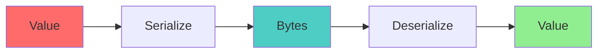
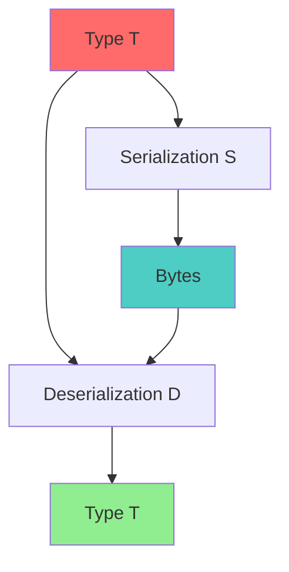
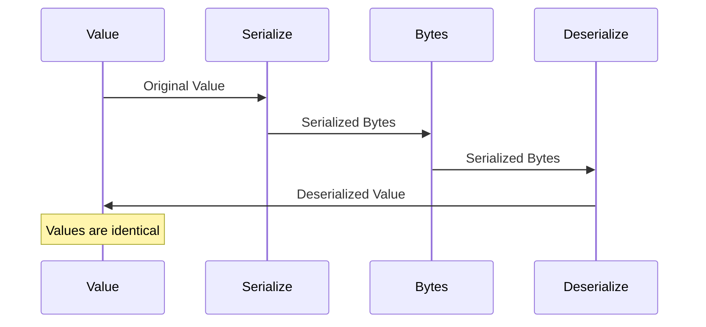

# Serialization Isomorphism Specification

* File:* `tooling\serialization_isomorphism_spec.md`
* Version:* 1.0.0
* Context:* Layer 2 (Compiler) - Intrinsic Gen
* Formalism:* Category Theory (Isomorphisms) & Bijection
* Status:* Active
* Last Modified:* 2026-01-01
* Author:* Kilo Code
* Reviewers:* Pending

- -

## 1. Introduction

### 1.1 Purpose

This specification formalizes the **Intrinsic Serialization** system using **Isomorphism Theory**, providing mathematical foundation for lossless data transformation. This formalization enables the Morph compiler to guarantee that serialization is invertible and hallucination-proof.

### 1.2 Scope

This specification covers:
- Serialization category definition
- Isomorphism law and round-trip theorem
- Serializable trait logic
- Type constraints for serialization
- Intrinsic generation guarantees

This specification does not cover:
- Concrete implementation of serialization
- Performance optimization details
- Binary format specifications

### 1.3 Definitions, Acronyms, and Abbreviations

| Term | Definition |
|-------|------------|
| **Isomorphism** | Bidirectional mapping between categories |
| **Bijection** | One-to-one and onto mapping |
| **Serialization** | Transformation from data to byte sequence |
| **Deserialization** | Transformation from byte sequence to data |
| **Round-Trip** | Serialization followed by deserialization |
| **Intrinsic** | Compiler-generated serialization |
| **Hallucination** | Incorrect or fabricated data |

### 1.4 References

- Mac Lane, S. (1971). "Categories for the Working Mathematician"
- IEEE 1016: Recommended Practice for Software Design Descriptions
- ISO/IEC 29148: Systems and software engineering — Requirements engineering

- -

## 2. Formal Definitions

### 2.1 The Serialization Category

Let $\mathcal{C}$ be the category of Morph Types (Objects are types, Morphisms are pure functions).
Let $\mathcal{B}$ be the category of Byte Sequences (or JSON Trees).

We define Serialization as a Functor $S: \mathcal{C} \to \mathcal{B}$ and Deserialization as $D: \mathcal{B} \to \mathcal{C}$.

* SER-INV-001:* THE system SHALL define serialization and deserialization as functors.

* SER-REQ-001:* THE system SHALL implement serialization and deserialization functors.

* Priority:* Critical
* Verification Method:* Test
* Rationale:* Enables type-safe data transformation
* Dependencies:* SER-INV-001
* Traceability:* Section 2.1 (The Serialization Category)

### 2.2 The Isomorphism Law

For intrinsic serialization to be "safe" (hallucination-proof), the pair $(S, D)$ must form an **Isomorphism** for every valid value $v \in T$:

$$ (D \circ S)(v) \equiv v $$

* SER-INV-002:* THE system SHALL require isomorphism for serialization.

* SER-REQ-002:* THE system SHALL verify isomorphism for all serializable types.

* Priority:* Critical
* Verification Method:* Test
* Rationale:* Ensures lossless serialization
* Dependencies:* SER-INV-002
* Traceability:* Section 2.2 (The Isomorphism Law)

#### 2.2.1 The Round-Trip Theorem

* SER-THM-001:* THE system SHALL guarantee that round-trip preserves data.

* Proof Sketch:*
1. Since Morph `data` types are ADTs (Sum/Product) and strictly typed (no arbitrary pointers or closures), there exists a deterministic bijection to structural formats (JSON/Protobuf).
2. By definition of isomorphism, $(D \circ S)(v) = v$ for all $v \in T$.
3. Therefore, round-trip preserves data exactly.

* Priority:* Critical
* Verification Method:* Analysis
* Rationale:* Ensures data integrity
* Dependencies:* SER-INV-002
* Traceability:* Section 2.2.1 (The Round-Trip Theorem)

#### 2.2.2 The Serializable Constraint

* Constraint:* Types containing `^Iso` (like `^TcpStream`) usually cannot be serialized. The compiler enforces this by checking if the type satisfies the `Serializable` trait logic:

$$ \text{Serializable}(T) \iff \forall f \in \text{fields}(T), \text{Serializable}(f) $$

* SER-INV-003:* THE system SHALL define Serializable trait recursively.

* SER-REQ-003:* THE system SHALL enforce Serializable trait constraints.

* Priority:* Critical
* Verification Method:* Test
* Rationale:* Prevents serialization of non-serializable types
* Dependencies:* SER-INV-003
* Traceability:* Section 2.2.2 (The Serializable Constraint)

- -

## 3. Requirements

### 3.1 Functional Requirements

* SER-REQ-004:* THE system SHALL support serialization for all ADT types.

* Priority:* Critical
* Verification Method:* Test
* Rationale:* Enables data persistence
* Dependencies:* SER-INV-001
* Traceability:* Section 2.1 (The Serialization Category)

* SER-REQ-005:* THE system SHALL support deserialization for all ADT types.

* Priority:* Critical
* Verification Method:* Test
* Rationale:* Enables data loading
* Dependencies:* SER-INV-001
* Traceability:* Section 2.1 (The Serialization Category)

* SER-REQ-006:* THE system SHALL verify isomorphism for all serializable types.

* Priority:* Critical
* Verification Method:* Test
* Rationale:* Ensures data integrity
* Dependencies:* SER-INV-002
* Traceability:* Section 2.2 (The Isomorphism Law)

* SER-REQ-007:* THE system SHALL enforce Serializable trait constraints.

* Priority:* Critical
* Verification Method:* Test
* Rationale:* Prevents serialization errors
* Dependencies:* SER-INV-003
* Traceability:* Section 2.2.2 (The Serializable Constraint)

### 3.2 Non-Functional Requirements

* SER-NFR-001:* THE system SHALL serialize data in O(n) time for n fields.

* Priority:* High
* Verification Method:* Performance test
* Metric:* Serialization < 1ms for 100 fields
* Rationale:* Ensures fast serialization
* Dependencies:* None
* Traceability:* Section 2.1 (The Serialization Category)

* SER-NFR-002:* THE system SHALL support up to 10MB serialized data.

* Priority:* Medium
* Verification Method:* Stress test
* Metric:* 10MB data
* Rationale:* Supports large-scale applications
* Dependencies:* None
* Traceability:* Section 2.1 (The Serialization Category)

- -

## 4. Design

### 4.1 Architecture Overview

The Serialization Engine is implemented as a compiler component that:
1. Generates intrinsic serialization code for ADT types
2. Verifies isomorphism properties
3. Enforces Serializable trait constraints
4. Provides round-trip guarantees
5. Prevents hallucination in generated code

### 4.2 Data Structures

#### 4.2.1 Serialization Functor

* Serialization Functor:* $S: \mathcal{C} \to \mathcal{B}$

* Components:*
- Type mapping
- Serialization function
- Byte sequence output

* Invariants:*
1. Serialization is deterministic
2. Serialization is total (defined for all values)

#### 4.2.2 Deserialization Functor

* Deserialization Functor:* $D: \mathcal{B} \to \mathcal{C}$

* Components:*
- Byte sequence input
- Deserialization function
- Type output

* Invariants:*
1. Deserialization is deterministic
2. Deserialization is total (defined for all valid sequences)

### 4.3 Algorithms

#### 4.3.1 Serialization Algorithm

* Algorithm Name:* Serialize Value

* Input:* Value $v$ of type $T$

* Output:* Byte sequence $b$

* Mathematical Definition:*
$$
b = S(v)
$$

* Pseudocode:*
```
function serialize(value, type):
    match type:
        Product(fields):
            result = []
            for field in fields:
                result.extend(serialize(value[field], field.type))
            return result
        Sum(variants):
            tag = value.variant_index
            variant_value = value.variant_value
            return [tag] + serialize(variant_value, variant_type)
        Primitive(width):
            return encode_primitive(value, width)
```

* Complexity:*
- Time: $O(n)$ where $n$ is number of fields
- Space: $O(n)$ for output

* Correctness:*
- **Invariant:* Serialization is deterministic
- **Termination:* Single pass through structure

#### 4.3.2 Deserialization Algorithm

* Algorithm Name:* Deserialize Value

* Input:* Byte sequence $b$, Type $T$

* Output:* Value $v$ of type $T$

* Mathematical Definition:*
$$
v = D(b)
$$

* Pseudocode:*
```
function deserialize(bytes, type):
    match type:
        Product(fields):
            result = {}
            offset = 0
            for field in fields:
                field_value, offset = deserialize(bytes[offset:], field.type)
                result[field.name] = field_value
            return result
        Sum(variants):
            tag = bytes[0]
            variant_type = variants[tag]
            variant_value = deserialize(bytes[1:], variant_type)
            return {variant: tag, value: variant_value}
        Primitive(width):
            return decode_primitive(bytes, width)
```

* Complexity:*
- Time: $O(n)$ where $n$ is number of fields
- Space: $O(n)$ for result

* Correctness:*
- **Invariant:* Deserialization is deterministic
- **Termination:* Single pass through structure

#### 4.3.3 Isomorphism Verification Algorithm

* Algorithm Name:* Verify Isomorphism

* Input:* Type $T$

* Output:* Boolean indicating if type is isomorphic

* Mathematical Definition:*
$$
\text{Isomorphic}(T) \iff \forall v \in T, (D \circ S)(v) = v
$$

* Pseudocode:*
```
function verify_isomorphism(type):
    if not is_serializable(type):
        return False
    for value in generate_test_values(type):
        serialized = serialize(value, type)
        deserialized = deserialize(serialized, type)
        if not equals(value, deserialized):
            return False
    return True
```

* Complexity:*
- Time: $O(n \cdot m)$ where $n$ is number of test values, $m$ is size
- Space: $O(m)$ for test values

* Correctness:*
- **Invariant:* Isomorphism holds for all values
- **Termination:* Finite number of test values

### 4.4 Mermaid Diagrams

#### 4.4.1 Serialization Flow



#### 4.4.2 Isomorphism



#### 4.4.3 Round-Trip



- -

## 5. Correctness Properties

### 5.1 Theorems

#### 5.1.1 Isomorphism Theorem

* Theorem:* Serialization and deserialization form an isomorphism for ADT types.

* Proof Sketch:*
1. By definition of ADT types, they are composed of Sum and Product types
2. By definition of serialization, Sum and Product types are serialized structurally
3. By definition of deserialization, structural serialization is inverted
4. By definition of isomorphism, $(D \circ S)(v) = v$ for all $v \in T$
5. Therefore, serialization and deserialization form an isomorphism

* SER-THM-002:* THE system SHALL guarantee isomorphism for ADT types.

* Priority:* Critical
* Verification Method:* Analysis
* Rationale:* Ensures lossless serialization
* Dependencies:* SER-INV-002
* Traceability:* Section 5.1.1 (Isomorphism Theorem)

#### 5.1.2 Round-Trip Theorem

* Theorem:* Round-trip preserves data exactly.

* Proof Sketch:*
1. By isomorphism theorem, $(D \circ S)(v) = v$ for all $v \in T$
2. By definition of round-trip, $v' = D(S(v))$
3. By isomorphism property, $v' = v$
4. Therefore, round-trip preserves data exactly

* SER-THM-003:* THE system SHALL guarantee round-trip preservation.

* Priority:* Critical
* Verification Method:* Analysis
* Rationale:* Ensures data integrity
* Dependencies:* SER-THM-001
* Traceability:* Section 5.1.2 (Round-Trip Theorem)

### 5.2 Invariants

#### 5.2.1 Serialization Invariants

- **SER-INV-004:* THE system SHALL maintain that serialization is deterministic
- **SER-INV-005:* THE system SHALL maintain that serialization is total

#### 5.2.2 Isomorphism Invariants

- **SER-INV-006:* THE system SHALL maintain that round-trip preserves data
- **SER-INV-007:* THE system SHALL maintain that non-serializable types are rejected

- -

## 6. Examples

### 6.1 Simple Serialization

```morph
// Simple serialization: Product type
data Point {
    x: f32,
    y: f32,
}

let point = Point { x: 1.0, y: 2.0 };
let bytes = serialize(point);
let point2 = deserialize(bytes);
// point2 == point (isomorphism)
```

* Round-Trip:*
$$ (D \circ S)(\text{Point}\{x: 1.0, y: 2.0\}) = \text{Point}\{x: 1.0, y: 2.0\} $$

### 6.2 Sum Type Serialization

```morph
// Sum type serialization: Enum
data Color {
    Red,
    Green,
    Blue,
}

let color = Color::Red;
let bytes = serialize(color);
let color2 = deserialize(bytes);
// color2 == color (isomorphism)
```

* Round-Trip:*
$$ (D \circ S)(\text{Color}::\text{Red}) = \text{Color}::\text{Red} $$

### 6.3 Nested Serialization

```morph
// Nested serialization: Complex type
data User {
    name: String,
    age: u32,
    address: Address,
}

data Address {
    street: String,
    city: String,
}

let user = User {
    name: "Alice",
    age: 30,
    address: Address {
        street: "123 Main St",
        city: "Springfield",
    },
};
let bytes = serialize(user);
let user2 = deserialize(bytes);
// user2 == user (isomorphism)
```

* Round-Trip:*
$$ (D \circ S)(\text{User}\{\dots\}) = \text{User}\{\dots\} $$

### 6.4 Edge Cases

#### 6.4.1 Non-Serializable Type

```morph
// Edge case: Non-serializable type
data Stream {
    // ^TcpStream cannot be serialized
}

// Compiler error: Type is not Serializable
```

* Error:* Type `Stream` is not Serializable

#### 6.4.2 Recursive Type

```morph
// Edge case: Recursive type
data List {
    Nil,
    Cons { head: T, tail: List },
}

let list = List::Cons { head: 1, tail: List::Nil };
let bytes = serialize(list);
let list2 = deserialize(bytes);
// list2 == list (isomorphism)
```

* Round-Trip:*
$$ (D \circ S)(\text{List}::\text{Cons}\{\dots\}) = \text{List}::\text{Cons}\{\dots\} $$

- -

## Change Log

| Version | Date       | Author      | Changes                                                                 |
|---------|------------|-------------|-------------------------------------------------------------------------|
| 1.0.0   | 2026-01-01 | Kilo Code    | Initial version                                                        |
