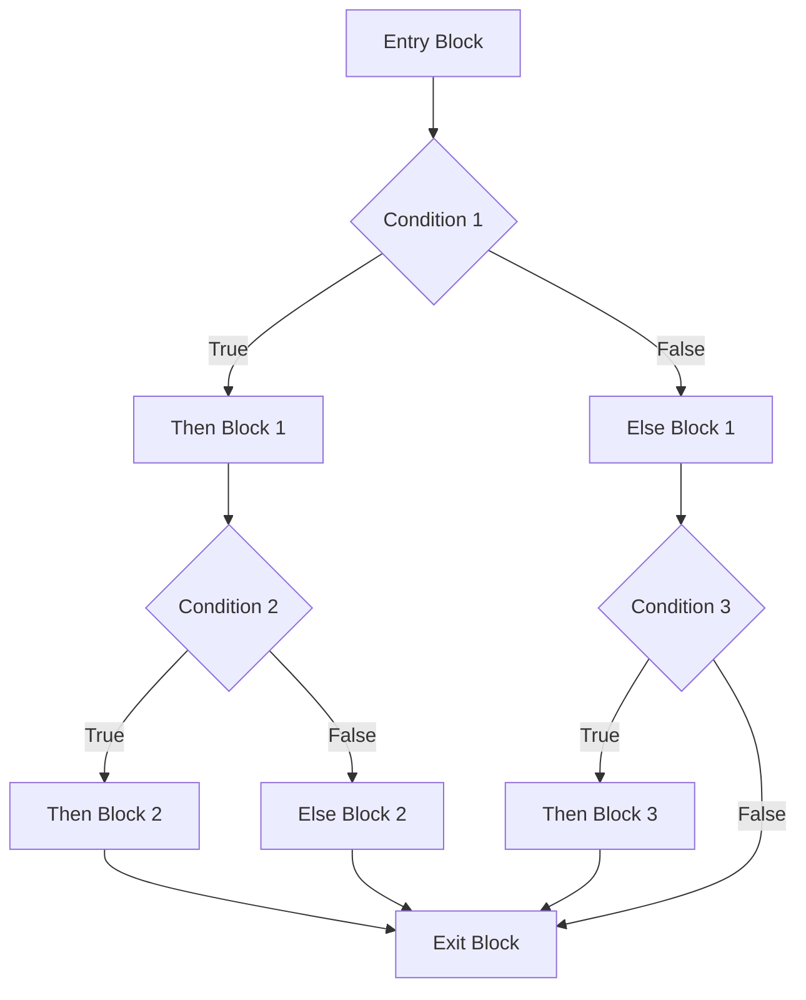
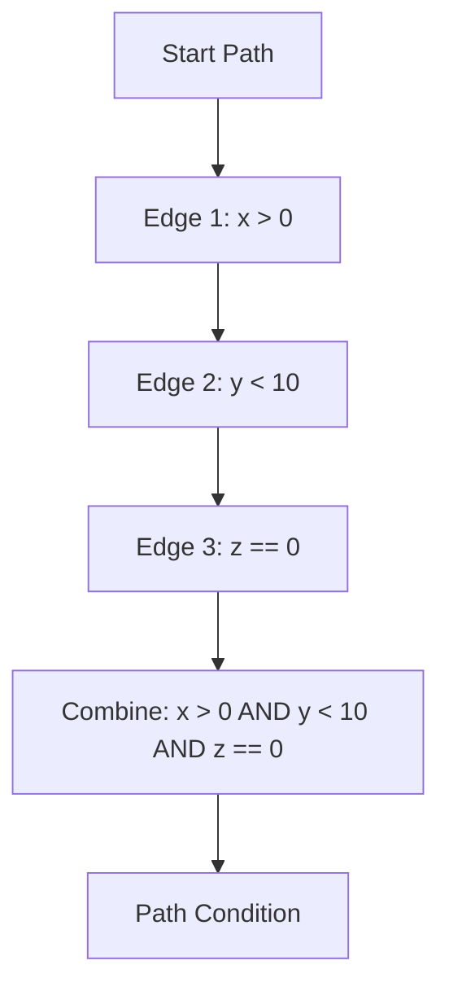
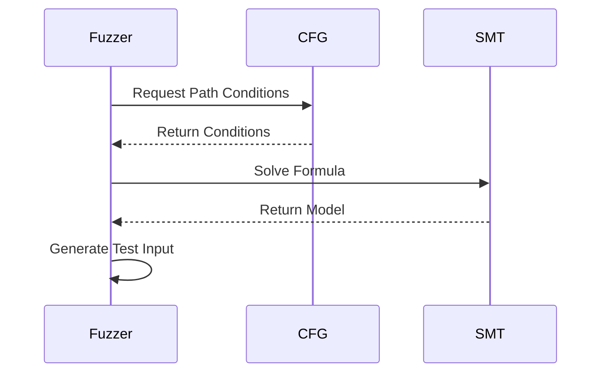
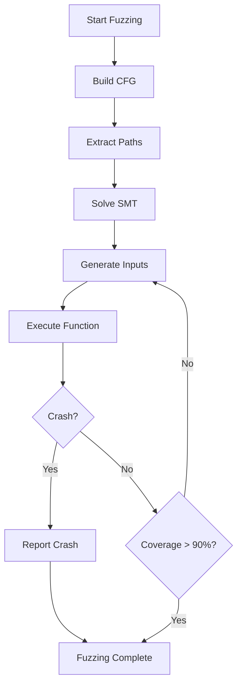

# Symbolic Execution Specification (Fuzzing)

- `File:* `tooling\symbolic_execution_fuzz_spec.md`
- `Version:* 1.0.0
- `Context:* Layer 2 (Analysis) - Auto-Fuzzer
- `Formalism:* Satisfiability Modulo Theories (SMT)
- `Status:* Active
- Last Modified:* 2026-01-01
- `Author:* Kilo Code
- `Reviewers:* Pending

- -

## 1. Introduction

### 1.1 Purpose

This specification formalizes the **Auto-Fuzzer** using **Symbolic Execution** and **SMT Solving**, providing mathematical foundation for automatic test case generation. This formalization enables the compiler to reason about program paths and generate inputs that achieve coverage or violate assertions.

### 1.2 Scope

This specification covers:
- Path Constraints derived from Control Flow Graph (CFG)
- The Generation Solver using SMT logic
- Contract Integration for filtering invalid inputs
- Coverage and crash detection strategies

This specification does not cover:
- Concrete implementation of SMT solver
- Test case execution infrastructure
- Fuzzing orchestration and scheduling

### 1.3 Definitions, Acronyms, and Abbreviations

| Term | Definition |
|-------|------------|
| **Symbolic Execution** | Executing a program with symbolic variables instead of concrete values |
| **SMT** | Satisfiability Modulo Theories - constraint solving over first-order logic |
| **Path Condition** | A conjunction of predicates along a program execution path |
| **CFG** | Control Flow Graph - representation of program control flow |
| **Coverage** | The percentage of code paths executed by test cases |
| **Crash** | An assertion violation or undefined behavior |

### 1.4 References

- King, J. C. (1976). "Symbolic Execution and Program Testing"
| Cadar, C., et al. (2008). "Symbolic Execution for Software Testing"
| ISO/IEC 29148: Systems and software engineering — Requirements engineering
| IEEE 1016: Recommended Practice for Software Design Descriptions

- -

## 2. Formal Definitions

### 2.1 Path Constraints

To auto-generate test cases for a function $f$, the compiler constructs a Control Flow Graph (CFG) where edges are annotated with predicates $\phi$.

#### 2.1.1 Path Condition Definition

A **Path Condition** $\pi$ is a conjunction of predicates along a trace:

$$ \pi = \phi_1 \land \phi_2 \land \dots \land \phi_n $$

where each $\phi_i$ is a predicate on program variables.

- FUZSYM-INV-001:* THE system SHALL construct path conditions as conjunctions of predicates.

#### 2.1.2 CFG Construction

The CFG is a directed graph $G = (V, E)$ where:

- $V$: Set of basic blocks
- $E \subset V \times V$: Control flow edges
- Each edge $(u, v) \in E$ is annotated with predicate $\phi_{uv}$

- FUZSYM-INV-002:* THE system SHALL annotate CFG edges with predicates.

### 2.2 The Generation Solver

The Fuzzer translates Morph Types into SMT Logic (Bitvectors and Arrays).

#### 2.2.1 Type Translation

| Morph Type | SMT Representation |
|-------------|---------------------|
| `i8`, `i16`, `i32`, `i64` | Bitvectors of width 8, 16, 32, 64 |
| `u8`, `u16`, `u32`, `u64` | Bitvectors of width 8, 16, 32, 64 |
| `bool` | Boolean (1-bit bitvector) |
| `str` | Array of 8-bit integers |
| `[T; n]` | Array of type T with length n |

- FUZSYM-INV-003:* THE system SHALL translate Morph types to SMT representations.

#### 2.2.2 Solver Goal

- **Goal:* Find an input vector $\vec{x}$ such that $\pi(\vec{x})$ is True (Coverage) OR violates an assertion (Crash).

- FUZSYM-REQ-001:* THE system SHALL find inputs that satisfy path conditions.

- `Priority:* Critical
- Verification Method:* Test
- `Rationale:* Generates test cases for specific code paths
- `Dependencies:* FUZSYM-INV-001
- `Traceability:* Section 2.1 (Path Constraints)

### 2.3 Contract Integration

If a function has `requires { x > 0 }`, the initial Path Condition is $\pi_0 = (x > 0)$.

The SMT solver will **never** generate $x = -1$, ensuring the Fuzzer focuses on valid business logic edge cases, not contract violations.

- FUZSYM-THM-001:* THE system SHALL guarantee that contracts filter invalid inputs.

- `Priority:* High
- Verification Method:* Analysis
- `Rationale:* Focuses fuzzing on business logic, not contract violations
- `Dependencies:* FUZSYM-INV-003
- `Traceability:* Section 2.2 (The Generation Solver)

- -

## 3. Requirements

### 3.1 Functional Requirements

- FUZSYM-REQ-002:* THE system SHALL construct CFG for all functions.

- `Priority:* Critical
- Verification Method:* Test
- `Rationale:* Enables path analysis for test generation
- `Dependencies:* FUZSYM-INV-002
- `Traceability:* Section 2.1.2 (CFG Construction)

- FUZSYM-REQ-003:* THE system SHALL extract path conditions from CFG.

- `Priority:* Critical
- Verification Method:* Test
- `Rationale:* Generates constraints for SMT solver
- `Dependencies:* FUZSYM-INV-001
- `Traceability:* Section 2.1 (Path Constraints)

- FUZSYM-REQ-004:* THE system SHALL translate path conditions to SMT formulas.

- `Priority:* Critical
- Verification Method:* Test
- `Rationale:* Enables constraint solving
- `Dependencies:* FUZSYM-INV-003
- `Traceability:* Section 2.2 (The Generation Solver)

- FUZSYM-REQ-005:* THE system SHALL solve SMT formulas to generate test inputs.

- `Priority:* Critical
- Verification Method:* Test
- `Rationale:* Produces concrete test cases
- `Dependencies:* FUZSYM-REQ-004
- `Traceability:* Section 2.2 (The Generation Solver)

- FUZSYM-REQ-006:* THE system SHALL integrate function contracts into path conditions.

- `Priority:* High
- Verification Method:* Test
- `Rationale:* Filters invalid inputs early
- `Dependencies:* FUZSYM-THM-001
- `Traceability:* Section 2.3 (Contract Integration)

- FUZSYM-REQ-007:* THE system SHALL detect assertion violations in generated inputs.

- `Priority:* High
- Verification Method:* Test
- `Rationale:* Identifies crash-causing inputs
- `Dependencies:* None
- `Traceability:* Section 2.2 (The Generation Solver)

### 3.2 Non-Functional Requirements

- FUZSYM-NFR-001:* THE system SHALL generate test cases in O(n) time complexity where n is CFG size.

- `Priority:* High
- Verification Method:* Analysis
- `Metric:* Test generation < 100ms for 10K nodes
- `Rationale:* Ensures fast fuzzing

- FUZSYM-NFR-002:* THE system SHALL support functions with up to 1000 basic blocks.

- `Priority:* Medium
- Verification Method:* Demonstration
- `Metric:* 1000 blocks with < 100MB memory
- `Rationale:* Supports complex functions

- FUZSYM-NFR-003:* THE system SHALL achieve > 90% path coverage for tested functions.

- `Priority:* High
- Verification Method:* Demonstration
- `Metric:* Coverage > 90% after 1000 test cases
- `Rationale:* Ensures comprehensive testing

- -

## 4. Design

### 4.1 Architecture Overview

The Auto-Fuzzer is implemented as a symbolic execution engine that:
1. Constructs CFG from function AST
2. Extracts path conditions for each path
3. Translates conditions to SMT formulas
4. Solves formulas to generate concrete inputs
5. Executes function with generated inputs
6. Detects crashes and coverage

### 4.2 Data Structures

#### 4.2.1 Control Flow Graph

- `CFG:* $G = (V, E, \Phi)$

- `Components:*
- $V$: Set of basic blocks
- $E \subset V \times V$: Control flow edges
- $\Phi: E \to \text{Predicates}$: Edge annotations

- `Invariants:*
1. $G$ is a directed graph
2. $\exists! \text{entry} \in V$ (Single entry point)
3. $\forall v \in V, \text{outdegree}(v) \geq 1$ (No dead ends)

#### 4.2.2 Path Condition

- Path Condition:* $\pi = (\phi_1, \phi_2, \dots, \phi_n)$

- `Components:*
- $\phi_i$: Predicate on program variables
- $n$: Number of predicates in path

- `Invariants:*
1. All predicates are well-formed
2. Variables are defined before use

#### 4.2.3 SMT Formula

- SMT Formula:* $\psi = \exists \vec{x} : \pi(\vec{x})$

- `Components:*
- $\vec{x}$: Vector of input variables
- $\pi$: Path condition (conjunction of predicates)
- $\exists$: Existential quantifier

- `Invariants:*
1. Formula is in SMT-LIB theory
2. All variables are typed correctly

### 4.3 Algorithms

#### 4.3.1 CFG Construction Algorithm

- Algorithm Name:* Build Control Flow Graph

- `Input:* Function AST

- `Output:* CFG $G = (V, E, \Phi)$

- Mathematical Definition:*
$$
\text{BuildCFG}(AST) = \begin{cases}
G & \Phi & \text{if } \text{is\_function}(AST) \\
\text{error} & \text{otherwise}
\end{cases}
$$

- `Pseudocode:*
```
function build_cfg(ast):
    if not is_function(ast):
        return error("Not a function")
    entry = create_basic_block(ast.body)
    blocks = [entry]
    for statement in ast.body:
        if is_conditional(statement):
            then_block = create_basic_block(statement.then_branch)
            else_block = create_basic_block(statement.else_branch)
            blocks.extend([then_block, else_block])
            add_edge(entry, then_block, statement.condition)
            add_edge(entry, else_block, negate(statement.condition))
        elif is_loop(statement):
            loop_body = create_basic_block(statement.body)
            blocks.append(loop_body)
            add_edge(entry, loop_body, statement.condition)
            add_edge(loop_body, entry, negate(statement.condition))
    return (blocks, edges, predicates)
```

- `Complexity:*
- Time: $O(n)$ where $n$ is AST size
- Space: $O(n)$

- `Correctness:*
- **Invariant:* CFG represents all possible execution paths
- **Termination:* Always terminates

#### 4.3.2 Path Condition Extraction Algorithm

- Algorithm Name:* Extract Path Conditions

- `Input:* CFG $G = (V, E, \Phi)$

- `Output:* Set of path conditions $\Pi = \{\pi_1, \dots, \pi_k\}$

- Mathematical Definition:*
$$
\text{ExtractPaths}(G) = \{\text{PathCondition}(p) \mid p \in \text{Paths}(G)\}
$$

- `Pseudocode:*
```
function extract_path_conditions(cfg):
    paths = []
    for path in enumerate_paths(cfg):
        condition = True
        for edge in path:
            condition = condition AND predicates[edge]
        paths.append(condition)
    return paths
```

- `Complexity:*
- Time: $O(2^n)$ where $n$ is CFG size (exponential)
- Space: $O(2^n)$

- `Correctness:*
- **Invariant:* Each path condition is conjunction of edge predicates
- **Termination:* Finite number of paths

#### 4.3.3 SMT Solving Algorithm

- Algorithm Name:* Solve SMT Formula

- `Input:* Path condition $\pi$

- `Output:* Input vector $\vec{x}$ or UNSAT

- Mathematical Definition:*
$$
\text{Solve}(\pi) = \begin{cases}
\vec{x} & \text{if } \text{SAT}(\pi) \\
\text{UNSAT} & \text{otherwise}
\end{cases}
$$

- `Pseudocode:*
```
function solve_smt(path_condition):
    formula = translate_to_smt(path_condition)
    result = z3_solver.solve(formula)
    if result.status == SAT:
        return result.model
    else:
        return None  // No solution
```

- `Complexity:*
- Time: Depends on SMT solver (NP-complete)
- Space: Depends on SMT solver

- `Correctness:*
- **Invariant:* Returns model iff formula is satisfiable
- **Termination:* SMT solver always terminates

### 4.4 Mermaid Diagrams

#### 4.4.1 CFG Construction



#### 4.4.2 Path Condition Extraction



#### 4.4.3 SMT Solving Process



#### 4.4.4 Test Execution Flow



- -

## 5. Correctness Properties

### 5.1 Theorems

#### 5.1.1 Path Completeness Theorem

- `Theorem:* The set of paths extracted from CFG covers all possible execution paths.

- Proof Sketch:*
1. By definition of CFG, all possible execution paths are represented
2. Path enumeration visits all paths from entry to exit
3. Therefore, extracted paths are complete

- FUZSYM-THM-002:* THE system SHALL guarantee complete path coverage.

- `Priority:* High
- Verification Method:* Analysis
- `Rationale:* Ensures all code paths are tested
- `Dependencies:* FUZSYM-INV-002
- `Traceability:* Section 4.3.1 (CFG Construction Algorithm)

#### 5.1.2 SMT Correctness Theorem

- `Theorem:* If SMT solver returns a model, then the model satisfies the path condition.

- Proof Sketch:*
1. By definition of SMT, model satisfies formula
2. Path condition is translated to SMT formula
3. Therefore, model satisfies path condition

- FUZSYM-THM-003:* THE system SHALL guarantee that SMT models satisfy path conditions.

- `Priority:* Critical
- Verification Method:* Analysis
- `Rationale:* Ensures generated inputs are valid
- `Dependencies:* FUZSYM-REQ-005
- `Traceability:* Section 4.3.3 (SMT Solving Algorithm)

### 5.2 Invariants

#### 5.2.1 CFG Invariants

- **FUZSYM-INV-004:* THE system SHALL maintain that CFG has single entry point
- **FUZSYM-INV-005:* THE system SHALL maintain that CFG has no unreachable blocks
- **FUZSYM-INV-006:* THE system SHALL maintain that all edges are annotated with predicates

#### 5.2.2 Path Invariants

- **FUZSYM-INV-007:* THE system SHALL maintain that path conditions are conjunctions
- **FUZSYM-INV-008:* THE system SHALL maintain that all variables in path conditions are defined
- **FUZSYM-INV-009:* THE system SHALL maintain that path conditions are satisfiable

#### 5.2.3 SMT Invariants

- **FUZSYM-INV-010:* THE system SHALL maintain that SMT formulas are well-formed
- **FUZSYM-INV-011:* THE system SHALL maintain that SMT models are type-correct
- **FUZSYM-INV-012:* THE system SHALL maintain that SMT solver terminates

- -

## 6. Examples

### 6.1 Simple Function

```morph
fn divide(a: i32, b: i32) -> i32 {
    requires { b != 0 };
    ret a / b;
}
```

- CFG Construction:*
1. Entry block: `requires { b != 0 }`
2. Conditional edge: `b != 0`
3. Then block: `ret a / b`
4. Exit block: (implicit)

- Path Conditions:*
- Path 1: `b != 0` (valid)
- Path 2: `b == 0` (invalid, filtered by contract)

- Generated Tests:*
- Path 1: Solve `b != 0` → `b = 1, a = 10` → `ret 10`
- Path 2: Skipped (contract violation)

### 6.2 Complex Function

```morph
fn process(data: i32) -> i32 {
    if (data > 0) {
        if (data < 100) {
            ret data * 2;
        } else {
            ret data + 10;
        }
    } else {
        ret 0;
    }
}
```

- CFG Construction:*
1. Entry block
2. Conditional: `data > 0`
3. Then block: Conditional `data < 100`
4. Else block: `data >= 100`
5. Exit block: `ret 0`

- Path Conditions:*
- Path 1: `data > 0 AND data < 100`
- Path 2: `data > 0 AND data >= 100`
- Path 3: `data <= 0`

- Generated Tests:*
- Path 1: Solve `data > 0 AND data < 100` → `data = 50` → `ret 100`
- Path 2: Solve `data > 0 AND data >= 100` → `data = 150` → `ret 160`
- Path 3: Solve `data <= 0` → `data = -5` → `ret 0`

### 6.3 Crash Detection

```morph
fn unsafe_access(arr: [i32], index: i32) -> i32 {
    ret arr[index];  // May crash if index out of bounds
}
```

- Path Conditions:*
- Path 1: `index >= 0 AND index < arr.len()`
- Path 2: `index < 0`
- Path 3: `index >= arr.len()`

- Generated Tests:*
- Path 1: `index = 5` → `ret arr[5]` (safe)
- Path 2: `index = -1` → `ret arr[-1]` (crash!)
- Path 3: `index = 100` → `ret arr[100]` (crash!)

- Crash Detection:*
- Paths 2 and 3 trigger out-of-bounds access
- Fuzzer reports crash with input and stack trace

### 6.4 Contract Integration

```morph
fn transfer(amount: i32, balance: i32) -> i32 {
    requires { balance >= amount };
    ret balance - amount;
}
```

- Path Conditions:*
- Path 1: `balance >= amount` (enforced by contract)
- Path 2: `balance < amount` (filtered out by contract)

- Generated Tests:*
- Path 1: Solve `balance >= amount` → `balance = 100, amount = 50` → `ret 50`
- Path 2: Skipped (contract violation, no test generated)

### 6.5 Edge Cases

#### 6.5.1 Empty Function

```morph
fn empty() -> i32 {
    ret 42;
}
```

- Path Conditions:*
- Path 1: `True` (no conditions)

- Generated Tests:*
- Path 1: Solve `True` → (no constraints) → `ret 42`

#### 6.5.2 Infinite Loop

```morph
fn infinite_loop() -> i32 {
    loop {
        // No exit condition
    }
}
```

- Path Conditions:*
- Path 1: `True` (infinite loop)

- Generated Tests:*
- Path 1: Solver detects infinite path
- Fuzzer reports timeout or path explosion

#### 6.5.3 Array Access

```morph
fn array_access(arr: [i32], i: i32, j: i32) -> i32 {
    ret arr[i][j];  // 2D array
}
```

- Path Conditions:*
- Path 1: `i >= 0 AND i < arr.len() AND j >= 0 AND j < arr[0].len()`

- Generated Tests:*
- Path 1: Solve all constraints → `i = 1, j = 2` → `ret arr[1][2]`

- -

## Change Log

| Version | Date       | Author      | Changes                                                                 |
|---------|------------|-------------|-------------------------------------------------------------------------|
| 1.0.0   | 2026-01-01 | Kilo Code    | Initial version                                                        |
