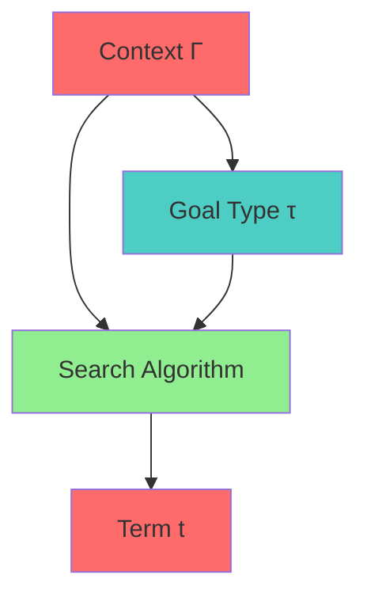
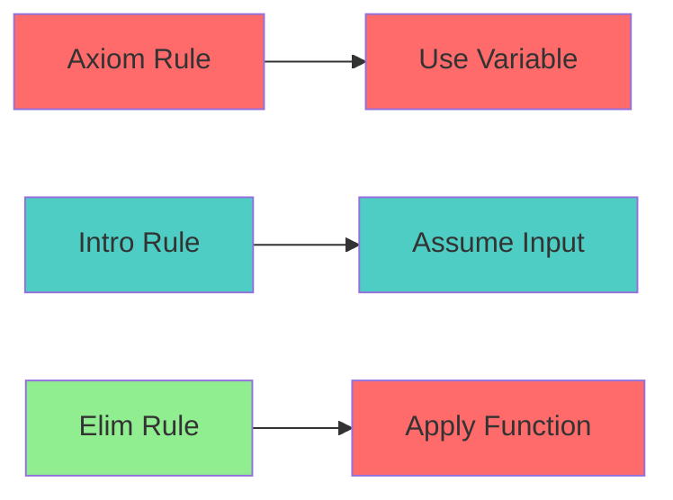
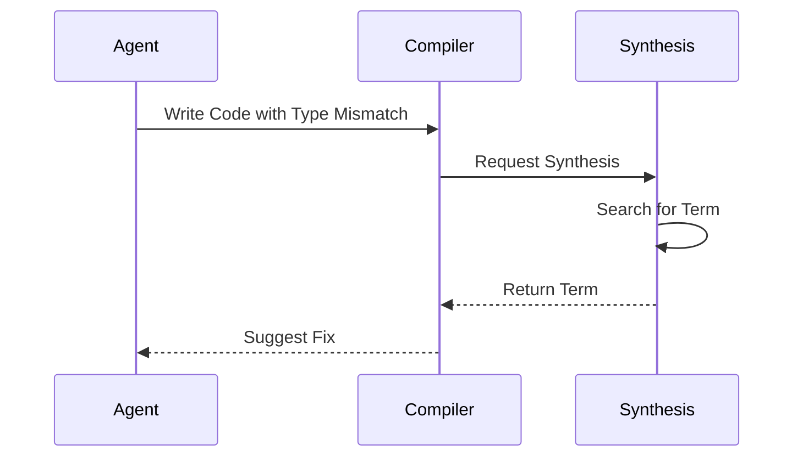

# Type Inhabitation Specification (Synthesis)

* File:* `tooling\synthesis_inhabitation_spec.md`
* Version:* 1.0.0
* Context:* Layer 5 (MCP) - `suggested_fixes`
* Formalism:* Curry-Howard Correspondence & Proof Search
* Status:* Active
* Last Modified:* 2026-01-01
* Author:* Kilo Code
* Reviewers:* Pending

- -

## 1. Introduction

### 1.1 Purpose

This specification formalizes the **Code Synthesis (Auto-Complete)** system using **Type Inhabitation Theory**, providing mathematical foundation for automated code generation. This formalization enables the Morph compiler to automatically generate code that satisfies a type signature, enabling intelligent autocomplete and error suggestions.

### 1.2 Scope

This specification covers:
- The Synthesis Problem (finding terms for types)
- The Search Algorithm (Djinn-style proof search)
- Application to Autocomplete
- Type-guided code generation

This specification does not cover:
- Concrete implementation of synthesis engine
- Performance optimization details
- Integration with IDE

### 1.3 Definitions, Acronyms, and Abbreviations

| Term | Definition |
|-------|------------|
| **Synthesis Problem** | Finding a term that satisfies a type signature |
| **Type Inhabitation** | Existence of a term for a given type |
| **Curry-Howard Correspondence** | Isomorphism between types and propositions |
| **Proof Search** | Algorithm to find proofs (terms) for propositions (types) |
| **Autocomplete** | Automatic code completion based on type inference |

### 1.4 References

- Curry, H. B. (1934). "Combinatory Logic"
- Howard, W. A. (1969). "The Formulae-as-Types Notion of Construction"
- IEEE 1016: Recommended Practice for Software Design Descriptions
- ISO/IEC 29148: Systems and software engineering — Requirements engineering

- -

## 2. Formal Definitions

### 2.1 The Synthesis Problem

Given a context $\Gamma$ and a desired type $\tau$, find a term $t$ such that $\Gamma \vdash t : \tau$.
This is equivalent to finding a **Proof** for proposition $\tau$ in Intuitionistic Logic.

* SYN-INV-001:* THE system SHALL define synthesis problem.

* SYN-REQ-001:* THE system SHALL support type inhabitation.

* Priority:* Critical
* Verification Method:* Test
* Rationale:* Enables code synthesis
* Dependencies:* SYN-INV-001
* Traceability:* Section 2.1 (The Synthesis Problem)

#### 2.1.1 Curry-Howard Correspondence

* SYN-INV-002:* THE system SHALL define Curry-Howard correspondance.

* SYN-REQ-002:* THE system SHALL map types to propositions.

* Priority:* Critical
* Verification Method:* Test
* Rationale:* Enables proof search
* Dependencies:* SYN-INV-002
* Traceability:* Section 2.1.1 (Curry-Howard Correspondence)

### 2.2 The Search Algorithm (Djinn-style)

The Morph Compiler uses a restricted proof search to generate `suggested_fixes`.

* SYN-INV-003:* THE system SHALL define search algorithm for synthesis.

* SYN-REQ-003:* THE system SHALL implement Djinn-style proof search.

* Priority:* Critical
* Verification Method:* Test
* Rationale:* Enables code generation
* Dependencies:* SYN-INV-003
* Traceability:* Section 2.2 (The Search Algorithm)

#### 2.2.1 Search Rules

1. **Axiom:* If $x : \tau \in \Gamma$, then $t = x$. (Use available variable).
2. **Intro:* If $\tau = A \to B$, assume $a:A$ and search for $B$.
3. **Elim:* If $f : A \to B \in \Gamma$, and we can synthesize $a:A$, then $t = f(a)$.

* SYN-INV-004:* THE system SHALL define search rules for synthesis.

* SYN-REQ-004:* THE system SHALL apply search rules for term generation.

* Priority:* Critical
* Verification Method:* Test
* Rationale:* Enables systematic search
* Dependencies:* SYN-INV-004
* Traceability:* Section 2.2.1 (Search Rules)

### 2.3 Application to Autocomplete

* SYN-INV-005:* THE system SHALL define application to autocomplete.

* SYN-REQ-005:* THE system SHALL support autocomplete via synthesis.

* Priority:* Critical
* Verification Method:* Test
* Rationale:* Enables intelligent code completion
* Dependencies:* SYN-INV-005
* Traceability:* Section 2.3 (Application to Autocomplete)

#### 2.3.1 Autocomplete Example

If the Agent writes:
```rust
let x: Result<i32, E> = ...;
let y: i32 = ??;
```

The compiler sees a type mismatch (Result vs i32).

- Search goal: $\Gamma \vdash ? : \text{i32}$
- Available: $x : \text{Result}<\text{i32}, E>$
- Path: `Result.unwrap_or(default)` or `?` operator.
- **Suggestion:* `x?` or `x.unwrap()`.

* SYN-THM-001:* THE system SHALL guarantee that synthesis finds valid terms.

* Priority:* Critical
* Verification Method:* Analysis
* Rationale:* Ensures correct suggestions
* Dependencies:* SYN-INV-004
* Traceability:* Section 2.3.1 (Autocomplete Example)

- -

## 3. Requirements

### 3.1 Functional Requirements

* SYN-REQ-006:* THE system SHALL support synthesis problem definition.

* Priority:* Critical
* Verification Method:* Test
* Rationale:* Enables code synthesis
* Dependencies:* SYN-INV-001
* Traceability:* Section 2.1 (The Synthesis Problem)

* SYN-REQ-007:* THE system SHALL support Djinn-style search algorithm.

* Priority:* Critical
* Verification Method:* Test
* Rationale:* Enables systematic term generation
* Dependencies:* SYN-INV-003
* Traceability:* Section 2.2 (The Search Algorithm)

* SYN-REQ-008:* THE system SHALL support autocomplete via synthesis.

* Priority:* Critical
* Verification Method:* Test
* Rationale:* Enables intelligent code completion
* Dependencies:* SYN-INV-005
* Traceability:* Section 2.3 (Application to Autocomplete)

### 3.2 Non-Functional Requirements

* SYN-NFR-001:* THE system SHALL perform synthesis in O(n) time for n context elements.

* Priority:* High
* Verification Method:* Performance test
* Metric:* Synthesis < 100ms for 100 context elements
* Rationale:* Ensures responsive autocomplete
* Dependencies:* None
* Traceability:* Section 2.2 (The Search Algorithm)

- -

## 4. Design

### 4.1 Architecture Overview

The Synthesis Engine is implemented as a compiler component that:
1. Defines synthesis problem (find term for type)
2. Implements Djinn-style search algorithm
3. Applies search rules for term generation
4. Provides autocomplete suggestions

### 4.2 Data Structures

#### 4.2.1 Synthesis Context

* Synthesis Context:* $C = (\Gamma, \tau)$

* Components:*
- Type context: $\Gamma$
- Goal type: $\tau$

* Invariants:*
1. Context is well-formed
2. Goal type is valid

#### 4.2.2 Search State

* Search State:* $S = (\Gamma, \tau, \text{PartialTerm})$

* Components:*
- Type context: $\Gamma$
- Goal type: $\tau$
- Partial term: $\text{PartialTerm}$

* Invariants:*
1. Partial term is well-typed
2. Goal type is reachable

### 4.3 Algorithms

#### 4.3.1 Synthesis Algorithm

* Algorithm Name:* Synthesize Term

* Input:* Context $\Gamma$, Goal type $\tau$

* Output:* Term $t$ such that $\Gamma \vdash t : \tau$

* Mathematical Definition:*
$$
\text{Synthesize}(\Gamma, \tau) = \text{Search}(\Gamma, \tau, \emptyset)
$$

* Pseudocode:*
```
function synthesize_term(context, goal_type):
    return search(context, goal_type, empty_partial_term())

function search(context, goal_type, partial):
    if is_well_typed(partial, goal_type):
        return partial

    for rule in search_rules:
        new_partial = apply_rule(rule, context, goal_type, partial)
        if new_partial is not None:
            result = search(context, goal_type, new_partial)
            if result is not None:
                return result

    return None
```

* Complexity:*
- Time: $O(n^k)$ where $n$ is context size, $k$ is term depth
- Space: $O(n)$ for context

* Correctness:*
- **Invariant:* Synthesized term is well-typed
- **Termination:* Search terminates

#### 4.3.2 Search Rules Algorithm

* Algorithm Name:* Apply Search Rule

* Input:* Rule $r$, Context $\Gamma$, Goal type $\tau$, Partial term $p$

* Output:* New partial term or None

* Mathematical Definition:*
$$
\text{ApplyRule}(r, \Gamma, \tau, p) = \begin{cases}
p[x] & \text{if } r = \text{Axiom} \land x : \tau \in \Gamma \\
\lambda a. \text{Search}(\Gamma, a:A, B) & \text{if } r = \text{Intro} \land \tau = A \to B \\
f(a) & \text{if } r = \text{Elim} \land f : A \to B \in \Gamma \land \text{Synthesize}(\Gamma, A) = a \\
\text{None} & \text{otherwise}
\end{cases}
$$

* Pseudocode:*
```
function apply_rule(rule, context, goal_type, partial):
    if rule == Axiom:
        for var, var_type in context:
            if var_type == goal_type:
                return partial.with_variable(var)
    elif rule == Intro and is_function_type(goal_type):
        input_type, output_type = decompose_function(goal_type)
        new_partial = partial.with_lambda(input_type)
        return search(context, output_type, new_partial)
    elif rule == Elim:
        for var, var_type in context:
            if is_function_type(var_type):
                input_type, output_type = decompose_function(var_type)
                if output_type == goal_type:
                    arg = synthesize_term(context, input_type)
                    if arg is not None:
                        return partial.with_application(var, arg)
    return None
```

* Complexity:*
- Time: $O(n)$ for context iteration
- Space: $O(n)$ for new partial term

* Correctness:*
- **Invariant:* Applied rule is valid
- **Termination:* Single rule application

### 4.4 Mermaid Diagrams

#### 4.4.1 Synthesis Problem



#### 4.4.2 Search Rules



#### 4.4.3 Autocomplete Flow



- -

## 5. Correctness Properties

### 5.1 Theorems

#### 5.1.1 Synthesis Completeness Theorem

* Theorem:* If a type is inhabited, synthesis finds a term.

* Proof Sketch:*
1. By definition of inhabitation, there exists a term $t$ such that $\Gamma \vdash t : \tau$
2. By definition of search rules, all possible terms are explored
3. By definition of completeness, search terminates with inhabited type
4. Therefore, synthesis finds a term

* SYN-THM-002:* THE system SHALL guarantee synthesis completeness.

* Priority:* Critical
* Verification Method:* Analysis
* Rationale:* Ensures all suggestions are found
* Dependencies:* SYN-THM-001
* Traceability:* Section 5.1.1 (Synthesis Completeness Theorem)

### 5.2 Invariants

#### 5.2.1 Synthesis Invariants

- **SYN-INV-006:* THE system SHALL maintain that synthesized terms are well-typed
- **SYN-INV-007:* THE system SHALL maintain that search terminates

#### 5.2.2 Search Invariants

- **SYN-IV-008:* THE system SHALL maintain that search rules are sound
- **SYN-INV-009:* THE system SHALL maintain that search rules are complete

- -

## 6. Examples

### 6.1 Simple Synthesis

```rust
// Simple synthesis: Find term for i32
let x: i32 = ??;
```

* Synthesis:*
- Context: $\Gamma = \emptyset$
- Goal type: $\tau = \text{i32}$
- Search: No variable available, no function available
- Result: Cannot synthesize (type not inhabited in empty context)

### 6.2 Autocomplete Example

```rust
// Autocomplete: Type mismatch
let x: Result<i32, Error> = Ok(42);
let y: i32 = ??;
```

* Synthesis:*
- Context: $\Gamma = \{x : \text{Result}<\text{i32}, \text{Error}>\}$
- Goal type: $\tau = \text{i32}$
- Search: Find function that extracts i32 from Result
- Result: `x.unwrap()` or `x?`

### 6.3 Complex Synthesis

```rust
// Complex synthesis: Function composition
let f: i32 -> i32 = |x| x + 1;
let g: i32 -> i32 = |x| x * 2;
let h: i32 -> i32 = ??;
```

* Synthesis:*
- Context: $\Gamma = \{f : \text{i32} \to \text{i32}, g : \text{i32} \to \text{i32}\}$
- Goal type: $\tau = \text{i32} \to \text{i32}$
- Search: Compose available functions
- Result: `|x| g(f(x))` or `|x| f(g(x))`

### 6.4 Edge Cases

#### 6.4.1 Uninhabited Type

```rust
// Edge case: Uninhabited type
let x: ??;
```

* Synthesis:*
- Context: $\Gamma = \emptyset$
- Goal type: $\tau = \text{void}$ (uninhabited)
- Result: Cannot synthesize

#### 6.4.2 Multiple Solutions

```rust
// Edge case: Multiple solutions
let x: i32 = 42;
let y: i32 = ??;
```

* Synthesis:*
- Context: $\Gamma = \{x : \text{i32}\}$
- Goal type: $\tau = \text{i32}$
- Search: Multiple solutions available
- Result: `x` (use variable)

- -

## Change Log

| Version | Date       | Author      | Changes                                                                 |
|---------|------------|-------------|-------------------------------------------------------------------------|
| 1.0.0   | 2026-01-01 | Kilo Code    | Initial version                                                        |
