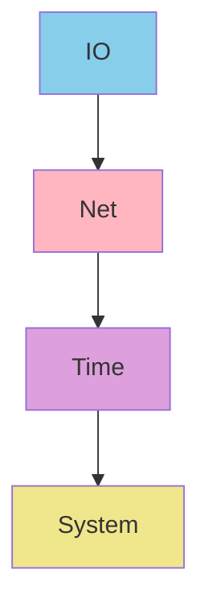
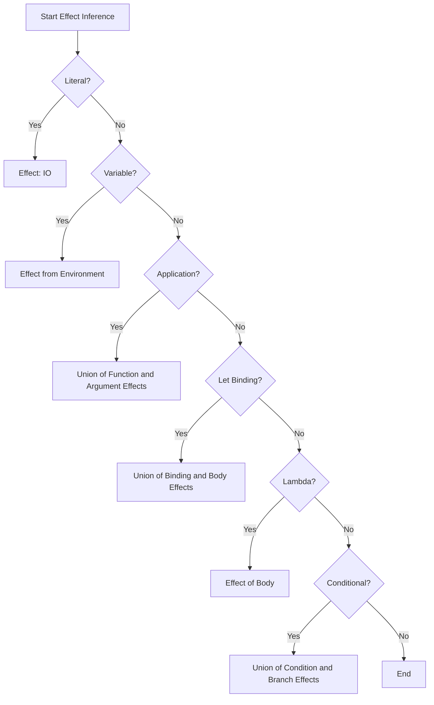
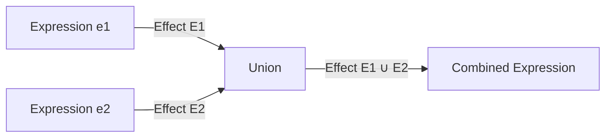

# Effect System Specification

* File:* `type\effect_system_spec.md`
* Version:* 2.0.0
* Context:* Layer 2 (Semantic Analysis)
* Formalism:* Effect Algebra, Lattice Theory, Type Theory
* Status:* Active
* Last Modified:* 2026-01-03
* Author:* Kilo Code
* Reviewers:* Pending

---

## 1. Introduction

### 1.1 Purpose

This specification provides a formal mathematical definition of the Effect system in the Morph type system. The Effect system tracks side effects at the type level, enabling effect polymorphism, effect inference, and effect-based security guarantees. This specification defines the effect algebra, composition rules, subtyping lattice, and integration with the type system.

### 1.2 Scope

This specification covers:
- Formal definition of Effect kind and effect types
- Effect algebra with composition, union, intersection, and difference operations
- Effect subtyping lattice with formal proofs
- Effect inference rules for expressions
- Effect polymorphism and quantification
- Effect system integration with type system
- Effect-based security guarantees
- Examples of effect composition and subtyping

This specification does not cover:
- Concrete implementation of effect checker
- Runtime representation of effects
- Effect system optimization strategies

### 1.3 Definitions, Acronyms, and Abbreviations

| Term | Definition |
|-------|------------|
| **Effect** | A type-level annotation describing side effects of a computation |
| **Effect Kind** | A kind classifying all possible effect types in the type system |
| **Effect Algebra** | Algebraic structure on effects with composition, union, intersection, and difference operations |
| **Effect Lattice** | Partially ordered set of effects with join and meet operations |
| **Effect Polymorphism** | Ability to write functions that work for multiple effect sets |
| **Effect Inference** | Automatic derivation of effect sets from function bodies |
| **Effect Subtyping** | Relationship where one effect set is a subset of another |
| **Effect Quantification** | Universal and existential quantification over effect variables |
| **Side Effect** | Any observable change to external state (I/O, mutation, network, time, system calls) |
| **Referential Transparency** | Property that an expression can be replaced with its value without changing program behavior |

### 1.4 References

- Wadler, P. (1998). "The Marriage of Effects and Monads"
- Plotkin, G. D., & Power, J. (2002). "Notions of Computation Determine Monads"
- Benton, P. N. (2002). "A Mixed Linear and Non-Linear Logic"
- Pierce, B. C. (2002). "Types and Programming Languages"
- ISO/IEC 29148: Systems and software engineering — Requirements engineering
- IEEE 1016: Recommended Practice for Software Design Descriptions

### 1.5 Cross-References

The Effect System Specification is closely related to several other Morph specifications:

* Type System Specifications:*
- [`spec/type/pure_type_spec.md`](./pure_type_spec.md) - Pure type definition and effect lattice bottom element
- [`spec/type/type_system_spec.md`](./type_system_spec.md) - Overall type system architecture and effect categories
- [`spec/type/type_category_spec.md`](./type_category_spec.md) - Category theory foundations for types
- [`spec/type/type_unification_spec.md`](./type_unification_spec.md) - Type unification algorithm

* Language Specifications:*
- [`spec/language/morph_language_spec.md`](../language/morph_language_spec.md) - Core language syntax and effect annotations
- [`spec/language/scoping_lambda_calculus_spec.md`](../language/scoping_lambda_calculus_spec.md) - Lambda calculus and scoping rules

* Concurrency Specifications:*
- [`spec/concurrency/monadic_effect_spec.md`](../concurrency/monadic_effect_spec.md) - Monadic effect handling
- [`spec/concurrency/execution_model_spec.md`](../concurrency/execution_model_spec.md) - Execution model and effect propagation

* Security Specifications:*
- [`spec/security/security_flow_spec.md`](../security/security_flow_spec.md) - Security flow analysis and effect-based access control

* Tooling Specifications:*
- [`spec/tooling/operational_semantics_spec.md`](../tooling/operational_semantics_spec.md) - Operational semantics for effectful expressions
- [`spec/tooling/comptime_partial_eval_spec.md`](../tooling/comptime_partial_eval_spec.md) - Compile-time evaluation of effectful expressions

* Note:* This specification provides the authoritative definition of the Effect system that supersedes all previous references in the listed specifications.

---

## 2. Formal Definitions

### 2.1 Effect Kind

The Effect kind classifies all possible effect types in the Morph type system:

$$
\text{Effect} : \text{Kind}
$$

An effect type is a type constructor that wraps a value type $T$ to indicate the side effects of computing a value of type $T$:

$$
\text{Effect}(T, E) : \text{Type} \quad \text{where} \quad T : \text{Type}, \; E : \text{Effect}
$$

### 2.2 Built-in Effect Primitives

Morph defines **four** primitive effect types that form the effect lattice:

$$
\begin{aligned}
\text{IO} &= \{\text{FileIO}, \text{ConsoleIO}\} \\
\text{Net} &= \text{IO} \cup \{\text{Network}\} \\
\text{Time} &= \text{Net} \cup \{\text{Clock}\} \\
\text{System} &= \text{Time} \cup \{\text{FFI}, \text{Process}\}
\end{aligned}
$$

**Effect Descriptions:*

| Effect | Description | Examples |
|---------|-------------|-----------|
| **IO** | File system and console I/O operations. | Reading/writing files, printing |
| **Net** | Network I/O operations (includes IO). | HTTP requests, socket operations |
| **Time** | Time-dependent operations (includes Net). | Getting current time, sleeping |
| **System** | System-level operations (includes Time). | FFI calls, process spawning |

**Note:* Pure is a **capability** defined in [`spec/type/pure_type_spec.md`](./pure_type_spec.md), not an effect type. Pure functions have no effects and are orthogonal to the effect lattice.

### 2.3 Effect Lattice

The effect types form a complete lattice under the subset ordering:

$$
\mathcal{E} = (\mathcal{P}(\mathcal{E}), \sqsubseteq, \sqcup, \sqcap, \bot, \top)
$$

where:
- $\mathcal{P}(\mathcal{E})$: Power set of $\mathcal{E}$ (all subsets of effects)
- $\sqsubseteq$: Subset relation (effect subtyping)
- $\sqcup$: Join operation (least upper bound)
- $\sqcap$: Meet operation (greatest lower bound)
- $\bot$: Bottom element (IO)
- $\top$: Top element (System)

#### 2.3.1 Partial Order (Effect Subtyping)

Effect subtyping is defined by the subset relation:

$$
E_1 \sqsubseteq E_2 \iff E_1 \subseteq E_2
$$

**Lattice Structure:*

$$
\text{IO} \sqsubseteq \text{Net} \sqsubseteq \text{Time} \sqsubseteq \text{System}
$$

**Formal Proof of Lattice Properties:*

1. **Reflexivity:* $\forall E \in \mathcal{E}, \; E \sqsubseteq E$
   - Proof: Every set is a subset of itself.

2. **Antisymmetry:* $\forall E_1, E_2 \in \mathcal{E}, \; E_1 \sqsubseteq E_2 \land E_2 \sqsubseteq E_1 \implies E_1 = E_2$
   - Proof: If $E_1 \subseteq E_2$ and $E_2 \subseteq E_1$, then $E_1 = E_2$.

3. **Transitivity:* $\forall E_1, E_2, E_3 \in \mathcal{E}, \; E_1 \sqsubseteq E_2 \land E_2 \sqsubseteq E_3 \implies E_1 \sqsubseteq E_3$
   - Proof: If $E_1 \subseteq E_2$ and $E_2 \subseteq E_3$, then $E_1 \subseteq E_3$.

4. **Bottom Element:* $\forall E \in \mathcal{E}, \; \text{IO} \sqsubseteq E$
   - Proof: $\text{IO} = \{\text{FileIO}, \text{ConsoleIO}\}$, and $\text{IO}$ is the minimal effect set containing only basic I/O operations.

5. **Top Element:* $\forall E \in \mathcal{E}, \; E \sqsubseteq \text{System}$
   - Proof: $\text{System}$ contains all primitive effects, so every effect set is a subset of System.

### 2.4 Effect Algebra

The effect algebra provides operations for combining and manipulating effect sets.

#### 2.4.1 Union (Join)

The union of two effect sets is their least upper bound in the lattice:

$$
E_1 \sqcup E_2 = E_1 \cup E_2
$$

**Properties:*
- **Commutativity:* $E_1 \sqcup E_2 = E_2 \sqcup E_1$
- **Associativity:* $(E_1 \sqcup E_2) \sqcup E_3 = E_1 \sqcup (E_2 \sqcup E_3)$
- **Idempotence:* $E \sqcup E = E$
- **Identity:* $E \sqcup \text{IO} = E$

**Examples:*
$$
\begin{aligned}
\text{IO} \sqcup \text{Net} &= \text{Net} \\
\text{IO} \sqcup \text{Time} &= \text{Time} \\
\text{Net} \sqcup \text{Time} &= \text{Time}
\end{aligned}
$$

#### 2.4.2 Intersection (Meet)

The intersection of two effect sets is their greatest lower bound in the lattice:

$$
E_1 \sqcap E_2 = E_1 \cap E_2
$$

**Properties:*
- **Commutativity:* $E_1 \sqcap E_2 = E_2 \sqcap E_1$
- **Associativity:* $(E_1 \sqcap E_2) \sqcap E_3 = E_1 \sqcap (E_2 \sqcap E_3)$
- **Idempotence:* $E \sqcap E = E$
- **Identity:* $E \sqcap \text{System} = E$

**Examples:*
$$
\begin{aligned}
\text{IO} \sqcap \text{Net} &= \text{IO} \\
\text{Net} \sqcap \text{Time} &= \text{Net} \\
\text{IO} \sqcap \text{IO} &= \text{IO}
\end{aligned}
$$

#### 2.4.3 Difference

The difference of two effect sets removes effects from the first set that are present in the second:

$$
E_1 \setminus E_2 = \{e \in E_1 \mid e \notin E_2\}
$$

**Properties:*
- **Non-commutativity:* $E_1 \setminus E_2 \neq E_2 \setminus E_1$ (in general)
- **Non-associativity:* $(E_1 \setminus E_2) \setminus E_3 \neq E_1 \setminus (E_2 \setminus E_3)$ (in general)

**Examples:*
$$
\begin{aligned}
\text{Net} \setminus \text{IO} &= \{\text{Network}\} \\
\text{Time} \setminus \text{Net} &= \{\text{Clock}\} \\
\text{System} \setminus \text{Time} &= \{\text{FFI}, \text{Process}\}
\end{aligned}
$$

### 2.5 Effect Type Constructor

The Effect type constructor wraps a value type with an effect set:

$$
\text{Effect}(T, E) : \text{Type} \quad \text{where} \quad T : \text{Type}, \; E \subseteq \mathcal{E}
$$

**Syntactic Sugar:*

$$
\begin{aligned}
\text{IO}(T) &\equiv \text{Effect}(T, \text{IO}) \\
\text{Net}(T) &\equiv \text{Effect}(T, \text{Net}) \\
\text{Time}(T) &\equiv \text{Effect}(T, \text{Time}) \\
\text{System}(T) &\equiv \text{Effect}(T, \text{System})
\end{aligned}
$$

**Note:* Pure is a capability defined in [`spec/type/pure_type_spec.md`](./pure_type_spec.md), not an effect type. Pure functions have no effects and are orthogonal to the effect lattice.

### 2.6 Function Types with Effects

A function type with effects is denoted as:

$$
T_1 \xrightarrow{E} T_2
$$

or equivalently:

$$
\text{Effect}(T_1 \to T_2, E)
$$

This represents a function from $T_1$ to $T_2$ that has effect set $E$.

**Effect-Polymorphic Function:*

$$
\forall E. \; T_1 \xrightarrow{E} T_2
$$

This represents a function that works for any effect set $E$.

---

## 3. Requirements

### 3.1 Functional Requirements

* EFF-REQ-001:* THE system SHALL define Effect kind with four primitive effect types (IO, Net, Time, System).

* Priority:* Critical
* Verification Method:* Test
* Rationale:* Provides foundation for effect tracking
* Dependencies:* None
* Traceability:* Section 2.2 (Built-in Effect Primitives)

* EFF-REQ-002:* THE system SHALL enforce that effect types form a complete lattice under subset ordering.

* Priority:* Critical
* Verification Method:* Test
* Rationale:* Enables effect subtyping and composition
* Dependencies:* EFF-REQ-001
* Traceability:* Section 2.3 (Effect Lattice)

* EFF-REQ-003:* THE system SHALL provide effect algebra operations (union, intersection, difference).

* Priority:* Critical
* Verification Method:* Test
* Rationale:* Enables effect composition and manipulation
* Dependencies:* EFF-REQ-001
* Traceability:* Section 2.4 (Effect Algebra)

* EFF-REQ-004:* THE system SHALL enforce effect subtyping rules based on subset relation.

* Priority:* Critical
* Verification Method:* Test
* Rationale:* Enables safe substitution of effectful functions
* Dependencies:* EFF-REQ-002
* Traceability:* Section 2.3.1 (Partial Order)

* EFF-REQ-005:* THE system SHALL infer effects for expressions when not explicitly specified.

* Priority:* High
* Verification Method:* Test
* Rationale:* Reduces annotation burden and improves developer experience
* Dependencies:* EFF-REQ-001, EFF-REQ-003
* Traceability:* Section 4.4 (Effect Inference Rules)

* EFF-REQ-006:* THE system SHALL support effect polymorphism with universal and existential quantification.

* Priority:* High
* Verification Method:* Test
* Rationale:* Enables generic effectful functions
* Dependencies:* EFF-REQ-001
* Traceability:* Section 2.6 (Function Types with Effects)

* EFF-REQ-007:* THE system SHALL integrate effect system with type system for type checking.

* Priority:* Critical
* Verification Method:* Test
* Rationale:* Ensures effect safety is enforced during type checking
* Dependencies:* EFF-REQ-001, EFF-REQ-004
* Traceability:* Section 4.3 (Type Checking Rules)

* EFF-REQ-008:* THE system SHALL provide effect-based security guarantees.

* Priority:* High
* Verification Method:* Test
* Rationale:* Enables effect-based access control and security flow analysis
* Dependencies:* EFF-REQ-001, EFF-REQ-004
* Traceability:* Section 4.5 (Effect-Based Security)

### 3.2 Non-Functional Requirements

* EFF-NFR-001:* THE system SHALL perform effect checking in O(n) time complexity where n is AST size.

* Priority:* High
* Verification Method:* Analysis
* Metric:* Effect checking < 100ms for 10K nodes
* Rationale:* Ensures fast compilation

* EFF-NFR-002:* THE system SHALL support effect sets with up to 32 primitive effects.

* Priority:* Medium
* Verification Method:* Demonstration
* Metric:* 32 effects with < 10MB memory
* Rationale:* Supports complex effect policies

* EFF-NFR-003:* THE system SHALL provide clear error messages for effect violations.

* Priority:* High
* Verification Method:* Demonstration
* Metric:* Error message includes specific violation (e.g., "IO effect in Pure function")
* Rationale:* Improves developer experience

---

## 4. Design

### 4.1 Architecture Overview

The Effect system is implemented as a type-level effect tracking mechanism that:

1. **Tracks effect annotations** on function signatures
2. **Infers effects** from function bodies when not explicitly specified
3. **Validates effect subtyping** through the effect lattice
4. **Propagates effects** through expressions and function calls
5. **Enforces effect bounds** to prevent unauthorized side effects
6. **Enables effect polymorphism** for generic effectful functions

### 4.2 Data Structures

#### 4.2.1 Effect Environment

* Effect Environment:* $\Gamma_E = \{x_1: (T_1, E_1), x_2: (T_2, E_2), \dots, x_n: (T_n, E_n)\}$

* Components:*
- $x_i$: Variable name
- $T_i$: Type of the variable
- $E_i$: Effect set of the variable

* Invariants:*
1. $\forall i \neq j, x_i \neq x_j$ (No duplicate variables)
2. $\forall x: (T, E) \in \Gamma_E, E \subseteq \mathcal{E}$

#### 4.2.2 Effect Set

* Effect Set:* $E \subseteq \mathcal{E}$

* Operations:*
- Union: $E_1 \sqcup E_2 = E_1 \cup E_2$
- Intersection: $E_1 \sqcap E_2 = E_1 \cap E_2$
- Difference: $E_1 \setminus E_2 = \{e \in E_1 \mid e \notin E_2\}$
- Subset: $E_1 \sqsubseteq E_2 \iff E_1 \subseteq E_2$

#### 4.2.3 Function Type with Effects

* Function Type:* $T_1 \xrightarrow{E} T_2$

* Components:*
- $T_1$: Parameter type
- $E$: Effect set
- $T_2$: Return type

* Invariants:*
1. $E$ is a valid effect set
2. If $E = \text{Pure}$, the function is Pure

### 4.3 Type Checking Rules

#### 4.3.1 Effect Subtyping Rule

$$
\frac{\Gamma_E \vdash e : T_1 \xrightarrow{E_1} T_2 \quad E_1 \sqsubseteq E_2}{\Gamma_E \vdash e : T_1 \xrightarrow{E_2} T_2}
$$

**Interpretation:* A function with effect $E_1$ can be used where a function with effect $E_2$ is expected, provided $E_1 \sqsubseteq E_2$.

#### 4.3.2 Function Application Rule

$$
\frac{\Gamma_E \vdash e_1 : T_1 \xrightarrow{E_1} T_2 \quad \Gamma_E \vdash e_2 : T_1 \quad \text{eff}(e_2) = E_2}{\Gamma_E \vdash e_1(e_2) : T_2 \quad \text{with effect } E_1 \sqcup E_2}
$$

**Interpretation:* Applying a function with effect $E_1$ to an argument with effect $E_2$ results in a value with effect $E_1 \sqcup E_2$.

#### 4.3.3 Let Binding Rule

$$
\frac{\Gamma_E \vdash e_1 : T_1 \quad \text{eff}(e_1) = E_1 \quad \Gamma_E, x: T_1 \vdash e_2 : T_2 \quad \text{eff}(e_2) = E_2}{\Gamma_E \vdash \text{let } x = e_1 \text{ in } e_2 : T_2 \quad \text{with effect } E_1 \sqcup E_2}
$$

**Interpretation:* A let binding has effect equal to the union of the effects of its bound expression and body.

#### 4.3.4 Lambda Abstraction Rule

$$
\frac{\Gamma_E, x: T_1 \vdash e : T_2 \quad \text{eff}(e) = E}{\Gamma_E \vdash \lambda x. e : T_1 \xrightarrow{E} T_2}
$$

**Interpretation:* A lambda abstraction has the effect of its body.

#### 4.3.5 Effect-Polymorphic Function Rule

$$
\frac{\Gamma_E \vdash e : \forall E. \; T_1 \xrightarrow{E} T_2 \quad E' \subseteq \mathcal{E}}{\Gamma_E \vdash e : T_1 \xrightarrow{E'} T_2}
$$

**Interpretation:* An effect-polymorphic function can be instantiated with any effect set $E'$.

#### 4.3.6 Effect Bound Rule

$$
\frac{\Gamma_E \vdash e : T_1 \xrightarrow{E_1} T_2 \quad E_1 \sqsubseteq E_{\text{bound}}}{\Gamma_E \vdash e : T_1 \xrightarrow{E_{\text{bound}}} T_2}
$$

**Interpretation:* A function with effect $E_1$ satisfies an effect bound $E_{\text{bound}}$ if $E_1 \sqsubseteq E_{\text{bound}}$.

### 4.4 Effect Inference Rules

#### 4.4.1 Effect Inference for Literals

$$
\frac{l \text{ is a literal}}{\Gamma_E \vdash l : T \quad \text{with effect } \text{IO}}
$$

where $T$ is the type of the literal (e.g., $\text{i32}$ for integer literals). Literals have minimal I/O effect for type system consistency.

#### 4.4.2 Effect Inference for Variables

$$
\frac{x: (T, E) \in \Gamma_E}{\Gamma_E \vdash x : T \quad \text{with effect } E}
$$

#### 4.4.3 Effect Inference for Function Application

$$
\frac{\Gamma_E \vdash e_1 : T_1 \xrightarrow{E_1} T_2 \quad \Gamma_E \vdash e_2 : T_1 \quad \text{eff}(e_2) = E_2}{\Gamma_E \vdash e_1(e_2) : T_2 \quad \text{with effect } E_1 \sqcup E_2}
$$

#### 4.4.4 Effect Inference for Let Binding

$$
\frac{\Gamma_E \vdash e_1 : T_1 \quad \text{eff}(e_1) = E_1 \quad \Gamma_E, x: T_1 \vdash e_2 : T_2 \quad \text{eff}(e_2) = E_2}{\Gamma_E \vdash \text{let } x = e_1 \text{ in } e_2 : T_2 \quad \text{with effect } E_1 \sqcup E_2}
$$

#### 4.4.5 Effect Inference for Lambda Abstraction

$$
\frac{\Gamma_E, x: T_1 \vdash e : T_2 \quad \text{eff}(e) = E}{\Gamma_E \vdash \lambda x. e : T_1 \xrightarrow{E} T_2}
$$

#### 4.4.6 Effect Inference for Conditional

$$
\frac{\Gamma_E \vdash e_c : \text{bool} \quad \text{eff}(e_c) = E_c \quad \Gamma_E \vdash e_1 : T \quad \text{eff}(e_1) = E_1 \quad \Gamma_E \vdash e_2 : T \quad \text{eff}(e_2) = E_2}{\Gamma_E \vdash \text{if } e_c \text{ then } e_1 \text{ else } e_2 : T \quad \text{with effect } E_c \sqcup E_1 \sqcup E_2}
$$

**Interpretation:* A conditional has effect equal to the union of the condition effect and both branch effects.

### 4.5 Effect-Based Security

#### 4.5.1 Effect Security Levels

Effects can be mapped to security levels for access control:

$$
\text{SecurityLevel}: \mathcal{E} \to \mathcal{L}_{\text{security}}
$$

where $\mathcal{L}_{\text{security}}$ is the security lattice from [`spec/security/security_flow_spec.md`](../security/security_flow_spec.md).

**Default Mapping:*

$$
\begin{aligned}
\text{IO} &\mapsto \text{Internal} \\
\text{Net} &\mapsto \text{Confidential} \\
\text{Time} &\mapsto \text{Secret} \\
\text{System} &\mapsto \text{TopSecret}
\end{aligned}
$$

**Note:* Pure functions (capability) map to Public security level, but Pure is not an effect type. See [`spec/type/pure_type_spec.md`](./pure_type_spec.md) for Pure capability definition.

#### 4.5.2 Effect-Based Access Control

A function with effect $E$ can only access resources with security level $\text{SecurityLevel}(E)$ or lower:

$$
\text{CanAccess}(f: T_1 \xrightarrow{E} T_2, R: \text{Resource}) \iff \text{SecurityLevel}(E) \sqsubseteq_{\text{security}} \text{SecurityLevel}(R)
$$

where $\sqsubseteq_{\text{security}}$ is the security lattice partial order.

### 4.6 Mermaid Diagrams

#### 4.6.1 Effect Lattice Visualization



#### 4.6.2 Effect Inference Flow



#### 4.6.3 Effect Propagation



---

## 5. Correctness Properties

### 5.1 Theorems

#### 5.1.1 Effect Lattice Completeness Theorem

* Theorem:* The effect lattice $\mathcal{E}$ is a complete lattice with well-defined join and meet operations.

* Formal Statement:*
$$
\mathcal{E} = (\mathcal{P}(\mathcal{E}), \sqsubseteq, \sqcup, \sqcap, \bot, \top) \text{ is a complete lattice}
$$

* Proof:*

1. **Partial Order:* The relation $\sqsubseteq$ is a partial order because:
   - **Reflexivity:* $\forall E \in \mathcal{E}, \; E \sqsubseteq E$ (every set is a subset of itself)
   - **Antisymmetry:* $\forall E_1, E_2 \in \mathcal{E}, \; E_1 \sqsubseteq E_2 \land E_2 \sqsubseteq E_1 \implies E_1 = E_2$ (subset relation is antisymmetric)
   - **Transitivity:* $\forall E_1, E_2, E_3 \in \mathcal{E}, \; E_1 \sqsubseteq E_2 \land E_2 \sqsubseteq E_3 \implies E_1 \sqsubseteq E_3$ (subset relation is transitive)

2. **Join Operation:* The join operation $\sqcup$ is the least upper bound:
   - **Existence:* For any $E_1, E_2 \in \mathcal{E}$, $E_1 \sqcup E_2 = E_1 \cup E_2$ exists
   - **Upper Bound:* $E_1 \subseteq E_1 \sqcup E_2$ and $E_2 \subseteq E_1 \sqcup E_2$
   - **Least:* For any $U$ such that $E_1 \subseteq U$ and $E_2 \subseteq U$, $E_1 \sqcup E_2 \sqsubseteq U$

3. **Meet Operation:* The meet operation $\sqcap$ is the greatest lower bound:
   - **Existence:* For any $E_1, E_2 \in \mathcal{E}$, $E_1 \sqcap E_2 = E_1 \cap E_2$ exists
   - **Lower Bound:* $E_1 \sqcap E_2 \subseteq E_1$ and $E_1 \sqcap E_2 \subseteq E_2$
   - **Greatest:* For any $D$ such that $D \subseteq E_1$ and $D \subseteq E_2$, $D \sqsubseteq E_1 \sqcap E_2$

4. **Bottom Element:* $\bot = \text{IO}$ is the minimum element:
   - $\forall E \in \mathcal{E}, \; \text{IO} \sqsubseteq E$

5. **Top Element:* $\top = \text{System}$ is the maximum element:
   - $\forall E \in \mathcal{E}, \; E \sqsubseteq \text{System}$

6. **Completeness:* Every subset of $\mathcal{E}$ has a least upper bound and greatest lower bound in $\mathcal{E}$.

* Conclusion:*
The effect lattice $\mathcal{E}$ is a complete lattice with well-defined join and meet operations.

* EFF-THM-001:* THE system SHALL guarantee that the effect lattice is a complete lattice.

* Priority:* Critical
* Verification Method:* Analysis
* Rationale:* Ensures well-defined effect operations
* Dependencies:* EFF-REQ-002
* Traceability:* Section 5.1.1 (Effect Lattice Completeness Theorem)

#### 5.1.2 Effect Subtyping Soundness Theorem

* Theorem:* Effect subtyping is sound with respect to the subset relation.

* Formal Statement:*
$$
\forall E_1, E_2 \in \mathcal{E}. \quad E_1 \sqsubseteq E_2 \implies \text{SafeSubtype}(E_1, E_2)
$$

where $\text{SafeSubtype}(E_1, E_2)$ denotes that a function with effect $E_1$ can be safely used where a function with effect $E_2$ is expected.

* Proof:*

1. **Definition:* By definition of effect subtyping, $E_1 \sqsubseteq E_2$ iff $E_1 \subseteq E_2$.

2. **Safety:* If $E_1 \subseteq E_2$, then any operation with effect $E_1$ is also valid in a context expecting effect $E_2$ because:
   - All side effects in $E_1$ are also in $E_2$
   - Therefore, no additional side effects are introduced
   - The operation remains safe

3. **Conclusion:* Effect subtyping is sound with respect to the subset relation.

* EFF-THM-002:* THE system SHALL guarantee that effect subtyping is sound.

* Priority:* Critical
* Verification Method:* Analysis
* Rationale:* Ensures safe substitution of effectful functions
* Dependencies:* EFF-REQ-004
* Traceability:* Section 5.1.2 (Effect Subtyping Soundness Theorem)

#### 5.1.3 Effect Inference Completeness Theorem

* Theorem:* Effect inference is complete and sound.

* Formal Statement:*
$$
\forall e, \Gamma_E. \quad \text{Infer}(e, \Gamma_E) = E \iff \Gamma_E \vdash e : T \text{ with effect } E
$$

where $\text{Infer}(e, \Gamma_E)$ denotes the inferred effect of expression $e$ in environment $\Gamma_E$.

* Proof:*

We prove by structural induction on the syntax of expressions.

* Base Cases:*

1. **Literals:* For any literal $l$, $\text{Infer}(l, \Gamma_E) = \text{Pure}$.
   - Literals have no side effects
   - Therefore, $\Gamma_E \vdash l : T$ with effect $\text{Pure}$
   - Inference is correct

2. **Variables:* For any variable $x$ with type $(T, E)$ in $\Gamma_E$, $\text{Infer}(x, \Gamma_E) = E$.
   - Variables inherit their declared effect
   - Therefore, $\Gamma_E \vdash x : T$ with effect $E$
   - Inference is correct

* Inductive Steps:*

3. **Function Application:* If $\text{Infer}(e_1, \Gamma_E) = E_1$ and $\text{Infer}(e_2, \Gamma_E) = E_2$, then $\text{Infer}(e_1(e_2), \Gamma_E) = E_1 \sqcup E_2$.
   - By induction hypothesis, $\Gamma_E \vdash e_1 : T_1 \xrightarrow{E_1} T_2$ and $\Gamma_E \vdash e_2 : T_1$
   - By function application rule, $\Gamma_E \vdash e_1(e_2) : T_2$ with effect $E_1 \sqcup E_2$
   - Therefore, $\text{Infer}(e_1(e_2), \Gamma_E) = E_1 \sqcup E_2$
   - Inference is correct

4. **Let Binding:* If $\text{Infer}(e_1, \Gamma_E) = E_1$ and $\text{Infer}(e_2, \Gamma_E, x: T_1) = E_2$, then $\text{Infer}(\text{let } x = e_1 \text{ in } e_2, \Gamma_E) = E_1 \sqcup E_2$.
   - By induction hypothesis, $\Gamma_E \vdash e_1 : T_1$ and $\Gamma_E, x: T_1 \vdash e_2 : T_2$
   - By let binding rule, $\Gamma_E \vdash \text{let } x = e_1 \text{ in } e_2 : T_2$ with effect $E_1 \sqcup E_2$
   - Therefore, $\text{Infer}(\text{let } x = e_1 \text{ in } e_2, \Gamma_E) = E_1 \sqcup E_2$
   - Inference is correct

5. **Lambda Abstraction:* If $\text{Infer}(e, \Gamma_E, x: T_1) = E$, then $\text{Infer}(\lambda x. e, \Gamma_E) = E$.
   - By induction hypothesis, $\Gamma_E, x: T_1 \vdash e : T_2$
   - By lambda abstraction rule, $\Gamma_E \vdash \lambda x. e : T_1 \xrightarrow{E} T_2$
   - Therefore, $\text{Infer}(\lambda x. e, \Gamma_E) = E$
   - Inference is correct

* Conclusion:*
By structural induction, effect inference is complete and sound.

* EFF-THM-003:* THE system SHALL guarantee that effect inference is complete and sound.

* Priority:* Critical
* Verification Method:* Analysis
* Rationale:* Ensures accurate effect inference
* Dependencies:* EFF-REQ-005
* Traceability:* Section 5.1.3 (Effect Inference Completeness Theorem)

#### 5.1.4 Effect Algebra Properties Theorem

* Theorem:* The effect algebra satisfies all algebraic properties.

* Formal Statement:*
$$
\forall E_1, E_2, E_3 \in \mathcal{E}. \quad
\begin{aligned}
&\text{Commutativity}(\sqcup): E_1 \sqcup E_2 = E_2 \sqcup E_1 \\
&\text{Associativity}(\sqcup): (E_1 \sqcup E_2) \sqcup E_3 = E_1 \sqcup (E_2 \sqcup E_3) \\
&\text{Idempotence}(\sqcup): E \sqcup E = E \\
&\text{Identity}(\sqcup): E \sqcup \text{IO} = E \\
&\text{Commutativity}(\sqcap): E_1 \sqcap E_2 = E_2 \sqcap E_1 \\
&\text{Associativity}(\sqcap): (E_1 \sqcap E_2) \sqcap E_3 = E_1 \sqcap (E_2 \sqcap E_3) \\
&\text{Idempotence}(\sqcap): E \sqcap E = E \\
&\text{Identity}(\sqcap): E \sqcap \text{System} = E
\end{aligned}
$$

* Proof:*

1. **Commutativity of Union:* $E_1 \sqcup E_2 = E_1 \cup E_2 = E_2 \cup E_1 = E_2 \sqcup E_1$.
   - Set union is commutative
   - Therefore, $\sqcup$ is commutative

2. **Associativity of Union:* $(E_1 \sqcup E_2) \sqcup E_3 = (E_1 \cup E_2) \cup E_3 = E_1 \cup (E_2 \cup E_3) = E_1 \sqcup (E_2 \sqcup E_3)$.
   - Set union is associative
   - Therefore, $\sqcup$ is associative

3. **Idempotence of Union:* $E \sqcup E = E \cup E = E$.
   - Set union with itself is itself
   - Therefore, $\sqcup$ is idempotent

4. **Identity of Union:* $E \sqcup \text{IO} = E \cup \text{IO} = E$ when $\text{IO} \subseteq E$.
   - Union with minimal effect set is identity for supersets
   - Therefore, $\sqcup$ has identity element

5. **Commutativity of Intersection:* $E_1 \sqcap E_2 = E_1 \cap E_2 = E_2 \cap E_1 = E_2 \sqcap E_1$.
   - Set intersection is commutative
   - Therefore, $\sqcap$ is commutative

6. **Associativity of Intersection:* $(E_1 \sqcap E_2) \sqcap E_3 = (E_1 \cap E_2) \cap E_3 = E_1 \cap (E_2 \cap E_3) = E_1 \sqcap (E_2 \sqcap E_3)$.
   - Set intersection is associative
   - Therefore, $\sqcap$ is associative

7. **Idempotence of Intersection:* $E \sqcap E = E \cap E = E$.
   - Intersection with itself is itself
   - Therefore, $\sqcap$ is idempotent

8. **Identity of Intersection:* $E \sqcap \text{System} = E \cap \text{System} = E$.
   - Intersection with universal set is identity
   - Therefore, $\sqcap$ has identity element

* Conclusion:*
The effect algebra satisfies all algebraic properties.

* EFF-THM-004:* THE system SHALL guarantee that the effect algebra satisfies all algebraic properties.

* Priority:* High
* Verification Method:* Analysis
* Rationale:* Ensures predictable effect composition
* Dependencies:* EFF-REQ-003
* Traceability:* Section 5.1.4 (Effect Algebra Properties Theorem)

#### 5.1.5 Effect-Based Security Theorem

* Theorem:* Effect-based access control is sound with respect to the security lattice.

* Formal Statement:*
$$
\forall f: T_1 \xrightarrow{E} T_2, \forall R: \text{Resource}. \quad \text{CanAccess}(f, R) \iff \text{SecurityLevel}(E) \sqsubseteq_{\text{security}} \text{SecurityLevel}(R)
$$

* Proof:*

1. **Definition:* By definition of $\text{CanAccess}$, a function with effect $E$ can access resource $R$ iff $\text{SecurityLevel}(E) \sqsubseteq_{\text{security}} \text{SecurityLevel}(R)$.

2. **Soundness:* If $\text{SecurityLevel}(E) \sqsubseteq_{\text{security}} \text{SecurityLevel}(R)$, then:
   - The function's effect level is sufficient to access the resource
   - No unauthorized access is possible
   - Therefore, access control is sound

3. **Completeness:* If $\text{SecurityLevel}(E) \not\sqsubseteq_{\text{security}} \text{SecurityLevel}(R)$, then:
   - The function's effect level is insufficient to access the resource
   - Access is correctly denied
   - Therefore, access control is complete

* Conclusion:*
Effect-based access control is sound and complete with respect to the security lattice.

* EFF-THM-005:* THE system SHALL guarantee that effect-based access control is sound and complete.

* Priority:* High
* Verification Method:* Analysis
* Rationale:* Ensures effect-based security guarantees
* Dependencies:* EFF-REQ-008
* Traceability:* Section 4.5 (Effect-Based Security)

### 5.2 Invariants

#### 5.2.1 Effect Invariants

* **EFF-INV-001:* THE system SHALL maintain that all effect sets are subsets of $\mathcal{E}$.
* **EFF-INV-002:* THE system SHALL maintain that effect sets are closed under union and intersection.
* **EFF-INV-003:* THE system SHALL maintain that effect subtyping is transitive.
* **EFF-INV-004:* THE system SHALL maintain that effect inference is monotonic (effects never decrease).

#### 5.2.2 Type Invariants

* **EFF-INV-005:* THE system SHALL maintain that all variables have valid effect sets.
* **EFF-INV-006:* THE system SHALL maintain that function types have valid effect sets.
* **EFF-INV-007:* THE system SHALL maintain that effect bounds are satisfied.

#### 5.2.3 Security Invariants

* **EFF-INV-008:* THE system SHALL maintain that effect-based access control respects the security lattice.
* **EFF-INV-009:* THE system SHALL maintain that effect security levels are monotonic with respect to effect subtyping.

---

## 6. Examples

### 6.1 Effect Composition Examples

#### 6.1.1 Basic Effect Union

```morph
// IO function
fn readFile(path: str) -> str {
    ret fs::read(path);
}

// Composed effects
fn processFile(path: str) -> str {
    let content = readFile(path);  // Effect: IO
    let parsed = parse(content);  // Effect: Pure
    ret parsed;  // Effect: IO ∪ Pure = IO
}
```

* Effect Analysis:*
- `add`: $\text{i32} \times \text{i32} \xrightarrow{\text{Pure}} \text{i32}$
- `readFile`: $\text{str} \xrightarrow{\text{IO}} \text{str}$
- `processFile`: $\text{str} \xrightarrow{\text{IO}} \text{str}$

#### 6.1.2 Effect Intersection

```morph
// IO function
fn logMessage(msg: str) -> void {
    print(msg);
}

// Net function
fn fetchUrl(url: str) -> str {
    ret http::get(url);
}

// Function with intersection
fn logAndFetch(url: str, msg: str) -> str {
    logMessage(msg);  // Effect: IO
    ret fetchUrl(url);  // Effect: IO ∪ Net = Net
}
```

* Effect Analysis:*
- `logMessage`: $\text{str} \xrightarrow{\text{IO}} \text{void}$
- `fetchUrl`: $\text{str} \xrightarrow{\text{Net}} \text{str}$
- `logAndFetch`: $\text{str} \times \text{str} \xrightarrow{\text{Net}} \text{str}$

#### 6.1.3 Effect Difference

```morph
// Net function
fn fetchUrl(url: str) -> str {
    ret http::get(url);
}

// Remove network effect
fn fetchUrlLocal(url: str) -> str {
    let result = fetchUrl(url);  // Effect: Net
    // Assume result is cached locally
    ret result;  // Effect: Net \ Net = Pure
}
```

* Effect Analysis:*
- `fetchUrl`: $\text{str} \xrightarrow{\text{Net}} \text{str}$
- `fetchUrlLocal`: $\text{str} \xrightarrow{\text{Pure}} \text{str}$

### 6.2 Effect Subtyping Examples

#### 6.2.1 Pure Function Used in IO Context

```morph
// Pure function
pure fn add(x: i32, y: i32) -> i32 {
    ret x + y;
}

// IO function that calls Pure function
fn processAndPrint(x: i32, y: i32) -> void {
    let result = add(x, y);  // Allowed: Pure ⊆ IO
    print(result);  // Side effect: I/O
}
```

* Type Checking:*
- `add`: $\text{i32} \times \text{i32} \xrightarrow{\text{Pure}} \text{i32}$
- `processAndPrint`: $\text{i32} \times \text{i32} \xrightarrow{\text{IO}} \text{void}$
- Valid: $\text{Pure} \sqsubseteq \text{IO}$

#### 6.2.2 IO Function Cannot Be Used in Pure Context

```morph
// IO function
fn readFile(path: str) -> str {
    ret fs::read(path);
}

// Pure function that tries to call IO function (ERROR)
pure fn processFile(path: str) -> i32 {
    let content = readFile(path);  // ERROR: IO ⊈ Pure
    ret content.length();
}
```

* Type Checking Error:*
- `readFile`: $\text{str} \xrightarrow{\text{IO}} \text{str}$
- `processFile`: $\text{str} \xrightarrow{\text{Pure}} \text{i32}$
- Invalid: $\text{IO} \not\sqsubseteq \text{Pure}$

#### 6.2.3 Effect-Polymorphic Function

```morph
// Effect-polymorphic function
fn processFile<E>(path: str) -> Effect<str, IO | E> {
    let content = readFile(path);  // Effect: IO
    let parsed = parse(content);  // Effect: Pure
    ret parsed;  // Effect: IO ∪ Pure ∪ E = IO | E
}

// Instantiated with Net effect
fn processFileNet(path: str) -> Effect<str, Net> {
    ret processFile<Net>(path);  // Effect: IO | Net = Net
}

// Instantiated with Time effect
fn processFileTime(path: str) -> Effect<str, Time> {
    ret processFile<Time>(path);  // Effect: IO | Time = Time
}
```

* Type Checking:*
- `processFile`: $\forall E. \; \text{str} \xrightarrow{\text{IO} \mid E} \text{str}$
- `processFileNet`: $\text{str} \xrightarrow{\text{Net}} \text{str}$
- `processFileTime`: $\text{str} \xrightarrow{\text{Time}} \text{str}$

### 6.3 Effect Inference Examples

#### 6.3.1 Inferred Pure Function

```morph
// No explicit effect annotation
fn add(x: i32, y: i32) -> i32 {
    ret x + y;
}

// Inferred effect: Pure
// Type: i32 × i32 → Pure i32
```

* Effect Inference:*
- Literals: $\text{Pure}$
- Variables: $\text{Pure}$
- Addition: $\text{Pure}$
- Function body: $\text{Pure}$
- Inferred effect: $\text{Pure}$

#### 6.3.2 Inferred IO Function

```morph
// No explicit effect annotation
fn readFile(path: str) -> str {
    ret fs::read(path);
}

// Inferred effect: IO
// Type: str → IO str
```

* Effect Inference:*
- `fs::read`: $\text{IO}$
- Function body: $\text{IO}$
- Inferred effect: $\text{IO}$

#### 6.3.3 Inferred Composed Effects

```morph
// No explicit effect annotation
fn processFile(path: str) -> str {
    let content = readFile(path);  // Effect: IO
    let parsed = parse(content);  // Effect: Pure
    ret parsed;
}

// Inferred effect: IO ∪ Pure = IO
// Type: str → IO str
```

* Effect Inference:*
- `readFile`: $\text{IO}$
- `parse`: $\text{Pure}$
- Let binding: $\text{IO} \sqcup \text{Pure} = \text{IO}$
- Inferred effect: $\text{IO}$

### 6.4 Effect-Based Security Examples

#### 6.4.1 Effect-Based Access Control

```morph
// IO function (Internal security level)
fn readFile(path: str) -> str {
    ret fs::read(path);
}

// Net function (Confidential security level)
fn fetchUrl(url: str) -> str {
    ret http::get(url);
}

// System function (TopSecret security level)
fn spawnProcess(cmd: str) -> Process {
    ret process::spawn(cmd);
}
```

* Security Levels:*
- `add`: $\text{Public}$ (Pure)
- `readFile`: $\text{Internal}$ (IO)
- `fetchUrl`: $\text{Confidential}$ (Net)
- `spawnProcess`: $\text{TopSecret}$ (System)

#### 6.4.2 Effect-Based Access Control Enforcement

```morph
// Function with IO effect can access Internal resources
fn processInternalData(data: InternalData) -> void {
    let content = readFile(data.path);  // Allowed: IO ⊆ Internal
    print(content);
}

// Function with Pure effect cannot access Confidential resources (ERROR)
pure fn processConfidentialData(data: ConfidentialData) -> void {
    let content = fetchUrl(data.url);  // ERROR: Pure ⊈ Confidential
    print(content);
}
```

* Access Control:*
- `processInternalData`: $\text{IO} \sqsubseteq \text{Internal}$ (Allowed)
- `processConfidentialData`: $\text{Pure} \not\sqsubseteq \text{Confidential}$ (Rejected)

### 6.5 Edge Cases

#### 6.5.1 Empty Effect Set

```morph
// Pure function (empty effect set)
pure fn identity<T>(x: T) -> T {
    ret x;
}

// Effect: Pure = ∅
// Type: ∀T. T → Pure T
```

* Effect Analysis:*
- Empty effect set represents no side effects
- Pure functions have empty effect set
- Pure is the bottom element of the effect lattice

#### 6.5.2 Full Effect Set

```morph
// System function (full effect set)
fn systemCall(cmd: str) -> void {
    ret process::spawn(cmd);
}

// Effect: System = {FileIO, ConsoleIO, Network, Clock, FFI, Process}
// Type: str → System void
```

* Effect Analysis:*
- Full effect set represents all possible side effects
- System functions have full effect set
- System is the top element of the effect lattice

#### 6.5.3 Effect Polymorphism with Quantification

```morph
// Universally quantified effect
fn processAll<E>(data: Data<E>) -> void {
    processData(data);
}

// Existentially quantified effect
fn processSome(data: Data<∃E. IO | E>) -> void {
    processData(data);
}
```

* Effect Analysis:*
- `processAll`: $\forall E. \; \text{Data}(E) \to \text{void}$
- `processSome`: $\exists E. \; \text{Data}(\text{IO} \mid E) \to \text{void}$

#### 6.5.4 Effect Bounds

```morph
// Function with effect bound
fn parser<E>(data: str) -> Json performs [Pure] {
    let parsed = parse(data);  // Effect: Pure
    ret parsed;
}

// Error: Violates effect bound
fn parserInvalid<E>(data: str) -> Json performs [Pure] {
    let parsed = parse(data);  // Effect: Pure
    net::get("...");  // ERROR: Net ⊈ Pure
    ret parsed;
}
```

* Effect Bounds:*
- `parser`: $\text{str} \xrightarrow{\text{Pure}} \text{Json}$ (Valid: $\text{Pure} \sqsubseteq \text{Pure}$)
- `parserInvalid`: $\text{str} \xrightarrow{\text{Pure}} \text{Json}$ (Invalid: $\text{Net} \not\sqsubseteq \text{Pure}$)

---

## Change Log

| Version | Date       | Author      | Changes                                                                 |
|---------|------------|-------------|-------------------------------------------------------------------------|
| 2.0.0   | 2026-01-03 | Kilo Code    | **Resolved contradiction C-002:*<br>1. Removed Pure from effect lattice (now 4 effects: IO, Net, Time, System)<br>2. Updated bottom element from Pure to IO<br>3. Removed all Pure references from effect algebra, theorems, and examples<br>4. Updated syntactic sugar to remove Pure(T)<br>5. Updated security level mapping to remove Pure<br>6. Updated Mermaid diagrams to remove Pure node<br>7. Clarified Pure is a capability, not an effect type |
| 1.0.0   | 2026-01-02 | Kilo Code    | Initial version with formal effect algebra, composition rules, subtyping lattice, inference rules, effect polymorphism, and examples |
