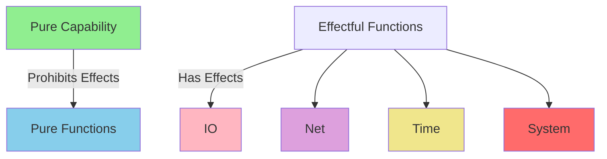
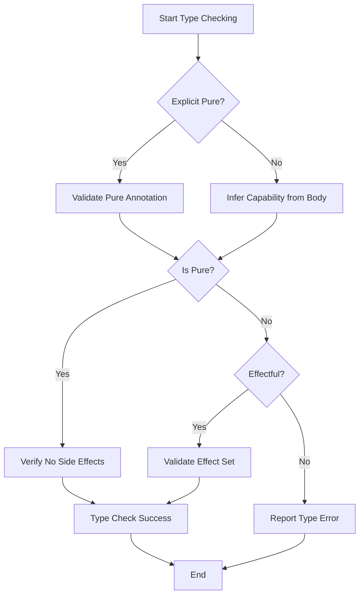
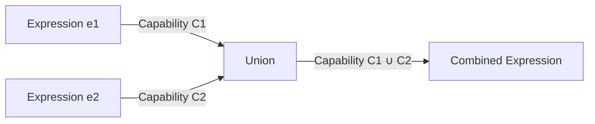

# Pure Type Specification

* File:* `type\pure_type_spec.md`
* Version:* 2.0.0
* Context:* Layer 2 (Semantic Analysis)
* Formalism:* Type Theory, Effect Systems
* Status:* Active
* Last Modified:* 2026-01-03
* Author:* Kilo Code
* Reviewers:* Pending

---

## 1. Introduction

### 1.1 Purpose

This specification provides a formal mathematical definition of Pure type in Morph type system. The Pure type is a foundational concept that enables referential transparency, enables compiler optimizations, and ensures architectural purity by tracking absence of side effects at type level.

### 1.2 Scope

This specification covers:
- Formal mathematical definition of Pure type using type theory
- Pure as a capability that prohibits effects
- Type inference rules for Pure type checking
- Enforcement mechanisms and invariants
- Theorems and correctness properties
- Examples of Pure and non-Pure functions

This specification does not cover:
- Concrete implementation of type checker
- Runtime representation of Pure types
- Integration with specific compiler phases

### 1.3 Definitions, Acronyms, and Abbreviations

| Term | Definition |
|-------|------------|
| **Pure** | A capability representing functions with no side effects, referential transparency, and deterministic behavior |
| **Capability** | A type-level annotation that restricts what operations are allowed |
| **Referential Transparency** | Property that an expression can be replaced with its value without changing program behavior |
| **Side Effect** | Any observable change to external state (I/O, mutation, network, time, system calls) |
| **Effect Lattice** | A partially ordered set of effect types (IO, Net, Time, System) without Pure |
| **Subtyping** | Relationship where one type can be used where another type is expected |
| **Type Judgment** | Formal statement $\Gamma \vdash e : T$ meaning "expression $e$ has type $T$ in environment $\Gamma$" |

### 1.4 References

- Pierce, B. C. (2002). "Types and Programming Languages"
- Wadler, P. (1998). "The Marriage of Effects and Monads"
- Plotkin, G. D., & Power, J. (2002). "Notions of Computation Determine Monads"
- ISO/IEC 29148: Systems and software engineering — Requirements engineering
- IEEE 1016: Recommended Practice for Software Design Descriptions

### 1.5 Cross-References

The Pure Type Specification is closely related to several other Morph specifications:

* Type System Specifications:*
- [`spec/type/type_system_spec.md`](./type_system_spec.md) - Overall type system architecture and effect categories
- [`spec/type/type_category_spec.md`](./type_category_spec.md) - Category theory foundations for types
- [`spec/type/type_unification_spec.md`](./type_unification_spec.md) - Type unification algorithm

* Language Specifications:*
- [`spec/language/scoping_lambda_calculus_spec.md`](../language/scoping_lambda_calculus_spec.md) - Lambda calculus and scoping rules
- [`spec/language/morph_language_spec.md`](../language/morph_language_spec.md) - Core language syntax and semantics

* Concurrency Specifications:*
- [`spec/concurrency/monadic_effect_spec.md`](../concurrency/monadic_effect_spec.md) - Monadic effect handling
- [`spec/concurrency/execution_model_spec.md`](../concurrency/execution_model_spec.md) - Execution model and effect propagation

* Security Specifications:*
- [`spec/security/security_flow_spec.md`](../security/security_flow_spec.md) - Security flow analysis and effect-based access control

* Tooling Specifications:*
- [`spec/tooling/operational_semantics_spec.md`](../tooling/operational_semantics_spec.md) - Operational semantics for Pure functions
- [`spec/tooling/comptime_partial_eval_spec.md`](../tooling/comptime_partial_eval_spec.md) - Compile-time evaluation of Pure expressions

* Note:* This specification provides authoritative definition of Pure type that supersedes all previous references in listed specifications.

---

## 2. Formal Definitions

### 2.1 Pure Type as a Capability

The Pure type is defined as a **capability** in Morph type system, not as an effect level:

$$
\text{Pure} : \text{Capability}
$$

A Pure type is a type constructor that wraps a value type $T$ to indicate that value is computed **without any side effects**:

$$
\text{Pure}(T) : \text{Type} \quad \text{where} \quad T : \text{Type}
$$

**Key Distinction:* Pure is a capability that **prohibits** effects, not an effect level that represents a subset of effects. A Pure function cannot have any effects, whereas effectful functions have specific effect sets (IO, Net, Time, System). This distinction is critical for understanding the type system design.

### 2.2 Formal Semantics

A function $f: A \to B$ is **Pure** if and only if it satisfies the following three properties:

#### 2.2.1 Referential Transparency

$$
\forall x_1, x_2 \in A. \quad x_1 = x_2 \implies f(x_1) = f(x_2)
$$

**Interpretation:* For any two equal inputs, function produces equal outputs. This means that function's result depends only on its arguments, not on any external state.

#### 2.2.2 Absence of Side Effects

$$
\neg \text{hasSideEffects}(f)
$$

Where $\text{hasSideEffects}(f)$ is true if $f$ performs any of the following:
- I/O operations (reading/writing files, console, network)
- Mutation of external state (global variables, heap objects)
- System calls (process spawning, FFI)
- Non-deterministic operations (random number generation, clock access)

#### 2.2.3 Determinism

$$
\forall x \in A. \quad \exists! y \in B. \quad f(x) = y
$$

**Interpretation:* For every input $x$, there exists exactly one output $y$. The function always produces the same result for the same input.

### 2.3 Combined Formal Definition

$$
\text{pure}(f: A \to B) \iff
\begin{cases}
\forall x_1, x_2 \in A. \quad x_1 = x_2 \implies f(x_1) = f(x_2) \quad \land \\
\neg \text{hasSideEffects}(f) \quad \land \\
\forall x \in A. \quad \exists! y \in B. \quad f(x) = y
\end{cases}
$$

### 2.4 Relationship to Effect System

The Pure capability is **orthogonal** to the effect system. While effectful functions have effect sets (IO, Net, Time, System), Pure functions have **no effects**:

$$
\text{Pure} \cap \text{IO} = \emptyset \\
\text{Pure} \cap \text{Net} = \emptyset \\
\text{Pure} \cap \text{Time} = \emptyset \\
\text{Pure} \cap \text{System} = \emptyset
$$

**Important:* Pure is NOT part of the effect lattice. The effect lattice consists only of IO, Net, Time, and System. Pure is a separate capability that prohibits all effects.

#### 2.4.1 Effect Type Definitions (for reference)

The effect system defines the following effect types (from [`spec/type/effect_system_spec.md`](./effect_system_spec.md)):

$$
\begin{aligned}
\text{IO} &= \{\text{FileIO}, \text{ConsoleIO}\} \\
\text{Net} &= \text{IO} \cup \{\text{Network}\} \\
\text{Time} &= \text{Net} \cup \{\text{Clock}\} \\
\text{System} &= \text{Time} \cup \{\text{FFI}, \text{Process}\}
\end{aligned}
$$

#### 2.4.2 Effect Lattice (for reference)

The effect types form a complete lattice under subset ordering:

$$
\text{IO} \sqsubseteq \text{Net} \sqsubseteq \text{Time} \sqsubseteq \text{System}
$$

where $\sqsubseteq$ denotes effect subtyping relation (less effects $\subseteq$ more effects).

**Note:* Pure is not included in this lattice. Pure is a capability that is incompatible with all effect types.

### 2.5 Pure Function Type

A Pure function type is denoted as:

$$
A \xrightarrow{\text{Pure}} B
$$

or equivalently:

$$
\text{Pure}(A \to B)
$$

This represents a function from $A$ to $B$ that has no side effects.

### 2.6 Pure Type Constructor

The Pure type can be applied to any type $T$:

$$
\text{Pure}: \text{Type} \to \text{Type}
$$

For a value $v$ of type $T$, $\text{Pure}(v)$ is a value of type $\text{Pure}(T)$.

---

## 3. Requirements

### 3.1 Functional Requirements

- **PURE-REQ-001:* THE system SHALL enforce that Pure functions satisfy referential transparency.

  - `Priority:* Critical
  - Verification Method:* Test
  - `Rationale:* Ensures that Pure functions can be reasoned about mathematically
  - `Dependencies:* None
  - `Traceability:* Section 2.2.1 (Referential Transparency)

- **PURE-REQ-002:* THE system SHALL enforce that Pure functions have no side effects.

  - `Priority:* Critical
  - Verification Method:* Test
  - `Rationale:* Prevents unintended state mutations and I/O operations
  - `Dependencies:* PURE-REQ-001
  - `Traceability:* Section 2.2.2 (Absence of Side Effects)

- **PURE-REQ-003:* THE system SHALL enforce that Pure functions are deterministic.

  - `Priority:* Critical
  - Verification Method:* Test
  - `Rationale:* Ensures reproducible behavior and enables optimizations
  - `Dependencies:* PURE-REQ-001, PURE-REQ-002
  - `Traceability:* Section 2.2.3 (Determinism)

- **PURE-REQ-004:* THE system SHALL enforce that Pure functions cannot have any effects.

  - `Priority:* Critical
  - Verification Method:* Test
  - `Rationale:* Ensures Pure capability is strictly enforced
  - `Dependencies:* PURE-REQ-001, PURE-REQ-002, PURE-REQ-003
  - `Traceability:* Section 2.1 (Pure Type as a Capability)

- **PURE-REQ-005:* THE system SHALL infer Pure types for functions that satisfy purity conditions.

  - `Priority:* High
  - Verification Method:* Test
  - `Rationale:* Reduces annotation burden and improves developer experience
  - `Dependencies:* PURE-REQ-001, PURE-REQ-002, PURE-REQ-003
  - `Traceability:* Section 4.3 (Type Inference Rules)

- **PURE-REQ-006:* THE system SHALL reject functions marked Pure that violate purity conditions.

  - `Priority:* Critical
  - Verification Method:* Test
  - `Rationale:* Prevents incorrect purity claims that could lead to unsound optimizations
  - `Dependencies:* PURE-REQ-001, PURE-REQ-002, PURE-REQ-003
  - `Traceability:* Section 4.2 (Type Checking Rules)

### 3.2 Non-Functional Requirements

- **PURE-NFR-001:* THE system SHALL perform Pure type checking in O(n) time complexity where n is AST size.

  - `Priority:* High
  - Verification Method:* Analysis
  - `Metric:* Type checking < 100ms for 10K nodes
  - `Rationale:* Ensures fast compilation

- **PURE-NFR-002:* THE system SHALL provide clear error messages for purity violations.

  - `Priority:* High
  - Verification Method:* Demonstration
  - `Metric:* Error message includes specific violation (e.g., "I/O operation in Pure function")
  - `Rationale:* Improves developer experience

- **PURE-NFR-003:* THE system SHALL enable compiler optimizations for Pure functions.

  - `Priority:* Medium
  - Verification Method:* Analysis
  - `Metric:* Pure functions are optimized with common subexpression elimination, memoization, and constant folding
  - `Rationale:* Leverages purity for performance improvements

---

## 4. Design

### 4.1 Architecture Overview

The Pure type system is implemented as a type-level capability tracking mechanism that:

1. **Tracks Pure capability annotations** on function signatures
2. **Infers Pure capability** from function bodies when not explicitly specified
3. **Validates purity** by checking for side-effect operations
4. **Enforces strict separation** between Pure and effectful functions
5. **Enables optimizations** for Pure functions

**Key Design Principle:* Pure is a capability that prohibits effects, not an effect level. This design ensures that Pure functions cannot be composed with effectful functions, maintaining strict separation.

### 4.2 Data Structures

#### 4.2.1 Type Environment with Capabilities

- **Type Environment:* $\Gamma = \{x_1: (T_1, C_1), x_2: (T_2, C_2), \dots, x_n: (T_n, C_n)\}$

- **Components:*
  - $x_i$: Variable name
  - $T_i$: Type of variable
  - $C_i$: Capability of variable (Pure or effect set)

- **Invariants:*
  1. $\forall i \neq j, x_i \neq x_j$ (No duplicate variables)
  2. $\forall x: (T, C) \in \Gamma, C \in \{\text{Pure}\} \cup \{\text{IO}, \text{Net}, \text{Time}, \text{System}\}$

#### 4.2.2 Effect Set

- **Effect Set:* $E \subseteq \{\text{IO}, \text{Net}, \text{Time}, \text{System}\}$

- **Operations:*
  - Union: $E_1 \cup E_2 = \{e \mid e \in E_1 \lor e \in E_2\}$
  - Intersection: $E_1 \cap E_2 = \{e \mid e \in E_1 \land e \in E_2\}$
  - Subset: $E_1 \sqsubseteq E_2 \iff \forall e \in E_1, e \in E_2$

#### 4.2.3 Function Type with Capability

- **Function Type:* $T_1 \xrightarrow{C} T_2$

- **Components:*
  - $T_1$: Parameter type
  - $C$: Capability (Pure or effect set)
  - $T_2$: Return type

- **Invariants:*
  1. $C$ is a valid capability
  2. If $C = \text{Pure}$, function is Pure
  3. If $C \in \{\text{IO}, \text{Net}, \text{Time}, \text{System}\}$, function is effectful

### 4.3 Type Checking Rules

#### 4.3.1 Pure Function Rule

$$
\frac{\Gamma, x: A \vdash e: B \quad \text{isPure}(e)}{\Gamma \vdash \lambda x. e : A \xrightarrow{\text{Pure}} B}
$$

where $\text{isPure}(e)$ checks that expression $e$ has no side effects.

#### 4.3.2 Effect Subtyping Rule

$$
\frac{\Gamma \vdash e : A \xrightarrow{E_1} B \quad E_1 \sqsubseteq E_2}{\Gamma \vdash e : A \xrightarrow{E_2} B}
$$

**Interpretation:* A function with effect $E_1$ can be used where a function with effect $E_2$ is expected, provided $E_1 \sqsubseteq E_2$.

**Note:* Pure functions cannot be used where effectful functions are expected because $\text{Pure} \not\sqsubseteq E$ for any effect set $E$.

#### 4.3.3 Application Rule

$$
\frac{\Gamma \vdash e_1 : A \xrightarrow{\text{Pure}} B \quad \Gamma \vdash e_2 : A}{\Gamma \vdash e_1(e_2) : B \quad \text{with capability } \text{Pure}}
$$

**Interpretation:* Applying a Pure function to a Pure argument results in a Pure value.

#### 4.3.4 Let Binding Rule

$$
\frac{\Gamma \vdash e_1 : A \quad \Gamma, x: A \vdash e_2 : B}{\Gamma \vdash \text{let } x = e_1 \text{ in } e_2 : B}
$$

#### 4.3.5 Side Effect Detection Rules

**I/O Operation:*
$$
\frac{\Gamma \vdash e : \text{IO}(T)}{\text{hasSideEffect}(e)}
$$

**Network Operation:*
$$
\frac{\Gamma \vdash e : \text{Net}(T)}{\text{hasSideEffect}(e)}
$$

**Time Operation:*
$$
\frac{\Gamma \vdash e : \text{Time}(T)}{\text{hasSideEffect}(e)}
$$

**System Operation:*
$$
\frac{\Gamma \vdash e : \text{System}(T)}{\text{hasSideEffect}(e)}
$$

### 4.4 Type Inference Rules

#### 4.4.1 Capability Inference for Literals

$$
\frac{l \text{ is a literal}}{\Gamma \vdash l : T \quad \text{with capability } \text{Pure}}
$$

where $T$ is the type of the literal (e.g., $\text{i32}$ for integer literals).

#### 4.4.2 Capability Inference for Variables

$$
\frac{x: (T, C) \in \Gamma}{\Gamma \vdash x : T \quad \text{with capability } C}
$$

#### 4.4.3 Capability Inference for Function Application

$$
\frac{\Gamma \vdash e_1 : A \xrightarrow{C_1} B \quad \Gamma \vdash e_2 : A \quad \text{cap}(e_2) = C_2}{\Gamma \vdash e_1(e_2) : B \quad \text{with capability } C_1}
$$

where $C_1$ and $C_2$ are the capabilities of the function and argument, respectively.

#### 4.4.4 Capability Inference for Let Binding

$$
\frac{\Gamma \vdash e_1 : A \quad \text{cap}(e_1) = C_1 \quad \Gamma, x: A \vdash e_2 : B \quad \text{cap}(e_2) = C_2}{\Gamma \vdash \text{let } x = e_1 \text{ in } e_2 : B \quad \text{with capability } C_2}
$$

#### 4.4.5 Capability Inference for Lambda Abstraction

$$
\frac{\Gamma, x: A \vdash e : B \quad \text{cap}(e) = C}{\Gamma \vdash \lambda x. e : A \xrightarrow{C} B}
$$

### 4.5 Mermaid Diagrams

#### 4.5.1 Pure vs Effectful Functions



#### 4.5.2 Type Checking Flow



#### 4.5.3 Capability Propagation



---

## 5. Correctness Properties

### 5.1 Theorems

#### 5.1.1 Type Safety Theorem for Pure Functions

- **Theorem:* If a function type-checks as Pure, then it is type-safe and has no side effects.

- **Formal Statement:*
$$
\Gamma \vdash f : A \xrightarrow{\text{Pure}} B \implies \text{safe}(f) \land \neg \text{hasSideEffects}(f)
$$

where:
- $\Gamma \vdash f : A \xrightarrow{\text{Pure}} B$ denotes that function $f$ has Pure type
- $\text{safe}(f)$ denotes that evaluation of $f$ does not produce type errors
- $\neg \text{hasSideEffects}(f)$ denotes that $f$ has no side effects

- **Proof by Structural Induction:*

*Base Cases:*

1. **Literals:* For any literal $l$, $\Gamma \vdash l : T$ with capability $\text{Pure}$.
   - Literals are always type-safe by definition
   - Literals have no side effects
   - Therefore, $\text{safe}(l) \land \neg \text{hasSideEffects}(l)$

2. **Variables:* For any variable $x$ with type $(T, \text{Pure})$ in $\Gamma$, $\Gamma \vdash x : T$ with capability $\text{Pure}$.
   - Variables are bound to values of their declared type
   - Variables have no side effects
   - Therefore, $\text{safe}(x) \land \neg \text{hasSideEffects}(x)$

*Inductive Steps:*

3. **Function Application:* If $\Gamma \vdash e_1 : A \xrightarrow{\text{Pure}} B$ and $\Gamma \vdash e_2 : A$ with capability $\text{Pure}$, then $\Gamma \vdash e_1(e_2) : B$ with capability $\text{Pure}$.
   - By induction hypothesis, $e_1$ is type-safe and has no side effects
   - By induction hypothesis, $e_2$ is type-safe and has no side effects
   - Function application requires argument type matches parameter type
   - Pure functions have no side effects, so application has no side effects
   - Therefore, $\text{safe}(e_1(e_2)) \land \neg \text{hasSideEffects}(e_1(e_2))$

4. **Let Binding:* If $\Gamma \vdash e_1 : A$ with capability $\text{Pure}$ and $\Gamma, x:A \vdash e_2 : B$ with capability $\text{Pure}$, then $\Gamma \vdash \text{let } x = e_1 \text{ in } e_2 : B$ with capability $\text{Pure}$.
   - By induction hypothesis, $e_1$ is type-safe and has no side effects
   - By induction hypothesis, $e_2$ is type-safe and has no side effects in extended environment
   - Variable $x$ is bound to a value of type $A$
   - Extended environment $\Gamma, x:A$ is well-typed
   - Therefore, $\text{safe}(\text{let } x = e_1 \text{ in } e_2) \land \neg \text{hasSideEffects}(\text{let } x = e_1 \text{ in } e_2)$

5. **Lambda Abstraction:* If $\Gamma, x:A \vdash e : B$ with capability $\text{Pure}$, then $\Gamma \vdash \lambda x. e : A \xrightarrow{\text{Pure}} B$.
   - By induction hypothesis, $e$ is type-safe and has no side effects in extended environment
   - Lambda abstraction creates a function with parameter type $A$ and return type $B$
   - The function body has no side effects, so function is Pure
   - Therefore, $\text{safe}(\lambda x. e) \land \neg \text{hasSideEffects}(\lambda x. e)$

*Conclusion:*
By structural induction on the syntax of expressions, if $\Gamma \vdash e : T$ with capability $\text{Pure}$, then $\text{safe}(e) \land \neg \text{hasSideEffects}(e)$. Therefore, Pure type-checked functions are type-safe and have no side effects.

- **PURE-THM-001:* THE system SHALL guarantee type safety and absence of side effects for Pure type-checked functions.

  - `Priority:* Critical
  - Verification Method:* Analysis
  - `Rationale:* Provides formal guarantee of correctness
  - `Dependencies:* PURE-REQ-001, PURE-REQ-002, PURE-REQ-003
  - `Traceability:* Section 5.1.1 (Type Safety Theorem)

#### 5.1.2 Pure Capability Orthogonality Theorem

- **Theorem:* The Pure capability is orthogonal to the effect system.

- **Formal Statement:*
$$
\forall E \in \{\text{IO}, \text{Net}, \text{Time}, \text{System}\}. \quad \text{Pure} \cap E = \emptyset
$$

- **Proof:*

1. **Definition:* Pure is defined as a capability that prohibits all effects.
2. **Effect Sets:* Effect sets are defined as subsets of $\{\text{IO}, \text{Net}, \text{Time}, \text{System}\}$.
3. **Intersection:* The intersection of Pure (which prohibits all effects) with any effect set $E$ is the empty set.
4. **Conclusion:* Pure is orthogonal to all effect types.

- **PURE-THM-002:* THE system SHALL guarantee that Pure capability is orthogonal to the effect system.

  - `Priority:* Critical
  - Verification Method:* Analysis
  - `Rationale:* Ensures strict separation between Pure and effectful functions
  - `Dependencies:* PURE-REQ-004
  - `Traceability:* Section 2.4 (Relationship to Effect System)

#### 5.1.3 Referential Transparency Theorem

- **Theorem:* Pure functions are referentially transparent.

- **Formal Statement:*
$$
\forall f: A \xrightarrow{\text{Pure}} B. \quad \forall x_1, x_2 \in A. \quad x_1 = x_2 \implies f(x_1) = f(x_2)
$$

- **Proof:*

1. By definition of Pure type (Section 2.2.1), Pure functions satisfy referential transparency
2. Therefore, the theorem holds by definition

- **PURE-THM-003:* THE system SHALL guarantee that Pure functions are referentially transparent.

  - `Priority:* Critical
  - Verification Method:* Analysis
  - `Rationale:* Enables mathematical reasoning and optimizations
  - `Dependencies:* PURE-REQ-001
  - `Traceability:* Section 5.1.3 (Referential Transparency Theorem)

### 5.2 Invariants

#### 5.2.1 Type Invariants

- **PURE-INV-001:* THE system SHALL maintain that all Pure functions have capability $\text{Pure}$.
- **PURE-INV-002:* THE system SHALL maintain that effect sets are closed under union and intersection.
- **PURE-INV-003:* THE system SHALL maintain that effect subtyping is transitive.

#### 5.2.2 Purity Invariants

- **PURE-INV-004:* THE system SHALL maintain that Pure functions cannot call effectful functions.
- **PURE-INV-005:* THE system SHALL maintain that Pure functions cannot perform I/O operations.
- **PURE-INV-006:* THE system SHALL maintain that Pure functions cannot mutate external state.
- **PURE-INV-007:* THE system SHALL maintain that Pure functions cannot access network.
- **PURE-INV-008:* THE system SHALL maintain that Pure functions cannot access system clock.
- **PURE-INV-009:* THE system SHALL maintain that Pure functions cannot perform system calls.

---

## 6. Examples

### 6.1 Pure Function Examples

#### 6.1.1 Basic Pure Function

```morph
// Pure function: addition
pure fn add(x: i32, y: i32) -> i32 {
    ret x + y;
}
```

- **Type:* $\text{i32} \times \text{i32} \xrightarrow{\text{Pure}} \text{i32}$
- **Capability:* Pure
- **Properties:*
  - Referential transparency: $\forall x_1, x_2, y_1, y_2. \quad x_1 = x_2 \land y_1 = y_2 \implies \text{add}(x_1, y_1) = \text{add}(x_2, y_2)$
  - No side effects: No I/O, mutation, or external state access
  - Deterministic: Always produces the same result for the same inputs

#### 6.1.2 Pure Higher-Order Function

```morph
// Pure higher-order function: map
pure fn map<A, B>(f: fn(A) -> B, list: List<A>) -> List<B> {
    match list {
        [] => [],
        [head, ...tail] => [f(head), ...map(f, tail)]
    }
}
```

- **Type:* $\forall A, B. \quad (A \xrightarrow{\text{Pure}} B) \times \text{List}(A) \xrightarrow{\text{Pure}} \text{List}(B)$
- **Capability:* Pure
- **Properties:*
  - Referential transparency: Output depends only on inputs
  - No side effects: No I/O, mutation, or external state access
  - Deterministic: Always produces the same result for the same inputs

#### 6.1.3 Pure Recursive Function

```morph
// Pure recursive function: factorial
pure fn factorial(n: i32) -> i32 {
    if (n <= 1) {
        ret 1;
    } else {
        ret n * factorial(n - 1);
    }
}
```

- **Type:* $\text{i32} \xrightarrow{\text{Pure}} \text{i32}$
- **Capability:* Pure
- **Properties:*
  - Referential transparency: Output depends only on input
  - No side effects: No I/O, mutation, or external state access
  - Deterministic: Always produces the same result for the same input

### 6.2 Non-Pure Function Examples

#### 6.2.1 I/O Function

```morph
// Non-pure function: file I/O
fn readFile(path: str) -> str {
    // Side effect: reads from file system
    ret fs::read(path);
}
```

- **Type:* $\text{str} \xrightarrow{\text{IO}} \text{str}$
- **Capability:* IO
- **Violations:*
  - Not referentially transparent: Same path may return different content at different times
  - Has side effects: Performs file I/O
  - Non-deterministic: File content may change between calls

#### 6.2.2 Network Function

```morph
// Non-pure function: HTTP request
fn httpGet(url: str) -> Response {
    // Side effect: network I/O
    ret net::http::get(url);
}
```

- **Type:* $\text{str} \xrightarrow{\text{Net}} \text{Response}$
- **Capability:* Net
- **Violations:*
  - Not referentially transparent: Same URL may return different responses
  - Has side effects: Performs network I/O
  - Non-deterministic: Network conditions may vary

#### 6.2.3 Time Function

```morph
// Non-pure function: get timestamp
fn getTimestamp() -> i64 {
    // Side effect: accesses system clock
    ret time::now();
}
```

- **Type:* $\text{void} \xrightarrow{\text{Time}} \text{i64}$
- **Capability:* Time
- **Violations:*
  - Not referentially transparent: Returns different values on each call
  - Has side effects: Accesses system clock
  - Non-deterministic: Time advances between calls

#### 6.2.4 State Mutation Function

```morph
// Non-pure function: global state mutation
let counter: i32 = 0;

fn increment() -> i32 {
    // Side effect: mutates global state
    counter = counter + 1;
    ret counter;
}
```

- **Type:* $\text{void} \xrightarrow{\text{IO}} \text{i32}$
- **Capability:* IO (state mutation)
- **Violations:*
  - Not referentially transparent: Returns different values on each call
  - Has side effects: Mutates global state
  - Non-deterministic: State changes between calls

### 6.3 Pure vs Effectful Function Interaction

#### 6.3.1 Pure Function Used in Effectful Context

```morph
// Pure function
pure fn add(x: i32, y: i32) -> i32 {
    ret x + y;
}

// Effectful function that calls Pure function
fn processAndPrint(x: i32, y: i32) -> void {
    let result = add(x, y);  // Allowed: Pure function called in effectful context
    print(result);  // Side effect: I/O
}
```

- **Type Checking:*
  - `add`: $\text{i32} \times \text{i32} \xrightarrow{\text{Pure}} \text{i32}$
  - `processAndPrint`: $\text{i32} \times \text{i32} \xrightarrow{\text{IO}} \text{void}$
  - **Valid:* Pure function can be called from effectful context (no restriction on calling Pure functions)

#### 6.3.2 Effectful Function Cannot Be Used in Pure Context

```morph
// Effectful function
fn readFile(path: str) -> str {
    ret fs::read(path);
}

// Pure function that tries to call effectful function (ERROR)
pure fn processFile(path: str) -> i32 {
    let content = readFile(path);  // ERROR: Cannot call effectful function from Pure context
    ret content.length();
}
```

- **Type Checking Error:*
  - `readFile`: $\text{str} \xrightarrow{\text{IO}} \text{str}$
  - `processFile`: $\text{str} \xrightarrow{\text{Pure}} \text{i32}$
  - **Invalid:* Pure functions cannot call effectful functions

### 6.4 Edge Cases

#### 6.4.1 Empty Function

```morph
// Pure function: empty function
pure fn noop() -> void {
    // No operations
}
```

- **Type:* $\text{void} \xrightarrow{\text{Pure}} \text{void}$
- **Capability:* Pure
- **Properties:*
  - Referential transparency: Always returns void
  - No side effects: No operations
  - Deterministic: Always returns void

#### 6.4.2 Function with Multiple Returns

```morph
// Pure function: conditional return
pure fn abs(x: i32) -> i32 {
    if (x < 0) {
        ret -x;
    } else {
        ret x;
    }
}
```

- **Type:* $\text{i32} \xrightarrow{\text{Pure}} \text{i32}$
- **Capability:* Pure
- **Properties:*
  - Referential transparency: Output depends only on input
  - No side effects: No I/O, mutation, or external state access
  - Deterministic: Always produces the same result for the same input

#### 6.4.3 Function with Pure Closure

```morph
// Pure function: returns closure
pure fn makeAdder(n: i32) -> fn(i32) -> i32 {
    ret fn(x: i32) -> i32 {
        ret x + n;
    };
}
```

- **Type:* $\text{i32} \xrightarrow{\text{Pure}} (\text{i32} \xrightarrow{\text{Pure}} \text{i32})$
- **Capability:* Pure
- **Properties:*
  - Referential transparency: Output depends only on input
  - No side effects: No I/O, mutation, or external state access
  - Deterministic: Always produces the same result for the same input

---

## Change Log

| Version | Date       | Author      | Changes                                                                 |
|---------|------------|-------------|-------------------------------------------------------------------------|
| 1.0.0   | 2026-01-02 | Kilo Code    | Initial version with formal Pure type definition, effect lattice, type checking rules, theorems, and examples |
| 2.0.0   | 2026-01-03 | Kilo Code    | **RESOLVED CONTRADICTION C-002:* Redefined Pure as a capability (not effect level), removed Pure from effect lattice, clarified orthogonality between Pure and effect system, updated type checking rules to enforce strict separation |
