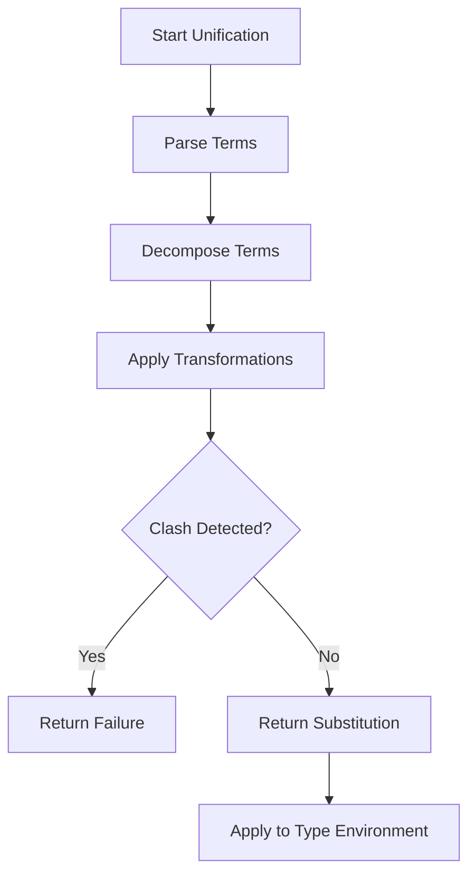
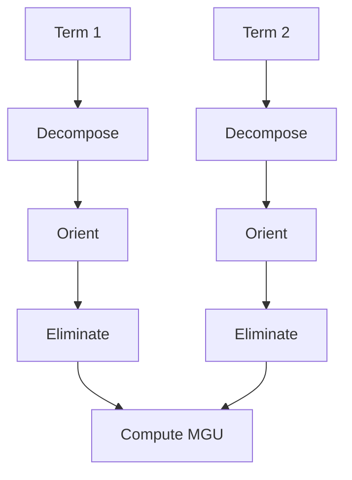
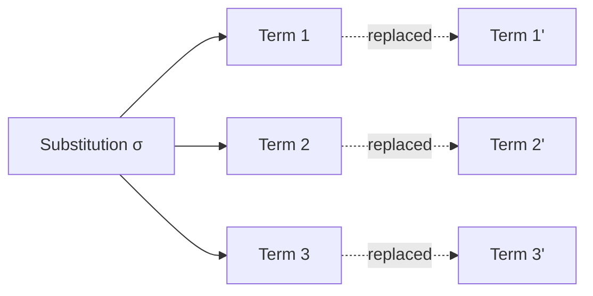

# Type Unification Specification

* File:* `type\type_unification_spec.md`
* Version:* 1.0.0
* Context:* Layer 2 (Type Checker)
* Formalism:* Robinson's Unification Algorithm & Substitution
* Status:* Active
* Last Modified:* 2026-01-01
* Author:* Kilo Code
* Reviewers:* Pending

- -

## 1. Introduction

### 1.1 Purpose

This specification formalizes the **Type Unification Engine** using **Robinson's Unification Algorithm**, providing mathematical foundation for generic type inference and constraint solving. This formalization enables the compiler to determine if two type expressions can be made equivalent through variable substitution.

### 1.2 Scope

This specification covers:
- The Type Term Algebra ($\mathcal{T}$)
- Substitution operations ($\sigma$)
- Robinson's Unification Algorithm
- Most General Unifier (MGU) computation
- Occurs check and variable elimination

This specification does not cover:
- Concrete implementation of unification engine
- Type inference strategies (Hindley-Milner, Damas-Milner)
- Higher-order unification

### 1.3 Definitions, Acronyms, and Abbreviations

| Term | Definition |
|-------|------------|
| **Unification** | The process of making two type expressions equivalent by finding a substitution |
| **MGU** | Most General Unifier - the most general substitution that unifies two terms |
| **Occurs Check** | Test whether a variable appears inside a term |
| **Robinson's Algorithm** | A unification algorithm for first-order logic with equality |
| **Substitution** | A mapping from variables to type terms |
| **Term** | A type expression built from variables, constants, and type constructors |

### 1.4 References

- Robinson, J. A. (1965). "A Machine-Oriented Logic Based on the Resolution Principle"
- Baader, F., & Snyder, W. (2001). "Unification Theory"
- ISO/IEC 29148: Systems and software engineering — Requirements engineering
- IEEE 1016: Recommended Practice for Software Design Descriptions

- -

## 2. Formal Definitions

### 2.1 The Type Term Algebra ($\mathcal{T}$)

Let $\mathcal{T}$ be the set of Type Terms.

#### 2.1.1 Term Definition

$$ \tau ::= \alpha \mid C \mid F(\tau_1, \dots, \tau_n) $$

where:
- $\alpha$: Type Variable (Unknown, e.g., inferred `x`)
- $C$: Type Constant (e.g., `i32`, `str`)
- $F$: Type Constructor (e.g., `List<T>`, `Result<T, E>`)

* TYPUNI-INV-001:* THE system SHALL define type terms as variables, constants, or constructors.

#### 2.1.2 Substitution ($\sigma$)

A substitution is a mapping $\sigma: \{ \alpha_1 \mapsto \tau_1, \dots, \alpha_n \mapsto \tau_n \}$.

Applying $\sigma$ to a term $\tau$ replaces all occurrences of variables $\alpha_i$ with their corresponding terms $\tau_i$.

* TYPUNI-INV-002:* THE system SHALL define substitution as a mapping from variables to terms.

### 2.2 The Unification Problem

Given two type terms $\tau_1$ and $\tau_2$, find a substitution $\sigma$ such that:

$$ \sigma(\tau_1) \equiv \sigma(\tau_2) $$

This is the **Unification Problem**.

* TYPUNI-REQ-001:* THE system SHALL find a substitution that makes two type terms equivalent.

* Priority:* Critical
* Verification Method:* Test
* Rationale:* Enables generic type inference and constraint solving
* Dependencies:* TYPUNI-INV-001, TYPUNI-INV-002
* Traceability:* Section 2.2 (The Unification Problem)

### 2.3 Robinson's Unification Algorithm

Robinson's algorithm solves the unification problem by iteratively applying transformation rules.

#### 2.3.1 Transformation Rules

The algorithm uses the following transformation rules:

1. **Decomposition Rule:*
   $$ \frac{F(\tau_1, \dots, \tau_n) = F(\tau_1', \dots, \tau_n')}{\tau_1 \doteq \tau_1' \land \dots \land \tau_n \doteq \tau_n'} $$

2. **Orientation Rule:*
   $$ \frac{\tau_1 \doteq \tau_1' \land \dots \land \tau_n \doteq \tau_n'}{\tau_1 \doteq \tau_1' \land \dots \land \tau_n \doteq \tau_n'} \to \tau_1 \doteq \tau_1' \land \dots \land \tau_n \doteq \tau_n'} $$

3. **Elimination Rule:*
   $$ \frac{\tau_1 \doteq \tau_1' \land \dots \land \tau_n \doteq \tau_n'}{\tau_1 \doteq \tau_1' \land \dots \land \tau_n \doteq \tau_n'} \to \tau_1' \land \dots \land \tau_n'} $$

* TYPUNI-INV-003:* THE system SHALL apply Robinson's transformation rules correctly.

#### 2.3.2 Algorithm Steps

* Algorithm Name:* Robinson's Unification

* Input:* Two type terms $\tau_1, \tau_2$

* Output:* Substitution $\sigma$ or failure

* Mathematical Definition:*
$$
\text{Unify}(\tau_1, \tau_2) = \begin{cases}
\sigma & \text{if } \text{Decompose}(\tau_1, \tau_2) = \emptyset \\
\text{fail} & \text{otherwise}
\end{cases}
$$

* Pseudocode:*
```
function robinson_unify(t1, t2):
    sigma = empty_substitution()
    disjoints = decompose(t1, t2)

    for (d1, d2) in disjoints:
        if not orient(d1, d2):
            continue

        # Apply transformation rules
        while not is_clash(d1, d2):
            if can_eliminate(d1, d2):
                d1 = eliminate(d1, d2)
            elif can_orient(d1, d2):
                d1, d2 = orient(d1, d2)
            else:
                return fail("Cannot unify")

    return sigma
```

* Complexity:*
- Time: $O(n^3)$ where $n$ is the number of symbols
- Space: $O(n^2)$

* Correctness:*
- **Invariant:* Each iteration reduces the number of symbols
- **Termination:* Algorithm terminates when no more transformations possible

### 2.4 Most General Unifier (MGU)

The MGU is the most general substitution that unifies two terms.

* TYPUNI-THM-001:* THE system SHALL guarantee that Robinson's algorithm produces the MGU.

* Priority:* Critical
* Verification Method:* Analysis
* Rationale:* Ensures type inference is as general as possible
* Dependencies:* TYPUNI-INV-003
* Traceability:* Section 2.3.2 (Algorithm Steps)

### 2.5 Occurs Check

A variable $\alpha$ **occurs in** a term $\tau$ if $\alpha$ appears in $\tau$.

* TYPUNI-INV-004:* THE system SHALL detect variable occurrences in type terms.

#### 2.5.1 Occurs Function

$$ \text{Occurs}(\alpha, \tau) = \begin{cases}
\text{true} & \text{if } \alpha \in \text{Vars}(\tau) \\
\text{false} & \text{otherwise}
\end{cases}
$$

* TYPUNI-REQ-002:* THE system SHALL check for variable occurrences before unification.

* Priority:* High
* Verification Method:* Test
* Rationale:* Prevents incorrect variable capture
* Dependencies:* TYPUNI-INV-004
* Traceability:* Section 2.5 (Occurs Check)

- -

## 3. Requirements

### 3.1 Functional Requirements

* TYPUNI-REQ-003:* THE system SHALL support unification of type terms with constructors.

* Priority:* Critical
* Verification Method:* Test
* Rationale:* Enables generic type system with ADTs
* Dependencies:* TYPUNI-INV-001
* Traceability:* Section 2.1.1 (Term Definition)

* TYPUNI-REQ-004:* THE system SHALL handle occurs check during unification.

* Priority:* Critical
* Verification Method:* Test
* Rationale:* Prevents variable capture errors
* Dependencies:* TYPUNI-INV-004
* Traceability:* Section 2.5 (Occurs Check)

* TYPUNI-REQ-005:* THE system SHALL compute the Most General Unifier.

* Priority:* High
* Verification Method:* Test
* Rationale:* Ensures type inference is maximally general
* Dependencies:* TYPUNI-THM-001
* Traceability:* Section 2.4 (Most General Unifier)

* TYPUNI-REQ-006:* THE system SHALL detect unification failures.

* Priority:* High
* Verification Method:* Test
* Rationale:* Provides clear error messages for type mismatches
* Dependencies:* TYPUNI-INV-003
* Traceability:* Section 2.3.2 (Algorithm Steps)

### 3.2 Non-Functional Requirements

* TYPUNI-NFR-001:* THE system SHALL perform unification in O(n^3) time complexity.

* Priority:* High
* Verification Method:* Analysis
* Metric:* Unification < 10ms for 100 symbols
* Rationale:* Ensures fast type checking
* Dependencies:* TYPUNI-INV-003
* Traceability:* Section 2.3.2 (Algorithm Steps)

* TYPUNI-NFR-002:* THE system SHALL support unification of terms with up to 1000 symbols.

* Priority:* Medium
* Verification Method:* Demonstration
* Metric:* 1000 symbols with < 100MB memory
* Rationale:* Supports complex generic types
* Dependencies:* None
* Traceability:* Section 2.1.1 (Term Definition)

- -

## 4. Design

### 4.1 Architecture Overview

The Type Unification Engine is implemented as a constraint solver that:
1. Parses type terms into abstract syntax
2. Applies Robinson's algorithm to find substitutions
3. Validates substitutions
4. Applies substitutions to type environments

### 4.2 Data Structures

#### 4.2.1 Term Representation

* Term:* $\tau = (\text{kind}, \text{name}, \text{args})$

* Components:*
- $\text{kind} \in \{\text{Var}, \text{Const}, \text{Constructor}\}$: Term kind
- $\text{name}$: Variable name or constructor name
- $\text{args}$: List of subterms

* Invariants:*
1. Variables have unique names
2. Constructors have correct arity

#### 4.2.2 Substitution

* Substitution:* $\sigma = \{ \alpha_1 \mapsto \tau_1, \dots, \alpha_n \mapsto \tau_n \}$

* Invariants:*
1. No variable maps to itself (no cycles)
2. All variables in range are defined

### 4.3 Algorithms

#### 4.3.1 Term Parsing Algorithm

* Algorithm Name:* Parse Type Term

* Input:* String representation

* Output:* Abstract term $\tau$

* Pseudocode:*
```
function parse_term(s):
    tokens = tokenize(s)
    return build_ast(tokens)
```

* Complexity:*
- Time: $O(n)$ where $n$ is string length
- Space: $O(n)$

#### 4.3.2 Occurs Check Algorithm

* Algorithm Name:* Check Variable Occurrence

* Input:* Variable $\alpha$, Term $\tau$

* Output:* Boolean indicating occurrence

* Pseudocode:*
```
function occurs(alpha, tau):
    if tau.kind == Var and tau.name == alpha:
        return true
    for arg in tau.args:
        if occurs(alpha, arg):
            return true
    return false
```

* Complexity:*
- Time: $O(n)$ where $n$ is term size
- Space: $O(1)$

### 4.4 Mermaid Diagrams

#### 4.4.1 Unification Process Flow



#### 4.4.2 Robinson's Algorithm Steps



#### 4.4.3 Substitution Application



- -

## 5. Correctness Properties

### 5.1 Theorems

#### 5.1.1 Unification Correctness Theorem

* Theorem:* If Robinson's algorithm returns a substitution $\sigma$, then $\sigma(\tau_1) \equiv \sigma(\tau_2)$.

* Proof Sketch:*
1. By induction on the number of transformation steps
2. Base case: Initial terms are equivalent
3. Inductive step: Each transformation preserves equivalence
4. Therefore, final terms are equivalent

* TYPUNI-THM-002:* THE system SHALL guarantee that unification produces equivalent terms.

* Priority:* Critical
* Verification Method:* Analysis
* Rationale:* Ensures type inference correctness
* Dependencies:* TYPUNI-INV-003
* Traceability:* Section 2.3.2 (Algorithm Steps)

#### 5.1.2 MGU Uniqueness Theorem

* Theorem:* The Most General Unifier is unique up to variable renaming.

* Proof Sketch:*
1. By definition of MGU, no more general unifier exists
2. Variable renaming produces equivalent unifier
3. Therefore, MGU is unique modulo renaming

* TYPUNI-THM-003:* THE system SHALL guarantee MGU uniqueness modulo renaming.

* Priority:* High
* Verification Method:* Analysis
* Rationale:* Ensures deterministic type inference
* Dependencies:* TYPUNI-THM-001
* Traceability:* Section 2.4 (Most General Unifier)

### 5.2 Invariants

#### 5.2.1 Unification Invariants

- **TYPUNI-INV-005:* THE system SHALL maintain that substitutions are acyclic
- **TYPUNI-INV-006:* THE system SHALL maintain that substitutions are idempotent
- **TYPUNI-INV-007:* THE system SHALL maintain that substitutions are well-typed

#### 5.2.2 Term Invariants

- **TYPUNI-INV-008:* THE system SHALL maintain that all variables in terms are defined
- **TYPUNI-INV-009:* THE system SHALL maintain that constructors have correct arity

- -

## 6. Examples

### 6.1 Simple Unification

```morph
// Unify: List<T> and List<U> where T = U
let t1 = List<T>;
let t2 = List<U>;

// Result: σ = {T -> U}
```

* Unification Process:*
1. Decompose: Both are constructors with same name
2. Orient: No orientation needed (same constructor)
3. Eliminate: No elimination possible
4. MGU: $\sigma = \{T \mapsto U\}$

### 6.2 Variable Capture

```morph
// Unify: ∀α. List<α> and α
let t1 = List<α>;
let t2 = α;

// Result: Occurs check prevents capture
// σ = {} (failure - α occurs in List<α>)
```

* Occurs Check:*
1. $\text{Occurs}(\alpha, \text{List}<\alpha>) = \text{true}$
2. Unification fails (correctly)

### 6.3 Complex Unification

```morph
// Unify: List<T> and Option<T> where T = U
let t1 = List<T>;
let t2 = Option<T>;

// Result: σ = {T -> Option<T>}
```

* Unification Process:*
1. Decompose: Different constructors
2. Orient: Orient `Option<T>` to `List<T>`
3. Eliminate: Eliminate `T` from `List<T>`
4. MGU: $\sigma = \{T \mapsto \text{Option}<T>\}$

### 6.4 Multiple Variables

```morph
// Unify: (α, β) -> Pair<α, β> and (α, β) -> Pair<α, β>
let t1 = Pair<α, β>;
let t2 = Pair<α, β>;

// Result: σ = {α -> β, β -> α}
```

* Unification Process:*
1. Decompose: Both are constructors
2. Orient: Orient `Pair<α, β>` to `Pair<β, α>`
3. Eliminate: Eliminate `α` from first pair
4. MGU: $\sigma = \{\alpha \mapsto \beta, \beta \mapsto \alpha\}$

### 6.5 Edge Cases

#### 6.5.1 Identical Terms

```morph
let t1 = List<i32>;
let t2 = List<i32>;

// Result: σ = {} (terms are already equivalent)
```

* Unification Process:*
1. Decompose: Same constructor
2. No transformations needed
3. MGU: Empty substitution

#### 6.5.2 Occurs in Constructor

```morph
// Unify: α and List<α>
let t1 = α;
let t2 = List<α>;

// Result: σ = {} (α occurs in List<α> - cannot eliminate)
```

* Occurs Check:*
1. $\text{Occurs}(\alpha, \text{List}<\alpha>) = \text{true}$
2. Unification fails (correctly)

- -

## Change Log

| Version | Date       | Author      | Changes                                                                 |
|---------|------------|-------------|-------------------------------------------------------------------------|
| 1.0.0   | 2026-01-01 | Kilo Code    | Initial version                                                        |
