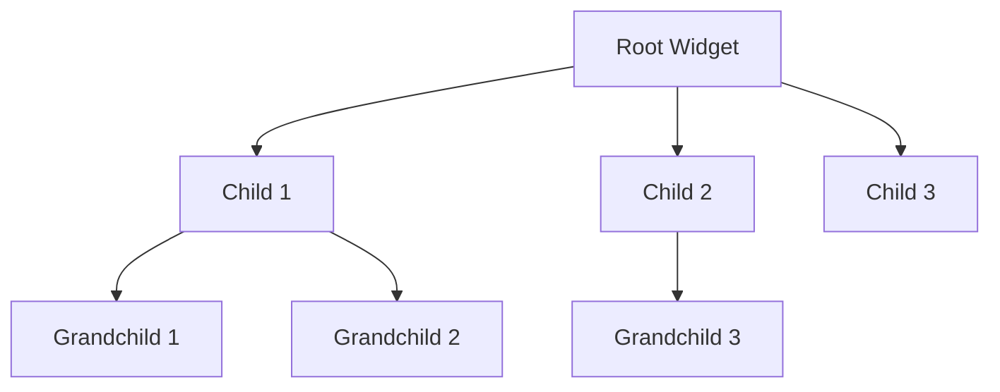
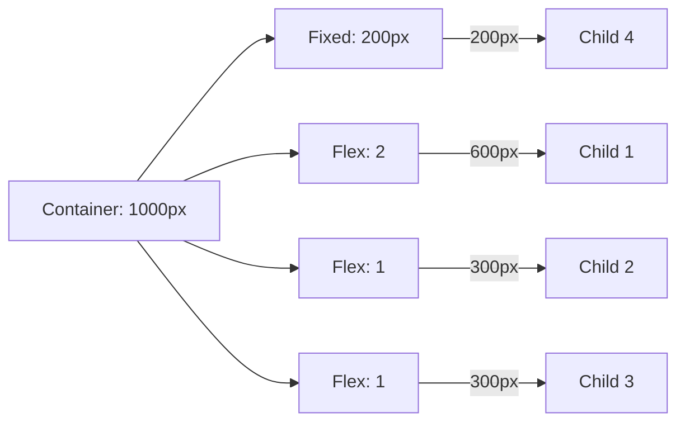
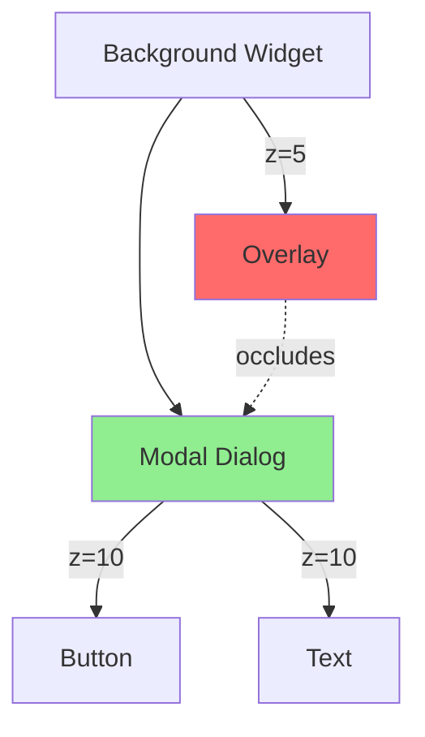
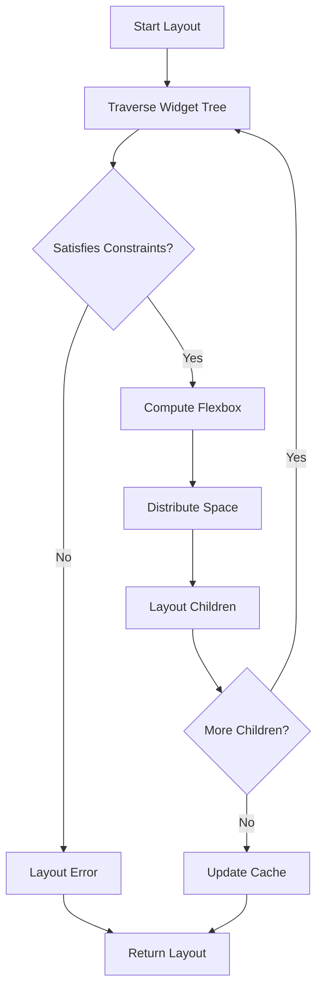

# UI Constraint Algebra Specification

- `File:* `ui\ui_constraint_algebra_spec.md`
- `Version:* 1.0.0
- `Context:* Layer 4 (Frontend) - SAP
- `Formalism:* Linear Inequalities, Box Model Algebra
- `Status:* Active
- Last Modified:* 2026-01-01
- `Author:* Kilo Code
- `Reviewers:* Pending

- -

## 1. Introduction

### 1.1 Purpose

This specification formalizeses **UI Layout Engine** using **Constraint Algebra**, providing mathematical foundation for automatic layout computation and semantic accessibility. This formalization enables compiler to reason about widget geometry, occlusion, and visibility.

* Note:* The layout geometry computed by this specification is consumed by **Semantic Accessibility Protocol (SAP)** defined in [`spec/ui/semantic_accessibility_spec.md`](ui/semantic_accessibility_spec.md). SAP uses computed geometry to build a semantic tree for agent interaction.

### 1.2 Scope

This specification covers:
- The Widget Definition as a tuple of constraints, state, and children
- The Layout Function ($\lambda$) mapping widgets to geometry
- The Flexbox Algebraic Structure for flexible layouts
- Occlusion Logic (Z-Ordering) for semantic accessibility

This specification does not cover:
- Concrete implementation of layout engine
- Rendering algorithms
- Event handling for UI interactions

### 1.3 Definitions, Acronyms, and Abbreviations

| Term | Definition |
|-------|------------|
| **Widget** | A UI component with constraints, state, and children |
| **Layout Function** | A function that computes geometry from widget tree and viewport |
| **Box Constraint** | A tuple specifying minimum and maximum dimensions |
| **Flexbox** | A layout model where children share available space proportionally |
| **Occlusion** | When one widget visually covers another |
| **Z-Ordering** | The stacking order of widgets for rendering |
| **SAP** | Semantic Accessibility Protocol - ensures UI is perceivable by agents |
| **Viewport** | The visible area of screen or container |

### 1.4 References

- IEEE 1471: Recommended Practice for Architectural Description
- CSS Flexbox Specification (W3C)
- ISO/IEC 40500: Ergonomics of human-system interaction
- ISO/IEC 29148: Systems and software engineering — Requirements engineering

- -

## 2. Formal Definitions

### 2.1 The Widget Definition

A Widget $W$ is a tuple $(C, S, \chi)$ where:

- $C$: A set of **Intrinsic Constraints** (Min/Max Width/Height)
- $S$: A **State** vector (semantic properties)
- $\chi$: An ordered sequence of child Widgets

#### 2.1.1 Intrinsic Constraints

$$ C = \{ (w_{min}, w_{max}), (h_{min}, h_{max}) \} $$

where:
- $w_{min}, w_{max} \in \mathbb{R}^+ \cup \{\infty\}$: Width constraints
- $h_{min}, h_{max} \in \mathbb{R}^+ \cup \{\infty\}$: Height constraints

- UICST-INV-001:* THE system SHALL enforce intrinsic constraints for all widgets.

#### 2.1.2 State Vector

$$ S = \{ s_1, s_2, \dots, s_k \} $$

where each $s_i$ represents a semantic property (e.g., visible, enabled, focused).

- UICST-INV-002:* THE system SHALL maintain state vector for all widgets.

### 2.2 The Layout Function ($\lambda$)

Layout is a function mapping a Widget Tree and a Viewport Constraint to a Geometry Tree.

$$ \lambda: (W, \text{Box}) \to \text{Rect} $$

Where a Box constraint is a tuple $(w_{min}, w_{max}, h_{min}, h_{max})$.

#### 2.2.1 Rect Definition

$$ \text{Rect} = (x, y, w, h) $$

where:
- $(x, y)$: Top-left corner position
- $(w, h)$: Width and height

- UICST-INV-003:* THE system SHALL represent geometry as rectangles.

### 2.3 The Flexbox Algebraic Structure

For a `Row` (Flex container) containing children $c_1 \dots c_n$ with flex factors $f_1 \dots f_n$:

#### 2.3.1 Available Space ($S_{avail}$)

$$ S_{avail} = w_{max} - \sum \text{FixedWidths} $$

where $\text{FixedWidths}$ are children with fixed widths.

- UICST-REQ-001:* THE system SHALL calculate available space as maximum minus fixed widths.

- Priority:* Critical
- Verification Method:* Test
- Rationale:* Enables proportional distribution of remaining space
- Dependencies:* UICST-INV-001
- Traceability:* Section 2.3 (The Flexbox Algebraic Structure)

#### 2.3.2 Total Flex ($F_{total}$)

$$ F_{total} = \sum f_i $$

- UICST-REQ-002:* THE system SHALL sum all flex factors for distribution.

- Priority:* Critical
- Verification Method:* Test
- Rationale:* Determines proportional sharing of available space
- Dependencies:* None
- Traceability:* Section 2.3.2 (Total Flex)

#### 2.3.3 Distribution Rule

$$ \text{Width}(c_i) = \text{Base}(c_i) + S_{avail} \cdot \frac{f_i}{F_{total}} $$

- UICST-REQ-003:* THE system SHALL distribute available space proportionally to flex factors.

- Priority:* Critical
- Verification Method:* Test
- Rationale:* Implements flexbox layout algorithm
- Dependencies:* UICST-REQ-001, UICST-REQ-002
- Traceability:* Section 2.3.3 (Distribution Rule)

### 2.4 Occlusion Logic (Z-Ordering)

For Semantic Accessibility Protocol (SAP), we define Visibility $V$ as a boolean predicate.

Given two Rects $R_A, R_B$ with Z-indices $Z_A, Z_B$:

$$ \text{Occluded}(A, B) \iff (R_A \cap R_B \neq \emptyset) \land (Z_B > Z_A) $$

If $\exists B$ such that $\text{Occluded}(A, B)$ is true and $R_A \subseteq R_B$, then $A$ is **Invisible** to user (and thus to Agent).

- UICST-THM-001:* THE system SHALL guarantee that occluded widgets are invisible to agents.

- Priority:* High
- Verification Method:* Analysis
- Rationale:* Enables semantic accessibility analysis
- Dependencies:* UICST-INV-003
- Traceability:* Section 2.4 (Occlusion Logic)

- -

## 3. Requirements

### 3.1 Functional Requirements

- UICST-REQ-004:* THE system SHALL compute layout for widget trees.

- Priority:* Critical
- Verification Method:* Test
- Rationale:* Enables automatic UI layout
- Dependencies:* None
- Traceability:* Section 2.2 (The Layout Function)

- UICST-REQ-005:* THE system SHALL enforce intrinsic constraints during layout.

- Priority:* Critical
- Verification Method:* Test
- Rationale:* Ensures widgets respect their size limits
- Dependencies:* UICST-INV-001
- Traceability:* Section 2.1.1 (Intrinsic Constraints)

- UICST-REQ-006:* THE system SHALL support flexbox layout model.

- Priority:* High
- Verification Method:* Test
- Rationale:* Enables flexible, responsive layouts
- Dependencies:* UICST-REQ-001, UICST-REQ-002, UICST-REQ-003
- Traceability:* Section 2.3 (The Flexbox Algebraic Structure)

- UICST-REQ-007:* THE system SHALL detect occlusion for semantic accessibility.

- Priority:* High
- Verification Method:* Test
- Rationale:* Enables SAP to determine widget visibility
- Dependencies:* UICST-THM-001
- Traceability:* Section 2.4 (Occlusion Logic)

- UICST-REQ-008:* THE system SHALL maintain Z-ordering for rendering.

- Priority:* High
- Verification Method:* Test
- Rationale:* Ensures correct visual stacking
- Dependencies:* None
- Traceability:* Section 2.4 (Occlusion Logic)

### 3.2 Non-Functional Requirements

- UICST-NFR-001:* THE system SHALL compute layout in O(n) time complexity where n is widget count.

- Priority:* High
- Verification Method:* Analysis
- Metric:* Layout computation < 10ms for 10K widgets
- Rationale:* Ensures responsive UI

- UICST-NFR-002:* THE system SHALL support widget trees with up to 100,000 nodes.

- Priority:* Medium
- Verification Method:* Demonstration
- Metric:* 100K widgets with < 100MB memory
- Rationale:* Supports complex UI hierarchies

- UICST-NFR-003:* THE system SHALL provide incremental layout updates.

- Priority:* High
- Verification Method:* Demonstration
- Metric:* Partial update < 1ms for changed subtree
- Rationale:* Enables smooth animations and interactions

- -

## 4. Design

### 4.1 Architecture Overview

The UI Layout Engine is implemented as a constraint solver that:
1. Traverses widget tree
2. Applies intrinsic constraints
3. Computes layout using flexbox algebra
4. Detects occlusion for semantic accessibility

### 4.2 Data Structures

#### 4.2.1 Widget Tree

- Widget Tree:* $\mathcal{T} = (W, \chi)$

- `Components:*
- $W$: Set of all widgets
- $\chi: W \to W^*$: Parent-child relationships

- `Invariants:*
1. $\exists! r \in W$ (Single root)
2. $\forall w \in W, |\chi(w)| < 1000$ (Maximum children)

#### 4.2.2 Layout Cache

- Layout Cache:* $\mathcal{C} = \{ w \mapsto \text{Rect} \}$

- `Components:*
- $w$: Widget identifier
- $\text{Rect}$: Computed geometry

- `Invariants:*
1. Cache is invalidated when widget or ancestor changes
2. Cache is invalidated when viewport changes

### 4.3 Algorithms

#### 4.3.1 Layout Computation Algorithm

- Algorithm Name:* Compute Widget Layout

- Input:* Widget tree $\mathcal{T}$, Viewport $\text{Box}$

- Output:* Geometry for all widgets

- Mathematical Definition:*
$$
\lambda(w, \text{box}) = \begin{cases}
\text{constrain}(w, \text{box}) & \text{layout}(w, \text{box}) & \text{layout}(\chi(w), \text{box}') \\
\text{fail} & \text{otherwise}
\end{cases}
$$

- Pseudocode:*
```
function compute_layout(widget, viewport):
    if not satisfies_intrinsic(widget, viewport):
        return error("Widget exceeds viewport")
    rect = compute_flexbox_layout(widget, viewport)
    for child in widget.children:
        child_rect = compute_layout(child, rect)
    return rect
```

- `Complexity:*
- Time: $O(n)$ where $n$ is number of widgets
- Space: $O(n)$ for recursion stack

- `Correctness:*
- **Invariant:* All widgets satisfy constraints
- **Termination:* Recursion terminates at leaf widgets

#### 4.3.2 Flexbox Layout Algorithm

- Algorithm Name:* Compute Flexbox Distribution

- Input:* Container widget $W$, Available space $S_{avail}$

- Output:* Widths for all children

- Mathematical Definition:*
$$
\text{Width}(c_i) = \text{Base}(c_i) + S_{avail} \cdot \frac{f_i}{\sum_{j=1}^{n} f_j}
$$

- Pseudocode:*
```
function compute_flexbox(container, available_space):
    fixed_widths = sum(child.fixed_width for child in container.children)
    flex_space = available_space - fixed_widths
    total_flex = sum(child.flex_factor for child in container.children)
    for child in container.children:
        if child.fixed_width:
            child.width = child.fixed_width
        else:
            child.width = child.base_width + flex_space * (child.flex_factor / total_flex)
    return child.widths
```

- `Complexity:*
- Time: $O(n)$ where $n$ is number of children
- Space: $O(1)$

- `Correctness:*
- **Invariant:* Total width equals available space
- **Termination:* Loop terminates after processing all children

#### 4.3.3 Occlusion Detection Algorithm

- Algorithm Name:* Detect Widget Occlusion

- Input:* Widget $A$, Set of all widgets $W$

- Output:* Boolean indicating if $A$ is occluded

- Mathematical Definition:*
$$
\text{IsOccluded}(A) = \exists B \in W \setminus \{A\} : \text{Occluded}(A, B) \land \text{FullyCovered}(A, B)
$$

- Pseudocode:*
```
function is_occluded(widget, all_widgets):
    for other in all_widgets:
        if other.z_index > widget.z_index:
            if rects_intersect(widget.rect, other.rect):
                if is_fully_covered(widget.rect, other.rect):
                    return true
    return false
```

- `Complexity:*
- Time: $O(n)$ where $n$ is number of widgets
- Space: $O(1)$

- `Correctness:*
- **Invariant:* Returns true iff widget is fully occluded
- **Termination:* Loop terminates after checking all widgets

### 4.4 Mermaid Diagrams

#### 4.4.1 Widget Tree Layout



#### 4.4.2 Flexbox Distribution



#### 4.4.3 Occlusion Detection



#### 4.4.4 Layout Computation Flow



- -

## 5. Correctness Properties

### 5.1 Theorems

#### 5.1.1 Layout Uniqueness Theorem

- Theorem:* For a given widget tree and viewport, the layout function produces a unique geometry assignment.

- Proof Sketch:*
1. Layout computation is deterministic (no randomness)
2. Flexbox distribution is uniquely defined by flex factors
3. Therefore, layout is unique

- UICST-THM-002:* THE system SHALL guarantee unique layout for given inputs.

- Priority:* High
- Verification Method:* Analysis
- Rationale:* Ensures reproducible layout
- Dependencies:* UICST-REQ-004
- Traceability:* Section 4.3.1 (Layout Computation Algorithm)

#### 5.1.2 Occlusion Correctness Theorem

- Theorem:* If a widget is fully occluded by a higher Z-index widget, then it is invisible to the user.

- Proof Sketch:*
1. By definition of occlusion, higher Z-index widget covers lower Z-index widget
2. If coverage is complete, lower widget cannot be seen
3. Therefore, lower widget is invisible

- UICST-THM-003:* THE system SHALL guarantee that fully occluded widgets are invisible.

- Priority:* High
- Verification Method:* Analysis
- Rationale:* Enables semantic accessibility
- Dependencies:* UICST-THM-001
- Traceability:* Section 2.4 (Occlusion Logic)

### 5.2 Invariants

#### 5.2.1 Layout Invariants

- **UICST-INV-004:* THE system SHALL maintain that all widgets fit within viewport
- **UICST-INV-005:* THE system SHALL maintain that flexbox distribution sums to available space
- **UICST-INV-006:* THE system SHALL maintain that widget tree is acyclic

#### 5.2.2 Occlusion Invariants

- **UICST-INV-007:* THE system SHALL maintain that Z-ordering is consistent
- **UICST-INV-008:* THE system SHALL maintain that occlusion detection is transitive
- **UICST-INV-009:* THE system SHALL maintain that self-occlusion is impossible

- -

## 6. Examples

### 6.1 Simple Flexbox Layout

```morph
type Row = {
    children: [Widget],
    direction: Row,
};

let container = Row {
    children: [
        Widget { width: Fixed(200) },
        Widget { flex: 2 },
        Widget { flex: 1 },
    ],
    viewport: Box { width: 1000 },
};
```

- Layout Computation:*
1. Fixed width: 200px
2. Available space: 1000 - 200 = 800px
3. Total flex: 2 + 1 = 3
4. Child 2: 800 * (2/3) = 533.33px
5. Child 3: 800 * (1/3) = 266.67px
6. Total: 200 + 533.33 + 266.67 = 1000px

### 6.2 Nested Flexbox

```morph
let container = Row {
    children: [
        Widget { flex: 1, children: [
            Widget { flex: 1 },
            Widget { flex: 1 },
        ]},
        Widget { flex: 2 },
    ],
    viewport: Box { width: 1000 },
};
```

- Layout Computation:*
1. Top-level available: 1000px
2. Child 1 (flex 1): 1000 * (1/3) = 333.33px
3. Child 1's children: 333.33px available
   - Grandchild 1: 333.33 * (1/2) = 166.67px
   - Grandchild 2: 333.33 * (1/2) = 166.67px
4. Child 2 (flex 2): 1000 * (2/3) = 666.67px
5. Total: 333.33 + 666.67 = 1000px

### 6.3 Occlusion Example

```morph
let modal = Widget {
    z_index: 10,
    rect: Rect { x: 100, y: 100, w: 400, h: 300 },
};

let button = Widget {
    z_index: 11,
    rect: Rect { x: 200, y: 200, w: 100, h: 50 },
    parent: modal,
};
```

- Occlusion Analysis:*
1. Modal: z=10, rect=(100, 100, 400, 300)
2. Button: z=11, rect=(200, 200, 100, 50)
3. Button is inside modal (200-100=100, 200-100=100, 100<400, 50<300)
4. Button has higher Z-index (11 > 10)
5. Button is NOT occluded (visible)

### 6.4 Full Occlusion

```morph
let overlay = Widget {
    z_index: 20,
    rect: Rect { x: 0, y: 0, w: 1920, h: 1080 },
};

let content = Widget {
    z_index: 10,
    rect: Rect { x: 100, y: 100, w: 1720, h: 880 },
};
```

- Occlusion Analysis:*
1. Overlay: z=20, rect=(0, 0, 1920, 1080)
2. Content: z=10, rect=(100, 100, 1720, 880)
3. Content is inside overlay (100-0=100, 100-100=100, 1720<1920, 880<1080)
4. Overlay has higher Z-index (20 > 10)
5. Content is FULLY occluded (invisible to user)

### 6.5 Edge Cases

#### 6.5.1 Zero Flex

```morph
let container = Row {
    children: [
        Widget { flex: 0 },  // Zero flex
        Widget { flex: 1 },
    ],
    viewport: Box { width: 1000 },
};
```

- Layout Computation:*
1. Child 1: 0px (base width only)
2. Child 2: 1000 * (1/1) = 1000px
3. Total: 0 + 1000 = 1000px

#### 6.5.2 Overflow

```morph
let container = Row {
    children: [
        Widget { width: Fixed(600) },
        Widget { width: Fixed(600) },
    ],
    viewport: Box { width: 1000 },
};
```

- Layout Computation:*
1. Fixed widths: 600 + 600 = 1200px
2. Available space: 1000 - 1200 = -200px (overflow!)
3. Layout error: "Children exceed viewport width"

#### 6.5.3 Negative Space

```morph
let container = Row {
    children: [
        Widget { width: Fixed(1200) },
    ],
    viewport: Box { width: 1000 },
};
```

- Layout Computation:*
1. Fixed width: 1200px
2. Available space: 1000 - 1200 = -200px (negative!)
3. Layout error: "Child exceeds viewport width"

- -

## Change Log

| Version | Date       | Author      | Changes                                                                 |
|---------|------------|-------------|-------------------------------------------------------------------------|
| 1.0.0   | 2026-01-01 | Kilo Code    | Initial version                                                        |
