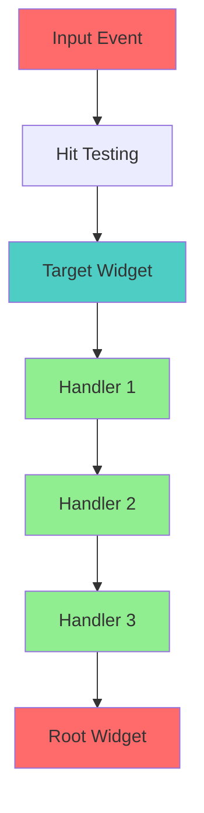
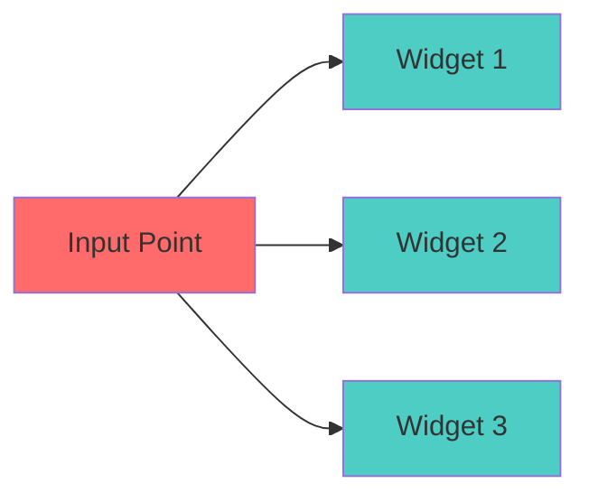
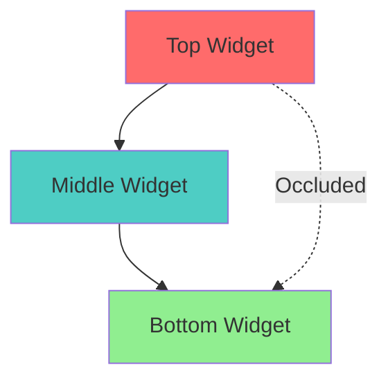
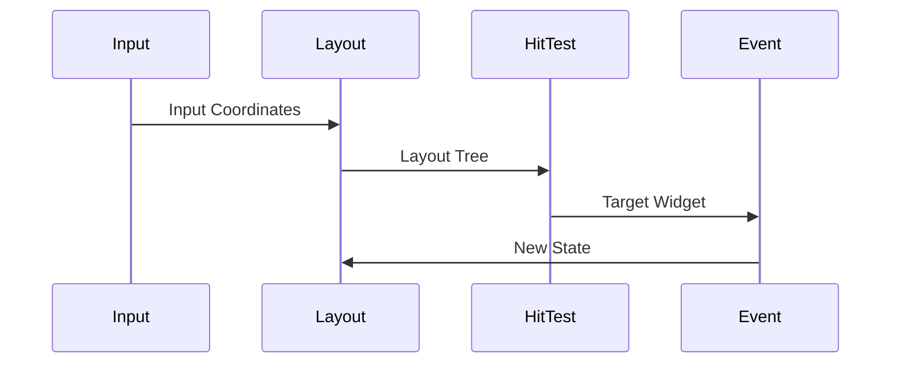

# UI Event Topology Specification

- `File:* `ui\ui_event_topology_spec.md`
- `Version:* 1.0.0
- `Context:* Layer 4 (UI Framework) - Interactions
- `Formalism:* Tree Transducers & Bubbling
- `Status:* Active
- Last Modified:* 2026-01-01
- `Author:* Kilo Code
- `Reviewers:* Pending

- -

## 1. Introduction

### 1.1 Purpose

This specification formalizeses **UI Event Propagation Model** using **Tree Transducers**, providing mathematical foundation for deterministic event handling. This formalization enables Morph UI framework to guarantee that events propagate correctly throughs widget tree and that interactions are reproducible.

* Note:* The event propagation model depends on widget geometry computed by the **UI Layout Engine** defined in [`spec/ui/ui_constraint_algebra_spec.md`](./ui_constraint_algebra_spec.md). The Layout Engine computes widget geometry using constraint algebra, and event propagation uses this computed geometry for hit testing and bubbling. The deterministic nature of both systems ensures reproducible UI interactions.

### 1.2 Scope

This specification covers:
- Event propagation model
- Hit testing algorithm
- Bubbling mechanism
- Deterministic input replay
- Event handler composition

This specification does not cover:
- Concrete implementation of event system
- Performance optimization details
- Platform-specific input handling

### 1.3 Definitions, Acronyms, and Abbreviations

| Term | Definition |
|-------|------------|
| **Event Propagation** | Process of distributing events through widget tree |
| **Hit Testing** | Finding widget at input coordinates |
| **Bubbling** | Bottom-up event propagation |
| **Tree Transducer** | Mathematical model for tree transformations |
| **Deterministic Replay** | Reproducible input-output behavior |
| **MCIE** | Multi-Channel Input Emulation |

### 1.4 References

- IEEE 1016: Recommended Practice for Software Design Descriptions
- ISO/IEC 29148: Systems and software engineering — Requirements engineering

- -

## 2. Formal Definitions

### 2.1 The Event Propagation Model

Events in UI (e.g., `Click`) traverse the Semantic Tree. We model this as a **Top-Down / Bottom-Up Tree Automaton**.

* UIEVT-INV-001:* THE system SHALL model event propagation as tree automaton.

* UIEVT-REQ-001:* THE system SHALL implement event propagation as tree traversal.

* Priority:* Critical
* Verification Method:* Test
* Rationale:* Enables correct event distribution
* Dependencies:* UIEVT-INV-001
* Traceability:* Section 2.1 (The Event Propagation Model)

### 2.2 Phases

* UIEVT-INV-002:* THE system SHALL define two-phase event propagation.

* UIEVT-REQ-002:* THE system SHALL implement hit testing and bubbling phases.

* Priority:* Critical
* Verification Method:* Test
* Rationale:* Enables complete event handling
* Dependencies:* UIEVT-INV-002
* Traceability:* Section 2.2 (Phases)

#### 2.2.1 Hit Testing (Geometric Query)

Given a point $P(x,y)$, find the deepest node $N$ such that $P \in \text{Rect}(N)$ and $N$ is not occluded.

$$ \text{Target} = \text{FindLeaf}(\text{Root}, P) $$

* UIEVT-INV-003:* THE system SHALL define hit testing as geometric query.

* UIEVT-REQ-003:* THE system SHALL find deepest widget at input coordinates.

* Priority:* Critical
* Verification Method:* Test
* Rationale:* Enables accurate target selection
* Dependencies:* UIEVT-INV-003
* Traceability:* Section 2.2.1 (Hit Testing)

#### 2.2.2 Bubbling (Bottom-Up)

The event travels from Target $\to$ Root.

Let $H(n, e)$ be a handler function at node $n$ for event $e$.

$$ \text{Outcome} = H(n, e) \lor H(\text{Parent}(n), e) $$

* Logic: If Child handles it, stop; else propagate.)*

* UIEVT-INV-004:* THE system SHALL define bubbling as bottom-up propagation.

* UIEVT-REQ-004:* THE system SHALL propagate events from target to root.

* Priority:* Critical
* Verification Method:* Test
* Rationale:* Enables event handler composition
* Dependencies:* UIEVT-INV-004
* Traceability:* Section 2.2.2 (Bubbling)

* UIEVT-THM-001:* THE system SHALL guarantee that bubbling terminates at root or when event is handled.

* Priority:* Critical
* Verification Method:* Analysis
* Rationale:* Ensures event propagation completes
* Dependencies:* UIEVT-INV-004
* Traceability:* Section 2.2.2 (Bubbling)

### 2.3 Deterministic Input Replay

Since Hit Testing depends only on **Layout Tree** (computed deterministically via Constraint Algebra) and **Input Coordinates** (MCIE), the entire interaction chain is a pure function:

$$ \text{NextState} = f(\text{CurrentState}, \text{InputPacket}) $$

This mathematically guarantees that UI tests are non-flaky **when using deterministic input sources**.

* UIEVT-INV-005:* THE system SHALL guarantee deterministic input replay for deterministic input sources.

* UIEVT-REQ-005:* THE system SHALL ensure reproducible UI interactions when using deterministic input sources.

* Priority:* Critical
* Verification Method:* Test
* Rationale:* Enables reliable UI testing
* Dependencies:* UIEVT-INV-005
* Traceability:* Section 2.3 (Deterministic Input Replay)

* UIEVT-THM-002:* THE system SHALL guarantee that UI interactions are pure functions when using deterministic input sources.

* Priority:* Critical
* Verification Method:* Analysis
* Rationale:* Ensures test reproducibility
* Dependencies:* UIEVT-INV-005
* Traceability:* Section 2.3 (Deterministic Input Replay)

#### 2.3.1 Scope and Limitations of Deterministic Replay

* Important:* The deterministic replay guarantee applies **only to deterministic input sources** such as:
- **MCIE (Multi-Channel Input Emulation):* Programmatic input generation for testing
- **Recorded input sequences:* Pre-recorded user interactions replayed exactly
- **Synthetic input:* Algorithmically generated input with controlled timing

* Real-world non-determinism** is **not covered** by this guarantee:
- **Human input timing:* Variations in mouse movement speed, keyboard typing rhythm
- **System-level non-determinism:* Thread scheduling, OS event delivery timing
- **External factors:* Network latency, device performance differences, background processes

* UIEVT-INV-013:* THE system SHALL document the boundary between deterministic and non-deterministic input sources.

* UIEVT-REQ-010:* THE system SHALL provide clear documentation on when deterministic replay guarantees apply.

* Priority:* High
* Verification Method:* Review
* Rationale:* Prevents misuse of deterministic guarantees
* Dependencies:* UIEVT-INV-005
* Traceability:* Section 2.3.1 (Scope and Limitations)

#### 2.3.2 Deterministic vs Non-Deterministic Input

| Aspect | Deterministic Input (MCIE) | Non-Deterministic Input (Real-World) |
|--------|---------------------------|--------------------------------------|
| **Source** | Programmatic, recorded, synthetic | Human interaction, system events |
| **Timing** | Precisely controlled | Variable, unpredictable |
| **Replay** | Exactly reproducible | Not reproducible |
| **Testing** | Flaky-free tests | May exhibit flakiness |
| **Guarantee** | Pure function semantics | No formal guarantee |
| **Use Case** | Automated testing, CI/CD | Production usage, user experience |

* UIEVT-INV-014:* THE system SHALL distinguish between deterministic and non-deterministic input sources in documentation.

* UIEVT-REQ-011:* THE system SHALL provide guidance on handling non-deterministic real-world inputs.

* Priority:* High
* Verification Method:* Review
* Rationale:* Enables proper use of deterministic guarantees
* Dependencies:* UIEVT-INV-013
* Traceability:* Section 2.3.2 (Deterministic vs Non-Deterministic Input)

#### 2.3.3 Practical Implications

* For Testing:*
- Use MCIE or recorded input sequences for automated tests
- Deterministic replay guarantees apply to these tests
- Tests will be flaky-free when using deterministic input sources
- Example: CI/CD pipelines using MCIE for UI testing

* For Production:*
- Real-world user input is non-deterministic
- Deterministic replay guarantees do not apply to production usage
- UI behavior may vary due to timing differences, system load, etc.
- Example: User clicking a button at different speeds may produce different visual feedback

* For Debugging:*
- Record non-deterministic user interactions for later replay
- Replay recorded sequences deterministically for debugging
- Use deterministic replay to reproduce bugs from production
- Example: Recording a user session and replaying it in development environment

* UIEVT-INV-015:* THE system SHALL provide guidance on using deterministic replay for testing and debugging.

* UIEVT-REQ-012:* THE system SHALL support recording and replaying non-deterministic input sequences.

* Priority:* Medium
* Verification Method:* Test
* Rationale:* Enables debugging of production issues
* Dependencies:* UIEVT-INV-014
* Traceability:* Section 2.3.3 (Practical Implications)

#### 2.3.4 Formal Definition of Determinism Boundary

Let $I_{det}$ be the set of deterministic input sources (MCIE, recorded sequences, synthetic input).

Let $I_{non}$ be the set of non-deterministic input sources (human interaction, system events).

* Determinism Theorem (Refined):*

For all $i \in I_{det}$:
$$ \text{NextState} = f(\text{CurrentState}, i) $$

where $f$ is a pure function (deterministic, no side effects).

For all $i \in I_{non}$:
$$ \text{NextState} = g(\text{CurrentState}, i, \text{Environment}) $$

where $g$ is **not** a pure function (depends on non-deterministic environment factors).

* UIEVT-THM-005:* THE system SHALL guarantee that UI interactions are pure functions for deterministic input sources only.

* Priority:* Critical
* Verification Method:* Analysis
* Rationale:* Clarifies scope of determinism guarantee
* Dependencies:* UIEVT-INV-005, UIEVT-INV-013
* Traceability:* Section 2.3.4 (Formal Definition of Determinism Boundary)

- -

## 3. Requirements

### 3.1 Functional Requirements

* UIEVT-REQ-006:* THE system SHALL support hit testing for all input events.

* Priority:* Critical
* Verification Method:* Test
* Rationale:* Enables accurate target selection
* Dependencies:* UIEVT-INV-003
* Traceability:* Section 2.2.1 (Hit Testing)

* UIEVT-REQ-007:* THE system SHALL support event bubbling for all widget types.

* Priority:* Critical
* Verification Method:* Test
* Rationale:* Enables event handler composition
* Dependencies:* UIEVT-INV-004
* Traceability:* Section 2.2.2 (Bubbling)

* UIEVT-REQ-008:* THE system SHALL support event handler registration.

* Priority:* Critical
* Verification Method:* Test
* Rationale:* Enables custom event handling
* Dependencies:* UIEVT-INV-004
* Traceability:* Section 2.2.2 (Bubbling)

* UIEVT-REQ-009:* THE system SHALL support event propagation termination.

* Priority:* High
* Verification Method:* Test
* Rationale:* Enables event flow control
* Dependencies:* UIEVT-INV-004
* Traceability:* Section 2.2.2 (Bubbling)

### 3.2 Non-Functional Requirements

* UIEVT-NFR-001:* THE system SHALL perform hit testing in O(n) time for n widgets.

* Priority:* High
* Verification Method:* Performance test
* Metric:* Hit test < 1ms for 1000 widgets
* Rationale:* Ensures responsive UI
* Dependencies:* None
* Traceability:* Section 2.2.1 (Hit Testing)

* UIEVT-NFR-002:* THE system SHALL support up to 10,000 widgets in tree.

* Priority:* Medium
* Verification Method:* Stress test
* Metric:* 10,000 widgets
* Rationale:* Supports complex UIs
* Dependencies:* None
* Traceability:* Section 2.2.1 (Hit Testing)

* UIEVT-NFR-003:* THE system SHALL guarantee deterministic event propagation.

* Priority:* Critical
* Verification Method:* Test
* Metric:* 100% reproducible events
* Rationale:* Ensures test reliability
* Dependencies:* UIEVT-INV-005
* Traceability:* Section 2.3 (Deterministic Input Replay)

- -

## 4. Design

### 4.1 Architecture Overview

The UI Event Engine is implemented as a framework component that:
1. Maintains semantic tree of widgets
2. Performs hit testing for input events
3. Propagates events via bubbling
4. Supports event handler registration
5. Ensures deterministic behavior

### 4.2 Data Structures

#### 4.2.1 Widget Tree

* Widget Tree:* $T = (V, E)$

* Components:*
- Vertices $V$: Widgets
- Edges $E$: Parent-child relationships

* Invariants:*
1. Tree is acyclic
2. Each widget has at most one parent

#### 4.2.2 Event

* Event:* $E = (\text{Type}, \text{Coordinates}, \text{Data})$

* Components:*
- Event type (Click, KeyPress, etc.)
- Input coordinates
- Event data

* Invariants:*
1. Coordinates are valid
2. Data is well-formed

#### 4.2.3 Event Handler

* Event Handler:* $H: \text{Widget} \times \text{Event} \to \text{Boolean}$

* Components:*
- Widget reference
- Event type
- Handler function
- Return boolean (handled or propagate)

* Invariants:*
1. Handler is defined for Widget
2. Handler returns boolean (handled or propagate)

### 4.3 Algorithms

#### 4.3.1 Hit Testing Algorithm

* Algorithm Name:* Find Target Widget

* Input:* Input point $P(x,y)$, Widget Tree $T$

* Output:* Target widget $N$

* Mathematical Definition:*
$$
\text{Target} = \text{FindLeaf}(\text{Root}, P) $$

* Pseudocode:*
```
function find_target(root, point):
    target = null
    max_depth = -1

    for widget in depth_first_traversal(root):
        if contains(widget.rect, point) and not is_occluded(widget, root):
            if widget.depth > max_depth:
                target = widget
                max_depth = widget.depth

    return target
```

* Complexity:*
- Time: $O(n)$ where $n$ is number of widgets
- Space: $O(1)$

* Correctness:*
- **Invariant:* Returns deepest non-occluded widget
- **Termination:* Single traversal

#### 4.3.2 Bubbling Algorithm

* Algorithm Name:* Propagate Event

* Input:* Target widget $N$, Event $e$

* Output:* Boolean indicating if event was handled

* Mathematical Definition:*
$$
\text{Outcome} = H(N, e) \lor H(\text{Parent}(N), e) $$

* Pseudocode:*
```
function propagate_event(target, event):
    current = target

    while current != null:
        handled = call_handler(current, event)

        if handled:
            return True  # Stop propagation

        current = parent(current)

    return False  # Reached root without handling
```

* Complexity:*
- Time: $O(d)$ where $d$ is depth of target
- Space: $O(1)$

* Correctness:*
- **Invariant:* Event propagates to root or until handled
- **Termination:* Tree depth is finite

#### 4.3.3 Occlusion Check Algorithm

* Algorithm Name:* Check Occlusion

* Input:* Widget $A$, Widget Tree $T$

* Output:* Boolean indicating if $A$ is occluded

* Mathematical Definition:*
$$
\text{Occluded}(A, T) \iff \exists B \in T, \text{Occludes}(A, B) \land Z_B > Z_A $$

* Pseudocode:*
```
function is_occluded(widget, tree):
    for other in depth_first_traversal(tree):
        if other != widget and
            intersects(widget.rect, other.rect) and
            other.z_index > widget.z_index:
            return True
    return False
```

* Complexity:*
- Time: $O(n)$ where $n$ is number of widgets
- Space: $O(1)$

* Correctness:*
- **Invariant:* Correctly identifies occluded widgets
- **Termination:* Single traversal

### 4.4 Mermaid Diagrams

#### 4.4.1 Event Propagation Flow



#### 4.4.2 Hit Testing



#### 4.4.3 Occlusion



#### 4.4.4 Deterministic Replay



- -

## 5. Correctness Properties

### 5.1 Theorems

#### 5.1.1 Hit Testing Theorem

* Theorem:* Hit testing returns deepest non-occluded widget.

* Proof Sketch:*
1. By definition of hit testing, search finds all widgets containing point
2. By definition of occlusion check, occluded widgets are excluded
3. By definition of depth-first traversal, deepest widget is found
4. Therefore, hit testing returns deepest non-occluded widget

* UIEVT-THM-003:* THE system SHALL guarantee correct hit testing.

* Priority:* Critical
* Verification Method:* Analysis
* Rationale:* Ensures accurate target selection
* Dependencies:* UIEVT-INV-003
* Traceability:* Section 4.3.1 (Hit Testing Theorem)

#### 5.1.2 Bubbling Theorem

* Theorem:* Bubbling terminates at root or when event is handled.

* Proof Sketch:*
1. By definition of bubbling, propagation proceeds from target to root
2. By definition of bubbling, propagation stops if handler returns True
3. By definition of tree, depth is finite
4. Therefore, bubbling terminates at root or when handled

* UIEVT-THM-004:* THE system SHALL guarantee bubbling termination.

* Priority:* Critical
* Verification Method:* Analysis
* Rationale:* Ensures event propagation completes
* Dependencies:* UIEVT-INV-004
* Traceability:* Section 4.3.2 (Bubbling Theorem)

#### 5.1.3 Determinism Theorem

* Theorem (Determinism for Deterministic Input Sources):* For all deterministic input sources $i \in I_{det}$, UI interactions are pure functions of state and input.

* Formal Statement:*

Let:
- $S$ be the set of all possible UI states
- $I_{det}$ be the set of deterministic input sources (MCIE, recorded sequences, synthetic input)
- $f: S \times I_{det} \to S$ be the UI transition function

* Theorem:* $f$ is a pure function, i.e., for all $s \in S$ and $i \in I_{det}$:
$$ f(s, i) = f(s, i) $$
and $f$ has no side effects.

* Proof:*

* Lemma 1 (Hit Testing Determinism):* Hit testing is deterministic for deterministic input sources.

* roof:*
1. Let $P(x,y)$ be an input point from a deterministic source $i \in I_{det}$
2. Let $T$ be the layout tree, which is deterministic by definition (computed via constraint algebra)
3. The hit testing algorithm $\text{FindLeaf}(T, P)$ performs a deterministic depth-first traversal
4. The occlusion check $\text{Occluded}(A, T)$ is deterministic (depends only on widget geometry and z-index)
5. Therefore, $\text{Target} = \text{FindLeaf}(T, P)$ is deterministic
6. ∎

* Lemma 2 (Event Propagation Determinism):* Event propagation is deterministic for deterministic input sources.

* roof:*
1. Let $N$ be the target widget (deterministic by Lemma 1)
2. Let $e$ be an event from a deterministic source $i \in I_{det}$
3. The bubbling algorithm $\text{PropagateEvent}(N, e)$ traverses the tree from $N$ to root
4. Each handler $H(n, e)$ is a pure function (no side effects)
5. The propagation stops when a handler returns True or reaches root
6. Therefore, the outcome of event propagation is deterministic
7. ∎

* Lemma 3 (State Transition Determinism):* State transitions are deterministic for deterministic input sources.

* roof:*
1. Let $s \in S$ be the current UI state
2. Let $i \in I_{det}$ be a deterministic input source
3. By Lemma 1, hit testing produces a deterministic target widget
4. By Lemma 2, event propagation produces a deterministic outcome
5. State updates depend only on the current state and event outcome
6. Therefore, the next state $s' = f(s, i)$ is deterministic
7. ∎

* Main Proof:*
1. By Lemma 1, hit testing is deterministic for deterministic input sources
2. By Lemma 2, event propagation is deterministic for deterministic input sources
3. By Lemma 3, state transitions are deterministic for deterministic input sources
4. The UI transition function $f(s, i)$ composes these deterministic operations
5. Therefore, $f$ is a pure function for all $i \in I_{det}$
6. ∎

* Corollary 1 (Replay Property):* For any deterministic input sequence $i_1, i_2, \dots, i_n \in I_{det}$ and initial state $s_0$, the final state $s_n$ is uniquely determined.

* roof:*
1. By the Determinism Theorem, $s_1 = f(s_0, i_1)$ is uniquely determined
2. By induction, $s_k = f(s_{k-1}, i_k)$ is uniquely determined for all $k$
3. Therefore, $s_n$ is uniquely determined
4. ∎

* Corollary 2 (Test Reproducibility):* UI tests using deterministic input sources are reproducible (non-flaky).

* roof:*
1. Let $t$ be a UI test using deterministic input sources $i_1, i_2, \dots, i_n \in I_{det}$
2. Let $s_0$ be the initial state (deterministic by test setup)
3. By Corollary 1, the final state $s_n$ is uniquely determined
4. Test assertions depend only on $s_n$
5. Therefore, test results are reproducible
6. ∎

* UIEVT-THM-002:* THE system SHALL guarantee deterministic UI behavior for deterministic input sources.

* Priority:* Critical
* Verification Method:* Analysis
* Rationale:* Ensures test reproducibility
* Dependencies:* UIEVT-INV-005
* Traceability:* Section 5.1.3 (Determinism Theorem)

* UIEVT-THM-006:* THE system SHALL guarantee the replay property for deterministic input sequences.

* Priority:* Critical
* Verification Method:* Analysis
* Rationale:* Enables deterministic replay of recorded interactions
* Dependencies:* UIEVT-THM-002
* Traceability:* Section 5.1.3 (Determinism Theorem - Corollary 1)

* UIEVT-THM-007:* THE system SHALL guarantee test reproducibility for tests using deterministic input sources.

* Priority:* Critical
* Verification Method:* Analysis
* Rationale:* Ensures non-flaky UI tests
* Dependencies:* UIEVT-THM-002
* Traceability:* Section 5.1.3 (Determinism Theorem - Corollary 2)

#### 5.1.4 Non-Determinism Theorem

* Theorem (Non-Determinism for Non-Deterministic Input Sources):* For non-deterministic input sources, UI interactions are not guaranteed to be pure functions.

* Formal Statement:*

Let:
- $I_{non}$ be the set of non-deterministic input sources (human interaction, system events)
- $g: S \times I_{non} \times E \to S$ be the UI transition function for non-deterministic input
- $E$ be the set of environment factors (timing, system load, etc.)

* Theorem:* $g$ is not a pure function, i.e., there exist $s \in S$, $i \in I_{non}$, and $e_1, e_2 \in E$ such that:
$$ g(s, i, e_1) \neq g(s, i, e_2) $$

* Proof:*

* Counterexample Construction:*
1. Let $s$ be a UI state with a button widget
2. Let $i$ be a human click event (non-deterministic timing)
3. Let $e_1$ be an environment with low system load (fast event delivery)
4. Let $e_2$ be an environment with high system load (slow event delivery)
5. In $e_1$, the click event is delivered immediately, triggering the button handler
6. In $e_2$, the click event is delayed, potentially missing a time-critical window
7. Therefore, $g(s, i, e_1) \neq g(s, i, e_2)$
8. ∎

* Corollary 3 (Production Non-Determinism):* Real-world UI interactions in production are not guaranteed to be deterministic.

* roof:*
1. Production environments have non-deterministic input sources (human users)
2. Production environments have non-deterministic environment factors (system load, network latency)
3. By the Non-Determinism Theorem, $g$ is not a pure function
4. Therefore, production UI interactions are not guaranteed to be deterministic
5. ∎

* UIEVT-THM-008:* THE system SHALL acknowledge that non-deterministic input sources do not guarantee deterministic behavior.

* Priority:* High
* Verification Method:* Analysis
* Rationale:* Prevents misuse of deterministic guarantees
* Dependencies:* UIEVT-INV-013
* Traceability:* Section 5.1.4 (Non-Determinism Theorem)

#### 5.1.5 Determinism Boundary Theorem

* Theorem (Determinism Boundary):* The UI system is deterministic if and only if all input sources are deterministic.

* Formal Statement:*

Let $I = I_{det} \cup I_{non}$ be the set of all input sources.

* Theorem:* For all $s \in S$ and input sequence $i_1, i_2, \dots, i_n \in I$:
- If $i_k \in I_{det}$ for all $k \in \{1, \dots, n\}$, then the UI transition is deterministic
- If $\exists k \in \{1, \dots, n\}$ such that $i_k \in I_{non}$, then the UI transition is not guaranteed to be deterministic

* Proof:*

* Forward Direction (Deterministic Input ⇒ Deterministic Transition):*
1. Assume $i_k \in I_{det}$ for all $k \in \{1, \dots, n\}$
2. By the Determinism Theorem, each transition $s_k = f(s_{k-1}, i_k)$ is deterministic
3. Therefore, the entire sequence of transitions is deterministic
4. ∎

* Reverse Direction (Non-Deterministic Input ⇒ Non-Deterministic Transition):*
1. Assume $\exists k \in \{1, \dots, n\}$ such that $i_k \in I_{non}$
2. By the Non-Determinism Theorem, the transition $s_k = g(s_{k-1}, i_k, e)$ is not guaranteed to be deterministic
3. Therefore, the entire sequence of transitions is not guaranteed to be deterministic
4. ∎

* UIEVT-THM-009:* THE system SHALL guarantee that determinism is preserved if and only if all input sources are deterministic.

* Priority:* Critical
* Verification Method:* Analysis
* Rationale:* Defines the precise boundary of determinism guarantees
* Dependencies:* UIEVT-THM-002, UIEVT-THM-008
* Traceability:* Section 5.1.5 (Determinism Boundary Theorem)

### 5.2 Invariants

#### 5.2.1 Event Propagation Invariants

- **UIEVT-INV-006:* THE system SHALL maintain that event propagation is deterministic.
- **UIEVT-INV-007:* THE system SHALL maintain that bubbling respects handler return values.
- **UIEVT-INV-008:* THE system SHALL maintain that hit testing excludes occluded widgets.
- **UIEVT-INV-009:* THE system SHALL maintain that hit testing excludes occluded widgets.
- **UIEVT-INV-010:* THE system SHALL maintain that layout computation is deterministic.

#### 5.2.2 Determinism Invariants

- **UIEVT-INV-011:* THE system SHALL maintain that input coordinates are deterministic.
- **UIEVT-INV-012:* THE system SHALL maintain that UI interactions are pure functions.

- -

## 6. Examples

### 6.1 Simple Event Propagation

```morph
// Simple event: Button click
ui {
    button {
        on_click() {
            // Handle event locally
            println("Button clicked!");
        }
    }
}

// Event propagates: button -> container -> root
```

* Event Flow:*
1. Hit testing finds button widget
2. Bubbling: button handler called (returns True)
3. Propagation stops at button

### 6.2 Nested Event Propagation

```morph
// Nested event: Click in container
ui {
    container {
        child1 {
            on_click() {
                // Handle locally
                println("Child 1 clicked!");
            }
        }

        child2 {
            on_click() {
                // Handle locally
                println("Child 2 clicked!");
            }
        }

        on_click() {
            // Container handler
            println("Container clicked!");
        }
    }
}

// Event Flow:
1. Hit testing finds child2 widget
2. Bubbling: child2 handler called (returns True)
3. Propagation stops at child2

### 6.3 Occluded Widget

```morph
// Occluded widget: Hidden behind another
ui {
    container {
        background {
            // Occluded by foreground
            on_click() {
                println("Background clicked!");
            }
        }

        foreground {
            // Occludes background
            on_click() {
                println("Foreground clicked!");
            }
        }
    }
}

// Event Flow:
1. Hit testing finds foreground widget (not occluded)
2. Bubbling: foreground handler called (returns True)
3. Propagation stops at foreground

### 6.4 Deterministic Replay

```morph
// Deterministic replay: Same input produces same output
// Input: Click at (100, 100)
// Layout: Button at (100, 100)
// Result: Button handler always called

// Determinism:
// f(State, Click(100, 100)) = ButtonClicked
// Same input always produces same output
```

* Determinism:*
$$ f(\text{State}, \text{Click}(100, 100)) = \text{ButtonClicked} $$

### 6.5 Edge Cases

#### 6.5.1 No Target Found

```morph
// Edge case: Click outside all widgets
ui {
    container {
        // No widget at click location
    }
}

// Event Flow:
1. Hit testing finds no target
2. Bubbling: No propagation (no target)
```

#### 6.5.2 Event Handler Returns False

```morph
// Edge case: Handler doesn't handle event
ui {
    button {
        on_click() {
            // Returns False (doesn't handle)
            return false;
        }
    }
}

// Event Flow:
1. Hit testing finds button widget
2. Bubbling: button handler returns False
3. Bubbling continues to container handler

- -

## Change Log

| Version | Date       | Author      | Changes                                                                 |
|---------|------------|-------------|-------------------------------------------------------------------------|
| 1.0.0   | 2026-01-01 | Kilo Code    | Initial version                                                        |
